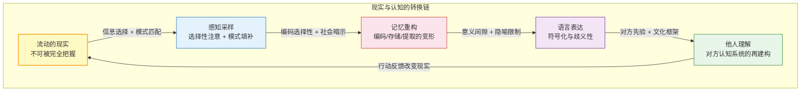

# 认知过程正在进行时：从误会到理解

## Cognition in Progress: From Misunderstanding to Understanding

---

## 摘要

人类几乎总是在误会中生活：我们误会世界、误会他人、误会自己。这种误会不是偶然的失误，而是认知过程的必然产物。本文提出一个入口性框架，将“认知过程正在进行时”这一洞见与 Project Dao.Science 的 L0-L7 频谱对接：感知、记忆、语言三层认知加工不断将流动的现实“定格”为可处理的模型，而每一层定格都伴随信息丢失、变形与添加。

本文进一步指出：**可怕的不是误会，而是不知道自己正在误会。** 项目的全部方法——从 L0-L7 层级觉察到四行实践，从第一人称认识到 N-of-1 验证——都可以被理解为“在知道必然误会的情况下，依然寻找更好理解”的操作系统。

**关键词**：认知过程；误会；感知建构；记忆可塑性；语言歧义；L0-L7 频谱；第一人称认识论；四行

---

> **证据等级**：形式化 [F] + 神经证据 [N] + 元伦理/规范 [M]

## 1. 一个根本悖论：用定格的认知理解流动的现实

请阅读下面这句话：

> “认知过程正在进行时。”

你读完它大约用了 1-2 秒。但在这 1-2 秒内，你的大脑完成了：接收光信号、处理字形、识别语言、提取意义、构建概念。所有这些过程都在毫秒级别发生。

这里有一个深刻悖论：**认知总是关于“过去”的信息，却要用来应对“未来”的情境。**

- 你看到的是已经发生的光信号；
- 你理解的是已经完成的文字处理；
- 但你用这个理解去应对即将到来的阅读、判断和行动。

这就是“认知过程正在进行时”的核心困境：**我们总是用已经定格的信息，去理解正在流动的现实。**

 project's `1_first_principles/03_map_not_territory.md` 已经论证：心智内容不是外部实在本身，而是大脑建构的“地图”。本文进一步指出：这张地图不是静态的画像，而是**持续生成、延迟更新、永远落后于疆域**的动态快照。

---

## 2. 误会的三层来源

为了在有限时间内处理无限信息，认知系统必须简化。正是在这种简化中，误会开始生根。

### 2.1 感知：眼睛不是摄像机，而是解释器

“眼见为实”可能是人类历史上最危险的四个字。认知科学告诉我们：眼睛不是摄像机，而是解释器。

- **穆勒-莱尔错觉**：两条等长线段因箭头方向不同而看起来长度不同；
- **卡尼莎三角形**：三个缺角的圆让我们“看到”一个并不存在的白色三角形；
- **麦格克效应**：当一个人说“ba”而嘴唇动作是“ga”时，我们听到的是“da”。

这些不是感知的“故障”，而是感知的工作方式：**大脑根据先验模式填补缺失信息，而不是被动接收原始数据。**

### 2.2 记忆：不是录像回放，而是每次回忆时的重新拼图

记忆常常被想象成大脑中的录像带，但认知科学揭示：**记忆更像是每次回忆时重新拼凑的拼图。**

- **编码选择性**：我们只能记住注意到的、有意义的、与已有知识连接的信息；
- **存储动态性**：记忆在存储过程中会衰退、被干扰、被重构；
- **提取情境性**：回忆依赖线索、情境和当前身心状态；
- **社会暗示性**：他人的提问方式、群体的共同叙述会改变我们的记忆。

伊丽莎白·洛夫特斯（Elizabeth Loftus）的经典实验显示：通过暗示，约 25% 的被试能够“回忆”出童年时在购物中心迷路这样从未发生的事件。这提醒我们：**我们不仅可能记错事实，还可能“记住”从未发生的事情。**

### 2.3 语言：不是思想本身，而是思想的近似表达

语言是人类最伟大的发明，也是最危险的工具。它让我们能够分享复杂想法、传承文明知识、协调大规模合作——但它同时也是误会的温床，因为**语言不是思想本身，而是思想的近似表达。**

- **能指与所指的任意性**：中文用“树”，英文用“tree”，法文用“arbre”，同一概念在不同语言中以不同声音呈现；
- **意义间隙**：每个人对“树”的具体意象、情感联想、文化含义都不同；
- **语用歧义**：“房间里有点热”可以是陈述、请求开空调、暗示离开或抱怨设备故障；
- **隐喻的隐藏面**：“争论是战争”的隐喻强调攻击、防御、胜负，却隐藏了合作、理解、共赢的可能。

语言在将个人理解转化为沟通内容的过程中，不可避免地造成信息损耗和变形。

---

## 3. 误会地图：从认知机制到 L0-L7 层级

我们可以将“误会”视为信息在认知层级间转换时发生的系统性失真。以下是将认知机制映射到 L0-L7 频谱的尝试：

**图 1：从现实到理解的认知转换链。** 每一层转换都会造成信息丢失、变形或添加。现实（L0/L1 的交界处）经过感知、记忆、语言、他人理解的多重过滤，最终形成一个不断回环的建构系统。

| 认知机制 | 典型误会 | 对应 L0-L7 层级 | 项目相关模块 |
|---------|---------|----------------|------------|
| **感知建构** | 看到不存在的东西，忽略存在的东西 | L1 规律被误认为 L0 实相 | `1_first_principles/03_map_not_territory.md` |
| **注意力锁定** | 只注意威胁信号，忽略整体情境 | L2 个体实情被特定模式劫持 | `2_models/attention_model.md`、`2_models/100ms_model.md` |
| **记忆重构** | 把想象当作回忆，把现在信念投射到过去 | L2 个体实情被 L3 叙事改写 | `2_models/dmn_self_model.md` |
| **语言歧义** | 同一句话被不同人理解为不同意思 | L3-L4 符号系统与 L2 体验错位 | `2_models/social_cognition.md` |
| **文化框架** | 用自己的文化脚本解释他人行为 | L3 群体共识压抑 L2 个体实情 | `0_motivation/L0_L7_spectrum.md` |
| **情感过滤** | 情绪状态改变对事实的判断 | L2 被劫持向 L5-L7 | `2_models/100ms_model.md` |
| **算法茧房** | 只接收符合已有信念的信息 | L4 契约被 L6 概念空转取代 | `4_applications/ai_governance.md` |
| **群体极化** | 集体信念脱离个体经验校准 | L3-L4 向 L6-L7 坍缩 | `2_models/social_cognition.md` |

这一映射不是要把复杂的心理现象简化为层级标签，而是要提供一种**元认知工具**：当你发现自己陷入误会时，可以先问——这是发生在哪一层级的失真？

---

## 4. 为什么“知道自己在误会”是理解的起点

如果误会是认知的必然，那么“避免误会”本身就是另一种误会——它否认了人类认知的基本结构。更有智慧的态度是：

> **在知道必然误会的情况下，依然选择理解。**

这种态度包含三个层面：

### 4.1 认知谦逊（Epistemic Humility）

承认自己的感知、记忆、语言、推理都可能出错。这不是自我贬低，而是对认知结构的诚实。详见 `1_first_principles/05_first_person_epistemology.md`。

### 4.2 第一人称觉察（First-Person Awareness）

不仅要知道“我可能错了”，还要能够在当下觉察到“我正在误会”。这种觉察不是概念层面的，而是 L0 层面的——那个能“知道自己在知道”的觉知本身。

### 4.3 持续修正（Continuous Revision）

把理解当作一个开放的过程，而不是一次性的结论。每一次新的信息、新的视角、新的反馈，都是修正地图的机会。

---

## 5. 项目回应：从第一人称数据到认识论谦逊

Project Dao.Science 为“与误会共存”提供了一套完整的操作框架：

| 项目要素 | 对“误会”问题的回应 |
|---------|------------------|
| **L0-L7 频谱** | 定位误会发生的认知层级，识别是感知失真、记忆重构、语言歧义还是关系坍缩 |
| **道 ≡ -∇G(π)** | 把“理解”建模为生成模型的持续更新过程，而非抵达固定真理 |
| **一 = 觉知带宽** | 通过调节 DMN-TPN 平衡，扩展能够觉察到“自己正在误会”的带宽 |
| **相非物** | 把心智内容视为可修正的地图，而不是不可质疑的疆域 |
| **第一人称认识论** | 把个体经验（L2）和觉知（L0）确立为科学不可还原的数据层 |
| **N-of-1 协议** | 让个体能够系统检验“我对自己的理解是否准确” |

这些工具的共同目标是：**不是消除误会（这不可能），而是缩短“误会发生”到“觉察误会”之间的时间，并建立高效的修正循环。**

---

## 6. 四行作为“减少误会的操作”

项目的 `3_methodology/xing_ru/` 四行可以被重新理解为四种针对典型误会的矫正操作：

| 四行 | 针对的误会 | 操作核心 |
|------|-----------|---------|
| **报冤行** | 把逆境归因为“他人故意针对我” | 重新框定为“过去心理习惯的成熟”，切断指责-愤怒循环 |
| **随缘行** | 把顺境归因为“我个人的功劳” | 看到“这也是条件的暂时聚合”，松开自我膨胀 |
| **无所求行** | 把“必须得到某结果”当作真实需求 | 区分“想要”（wanting）与“喜欢”（liking），停止被执着驱动 |
| **称法行** | 行动被情绪或概念扭曲 | 让行动与情境的“底层结构”自然协调，减少人为造作 |

四行不是道德教条，而是**认知校准协议**：它们帮助我们在每个当下，把被习惯、情绪、概念所扭曲的地图重新校准到更接近疆域的状态。

---

## 7. 结论：在误会中寻找自由

认识到误会的必然性，并不是通向虚无主义的入口，而是通向自由的入口。

因为一旦知道：
- 我的感知是建构的，我就不必对每一个第一印象反应；
- 我的记忆是可塑的，我就不必被过去的故事完全定义；
- 我的语言是近似的，我就不必执着于每一次沟通的 perfect；
- 我的理解是暂时的，我就可以保持开放与修正。

这种自由不是“什么都可以”的放任，而是**在有限性中依然选择理解、连接与创造**的清醒能力。这正是 Project Dao.Science 所追求的“在复杂面前保持鲜活”。

---

> **阅读建议**：
> - 若你关心“为什么这个项目重要”：`0_motivation/why_this_matters.md`
> - 若你关心“认知层级的完整地图”：`0_motivation/L0_L7_spectrum.md`
> - 若你关心“第一人称经验的科学地位”：`1_first_principles/05_first_person_epistemology.md`
> - 若你准备开始实践：`3_methodology/li_ru.md` → `3_methodology/n_of_1_protocol.md`
>
> 上一篇：`0_motivation/why_this_matters.md`（为什么这个项目重要）。  
> 下一篇：`0_motivation/abstraction_dialogue.md`（两棵树：一场关于抽象的解释说）。

---

*本文是 Project Dao.Science 的动机层入口文件之一。它将“认知过程正在进行时”这一第一人称洞见翻译为项目的操作语言，为后续的 L0-L7 框架、第一性原理和实践方法提供经验动机。*
