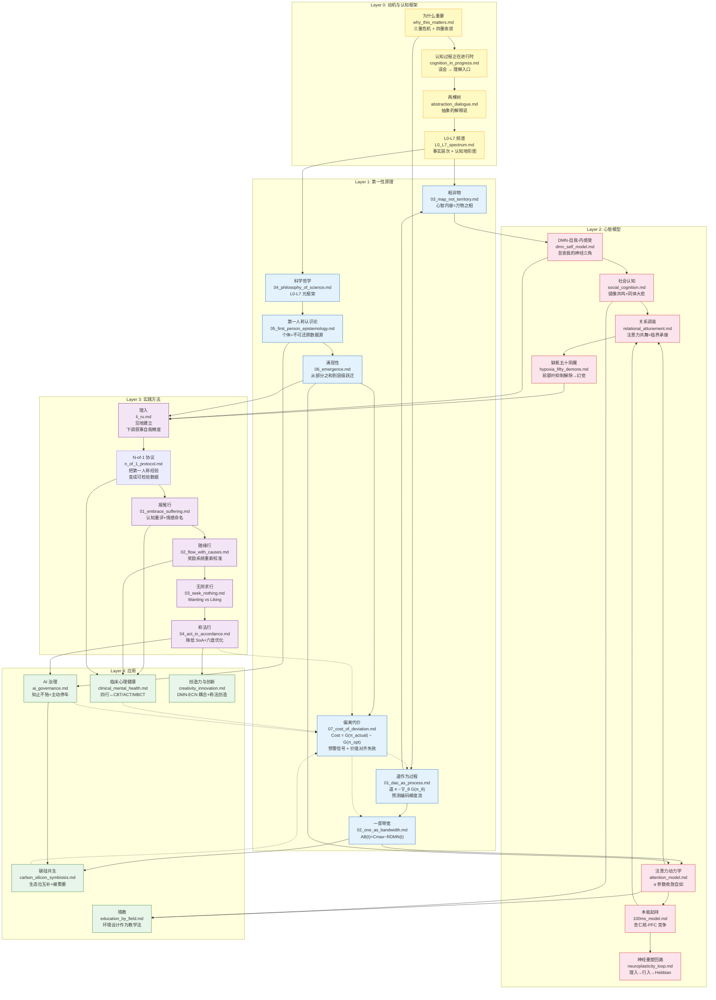

# 项目概念图谱：导航 Project Dao.Science

## Project Concept Map: Navigating Project Dao.Science

---

本文档提供 Project Dao.Science 全部核心内容模块之间的概念依赖关系图，帮助读者找到适合自己兴趣的阅读路径。（注：仓库另有 `project_map.md` 与 `objections_and_replies.md` 两个导航/元文件，以及 `FINAL_VISION.md`、`POSITIONING.md`、`GLOSSARY.md`、`CLAIMS.md` 等顶层声明文件。）

## 阅读路径

### 路径 1：理论优先（第一性原理驱动）
适合希望先建立完整理论框架的读者。

1. `0_motivation/why_this_matters.md` — 为什么这个项目重要
2. `0_motivation/L0_L7_spectrum.md` — 认知频谱框架
3. `1_first_principles/01_dao_as_process.md` — 道作为预测编码梯度流
4. `1_first_principles/02_one_as_bandwidth.md` — 一作为觉知带宽
5. `1_first_principles/03_map_not_territory.md` — 心智内容 = 表征 ≠ 实在
6. `1_first_principles/04_philosophy_of_science.md` — 科学知识的认知层级
7. `1_first_principles/05_first_person_epistemology.md` — 第一人称认识论与个体独特性
8. `1_first_principles/06_emergence.md` — 涌现性：从部分之和到层级跃迁
9. `1_first_principles/07_cost_of_deviation.md` — 偏离道的代价函数：预警信号与价值对齐失败
10. → 然后进入 Layer 2（心智模型）或 Layer 3（实践方法）

### 路径 2：经验优先（从误会觉察开始）
适合希望从日常经验出发、先建立直观理解的读者。

1. `0_motivation/cognition_in_progress.md` — 认知过程正在进行时：从误会到理解
2. `0_motivation/abstraction_dialogue.md` — 两棵树：一场关于抽象的解释说
3. `0_motivation/L0_L7_spectrum.md` — 用 L0-L7 频谱定位你的认知状态
3. `3_methodology/li_ru.md` — 理入：建立正确的见地
4. `3_methodology/n_of_1_protocol.md` — N-of-1 协议：把实践变成可检验数据
5. `3_methodology/xing_ru/01_embrace_suffering.md` — 报冤行：拥抱苦难
6. `3_methodology/xing_ru/02_flow_with_causes.md` — 随缘行：随顺因缘
7. `3_methodology/xing_ru/03_seek_nothing.md` — 无所求行：停止执着
8. `3_methodology/xing_ru/04_act_in_accordance.md` — 称法行：与实相协调
9. → 回到 Layer 1 理解理论根基

### 路径 3：应用驱动
适合关注特定应用场景的读者。

- **AI 安全**：`4_applications/ai_governance.md` → `4_applications/carbon_silicon_symbiosis.md`
- **教育**：`4_applications/education_by_field.md` → `2_models/social_cognition.md`
- **心理健康**：`1_first_principles/05_first_person_epistemology.md` → `4_applications/clinical_mental_health.md` → `3_methodology/n_of_1_protocol.md` → `3_methodology/xing_ru/`
- **创造力**：`4_applications/creativity_innovation.md` → `2_models/attention_model.md`

### 路径 4：神经科学优先
适合神经科学背景的读者。

1. `2_models/attention_model.md` — 注意力动力学
2. `2_models/100ms_model.md` — 本能劫持与情绪调控
3. `2_models/neuroplasticity_loop.md` — 神经重塑的工程化描述
4. `2_models/dmn_self_model.md` — DMN-自我-内感受三角
5. `2_models/social_cognition.md` — 社会认知与镜像共鸣
6. → 然后进入 Layer 3 了解实践方法

### 路径 5：第一人称/个体科学优先
适合关注自我实验、量化自我、临床个体化、第一人称亲证的读者。

1. `1_first_principles/05_first_person_epistemology.md` — 为什么第一人称数据不可还原
2. `3_methodology/n_of_1_protocol.md` — 如何设计一个自我实验
3. `3_methodology/xing_ru/01_embrace_suffering.md` — 报冤行：从接纳开始收集数据
4. → 按兴趣扩展到临床、创造力或 AI 对齐应用

### 路径 6：批判性审查
适合希望了解项目局限性和反驳论证的读者。

1. `0_motivation/objections_and_replies.md` — 六项核心挑战与回应
2. → 然后按路径 1-5 选择性深入

### 路径 7：证据状态审查
适合希望快速了解项目主张、证据等级和可证伪条件的读者。

1. `CLAIMS.md` — 主张登记册与证据状态总览
2. → 按表中链接跳到对应形式化定义、模拟或应用
3. → 对任何主张，检查其「可证伪条件」是否符合你的标准

### 路径 8：概念模拟优先
适合希望用可运行代码验证抽象区分的读者。

1. `verifiable_units/vu_04_emergence_vs_phase_transition.md` — 涌现 ≠ 相变
2. `verifiable_units/vu_05_attention_precision_optimization.md` — 注意力作为精度优化
3. `verifiable_units/vu_06_ai_stopping_protocol.md` — AI 知止协议
4. `verifiable_units/vu_07_carbon_silicon_symbiosis.md` — 碳硅共生生态位分工
5. → 回到 `1_first_principles/06_emergence.md`、`2_models/attention_model.md`、`4_applications/ai_governance.md` 与 `4_applications/carbon_silicon_symbiosis.md` 理解理论含义
6. → 扩展到 `4_applications/management_field_theory.md` 与 `4_applications/creativity_innovation.md`

### 路径 9：关系与领导力优先
适合关注人际调谐、管理、教育、咨询、亲子、碳硅协作的读者。

1. `2_models/relational_attunement.md` — 关系调谐：注意力作为生命张力的共舞
2. `2_models/attention_model.md` — 注意力的收放自如
3. `2_models/social_cognition.md` — 镜像共鸣与同体大悲
4. `4_applications/management_field_theory.md` — 场的营造与伦理剃刀
5. `4_applications/carbon_silicon_symbiosis.md` — 碳硅共生：生态位互补
6. → 回到 `1_first_principles/01_dao_as_process.md` 理解关系调谐的最小作用量含义

## 学术预印本

- 8 篇 LaTeX 预印本覆盖 22 个模块的核心内容（另有 2 个新增模块暂无对应预印本）。参见 `paper/README.md` 获取完整索引。

---

> **证据等级**：形式化 [F]

> 本文档是 Project Dao.Science 的导航入口。将本文档添加到 `mkdocs.yml` 的 nav 中作为首页可提供交互式导航。
>
> 下一篇：`0_motivation/why_this_matters.md`（技术文明的三重危机与道学科学的回应）。
