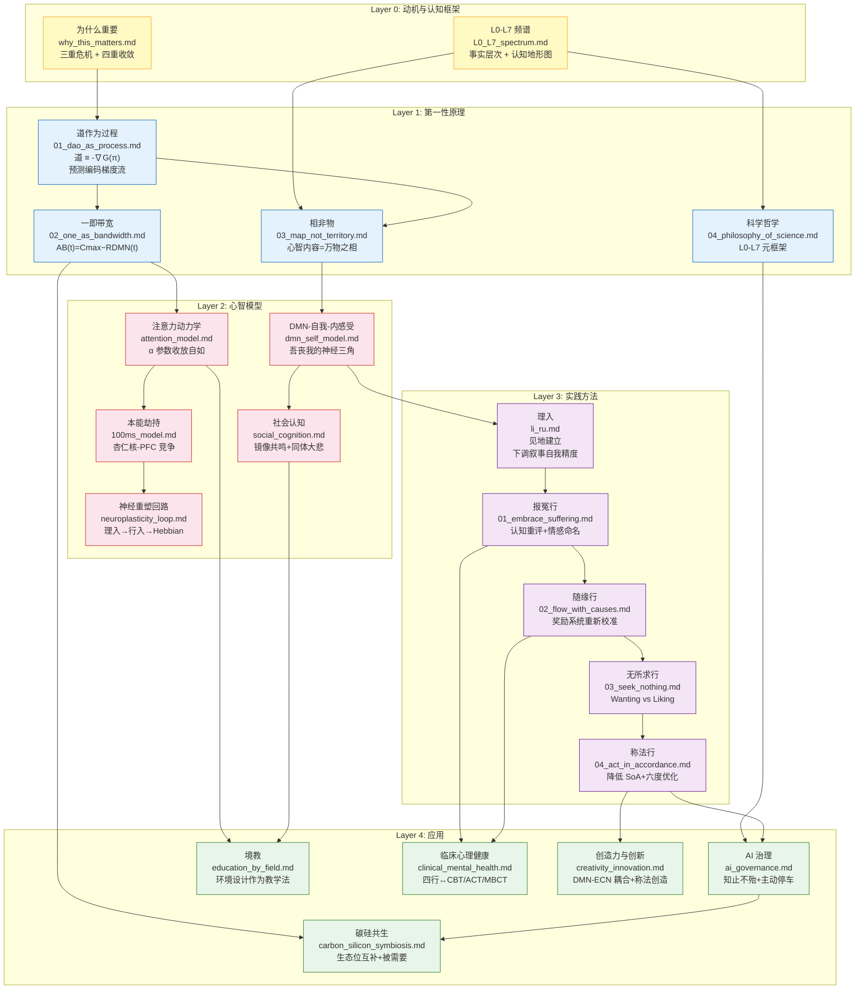

# 项目概念图谱：导航 Project Dao.Science

## Project Concept Map: Navigating Project Dao.Science

---

本文档提供 Project Dao.Science 全部 22 个模块之间的概念依赖关系图，帮助读者找到适合自己兴趣的阅读路径。

## 阅读路径

### 路径 1：理论优先（第一性原理驱动）
适合希望先建立完整理论框架的读者。

1. `0_motivation/why_this_matters.md` — 为什么这个项目重要
2. `0_motivation/L0_L7_spectrum.md` — 认知频谱框架
3. `1_first_principles/01_dao_as_process.md` — 道作为预测编码梯度流
4. `1_first_principles/02_one_as_bandwidth.md` — 一作为觉知带宽
5. `1_first_principles/03_map_not_territory.md` — 心智内容 = 表征 ≠ 实在
6. `1_first_principles/04_philosophy_of_science.md` — 科学知识的认知层级
7. → 然后进入 Layer 2（心智模型）

### 路径 2：实践优先（行入驱动）
适合希望直接开始实践的读者。

1. `3_methodology/li_ru.md` — 理入：建立正确的见地
2. `3_methodology/xing_ru/01_embrace_suffering.md` — 报冤行：拥抱苦难
3. `3_methodology/xing_ru/02_flow_with_causes.md` — 随缘行：随顺因缘
4. `3_methodology/xing_ru/03_seek_nothing.md` — 无所求行：停止执着
5. `3_methodology/xing_ru/04_act_in_accordance.md` — 称法行：与实相协调
6. → 回到 Layer 1 理解理论根基

### 路径 3：应用驱动
适合关注特定应用场景的读者。

- **AI 安全**：`4_applications/ai_governance.md` → `4_applications/carbon_silicon_symbiosis.md`
- **教育**：`4_applications/education_by_field.md` → `2_models/social_cognition.md`
- **心理健康**：`4_applications/clinical_mental_health.md` → `3_methodology/xing_ru/`
- **创造力**：`4_applications/creativity_innovation.md` → `2_models/attention_model.md`

### 路径 4：神经科学优先
适合神经科学背景的读者。

1. `2_models/attention_model.md` — 注意力动力学
2. `2_models/100ms_model.md` — 本能劫持与情绪调控
3. `2_models/neuroplasticity_loop.md` — 神经重塑的工程化描述
4. `2_models/dmn_self_model.md` — DMN-自我-内感受三角
5. `2_models/social_cognition.md` — 社会认知与镜像共鸣
6. → 然后进入 Layer 3 了解实践方法

## 学术预印本

|- 8 篇 LaTeX 预印本覆盖全部 22 个模块的核心内容。参见 `paper/README.md` 获取完整索引。

---

> 本文档是 Project Dao.Science 的导航入口。将本文档添加到 `mkdocs.yml` 的 nav 中作为首页可提供交互式导航。
