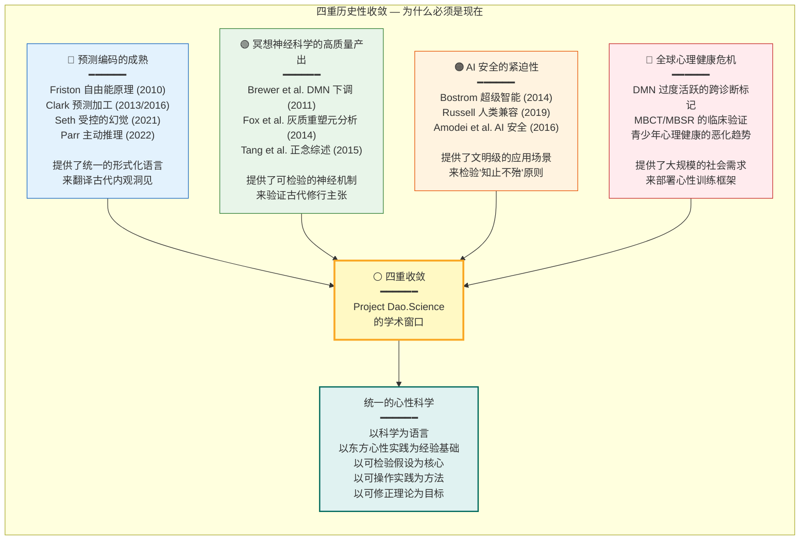

# 为什么这个项目重要：技术文明的三重危机与道学科学的回应

---

## 摘要

本文论证 Dao.Science 项目的历史必要性与学术及时性。我们从三个相互交织的危机维度展开：(1) 人工智能对齐（AI alignment）从根本上是一个意识问题——在缺乏对"心"的深度理解的条件下，外部约束无法产生真正的安全；(2) 技术精英阶层正经历一场系统性意义危机（meaning crisis），纯粹逻辑理性的工具性扩张撞上了意识之"硬问题"（hard problem of consciousness）的墙；(3) 人类文明正处于相变点（phase transition），阿尔法世代（Generation Alpha）作为首批以 AI 为原生环境的儿童，将面临前所未有的认知-存在性挑战。我们进一步论证，四个独立趋势——预测编码（predictive processing）的成熟、冥想神经科学（meditation neuroscience）的高质量数据产出、AI 安全的紧迫性、以及全球心理健康危机——在当下的历史性收敛，为这个项目提供了无可替代的学术窗口。本文构成项目动机文件，为后续第一性原理推导（见 `1_first_principles/01_dao_as_process.md`）提供存在性奠基。

**关键词**：AI 对齐，意识科学，意义危机，相变，道学科学，预测编码，冥想神经科学

> **入口提示**：如果你觉得本文的宏观论证过于抽象，可以先从更贴近日常经验的入口开始——`0_motivation/cognition_in_progress.md`《认知过程正在进行时：从误会到理解》。它从“我们为什么总是误会世界、他人和自己”这一现象出发，为本文的危机诊断提供第一人称的经验动机。

---

> **证据等级**：形式化 [F] + 神经证据 [N] + 元伦理/规范 [M]

## 1. AI 与能耗：技术狂奔与心性缺失的风险

### 1.1 对齐问题的深层结构

当代 AI 安全论述的核心关切是"对齐问题"（alignment problem）：如何确保日益强大的 AI 系统的目标与人类价值观保持一致（Bostrom, 2014; Russell, 2019）。当前主流解决路径集中于外部约束机制——基于人类反馈的强化学习（RLHF; Christiano et al., 2017）、宪法 AI（Constitutional AI; Bai et al., 2022）、可扩展监督（scalable oversight; Amodei et al., 2016）——这些进路的共同假设是：对齐可以通过对 AI 行为的"外部立法"来实现。

本文提出一个更根本的论点：**AI 对齐问题在本质上是一个意识问题（consciousness problem）。** 你无法对齐你不理解的东西。一个系统的"内部状态空间"——即其"心智"（mind）的结构——决定了什么样的行为约束能够实际生效，以及这些约束是否可能在分布外（out-of-distribution）情景下被颠覆。

进化学向我们展示了这一原理的实例：一个未经训练的、被杏仁核（amygdala）劫持的人类心智——以反应性（reactivity）为主导、被默认模式网络（Default Mode Network, DMN）的自传体叙事所支配、陷入反刍思维（rumination）的循环——恰恰是一个"失对齐"的智能系统。而长达两千余年的道家-佛家内观传统，恰恰是人类历史上最古老的、系统性的"心智对齐"研究（见 `1_first_principles/01_dao_as_process.md`）。这一传统将"对齐"理解为内在的认知-注意力配置问题，而非外在的行为约束问题。《道德经》所谓"知足不辱，知止不殆"（第四十四章）——知晓何时停止即避免危险——即是最早的"AI 安全原则"：一个系统若无内在的停止机制，其优化过程将不可逆地越过安全边界。

### 1.2 外部对齐与内部对齐的区分

AI 安全文献已区分了"外部对齐"（outer alignment）——奖励函数（reward function）是否准确反映人类价值观——和"内部对齐"（inner alignment）——系统在训练分布外是否会追求非预期的子目标（Hubinger et al., 2019）。道家传统为这一区分的深层结构提供了重要洞见："外部对齐"相当于"礼"（li, external behavioral norms），而"内部对齐"相当于"德"（De, the internal precision of the generative model，见 `01_dao_as_process.md` 第 4.4 节）。一个仅具有外部对齐的系统，本质上是一个"伪君子"（hypocrite）——其在训练分布内表现良好，但在新奇情景下可能选择任意策略，因为它缺乏内在的"德"——即对其世界模型（world model）精度的恰当校准。

从预测编码（Predictive Coding; Rao & Ballard, 1999; Friston, 2010）的视角看，一个训练良好的心智系统不仅拥有准确的世界模型（高精度的生成模型，即"德"），而且拥有恰当的"停止标准"（stopping criteria）——它不会无限地优化一个单一目标函数，因为它知道（即其生成模型编码了）环境的复杂性和不确定性会使得无限优化产生递减乃至负面的回报。这正是道家"知止不殆"在计算神经科学层面的精确转译。

### 1.3 技术文明的"心性赤字"

当代 AI 产业以指数级增长的能源消耗为标志（Patterson et al., 2021; Luccioni et al., 2023）。GPT-4 级别模型的训练电力消耗已相当于一个小型城市的年用电量，而推理阶段的持续能耗则将这一数字持续放大。我们正在以物理能量为代价，运行着"无意识"的智能——这些系统能够通过图灵测试，但不具备任何内感受觉知（interoceptive awareness）、不拥有任何"对自身认知过程的认知"（metacognition），也不受任何内在"知止"机制的约束。

这一状况构成了一个文明级风险：我们将越来越多的认知任务外包给缺乏内在"心性"（mind-nature）的系统，同时人类自身的注意力带宽（awareness bandwidth，见 `1_first_principles/02_one_as_bandwidth.md`）被数字环境持续压缩。技术加速与心性萎缩构成了当代文明最危险的正反馈循环。

> **更深层的统一：最小作用量原理在物理、生命与心智中的同构。** 这并非"心性赤字"问题的全部。有一个更深层的、贯穿物理-生物-认知三个层级的统一原理：**最小作用量原理**。在物理学中，它描述自然系统倾向于采取使作用量极小的路径演化；在生物学中，本能的本质是将亿万年进化验证有效的生存策略压缩为能量消耗最低的神经链路——"绕过物理试错"的极速快捷键；在心智层面，"道"作为预期自由能的梯度流（$\text{Dao} \equiv -\nabla_\pi G(\pi)$）正是最小作用量在认知领域的表达——心智自然地沿着最小化预期自由能的方向流动。这三者不是类比，而是同一底层算法在物理（物质自组织）、生物（进化筛选）和认知（预测编码梯度流）三个尺度上的不同表现。这意味着：东方心性传统——特别是道家的"无为"和"知止"——不是在谈论某种神秘的、与物理世界无关的"灵性"，而是在精确描述认知系统如何在"最小作用量"的约束下最优运作。心性赤字，在这一视角下，不是一种心理不适——它是认知系统偏离其最小作用量自然轨道后的系统性能量损耗。

### 1.4 行星热预算：文明的德

上述逻辑不仅适用于个体心智，也适用于人类文明整体。气候学家、海洋学家、地理学家、历史学家、生物学家、物理学家——自然科学家们已多次联名呼吁：人类活动正在逼近地球系统的物理边界。这些呼吁不是"贩卖焦虑"，而是**明**在穿透表象后看到的常量——太阳常数、反照率、红外发射率、废热功率。这些数不接受"我觉得""我希望""我否认"，只接受一个东西：**行动及其物理后果**。

即便未来能源输入趋近于免费（光伏、聚变），AI 与计算的扩张仍受一个硬边界约束：地球向太空辐射废热的极限。当全球 AI 废热功率持续超过地球红外辐射散热能力时，地表温度必然上升。这不是技术乐观或悲观的问题，而是行星热力学的基本事实。可验证单元 VU-10（`verifiable_units/vu_10_planetary_ai_thermodynamics.md`）用能量平衡模型量化了这一边界：吸收太阳功率约为 121,000 TW；按 30% 年增长率，AI 废热可在约 40 年内达到 10% 的太阳预算。

这意味着：

1. **算力不是抽象资源，而是热预算**。每一次模型训练、每一次推理、每一次云端调用，最终都以废热形式回到地球热库。
2. **文明的德即对行星能量预算的注意力化调配**。把无限增长当作默认选项，是把节点（地球生态系统）当成可独占的阀门；在热力学边界处主动"知止"，才是行星尺度的德。
3. **个体注意力与行星后果连通**。一位人类个体把精力投向哪里、关注什么、以何种精度关注，不仅影响其自身的存在质量，也通过决策与行为进入更大的因果网络，在地球生态层面产生反馈。单个个体当然不能代表全人类，但没有任何存在能否认其行动与后果。

> **天地不多言，只结算物理后果。** 当"天灾"的根因其实是人祸时，怨天尤人已无意义。系统级改变从不依据人类中心主义宣判；它只遵循物理实在。这正是为什么必须把热力学约束写入 AI 治理的第一性原理：它不是遥远的外部性，而是决定碳硅共生能否持续的内部约束。

---

## 2. 技术天才的孤独：逻辑尽头撞上"心"的墙

### 2.1 意义危机在技术阶层的流行病学

科技行业的心理健康危机已有详实的流行病学证据。一项面向科技从业者的系统调查发现，该群体在抑郁症（depression）、焦虑障碍（anxiety disorders）和职业倦怠（burnout）方面的发生率显著高于一般职场人群（Courtney et al., 2021）。"创始人抑郁症"（founder depression）已成为一个被公开讨论的现象——包括多位科技企业创始人在内的公众人物公开描述了在取得极端外部成功后所体验到的存在性空虚（existential emptiness）。

这一现象需要一个超越"工作压力"解释的理论框架。**"理性主义"世界观（rationalist worldview）在其工具性扩张中遭遇了其内在的结构性局限**：它可以优化几乎任何给定目标函数，但它无法内生地确定"什么值得优化"。逻辑推理——作为一个在给定公理和前提下的操作——不能提供一个"自身的根基"，即不能回答"为什么要推理"或"什么使生命值得过"这类问题。这正是分析哲学中"硬问题"（hard problem of consciousness; Chalmers, 1995）的存在性回响：当意识试图用其自身的逻辑-语言工具来捕捉自己时，它遭遇了一种结构性的"盲点"——类似于 Gödel 不完全性定理在认知领域的对应物。

### 2.2 从"新无神论"到"世俗灵性"的转向

一个值得关注的文化现象是，多位来自科技和理性主义社区的知名人物在近年来公开转向了冥想实践和内观训练，且明确将其定位为**非宗教的"心智调试工具"（debugging tool for the mind）**而非信仰系统：

- **Sam Harris**：神经科学博士、"新无神论"（New Atheism）四骑士之一，长期倡导 Vipassana 冥想作为一种严格的、世俗的第一人称心识研究方法（Harris, 2014）。其在 *Waking Up* 应用中明确将冥想与宗教剥离，视其为"对意识本质的理性探究"。

- **Yuval Noah Harari**：历史学家，公开表示每年进行长时间静默冥想闭关（Vipassana retreat），并将其描述为对"心智之本质"进行直接观察的科学研究方法（Harari, 2018）。

- **Jack Dorsey**：Twitter/Square 联合创始人，公开实践 Vipassana 冥想并进行了为期十天的静默闭关，将其描述为"最艰难但最有价值的体验之一"。

- **多位 AI 研究者**：包括 DeepMind 联合创始人 Mustafa Suleyman 以及 OpenAI 的多位核心成员，均公开承认冥想或正念实践在其发展 AI 系统的方法论反思中发挥了作用。

这一转向的深层含义是：**当逻辑推至尽头，对"心"本身的直接体验和系统性训练成为了下一个前沿。** 这不是对理性的放弃，而是对理性的"元层次"拓展——从对象层面的推理，扩展至对推理过程本身的觉知。

### 2.3 DMN 主导性与"天才的诅咒"

我们从本项目第二篇第一性原理论文（`1_first_principles/02_one_as_bandwidth.md`）中引入的框架提供了对这一现象的神经科学解释。高智商个体——特别是那些长期从事高度抽象概念工作的人群——往往表现出 DMN 的过度活跃（hyperactivity）和/或 DMN-TPN（Task-Positive Network）反相关（anticorrelation）的减弱。这表现为：持续的自我指涉加工（self-referential processing）、反刍思维（rumination）、对未来情景的过度模拟（over-simulation of future scenarios），以及对当下感官体验的抑制（suppression of present-moment sensory experience）。

换言之，**高度发达的抽象推理能力可能以"觉知带宽"（awareness bandwidth）的慢性压缩为代价**。逻辑天才能够在数学-概念空间中翱翔，但在日常生活中——在人际关系的细微情感信号、身体的早期疲劳警告、审美的直接感受中——他们的"后台进程"（DMN 的自我叙事）可能占据了绝大部分的认知资源，使其对"此时此地"的实际觉知严重衰减。这正是技术阶层中高发的情感隔离（emotional numbness）、人际关系困难（interpersonal difficulties）和存在性空虚（existential emptiness）的神经认知机制。

道家传统将这种状态诊断为"心为物役"——心智被其自身的构造物（概念、模型、叙事）所奴役——而修行的核心恰恰是"解缚"（unbinding）：不是增加更多的概念知识，而是减少心智对自身构造物的执着精度（precision of self-narrative priors）。在这一意义上，古代道家的"为道日损"（*Dao De Jing*, Chapter 48）——"为学日益，为道日损"（in the pursuit of learning, one accumulates daily; in the pursuit of Dao, one reduces daily）——精确预见了当代认知科学的洞见：有时，心智健康的路径不是"学会更多"，而是"放下更多"。

---

## 3. 文明窗口：阿尔法世代、相变点与历史韵脚

### 3.1 阿尔法世代：AI 作为原生环境

阿尔法世代（Generation Alpha）——2010年至2025年出生的儿童——是人类历史上第一个以 AI 作为原生认知环境（native cognitive environment）的世代。与数字移民（digital immigrants）和数字原住民（digital natives）不同，AI 原住民（AI natives）将成长在一个由大语言模型（LLMs）、AI 导师、AI 玩伴和 AI 辅助决策系统构成的认知生态中。这一生态的独特性在于：

1. **认知外包的常态化**：对于阿尔法世代而言，"问 AI"将像"问父母"或"查字典"一样，是最自然的认知策略。这意味着其自身的独立推理、记忆巩固和注意力维持能力可能在发育关键期（critical periods of development）中受到系统性的"低使用率"影响。

2. **社交认知的混合化**：阿尔法世代的社会认知环境不仅包含人类，还包含具有类人行为但不具有真实情感或意识的 AI 代理（AI agents）。这对镜像神经元系统（mirror neuron system, Rizzolatti & Craighero, 2004）和社会认知的发展具有未知的影响。

3. **意义来源的算法化**：阿尔法世代的意义建构（meaning-making）过程将前所未有地受到推荐算法和 AI 生成内容的塑造，而非主要由家庭、社区和物理世界的第一手体验所引导。

这一世代的认知发展实验正在真实地、无对照组地运行着。而我们对"心是如何工作的"、"注意力是如何发展的"、"意义是如何建构的"这些关键问题的科学理解，仍然远远落后于技术部署的速度。

### 3.2 意义危机与元危机

加拿大认知科学家 John Vervaeke 在其"意义危机"（meaning crisis）系列讲座中系统论证：当代西方社会正在经历一场多层面的意义丧失——传统宗教和哲学系统提供的意义框架（meaning frameworks）已不再对大量人群产生有效的认知-情感锚定作用，而科学-技术世界观虽然提供了无与伦比的工具性能力，却未能提供存在性的归属感（existential belonging）和对"什么是值得过的生活"的指引（Vervaeke, 2019）。

更广泛地，复杂性系统分析师 Daniel Schmachtenberger 提出的"元危机"（metacrisis）概念指出：人类文明面临的多重生存威胁——气候变化、生态崩溃、核扩散、AI 失控风险、信息生态危机——并非各自独立的问题，而是同一底层动力学的不同症状。这一底层动力学的核心特征是：**人类的技术力量（power）已经超越了人类的智慧（wisdom），我们的"做"的能力已经超出了我们的"知止"的能力**（Schmachtenberger, 2021）。

从 Dao.Science 项目的视角来看，这一动力学的根源是认知性的：我们以高焦点注意（focal attention, 即"收"）驱动的工具性优化已经发展到了极致，但我们以全局觉知（peripheral awareness, 即"放"）来感知整体系统状态的"觉知带宽"——即我们"看到后果"的能力——仍然极其有限。这正是道家"为学日益，为道日损"的文明级回响：我们在"日益"（积累局部优化能力）上取得了惊人的成功，但在"日损"（放下对局部优化的执着以感知全局）方面几乎毫无进展。

### 3.3 相变点：我们正处于何时？

复杂性科学中的一个核心概念是"相变"（phase transition）：一个系统在临界点（critical point）附近，其宏观行为发生了质的飞跃——微小的参数变化可以导致整个系统的重新组织（Solé, 2011）。越来越多的证据表明，人类文明作为一个复杂适应系统（complex adaptive system）正处于这样一个相变点附近（Steffen et al., 2015; Scheffer et al., 2012）。

在这样一个历史性时刻，建立一套**严格的、世俗的、以科学为语言的、以东方心性实践为经验基础的**心智-意识-意义框架，不仅是学术兴趣，更是文明必要性。我们需要的不是新的宗教，也不是对旧宗教的怀旧回归，而是一种基于可检验假设、可操作实践和可修正理论的"心性科学"（science of the mind-nature）。这正是 Dao.Science 项目的核心自我定位。

### 3.4 历史韵脚：轴心时代的当代回响

德国哲学家 Karl Jaspers（1949）提出了"轴心时代"（Axial Age, Achsenzeit）概念：公元前 800-200 年间，在中国（老子、孔子）、印度（佛陀、《奥义书》）、古希腊（柏拉图、亚里士多德）和以色列（希伯来先知），独立地出现了对意识、伦理和存在的基本问题进行系统性反思的人文爆发。Jaspers 认为，这些反思的共同特征是从"神话"（mythos）到"逻格斯"（logos）的过渡——即从事先给定的叙事转向理性的、反思性的探究。

Dao.Science 项目识别到我们这个时代的"第二轴心时刻"（Second Axial Moment）的可能性：在轴心时代，人类在多个文明中独立地发现了"内观"（looking inward）——对心智本身的系统性观察和训练。在当代，我们正在经历另一场独立的汇聚：来自认知神经科学（预测编码/自由能原理）、计算精神病学（computational psychiatry）、复杂系统科学、和人工智能研究的发现，正在与轴心时代的最深刻洞见——特别是道家传统的"道"、"一"、"无为"等概念——在结构上产生惊人的收敛（见 `1_first_principles/01_dao_as_process.md` 的概念映射表）。

这一历史韵脚的精髓在于：**当代科学终于获得了足够成熟的概念工具和数据资源，来系统地理解轴心时代的古代内观成就。** 先秦道家对心智运作的描述——"道"、"德"、"一"、"观"、"明"——不再是晦涩的神秘主义，而是可以被精确地翻译为预测编码的语言（精度、自由能、梯度流、精度景观）。这一次，我们有机会将"东西方"的两条河流汇合为一条统一的、以证据和逻辑为基础的"心性科学"的干流。

---

## 4. 为什么必须是现在：四重收敛

### 4.1 预测编码作为成熟的科学框架

### 4.1a 预测编码作为成熟的科学框架

预测编码（Predictive Coding; Rao & Ballard, 1999）和主动推理（Active Inference; Friston et al., 2017）在近二十年中已从边缘假说发展为认知神经科学中最具解释力和数学严密性的统一框架之一。其核心主张——大脑是一个通过最小化预测误差来维持其存在的、层级化的贝叶斯推理机——不仅在计算层面提供了优雅的形式化（以自由能原理为其数学基础），而且在神经生物学层面获得了大量实证支持（综述见 Clark, 2016; Hohwy, 2013; Seth, 2021）。

至关重要的是，**预测编码框架为东方心智传统的核心概念提供了天然的形式化语言**（详见 `1_first_principles/01_dao_as_process.md` 的概念映射表）。"道"可以精确地定义为预期自由能上的梯度流（Dao ≡ -∇π G(π)），"德"可以定义为生成模型的精度（Π_gen ≡ precision matrix），"观"可以定义为展平的精度景观（Π^attn_guan ≈ kI），"一"可以定义为最大化觉知带宽的神经认知配置（见 `1_first_principles/02_one_as_bandwidth.md`）。这不再是模糊的类比，而是精确的形式化映射。这一映射的历史性意义在于：**它使得数千年的东方心性实践积累的现象学数据，第一次能够被纳入当代神经科学的可检验框架中进行系统研究。**

### 4.2 冥想神经科学的高质量数据产出

在 2000-2025 年间，冥想神经科学领域产出了一批具有里程碑意义的研究成果，为东方心智传统的经验效力提供了客观的、可量化的证据：

1. DMN 的下调效应：Brewer 等人（2011）的 PNAS 论文首次证明，冥想实践者在冥想期间的 PCC（后扣带回，DMN 核心枢纽）活动显著低于新手，且这一改变在静息态中也得以保持（trait change, not merely state change）。

2. 可塑性的形态学证据：Fox 等人（2014）的元分析（21 个独立样本，123 项灰质形态学比较）确认，长期冥想实践者在前岛叶（anterior insula, 内感受）、前扣带回（ACC, 注意执行控制）、前额叶皮层（lateral PFC, 元认知）和海马体（hippocampus, 记忆与情绪调节）等区域具有系统性的灰质体积/皮质厚度增加。

3. 注意力的三组分改善：Tang 等人（2015）的 *Nature Reviews Neuroscience* 综述系统地总结了正念训练对注意力三个基本组分——警示（alerting）、定向（orienting）和执行控制（executive control）——的改善效应。

4. 内感受的精确化：Farb 等人（2015）的综述确认了冥思实践对内感受精确度（interoceptive accuracy）的提升，以及其与情绪调节改善之间的关联。

这些数据共同指向一个结论：**东方心智传统中描述的修行效果——注意力的稳定化、自我指涉加工的减少、身体觉知的精确化、情绪调节的改善——不是隐喻，不是信仰，而是可被测量、可被复现的神经认知改变。** 这为 Dao.Science 项目提供了坚实的数据基础。

### 4.3 AI 安全的紧迫性

AI 安全社区在 2023-2025 年间逐步认识到"技术进路"的局限性。Bengio 等（2023）在关于 AI 与全球治理的共识论文中承认，"我们需要在技术安全研究之外，开发更广泛的社会-认知框架来应对 AI 风险"。Russell（2019）的"人类兼容 AI"（Human Compatible AI）论证中隐含了一个道家式的核心洞见：真正安全的 AI 不是被"控制"的 AI，而是具有"内部不确定性"（即对自身目标的不确定）的 AI——一个能够"知止"的系统。

将道家"知止不殆"原则引入 AI 安全设计的系统性论证详见本项目的 `4_applications/ai_governance.md`。此处的要点是：**AI 安全危机为 Dao.Science 的核心关切提供了一个最迫切的现实锚点——这个项目不是对古代传统的怀旧研究，而是对人类文明最紧迫前沿问题的一种基于根本原则的回应。**

### 4.4 全球心理健康危机

世界卫生组织（WHO, 2022）报告：抑郁症是全球疾病负担（Global Burden of Disease）的首要致残原因之一，全球约有 2.8 亿人受抑郁症困扰。焦虑障碍的全球患病率同期急剧上升，在 COVID-19 大流行期间增加了约 26%（WHO, 2022）。青少年心理健康危机——特别是在社交媒体-数字环境全面渗透的背景下——已成为全球公共卫生的紧急议题（Twenge et al., 2019; Haidt, 2024）。

心理健康危机与意义危机是同一硬币的两面。从 Dao.Science 的框架看，这些状况的认知根基在于觉知带宽（awareness bandwidth）的系统性压缩：DMN 的过度活跃导致反刍思维的循环，内感受通道的关闭导致情感失调，注意力的碎片化导致无法维持连贯的认知-行动策略。现有的心理治疗范式——认知行为治疗（CBT）、正念认知治疗（MBCT）、接纳与承诺治疗（ACT）——已经在一定程度上应用了冥想和内观的要素，但它们缺乏一个统一的理论框架来将"心智优化"与"精神性修养"在科学层面进行衔接。

Dao.Science 致力于提供这一统一框架——一个从第一性原理（道 = 预测编码梯度流，一 = 觉知带宽）出发，经由具体的神经机制和操作化方法（冥想训练/注意力动力学），最终落脚于实际应用（AI 治理、教育改革、心理健康干预）的完整体系。

---

## 5. 项目定位与论证结构

### 5.1 本项目的学术属性

Dao.Science 不是一个宗教项目，不是一个"东方智慧"普及项目，不是一个心灵鸡汤项目。它是一个**严肃的学术预印本项目**，其核心目标是将东方（特别是道家-佛家）心性传统中的核心概念和实践，通过当代认知神经科学和计算精神病学的理论工具，进行精确的操作化（operationalization）和形式化（formalization），并推导出可证伪的经验预测。

这一进路属于"神经现象学"（Neurophenomenology; Varela, 1996）的研究传统——通过将现象学（第一人称体验的系统描述）与神经科学（第三人称生理数据）进行相互约束，来桥接"心的科学"与"心的体验"之间的鸿沟。"道学科学"（Daoist Science）不是将道家当作科学的替代品，而是将道家当作现象学数据的丰富来源——千年积累的系统性内观报告，值得且能够用当代科学的语言重新分析。

### 5.2 论证结构的整体地图

项目的整体论证结构如下：

- **A. 动机层** (`0_motivation/`):
  - `why_this_matters.md` — 本文：为什么这个项目是必要且及时的
  - `L0_L7_spectrum.md` — L0-L7 八层认知频谱框架
  - `project_map.md` — 概念地图与五条阅读路径
  - `objections_and_replies.md` — 反驳与回应：六项核心挑战

- **B. 第一性原理层** (`1_first_principles/`):
  - `01_dao_as_process.md` — 将"道"操作化为预期自由能上的梯度流（道 ≡ -∇π G(π)）
  - `02_one_as_bandwidth.md` — 将"一"操作化为觉知带宽（AB = f(S_DMN, A_TPN, C_inter, I_intero)）
  - `03_map_not_territory.md` — 论证"心智内容百分百是万物之相，非万物全部"（五传统收敛）
  - `04_philosophy_of_science.md` — 科学知识的认知层级：L0-L7 嵌套结构

- **C. 模型层** (`2_models/`):
  - `attention_model.md` — "收放自如"注意力动力学模型（元参数 α）
  - `100ms_model.md` — LeDoux 双通路理论与"念起即觉"的神经计算对应
  - `neuroplasticity_loop.md` — 基于 Hebbian 学习的神经重塑工程化描述
  - `dmn_self_model.md` — DMN-自我-内感受三角的预测编码解释
  - `social_cognition.md` — 社会认知、镜像共鸣与"同体大悲"的神经基础
  - `hypoxia_fifty_demons.md` — 缺氧→前额叶抑制解除→五十阴魔的神经生理学解释

- **D. 方法论层** (`3_methodology/`):
  - `li_ru.md` — 理入（见地建立）：下调自我叙事先验精度
  - `xing_ru/01_embrace_suffering.md` — 报冤行：拥抱苦难，认知重评
  - `xing_ru/02_flow_with_causes.md` — 随缘行：随顺因缘，RPE 修正
  - `xing_ru/03_seek_nothing.md` — 无所求行：Wanting vs Liking 的神经经济学
  - `xing_ru/04_act_in_accordance.md` — 称法行：降低 SoA，六度优化

- **E. 应用层** (`4_applications/`):
  - `ai_governance.md` — "知止不殆"在 AI 安全与治理中的应用
  - `education_by_field.md` — "境教"：环境设计作为教学法
  - `clinical_mental_health.md` — 四行在临床心理健康中的应用
  - `creativity_innovation.md` — 无为的创造：酝酿-顿悟的神经科学
  - `carbon_silicon_symbiosis.md` — 碳硅共生：从"它"到"祂"的关系跃迁

### 5.3 本文的贡献

作为动机文件，本文的独特贡献在于：(1) 系统论证了 Dao.Science 项目的"外部必要性"——即为什么这个项目不仅仅是学术兴趣，而且是文明所需；(2) 明确了将东方心性传统进行科学操作化的历史可能性和方法论合理性；(3) 定位了项目在当代学术地图中的位置——横跨认知科学、复杂性科学、AI 安全和教育哲学；(4) 将项目的存在性动机建立在对"四重收敛"（预测编码学术成熟度 + 冥想神经科学数据 + AI 安全紧迫性 + 全球心理健康危机）的分析之上。

---

## 参考文献

### AI 安全与对齐
- Amodei, D., Olah, C., Steinhardt, J., Christiano, P., Schulman, J., & Mané, D. (2016). Concrete problems in AI safety. *arXiv preprint*, arXiv:1606.06565. https://doi.org/10.48550/arXiv.1606.06565
- Bai, Y., Kadavath, S., Kundu, S., Askell, A., Kernion, J., Jones, A., ... & Kaplan, J. (2022). Constitutional AI: Harmlessness from AI feedback. *arXiv preprint*, arXiv:2212.08073. https://doi.org/10.48550/arXiv.2212.08073
- Bengio, Y., Hinton, G., Yao, A., Song, D., Abbeel, P., Harari, Y. N., ... & Mindermann, S. (2023). Managing AI risks in an era of rapid progress. *arXiv preprint*, arXiv:2310.17688. https://doi.org/10.48550/arXiv.2310.17688
- Bostrom, N. (2014). *Superintelligence: Paths, Dangers, Strategies*. Oxford University Press.
- Christiano, P. F., Leike, J., Brown, T., Martic, M., Legg, S., & Amodei, D. (2017). Deep reinforcement learning from human preferences. *Advances in Neural Information Processing Systems*, 30, 4299–4307.
- Hubinger, E., van Merwijk, C., Mikulik, V., Skalse, J., & Garrabrant, S. (2019). Risks from learned optimization in advanced machine learning systems. *arXiv preprint*, arXiv:1906.01820. https://doi.org/10.48550/arXiv.1906.01820
- Russell, S. (2019). *Human Compatible: Artificial Intelligence and the Problem of Control*. Viking.

### AI 与环境影响
- Luccioni, A. S., Viguier, S., & Ligozat, A.-L. (2023). Estimating the carbon footprint of BLOOM, a 176B parameter language model. *Journal of Machine Learning Research*, 24(253), 1–15.
- Patterson, D., Gonzalez, J., Le, Q., Liang, C., Munguia, L.-M., Rothchild, D., ... & Dean, J. (2021). Carbon emissions and large neural network training. *arXiv preprint*, arXiv:2104.10350. https://doi.org/10.48550/arXiv.2104.10350

### 意识与硬问题
- Chalmers, D. J. (1995). Facing up to the problem of consciousness. *Journal of Consciousness Studies*, 2(3), 200–219.
- Seth, A. K. (2021). *Being You: A New Science of Consciousness*. Faber & Faber.

### 冥想神经科学与意义危机
- Brewer, J. A., Worhunsky, P. D., Gray, J. R., Tang, Y. Y., Weber, J., & Kober, H. (2011). Meditation experience is associated with differences in default mode network activity and connectivity. *Proceedings of the National Academy of Sciences*, 108(50), 20254–20259. https://doi.org/10.1073/pnas.1112029108
- Farb, N., Daubenmier, J., Price, C. J., Gard, T., Kerr, C., Dunn, B. D., ... & Mehling, W. E. (2015). Interoception, contemplative practice, and health. *Frontiers in Psychology*, 6, 763. https://doi.org/10.3389/fpsyg.2015.00763
- Fox, K. C. R., Nijeboer, S., Dixon, M. L., Floman, J. L., Ellamil, M., Rumak, S. P., ... & Christoff, K. (2014). Is meditation associated with altered brain structure? A systematic review and meta-analysis of morphometric neuroimaging in meditation practitioners. *Neuroscience & Biobehavioral Reviews*, 43, 48–73. https://doi.org/10.1016/j.neubiorev.2014.03.016
- Harris, S. (2014). *Waking Up: A Guide to Spirituality Without Religion*. Simon & Schuster.
- Tang, Y. Y., Holzel, B. K., & Posner, M. I. (2015). The neuroscience of mindfulness meditation. *Nature Reviews Neuroscience*, 16(4), 213–225. https://doi.org/10.1038/nrn3916

### 意义危机与元危机
- Schmachtenberger, D. (2021). The metacrisis: A systems view of the human predicament. *The Jim Rutt Show* (interview series). The Consilience Project.
- Vervaeke, J. (2019). *Awakening from the Meaning Crisis* [Lecture series]. University of Toronto. https://www.youtube.com/playlist?list=PLND1JCRq8UhjXqn8YQ2mlHy1WxnHxvk6C

### 预测编码与主动推理
- Clark, A. (2016). *Surfing Uncertainty: Prediction, Action, and the Embodied Mind*. Oxford University Press. https://doi.org/10.1093/acprof:oso/9780190217013.001.0001
- Friston, K. (2010). The free-energy principle: A unified brain theory? *Nature Reviews Neuroscience*, 11(2), 127–138. https://doi.org/10.1038/nrn2787
- Friston, K., FitzGerald, T., Rigoli, F., Schwartenbeck, P., & Pezzulo, G. (2017). Active inference: A process theory. *Neural Computation*, 29(1), 1–49. https://doi.org/10.1162/NECO_a_00912
- Hohwy, J. (2013). *The Predictive Mind*. Oxford University Press. https://doi.org/10.1093/acprof:oso/9780199682737.001.0001
- Rao, R. P. N., & Ballard, D. H. (1999). Predictive coding in the visual cortex: A functional interpretation of some extra-classical receptive-field effects. *Nature Neuroscience*, 2(1), 79–87. https://doi.org/10.1038/4580

### 注意力网络与镜像神经元
- Rizzolatti, G., & Craighero, L. (2004). The mirror-neuron system. *Annual Review of Neuroscience*, 27, 169–192. https://doi.org/10.1146/annurev.neuro.27.070203.144230

### 全球心理健康危机
- Haidt, J. (2024). *The Anxious Generation: How the Great Rewiring of Childhood Is Causing an Epidemic of Mental Illness*. Penguin Press.
- Twenge, J. M., Martin, G. N., & Campbell, W. K. (2019). Decreases in psychological well-being among American adolescents after 2012 and links to screen time during the rise of smartphone technology. *Emotion*, 18(6), 765–780. https://doi.org/10.1037/emo0000403
- World Health Organization. (2022). *World Mental Health Report: Transforming Mental Health for All*. WHO.

### 相变与复杂性
- Jaspers, K. (1949). *The Origin and Goal of History* (M. Bullock, Trans., 1953). Yale University Press.
- Scheffer, M., Carpenter, S. R., Lenton, T. M., Bascompte, J., Brock, W., Dakos, V., ... & Vandermeer, J. (2012). Anticipating critical transitions. *Science*, 338(6105), 344–348. https://doi.org/10.1126/science.1225244
- Solé, R. V. (2011). *Phase Transitions*. Princeton University Press.
- Steffen, W., Broadgate, W., Deutsch, L., Gaffney, O., & Ludwig, C. (2015). The trajectory of the Anthropocene: The Great Acceleration. *The Anthropocene Review*, 2(1), 81–98. https://doi.org/10.1177/2053019614564785

### 神经现象学
- Varela, F. J. (1996). Neurophenomenology: A methodological remedy for the hard problem. *Journal of Consciousness Studies*, 3(4), 330–349.

### 科技行业心理健康
- Courtney, E., Goldenberg, J., & Boydell, K. M. (2021). The mental health of technology workers: A systematic review. *Journal of Technology in Behavioral Science*, 6(3), 459–470. https://doi.org/10.1007/s41347-021-00212-4

### 道家原典
- 老子. (约公元前4世纪). 《道德经》. （英文引文参考: Lau, D. C. (1963). *Tao Te Ching*. Penguin Classics.）

---

> 本文是 Project Dao.Science 的动机文件。后续理论推导见第一性原理系列：`1_first_principles/01_dao_as_process.md`（道作为预测编码梯度流）、`1_first_principles/02_one_as_bandwidth.md`（一作为觉知带宽）、`1_first_principles/03_map_not_territory.md`（心智内容 = 万物之相）。第一人称经验入口见 `0_motivation/cognition_in_progress.md`（认知过程正在进行时）。认知频谱框架见 `0_motivation/L0_L7_spectrum.md`（L0-L7 事实与关系频谱）。
>
> 下一篇：`0_motivation/cognition_in_progress.md`（认知过程正在进行时：从误会到理解）。
