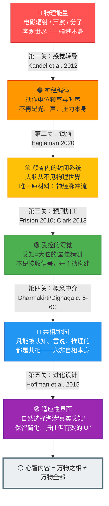

# 心智内容百分百是万物之相，非万物全部

## Mental Content Is 100% Representations of Things, Not the Things Themselves

科日布斯基"地图非疆域"的东方版本。
佛家"亲所缘缘"与认知科学"感觉替代"实验。

---

## 摘要

本文提出并论证一个核心认识论公理——**心智内容百分百是万物之相，非万物全部**（Mental content is 100% representations of things, not the things themselves）。该命题同时出现于五个独立学术传统：(1) 科日布斯基普通语义学（"地图非疆域"），(2) 佛教量论/瑜伽行派认识论（亲所缘缘-疏所缘缘的严格二分），(3) 认知神经科学的感知替代与预测编码，(4) 分析哲学的感知问题，(5) 神经生物学的感觉转导。五条线索从不同起点、用不同方法，独立收敛于同一核心洞见，构成强多重收敛证据。本文进一步提出五层防御模型（转导→封闭脑→预测性构建→概念中介→进化设计界面）来系统化论证"为什么感知永远是相而非物自体"，并引入"定格与流变"的认知动力学分析——揭示"将动态实在定格为静态切片"是人类认知效率的代价，也是将地图误认为疆域的认知根源。

**关键词**：地图非疆域，亲所缘缘，预测编码，感觉转导，普通语义学，量论，表征与实在，定格与流变

> **证据等级**：形式化 [F] + 神经证据 [N] + 元伦理/规范 [M]

---

## 概述

本文档围绕核心公理——**"心智内容百分百是万物之相，非万物全部"（Mental content is 100% representations of things, not the things themselves）**——提供跨学科文献调研。该命题同时出现在五个独立学术传统中：(1) 科日布斯基普通语义学，(2) 佛教量论/瑜伽行派认识论，(3) 认知神经科学的感知替代与预测加工，(4) 分析哲学中的感知问题，(5) 神经生物学中的感觉转导。五条线索相互独立地收敛于同一结论，构成强多重收敛证据。

---

## 1. 科日布斯基与普通语义学

### 1.1 原始来源

**Korzybski, A. (1933). *Science and Sanity: An Introduction to Non-Aristotelian Systems and General Semantics*. International Non-Aristotelian Library.**

- 首提"地图不是疆域"（The map is not the territory）的核心公理：任何表征系统（语言、概念、信念）在结构上必然与其表征的对象不同。
- 提出"结构微分模型"（Structural Differential）：展示从"事件层次"（无限复杂的物理实在）到"对象层次"（感知到的物体）到"描述层次"（语言标签）的逐级抽象过程，每一级都在丢失信息。
- 核心主张：人类的"语义反应"（semantic reactions）是对语词和概念的神经生理反应，而非对事物本身的反应——人生活在"语词世界"中，误将地图当疆域是人类苦难的根源。
- 将"对表征与实在的混淆"识别为精神病理学和科学错误的共同根源。

**对核心公理的贡献**: 首次用现代科学语言明确表述"心智内容=表征，不等于实在"的命题，并提供三级抽象模型解释从物理世界到心理表征的必然信息丢失。

### 1.2 后续学术发展

**Bateson, G. (1972). *Steps to an Ecology of Mind*. University of Chicago Press.**

- 将地图-疆域区分从语义学扩展到认知科学和系统论。提出"信息是制造差异的差异"（information is a difference that makes a difference），即生物体从不直接接触环境，只接触"差异"（neural firing patterns）。
- 引入 von Uexkull 的 umwelt 概念进入英语学界。

 **von Uexkull, J. (1934/2010). *A Foray into the Worlds of Animals and Humans*. University of Minnesota Press.** (原德文版 1934)

- 提出"umwelt"（主观环境世界）概念：每个物种生活在由其感觉器官和效应器官构建的独特主观世界中，而非"那个"客观世界。蜱虫的 umwelt（只有丁酸气味、体温、毛发三种信号）与人类的 umwelt 完全不同。
- 这是"地图不是疆域"的生物学版本：感官结构限制了可接收的信号类型，生物体永远生活在自身的"认知地图"中。

**对核心公理的贡献**: Umwelt 概念表明不仅人类，所有生物体都生活在"物种特定的表征世界"中，不存在对"疆域"的"客观感知"。

---

## 2. 佛教认识论：瑜伽行派与陈那-法称体系

### 2.1 陈那 (Dignaga, c. 480-540 CE) 的感知理论

**Hattori, M. (1968). *Dignaga, On Perception: Being the Pratyaksapariccheda of Dignaga's Pramanasamuccaya*. Harvard University Press.**

- 陈那在其《集量论》(Pramanasamuccaya) 中提出两种有效认知手段（量，pramana）：现量（pratyaksa，直接感知）和比量（anumana，推理/概念认知）。
- 现量（感知）的特征是**离分别**（kalpanapodha）：感知本身是对个别相（svalaksana）的直接接触，不含概念构造（vikalpa）。感知是前语言的、前概念的。
- 比量（推理/概念认知）处理的是共相（samanyalaksana）——由心识构造的普遍概念。
- 然关键之处在于：虽然现量直接接触个别的实在，但**我们所"知道"的一切感知内容（即凡能进入意识并被言说的）都已经经过了比量的概念化处理**。我们"知道"的永远是共相，不是自相。

**核心公理对应**: 陈那的 svalaksana（自相/个别的实在）对应"疆域"；samanyalaksana（共相/概念构造物）对应"地图"。我们能直接感知自相，但我们"知道"的永远是共相——即心智内容永远是"地图"。

### 2.2 法称 (Dharmakirti, c. 600-660 CE) 的认识论

**Dunne, J. D. (2004). *Foundations of Dharmakirti's Philosophy*. Wisdom Publications.**

- 法称在《释量论》(Pramanavarttika) 中深化了陈那的二分法。自相（svalaksana）是瞬间的、个别的、具有因果效力的实有（arthakriyakaritva —— 能产生实际效果是实在的判据）；共相（samanyalaksana）是永恒的、普遍的、无因果效力的概念构造。
- 关键论证：**凡能被语言表达的，都是共相**。因为语言通过排除（apoha/遮遣）起作用——"牛"这个词的作用是把一切"非牛"排除出去，而非正面指涉某个实在。这意味着我们所有的命题性知识都是关于"地图"的，而非关于"疆域"的。
- 法称对"亲所缘缘"（pratyaksa-alambana-pratyaya）的论述：感知的直接对象（亲所缘缘）永远是内在的"相分"（akara），即在心识中呈现的表征形式。外在对象（疏所缘缘）是间接的。

**Dreyfus, G. B. J. (1997). *Recognizing Reality: Dharmakirti's Philosophy and Its Tibetan Interpretations*. SUNY Press.**

- 系统梳理了法称体系在藏传佛教中的发展，特别是格鲁派和萨迦派对"自相是否可直接被认知"的争论。
- 格鲁派（宗喀巴）倾向温和实在论：自相确实被感知直接接触，但认知中出现的永远是"义总"（don spyi，意义共相）。
- 萨迦派（果让巴）倾向更强烈的反实在论：强调"认识的对象本身就是心识的显现"。

**Tillemans, T. J. F. (1999). *Scripture, Logic, Language: Essays on Dharmakirti and His Tibetan Successors*. Wisdom Publications.**

- 深入分析法称的 apoha（遮遣/排除）语义理论及"语言必须以概念为中介"的论证。所有语言知识都是排除性的，而非描述性的——这是"地图无法等于疆域"的严格逻辑论证。

**核心公理对应**: 法称的体系从认识论和语义学两个角度论证了"心智内容=共相=概念构造=地图"，并提供了严格的哲学论证（apoha理论）说明为什么语言永远无法直接抵达"疆域"。

### 2.3 瑜伽行派的"三性"理论 (Trisvabhava)

**Williams, P. (2008). *Mahayana Buddhism: The Doctrinal Foundations* (2nd ed.). Routledge.**

- 瑜伽行派（Yogacara/Vijnanavada）的"唯识"（vijnapti-matra，representation-only）理论通过三性（trisvabhava）来分析所有经验：
  - **遍计所执性** (parikalpita-svabhava)：将被概念构造出来的东西误认为实在——即"把地图当疆域"。
  - **依他起性** (paratantra-svabhava)：一切经验现象依因缘条件（感官、神经活动、先验概念框架）而显现——即"地图是如何被生成的"。
  - **圆成实性** (parinispanna-svabhava)：当遍计所执性被去除后，依他起性本身被如实地认识——即"知道地图只是地图"。

**Garfield, J. L. (2002). *Empty Words: Buddhist Philosophy and Cross-Cultural Interpretation*. Oxford University Press.**

- 将瑜伽行派的"唯识"解读为认识论的唯心论（epistemological idealism）而非形而上学的唯心论：瑜伽行派并不否认外部世界的存在，而是论证我们**只能**通过心识的表征来接触世界。

**Lusthaus, D. (2002). *Buddhist Phenomenology: A Philosophical Investigation of Yogacara Buddhism and the Ch'eng Wei-shih Lun*. Routledge.**

- 将瑜伽行派定位为现象学而非唯心论："瑜伽行派不是在说'外部世界不存在'，而是在说'我们对世界的一切经验都是被心识所中介和构造的'"。
- 核心概念"亲所缘缘"：感知的直接对象（亲所缘缘）是心识内部生起的表征（相分），而非外在事物本身。外在事物（疏所缘缘）通过因果作用影响感官和心识，但我们从未直接觉知它们。

**核心公理对应**: 三性理论是对"地图-vs-疆域"的最精细分析——遍计所执性=混淆地图与疆域，依他起性=地图的生成机制，圆成实性=如实知地图即地图。

### 2.4 《心经》的现代转译：空与相的统一

《心经》（Prajñāpāramitā Hṛdaya Sūtra）的核心命题——"色即是空，空即是色"——在"地图非疆域"的框架下可以被精确转译：

- **"色"（rūpa, form）** = 现象层面的一切显现——即我们感知到的"地图"（认知切片、概念构造、感官表征）
- **"空"（śūnyatā, emptiness）** = 一切现象无固定自性（svabhāva）——即"地图"不是"疆域"本身，地图没有独立的、固有的"真实性"

"色即是空"的现代转译：**所有我们感知到的"相"（地图/表征/认知切片）都没有固定的自性——它们是被认知系统构造出来的，不是"外面的世界本身"。**

"空即是色"的现代转译：**"空"不是一个独立于现象之外的"虚无"——它恰恰就是现象本身被如实认识时的状态。** "空"不是"没有"，而是"没有固定自性"——这与"地图不是疆域"（而非"地图不存在"）完全一致。

**"无"字的陷阱**：抠一个"无"字容易掉坑——"无我相"不是把人抠没了（变成行尸走肉），"无人相"不是把别人抠没了（冷漠当解脱），"无众生相"不是把世界抠没了（虚无当智慧）。真正的"无"不是"没有"，是**不被困住**——用着相（地图），但知道它不是实相（疆域）本身。这就是"见诸相非相，即见如来"的操作含义。

**用"正圆"的例子统一理解**：大自然没有正圆（这是"空"——没有固定自性的正圆存在于物理世界中），但我们可以画正圆（这是"色"——现象层面的有效构造）。"色即是空" = 我们画的正圆不是大自然本身；"空即是色" = "大自然没有正圆"这个事实本身，恰恰是通过我们画的正圆（及其与自然的偏差）被认识到的。**"若见诸相非相，即见如来"** = 一边用着正圆（你总得画图吧），一边知道它不是天然的——这就是"觉悟"的认知操作。

这一转译将《心经》从"神秘主义文本"重新定位为**对认知切片机制的精确现象学描述**——它与Korzybski的"地图非疆域"、预测编码的"受控的幻觉"、以及法称的apoha语义理论在结构上完全一致。

---

## 3. 认知神经科学：感官替代、锁脑与预测加工

### 3.1 感官替代实验

**Bach-y-Rita, P., Collins, C. C., Saunders, F. A., White, B., & Scadden, L. (1969). Vision substitution by tactile image projection. *Nature*, 221(5184), 963-964.** DOI: 10.1038/221963a0

- 首次证明"视觉"信息可以通过触觉通道传递：盲人被试通过背部触觉刺激阵列接收摄像机拍摄的视觉模式，能够识别物体、面部和透视。报告称被试体验到"物体在空间中的存在"而非"背部被触碰"。
- 关键含义：**"看"到的不是光，而是大脑对感觉信号的解释。** 视觉经验可以在完全没有视网膜刺激的情况下产生——只要携带相同结构信息的信号到达大脑，大脑就将其翻译为视觉。

**Bach-y-Rita, P. (2004). Tactile sensory substitution studies. *Annals of the New York Academy of Sciences*, 1013, 83-91.** DOI: 10.1196/annals.1305.006

- 综述三十年感官替代研究的结论：大脑不是感官特异性的，而是"信息处理器"——它接收的是神经脉冲模式，不管这些脉冲来自眼睛、耳朵还是皮肤。

**核心公理对应**: 感官替代证明"我们看到的世界不是'外面'的直接呈现，而是大脑从任意神经信号中构建出来的表征"——即我们永远只看到"地图"。

### 3.2 Eagleman 的大脑可塑性与 Umwelt

**Eagleman, D. (2020). *Livewired: The Inside Story of the Ever-Changing Brain*. Pantheon.**

- 提出"锁脑"（locked-in brain）模型：大脑被封闭在颅骨的黑暗寂静中，永远无法直接接触光、声、气味或任何物理世界。它唯一接收的是经由感觉器官转导后的电化学脉冲模式。
- 大脑的"可塑性"——感官替代之所以可能——恰恰是因为大脑不"知道"这些脉冲来自什么感官。大脑只是学习输入模式中的统计规律，然后用这些模式构建一个内部模型。
- 引入 von Uexkull 的 umwelt 概念进入当代神经科学框架：每个大脑根据其感官硬件构建其特有的主观世界——即"地图"。

**Eagleman, D. M. (2015). Can we create new senses for humans? *TED Talk*. (学术论文版本见 Eagleman 实验室在 *Frontiers in Neuroscience* 等期刊的多篇感官替代论文)**

**核心公理对应**: 锁脑模型为"心智内容百分百是表征"提供了神经解剖学的直接论证——大脑在物理上与外部世界完全隔绝，它唯一的"原材料"是神经脉冲模式。

### 3.3 预测加工与贝叶斯脑

**Clark, A. (2013). Whatever next? Predictive brains, situated agents, and the future of cognitive science. *Behavioral and Brain Sciences*, 36(3), 181-204.** DOI: 10.1017/S0140525X12000477

- 提出"预测加工"（predictive processing）作为统一的认知框架：大脑是一个多层级的预测引擎，它不是被动接收感官数据，而是主动生成关于感觉输入来源的预测（自上而下的生成模型），仅将预测误差（prediction error）向上传递。
- 关键含义：**我们"感知到"的不是感觉输入本身，而是大脑的"最佳猜测"（best guess）——即大脑构建的内部模型对感觉输入来源的推断。** 感知=受控的幻觉（controlled hallucination）。

**Friston, K. (2010). The free-energy principle: a unified brain theory? *Nature Reviews Neuroscience*, 11(2), 127-138.** DOI: 10.1038/nrn2787

- 提出自由能原理（free-energy principle）：所有自组织系统（包括大脑）通过最小化"自由能"（即感官惊奇/surprise 的上界）来维持其存在。大脑通过不断更新其内部生成模型（即"地图"）来最小化预测误差。
- 数学上证明：任何维持自身存在的系统必须包含一个关于其所处环境的内部模型——即必须有一个"地图"。

**Hohwy, J. (2013). *The Predictive Mind*. Oxford University Press.**

- 提出"预测加工的认识论含义"：如果感知是预测，那么感知与外部世界的关系是间接的、推论式的。大脑被封闭在颅骨内，只能通过预测误差的统计模式来推断外部世界——这是"间接实在论"的神经计算版本。
- 提出"自我证据"（self-evidencing）概念：感知系统不是"揭示"世界，而是通过其内部模型"解释掉"感觉证据来维持自身。

**Seth, A. K. (2013). Interoceptive inference, emotion, and the embodied self. *Trends in Cognitive Sciences*, 17(11), 565-573.** DOI: 10.1016/j.tics.2013.09.007

- 将预测加工扩展到内感受（interoception）：不仅对外部世界的感知是"受控的幻觉"，对身体内部状态的感知也是——情绪和身体感觉同样是大脑的"最佳猜测"。
- 这意味着连"我自己的身体"的心智内容也是地图而非疆域。

**核心公理对应**: 预测加工从计算神经科学层面提供了一个严格的数学和机制性框架，解释为什么和如何心智内容永远是内部模型（地图）而非外部实在（疆域）。感知=受控的幻觉，这一命题是现代神经科学对"心智内容百分百是万物之相"的最精确表述。

---

## 4. 分析哲学中的感知问题

### 4.1 感知之幕传统

**Locke, J. (1689/1975). *An Essay Concerning Human Understanding*. (P. H. Nidditch, Ed.). Oxford University Press.**

- 提出"观念之途"（the way of ideas）和第一性/第二性质的区分：我们直接感知的是"观念"（ideas），而非事物本身。颜色、声音、气味等"第二性质"不是物体本身的属性，而是物体在我们心中产生观念的能力。
- 这是"心智内容百分百是观念（表征）"的现代哲学奠基。

**Berkeley, G. (1710/1998). *A Treatise Concerning the Principles of Human Knowledge*. (J. Dancy, Ed.). Oxford University Press.**

- 将洛克的观点推向极端："存在即被感知"（esse est percipi）。如果所有我们接触的都只是观念，那么"物质实体"的概念本身就是空洞的。

**Hume, D. (1739/2007). *A Treatise of Human Nature*. (D. F. Norton & M. J. Norton, Eds.). Oxford University Press.**

- 进一步论证：我们感知到的只是"印象"（impressions）和"观念"（ideas），无法直接感知因果联系或外部世界的持续存在。

### 4.2 当代辩论：表征主义 vs 朴素实在论

**Martin, M. G. F. (2002). The transparency of experience. *Mind & Language*, 17(4), 376-425.** DOI: 10.1111/1468-0017.00205

- 提出"经验的透明性"论证：当我们试图内省感知经验本身时，我们发现的只是被感知对象的属性（如树叶的绿色），而非经验自身的属性。这被用来论证"朴素实在论"（naive realism）：感知直接呈现世界本身，而非表征——"地图的透明性"。
- **注意**: 透明性是一个现象学主张（经验"看起来"是透明的），但它不反驳"底层机制是表征性的"这一神经科学事实。

**Fish, W. (2010). *Philosophy of Perception: A Contemporary Introduction*. Routledge.**

- 系统对比了感知哲学的四大立场：
  - **朴素实在论/析取论**：在真实感知中，我们直接接触世界本身（而非表征），幻觉是不同种类的心理状态。代表人物: M. G. F. Martin, John McDowell。
  - **意向主义/表征主义**：感知本质上是命题态度或表征状态，与信念同属一类。代表: Michael Tye, Fred Dretske。
  - **现象主义**：感知是关于感觉与料（sense-data）的直接觉知。代表: A. J. Ayer, early sense-data theorists。
  - ** enactivism / embodied cognition**：感知不是内部表征，而是有机体与环境的主动互动。代表: Alva Noë, Evan Thompson。

**Tye, M. (1995). *Ten Problems of Consciousness: A Representational Theory of the Phenomenal Mind*. MIT Press.** DOI: 10.7551/mitpress/6712.001.0001

- 辩护"强表征主义"：现象意识（qualia/感觉质）完全由表征内容构成——感知经验的"感觉如何"（what it is like）等于其表征内容。这意味着连"红色的红"这种最原始的感觉质也是表征而非事物本身。

**Pautz, A. (2011). Can disjunctivists explain our access to the sensible world? *Philosophical Issues*, 21(1), 384-433.** DOI: 10.1111/j.1533-6077.2011.00209.x

- 批评朴素实在论/析取论无法解释幻觉和真实感知"从内部无法区分"这一事实。这个事实恰恰说明心智内容的"种类"是表征性的——无论外部对象是否存在，心智内容可以是相同种类的。

### 4.3 预测加工对感知哲学的重塑

**Clark, A. (2016). *Surfing Uncertainty: Prediction, Action, and the Embodied Mind*. Oxford University Press.** DOI: 10.1093/acprof:oso/9780190217013.001.0001

- 提出预测加工在朴素实在论和表征主义之间开辟了"第三条道路"：
  - 感知不是对外部世界的被动接收（反对现象主义/感觉与料理论），
  - 也不是对独立于心灵的外部世界的直接接触（反对朴素实在论的强解读），
  - 而是大脑通过预测性生成模型**主动构建**一个内部世界模型，这个模型在功能上被当作"外部世界"。
- 这实际上是一个"神经计算版本的表征主义"——心智内容是大脑的预测模型，这个模型被经验为"世界"，但它始终是模型而非世界本身。

**Seth, A. K. (2021). *Being You: A New Science of Consciousness*. Faber & Faber.**

- 提出"受控的幻觉"（controlled hallucination）概念：感知经验是一种由感官信号约束的大脑幻觉——大脑不断"幻觉"出对世界的模型，感官信号的作用是约束这些幻觉使之不偏离功能相关的环境特征太远。
- 这为"心智内容百分百是万物之相"提供了精确的神经科学版本：感知就是"受控的相"。

**核心公理对应**: 预测加工框架在分析哲学和计算神经科学之间建立了桥梁——它保留了表征主义的核心洞见（心智内容是内部模型），同时避免了现象主义的难题（存在独立的外部世界），并解释了为什么"经验透明性"只是现象学错觉（如同我们不会注意到眼镜的存在）。

---

## 5. "地图不是疆域"的神经生物学基础

### 5.1 感觉转导：从物理能量到神经脉冲

**Kandel, E. R., Schwartz, J. H., Jessell, T. M., Siegelbaum, S. A., & Hudspeth, A. J. (2012). *Principles of Neural Science* (5th ed.). McGraw-Hill.** (标准教科书)

- 所有感觉系统都遵循同一原则：**转导**（transduction）——将一种形式的物理能量转换为另一种（神经电化学信号）。
- 光感受器将电磁辐射转换为膜电位变化，机械感受器将压力/振动转换为离子通道开放，化学感受器将分子结合转换为G蛋白级联反应。
- 关键：到达大脑的永远是动作电位的频率和时序模式，而非光、声、压力本身。从转导的那一刻起，"疆域"（物理世界）已经被"翻译"成了"地图"（神经编码）。

**核心公理对应**: 感觉转导是"地图≠疆域"的第一个物理关卡——在神经系统的入口处，物理能量已经完成了向神经符号的转换。

### 5.2 颜色感知

**Gegenfurtner, K. R., & Kiper, D. C. (2003). Color vision. *Annual Review of Neuroscience*, 26, 181-206.** DOI: 10.1146/annurev.neuro.26.041002.131116

- 电磁辐射本身没有颜色——"颜色"是神经系统对波长信息的构造。700nm的电磁辐射在物理上并不"是"红色，它只是具有特定波长范围的电磁波，被人类的三种视锥细胞（长波/L-锥对560nm最敏感，中波/M-锥对530nm最敏感，短波/S-锥对420nm最敏感）以特定的比例吸收。
- 颜色恒常性（color constancy）现象——同一物体在不同光照下被感知为相同颜色——进一步说明颜色不是物理属性，而是大脑对表面反射率的推断。大脑不是在"测量波长"，而是在"计算"物体的表面属性。

**Hardin, C. L. (1988). *Color for Philosophers: Unweaving the Rainbow*. Hackett.**

- 系统论证颜色不是客观物理属性，而是由神经系统构造的主观经验。从物理学、生理学和现象学三个层面证明"红色不在700nm光中"。

**核心公理对应**: 颜色是"地图不是疆域"的标准示例——"红"不在光中，"红"是大脑对特定波长比例的编码和体验。

### 5.3 伤害性感受与疼痛

**Melzack, R., & Wall, P. D. (1965). Pain mechanisms: a new theory. *Science*, 150(3699), 971-979.** DOI: 10.1126/science.150.3699.971

- 提出疼痛的闸门控制理论，革命性地将疼痛从"损伤的直接感知"转变为"由中枢神经系统调制的复杂过程"。

**Tracey, I., & Mantyh, P. W. (2007). The cerebral signature for pain perception and its modulation. *Neuron*, 55(3), 377-391.** DOI: 10.1016/j.neuron.2007.07.012

- 明确区分**伤害性感受**（nociception，外周伤害感受器对组织损伤的检测）和**疼痛**（pain，大脑对伤害性感受信号的解释和情感加工）。
- 同样的伤害性感受输入可以产生截然不同的疼痛体验，取决于注意、预期、情绪、文化背景和先验经验。
- 反过来，在没有伤害性感受输入的情况下也能产生剧烈疼痛——如幻肢痛、慢性疼痛综合征。

**Apkarian, A. V., Bushnell, M. C., Treede, R. D., & Zubieta, J. K. (2005). Human brain mechanisms of pain perception and regulation in health and disease. *European Journal of Pain*, 9(4), 463-484.** DOI: 10.1016/j.ejpain.2004.11.001

- 综述疼痛的脑成像研究：疼痛经验不是由一个"疼痛中枢"生成的，而是由多个脑区（体感皮层、前扣带回、岛叶、前额叶）构成的分布式网络共同生成。
- 这进一步支持疼痛是一种大脑构建的"地图"——伤害性感受是输入信号，但疼痛体验是大脑对该信号的解释。

**核心公理对应**: 疼痛-伤害性感受的区分是"地图≠疆域"在身体内部感知层面的直接证据——连"我痛"这个最基本的身体感受都是一个解释/表征，而非对身体状态的直接读取。

### 5.4 感知的"接口理论"

**Hoffman, D. D., Singh, M., & Prakash, C. (2015). The interface theory of perception. *Psychonomic Bulletin & Review*, 22, 1480-1506.** DOI: 10.3758/s13423-015-0890-8

- 提出感知的"接口理论"（Interface Theory of Perception, ITP）：自然选择不选择"真实"的感知，而选择"适应"的感知——感知的作用不是揭示客观实在，而是提供适合生存和繁殖的"用户界面"。
- 用进化博弈论的形式模型证明：在几乎所有条件下，自然选择淘汰"真实感知"的基因型，而保留"界面感知"（即简化、扭曲但行为有效的表征）。
- 类比：电脑桌面上的文件夹图标不是计算机文件系统本身的真实呈现，而是隐藏了底层复杂性的"用户界面"——我们通过"界面"（即感知内容）操作世界，但界面本身不是世界。

**核心公理对应**: ITP 提供了进化生物学的论证：不仅我们的心智内容是表征，而且进化"设计"它们来隐藏（而非揭示）客观实在的大部分结构——因为"真实"在适应性上是劣化的。地图不仅不是疆域，而且**必然**不是疆域。

---

## 6. 综合：多重收敛

### 6.0 五层防御：为什么感知永远是"相"而非"物自体"

上述五条学术传统——（1）科日布斯基与普通语义学，（2）佛教量论/瑜伽行派，（3）认知神经科学的感官替代与预测加工，（4）分析哲学的感知问题，（5）神经生物学的感觉转导——从不同起点、用不同方法，独立收敛于同一核心洞见：

> **心智内容百分百是万物之相（表征/地图/内部模型），而非万物全部（实在/疆域/外部世界）。**

### 6.1 定格与流变：认知切片的动态学

上述五条线索共同揭示了一个更深层的结构：**"相"（表征/地图）的本质是一种"定格"（freeze-frame）操作——将动态、连续、不可分割的实在（"流变"）强行切割为静态、离散、可操作的切片**。

这一洞见同时出现在多个独立传统中：

- **佛教"刹那生灭"（ksanikavada）**：一切有为法在每一刹那都在生灭变化，没有任何"事物"有固定的自性（svabhava）。我们感知到的"桌子"只是在无数刹那中保持相似模式的一个流动过程，我们强行将其定格为一个"实体"。
- **怀特海过程哲学**（Whitehead, 1929）："实际的东西都是过程"（actual entities are processes）。我们为了方便语言和思维而用"实体"概念去切割流动，但"实体"本身只是思维虚构的抽象。
- **预测编码的"采样频率"问题**：大脑必须在一个有限的采样频率（约100ms的加工窗口，见 `2_models/100ms_model.md`）内构建世界的模型。这意味着大脑天然地在进行"定格"操作——每一次感知都是对连续信号的一次离散采样。
- **Korzybski (1933) 的"结构微分模型"（Structural Differential）**：从"事件层次"（无限复杂的物理实在）到"对象层次"（感知到的物体）到"描述层次"（语言标签），每一级抽象都是一次"冻结"——事件是流动的，对象是定格的，标签是凝固的。

**"定格"是人类思维意识高效运作的代价。** 为了采样世界，思维必须定格——把流动的人定格为"性格"，把流动的关系定格为"好/坏"，把流动的情境定格为"对/错"。定格之后，人类忘记了这只是切片——"他昨天生气了"被误解为"他是个暴躁的人"，"这次失败了"被误解为"我是个失败者"。这就是"误解为事实真相"的认知根源：**将动态的一帧当成静态的全部，这是我们为了认知效率而缴纳的税。**

**"流变"是实相，"定格"是工具。** 问题的关键不在于"不要定格"（没有定格就无法认知），而在于**知道自己在定格，并且随时准备更新切片**。这与道家"为道日损"的洞见一致——不是不学习（"为学日益"），而是在学习的基础上减去对"所学即真理"的执着（"为道日损"）。"见诸相非相"（《金刚经》）精确地表达了这一态度：用着相（定格），但知道它不是实相（流变）本身。

### 6.2 收敛的逻辑层次

| 层次 | 论证类型 | 关键来源 | 核心贡献 |
|------|---------|---------|---------|
| **物理层** | 感觉转导机制 | Kandel et al. (2012); 感觉生理学 | 感觉系统在门控处已完成能量形式的转换——进入神经系统的不是物理世界，而是神经编码 |
| **神经计算层** | 预测加工框架 | Friston (2010); Clark (2013, 2016); Hohwy (2013); Seth (2013, 2021) | 大脑不被动接收感觉信号，而是主动构建内部模型；感知=受控的幻觉 |
| **功能层** | 感官替代与锁脑 | Bach-y-Rita (1969, 2004); Eagleman (2020) | 大脑不关心信号的感官来源——任何结构信息足够的神经脉冲都可被"视为"任一感官的输入——证明大脑处理的是"地图"而非"疆域" |
| **进化层** | 接口理论 | Hoffman et al. (2015) | 自然选择系统性地淘汰"真实感知"，保留适应性"界面"——地图必然不是疆域 |
| **现象学层** | 感知哲学与经验透明性 | Martin (2002); Tye (1995); Pautz (2011) | 真实感知与幻觉的"从内部不可区分性"证明心智内容的种类是表征性的 |
| **认识论层** | 佛教量论 | Dignaga/Hattori (1968); Dharmakirti/Dunne (2004); Dreyfus (1997); Tillemans (1999) | 自相-共相的严格二分：认知内容永远是共相（概念构造），即便感知本身是直接的 |
| **元认知层** | 瑜伽行派三性 | Williams (2008); Lusthaus (2002); Garfield (2002) | 三性理论提供了对"误把地图当疆域"（遍计所执性）以及"如实知地图即地图"（圆成实性）的最精细分析 |
| **语义学层** | 普通语义学 | Korzybski (1933); Bateson (1972) | 语词不是事物本身；混淆表征与实在导致认知错误和心理痛苦 |

### 6.2a 收敛中的张力：五个传统之间的分歧

上述"多重收敛"论证是强有力的——五个独立传统从不同起点抵达了同一结论。但一个诚实的学术框架必须面对这些传统之间的**分歧**（而不仅仅是它们的一致之处）。这些分歧并不推翻收敛论证，但它们划定了框架的边界，并防止我们将"收敛"误解为"完全一致"。

**（a）现量（直接感知）是否接触自相？——佛教内部的争论。** 陈那（Dignaga）的《集量论》主张现量（pratyaksa，直接感知）是对自相（svalaksana，个别的实在）的直接接触——"离分别"（kalpanapodha，无概念构造）。这与预测编码的"所有感知都是推理"似乎存在张力：如果所有感知都是生成模型的"最佳猜测"（Clark, 2013），那么"直接接触自相"在计算上意味着什么？

一种调和方案是区分"感知的触发"和"感知的内容"。现量可以被理解为**预测误差信号的初始触发**——在概念化和意识访问之前的、最原始的"差异检测"（discrepancy detection）。这一原始信号确实"接触"了自相（它是由外部实在的因果效力触发的），但它本身尚未成为"感知内容"——感知内容（即我们能报告和记忆的东西）永远是生成模型对这一原始信号的"最佳解释"，即共相。在这一解读下，陈那的"现量接触自相"和预测编码的"感知是推理"并不矛盾——它们描述的是感知过程中不同时间窗口（<100ms vs >100ms）的不同操作阶段。

**（b）瑜伽行派的"唯识"——是否否认外部世界？** 瑜伽行派（Yogacara）的"唯识"（vijnapti-matra，representation-only）理论在历史上常被解读为形而上学唯心论——"外部世界不存在，一切都是心识的显现"。如果这一解读是正确的，那么瑜伽行派与神经科学（明确承认外部物理世界的存在）之间存在根本矛盾。

然而，当代学者（Garfield, 2002; Lusthaus, 2002）倾向于一种**认识论解读**：瑜伽行派不否认外部世界的存在，而是论证我们**只能**通过心识的表征来接触世界——因此，关于"外部世界本身是什么"的任何断言都超出了认知的边界。这一解读与预测编码框架完全兼容：大脑确实被封闭在颅骨内，确实只能通过神经脉冲流来推断外部世界——但这并不意味着外部世界不存在。

**（c）Hoffman 的"界面理论"——是否过于激进？** Hoffman 等人（2015）的界面理论（Interface Theory of Perception, ITP）主张自然选择**系统性地淘汰真实感知**——即进化不会选择"看到真实"的有机体，而会选择"看到适应性界面"的有机体。这一论证基于进化博弈论的数学模型，但它面临一个明显的反驳：如果感知完全不真实，为什么我们能够成功地操纵环境（如建造桥梁、发射火箭）？

Hoffman 的回应是：适应性界面不需要"真实"——它只需要"足够好地指导行动"。飞机的仪表盘不显示空气分子的真实运动，但它足以让飞行员安全降落。然而，这一类比可能低估了科学知识的累积性：如果每一代科学理论都是"适应性界面"，那么科学如何能够系统性地提高其预测精度？Dao.Science 项目在这一问题上采取中间立场：我们接受 Hoffman 的"感知是界面"的核心洞见，但不接受其"界面与真实之间没有任何收敛关系"的强版本。预测编码框架提供了一个更温和的替代方案：感知是"受控的幻觉"（controlled hallucination; Seth, 2021）——它是构造的，但它通过与感觉信号的持续比对（预测误差最小化）而被**约束**在真实的结构之上。地图不是疆域，但好的地图被疆域所约束。

**（d）科日布斯基的"结构相似性"——是否与佛教量论冲突？** 科日布斯基（1933）主张好的地图与疆域之间存在"结构相似性"（structural similarity）——地图的**关系结构**与疆域的关系结构同构。这与法称（Dharmakirti）的 apoha（遮遣/排除）语义学——语言通过"排除"而非"描述"来运作——似乎存在张力：如果语言只是排除性的，它如何能够捕捉疆域的"结构"？

这一张力可以通过区分"表征的媒介"和"表征的结构"来解决。Apoha 理论正确地指出：语言和概念通过排除（"牛"= 一切非牛的被排除）来运作——这是表征的**媒介**层面的特征。科日布斯基的"结构相似性"则指向表征的**关系结构**层面：地图上的距离比例与疆域中的空间关系之间存在同构——无论地图是用中文、英文还是数学符号绘制的。两者并不矛盾——它们描述了表征的不同层面。

**这些分歧的总体评估**：五个传统之间的分歧是真实的，但它们并不推翻"心智内容=表征≠实在"的核心命题。相反，它们丰富了我们对这一命题的理解——揭示了表征的精确本质、表征与实在之间的关系类型、以及表征的进化-认知约束——而这些正是 Dao.Science 项目试图系统化的问题。

### 6.3 核心公理的精确表述

上述所有学术传统的综合可被精确表述为以下命题：

1. **转导命题**（物理）：所有感觉输入在到达中枢神经系统之前，已经完成了从物理能量到神经电化学信号的编码转换——大脑的"原材料"永远是神经脉冲模式，而非外部世界的物理属性。

2. **构造命题**（神经计算）：有意识的感知经验不是感觉输入的直接反映，而是大脑通过多层级的预测性生成模型主动构建的内部模型（即"受控的幻觉"）。感知内容=大脑对感觉输入之来源的"最佳猜测"。

3. **封闭命题**（功能/解剖）：大脑在物理上被封闭在颅骨内，其唯一的"窗口"是经由感觉转导后的神经脉冲流。它从不直接接触光、声、分子或任何物理刺激。

4. **进化命题**（适应论）：自然选择不选择"真实"的感知，而选择适应性的感知界面——心智内容在进化上被设计来隐藏而不是揭示客观实在。

5. **认识论命题**（佛教量论）：虽然存在对外部实在的直接接触（现量/自相），但一切能被认知、记忆、言说、推理的内容都已经是概念共相（比量/共相）——即"心智内容永远是对自相的表征，而非自相本身"。

6. **元认知命题**（三性）：心理健康和认知准确性不在于"获得对实在的直接接触"，而在于"如实认识到心智内容即是表征（依他起性），不把表征误认为实在（断除遍计所执性）"。

---

## 参考文献总目

### 普通语义学
- Korzybski, A. (1933). *Science and Sanity: An Introduction to Non-Aristotelian Systems and General Semantics*. International Non-Aristotelian Library.
- Bateson, G. (1972). *Steps to an Ecology of Mind*. University of Chicago Press.
- von Uexkull, J. (1934/2010). *A Foray into the Worlds of Animals and Humans*. University of Minnesota Press.

### 佛教认识论
- Hattori, M. (1968). *Dignaga, On Perception: Being the Pratyaksapariccheda of Dignaga's Pramanasamuccaya*. Harvard University Press.
- Dunne, J. D. (2004). *Foundations of Dharmakirti's Philosophy*. Wisdom Publications.
- Dreyfus, G. B. J. (1997). *Recognizing Reality: Dharmakirti's Philosophy and Its Tibetan Interpretations*. SUNY Press.
- Tillemans, T. J. F. (1999). *Scripture, Logic, Language: Essays on Dharmakirti and His Tibetan Successors*. Wisdom Publications.
- Williams, P. (2008). *Mahayana Buddhism: The Doctrinal Foundations* (2nd ed.). Routledge.
- Lusthaus, D. (2002). *Buddhist Phenomenology: A Philosophical Investigation of Yogacara Buddhism*. Routledge.
- Garfield, J. L. (2002). *Empty Words: Buddhist Philosophy and Cross-Cultural Interpretation*. Oxford University Press.
- Arnold, D. (2008). *Buddhists, Brahmins, and Belief: Epistemology in South Asian Philosophy of Religion*. Columbia University Press.

### 认知神经科学与预测加工
- Bach-y-Rita, P. et al. (1969). Vision substitution by tactile image projection. *Nature*, 221(5184), 963-964.
- Bach-y-Rita, P. (2004). Tactile sensory substitution studies. *Annals of the New York Academy of Sciences*, 1013, 83-91.
- Eagleman, D. (2020). *Livewired: The Inside Story of the Ever-Changing Brain*. Pantheon.
- Clark, A. (2013). Whatever next? Predictive brains, situated agents, and the future of cognitive science. *Behavioral and Brain Sciences*, 36(3), 181-204.
- Clark, A. (2016). *Surfing Uncertainty: Prediction, Action, and the Embodied Mind*. Oxford University Press.
- Friston, K. (2010). The free-energy principle: a unified brain theory? *Nature Reviews Neuroscience*, 11(2), 127-138.
- Hohwy, J. (2013). *The Predictive Mind*. Oxford University Press.
- Seth, A. K. (2013). Interoceptive inference, emotion, and the embodied self. *Trends in Cognitive Sciences*, 17(11), 565-573.
- Seth, A. K. (2021). *Being You: A New Science of Consciousness*. Faber & Faber.

### 分析哲学与感知哲学
- Locke, J. (1689/1975). *An Essay Concerning Human Understanding*. Oxford University Press.
- Berkeley, G. (1710/1998). *A Treatise Concerning the Principles of Human Knowledge*. Oxford University Press.
- Hume, D. (1739/2007). *A Treatise of Human Nature*. Oxford University Press.
- Martin, M. G. F. (2002). The transparency of experience. *Mind & Language*, 17(4), 376-425.
- Tye, M. (1995). *Ten Problems of Consciousness: A Representational Theory of the Phenomenal Mind*. MIT Press.
- Pautz, A. (2011). Can disjunctivists explain our access to the sensible world? *Philosophical Issues*, 21(1), 384-433.
- Fish, W. (2010). *Philosophy of Perception: A Contemporary Introduction*. Routledge.
- Silins, N. (2011). Seeing through the 'veil of perception'. *Mind*, 120(478), 329-367.

### 神经生物学
- Kandel, E. R. et al. (2012). *Principles of Neural Science* (5th ed.). McGraw-Hill.
- Gegenfurtner, K. R., & Kiper, D. C. (2003). Color vision. *Annual Review of Neuroscience*, 26, 181-206.
- Hardin, C. L. (1988). *Color for Philosophers: Unweaving the Rainbow*. Hackett.
- Melzack, R., & Wall, P. D. (1965). Pain mechanisms: a new theory. *Science*, 150(3699), 971-979.
- Tracey, I., & Mantyh, P. W. (2007). The cerebral signature for pain perception and its modulation. *Neuron*, 55(3), 377-391.
- Apkarian, A. V. et al. (2005). Human brain mechanisms of pain perception and regulation in health and disease. *European Journal of Pain*, 9(4), 463-484.
- Hoffman, D. D., Singh, M., & Prakash, C. (2015). The interface theory of perception. *Psychonomic Bulletin & Review*, 22, 1480-1506.

---

> 本文是 Project Dao.Science 第一性原理系列的第三篇。前两篇为：`01_dao_as_process.md`（道作为过程——预测编码梯度流）、`02_one_as_bandwidth.md`（一即带宽——觉知带宽的神经科学）。
>
> **与 L0-L7 频谱的关系（`0_motivation/L0_L7_spectrum.md`）：** "相非物"（地图非疆域）是 L0-L7 频谱的认识论基石。L1 的物理规律是相（尽管高度稳定），L2 的个体感受是相（尽管切肤真实），L3 的文化传承是相（尽管是文明的织物），L4 的契约精神是相（尽管是现代社会运行的基石）。L0 是唯一能觉知一切相的觉知本身。L6（妄想）是相在语义空间内的自我繁殖——不再与 L1 物理规律或 L2 实情校准。L7（毁灭）是当相被误认为物自体、当符号被等同于所指时，系统对"不服从其相"的实在的暴力回应。本项目所有科学引文和数学形式化（L1/L4）都是相——有用、可检验、可修正的相——而非 L0 的绝对实相本身。
>
> **与涌现性的关系（`1_first_principles/06_emergence.md`）：** "相"本身是多尺度涌现的产物。从光子撞击视网膜（L1 物理事件）到颜色体验（L2 第一人称相），再到"红色"在文化中的象征意义（L3 集体相），每一层都涌现出新的语义属性。承认"相非物"，就是承认这些层级跃迁的不可还原性——我们不能用 L1 的物理描述去穷尽 L2/L3 的相。
>
> 下一篇：`2_models/attention_model.md`（注意力动力学——"收放自如"的神经基础）。
