# 科学知识的认知层级：从休谟到 L0-L7

## The Cognitive Hierarchy of Scientific Knowledge: From Hume to L0-L7

---

> **本文在第一性原理系列中的特殊位置**：前三篇论文（`01_dao_as_process.md`、`02_one_as_bandwidth.md`、`03_map_not_territory.md`）分别对"道"、"一"、"相非物"提出了形式化定义。本文是对这些定义的科学哲学反思——它以 L0-L7 频谱为工具重新审视科学方法论的基本问题（归纳、证伪、范式转移），从而为 Dao.Science 项目本身提供方法论合法性论证。在这个意义上，本文是"第一性原理的方法论论文"——它是**关于**第一性原理的，而非提出新的第一性原理。建议在阅读前三篇后阅读本文，以获得对项目方法论基础的完整理解。

---

## 摘要

科学哲学的核心争论——实在论 vs 工具论、证实 vs 证伪、累积进步 vs 范式革命——可以被 L0-L7 认知频谱框架重新照亮。本文论证：(1) 休谟的归纳问题（the problem of induction）在 L0-L7 框架中获得了一个认知层级解释：归纳推理的有效性不是 L1 的逻辑问题，而是 L4（契约精神——"我们同意用这个方法"）+ L1（物理规律——"这个方法在实践中有效"）的混合层级产物；(2) 波普尔的证伪主义（falsificationism）本质上是一种 L4 的契约约定——"科学陈述必须具有可证伪性"——而非 L1 的自然法则；(3) 库恩的范式转移（paradigm shift）可以被重新描述为科学共同体从 L4（旧范式的精密推理）→ L0（旧框架瓦解时的认知裸露）→ L4（新范式的重建）的层级跃迁过程；(4) 拉卡托斯的"研究纲领"（research programmes）——硬核 + 保护带——在预测编码框架中对应于生成模型的核心先验（硬核）和辅助假设（保护带），"进步的研究纲领"是那些模型证据 $P(o|M)$ 持续增加的纲领；(5) 费耶阿本德的"怎么都行"（anything goes）的方法论无政府主义是对 L4 契约逻辑的过度依赖的合理警告——科学实践中确实存在无法被 L4 完全捕获的 L0（直觉、审美判断）和 L2（个人信念、激情）的贡献。本文提出：L0-L7 频谱为科学哲学的核心争论提供了一个统一的元框架——不是"解决"这些争论，而是精确地定位每个争论在认知频谱上的位置，从而识别出哪些争论是实质性的（跨层级冲突），哪些是范畴错误（同一层级内的术语混淆）。

**关键词**：科学哲学，归纳问题，证伪主义，范式转移，研究纲领，L0-L7 频谱，预测编码，模型选择

---

## 1. 引言：科学知识在 L0-L7 频谱上的位置

科学知识通常被默认为"L1 的事实"——客观的、独立于观察者的、可重复验证的物理规律。然而，科学哲学两百年的发展已经使这一默认变得不可持续。

```mermaid
flowchart TB
    subgraph "科学知识的多层级嵌套 — 从 L0 到 L7"
        L0_S["L0: 科学洞见的源头<br/>顿悟、直觉、面对自然时的原始惊叹<br/>爱因斯坦: '想象力比知识更重要'"]
        L1_S["L1: 科学知识的内容<br/>物理定律、方程、可重复验证的规律<br/>F=ma, E=mc²"]
        L2_S["L2: 科学家的个体实情<br/>信念、激情、执着、审美判断<br/>哥白尼终其一生坚持日心说"]
        L3_S["L3: 科学的文化传承<br/>教科书、学派、导师-学生谱系<br/>哥本哈根学派 vs 隐变量学派"]
        L4_S["L4: 科学的方法论契约<br/>实验设计、统计检验、同行评审<br/>RCT, p&#60;0.05"]
        L5_S["L5: 科学共同体的分裂<br/>学派对立、引用政治、范式不可通约<br/>心理学复制危机中的阵营对立"]
        L6_S["L6: 科学的伪科学化<br/>脱离经验校准的理论空转<br/>某些弦理论的'不可检验'批评"]
        L7_S["L7: 科学的毁灭性滥用<br/>科学被武器化、伪科学导致的灾难<br/>李森科主义、优生学运动"]
    end
    
    L0_S --> L1_S --> L2_S --> L3_S --> L4_S --> L5_S --> L6_S --> L7_S
    
    style L0_S fill:#fff9c4,stroke:#f9a825,stroke-width:2px
    style L1_S fill:#e3f2fd,stroke:#1565c0
    style L2_S fill:#fce4ec,stroke:#c62828
    style L3_S fill:#f3e5f5,stroke:#6a1b9a
    style L4_S fill:#e8f5e9,stroke:#2e7d32
    style L5_S fill:#eceff1,stroke:#546e7a
    style L6_S fill:#fff3e0,stroke:#e65100
    style L7_S fill:#ffebee,stroke:#b71c1c
```

从休谟对归纳推理的怀疑，到库恩对范式革命的观察，到费耶阿本德对科学方法论的彻底解构——科学知识的"客观性"被反复地质疑和重新定义。

L0-L7 频谱为这一争论提供了一个新的视角：**科学知识不是单一层级的事实，而是在 L0-L7 频谱上多层嵌套的认知产物。**

具体地：
- **L1**：科学知识的**内容**——物理定律、化学方程式、生物机制。这是科学最可见的产出。
- **L4**：科学知识的**方法**——实验设计、统计检验、同行评审、发表规范。这是科学共同体的契约协议。
- **L3**：科学知识的**传承**——教科书、学术传统、学派、导师-学生谱系。这是科学作为文化实践的维度。
- **L2**：科学知识的**个体载体**——科学家的直觉、信念、激情、审美判断。这是科学中常被否认但不可消除的"主观"维度。
- **L0**：科学知识的**源头**——那个能"明白"的觉知本身。科学家在"啊哈"时刻的顿悟、在范式危机中的"裸露"、在面对自然时的原始惊叹——这些都是 L0 在科学实践中的显现。

本文通过 L0-L7 频谱重新审视科学哲学的五个核心争论。

---

## 2. 休谟的归纳问题：L1 的规律 vs L4 的契约

### 2.1 归纳问题的标准表述

休谟（Hume, 1739/2000）提出的归纳问题（the problem of induction）是科学哲学中最持久、最令人不安的挑战：

1. 所有关于"未观察到的实例"的推理都基于"自然是一致/均匀的"（the uniformity of nature）这一假设。
2. 但"自然是一致/均匀的"这一假设本身只能通过归纳来证明。
3. 因此，归纳推理的合理性无法被非循环地证明。

简言之：**归纳推理在逻辑上没有保证——它只是我们"习惯"这样做。**

### 2.2 L0-L7 框架下的重新解释

从 L0-L7 频谱的视角，归纳问题的"不可解决性"不是逻辑的失败，而是**层级混淆**的产物：

- **L1 层面**：归纳推理确实没有逻辑保证。物理规律在微观/宏观尺度可能失效（牛顿力学在量子尺度的失效是最经典的例子）。休谟在 L1 层面是完全正确的。

- **L4 层面**：归纳推理是一种**契约约定**——科学共同体同意"在给定条件下可重复验证"是接受一个陈述为"科学事实"的操作性标准。这不是 L1 的逻辑必然性，而是 L4 的社会契约。

- **L3 层面**：归纳推理是一种**文化传承**——它"有效"的数百年历史使其成为科学传统的默认操作模式。我们使用归纳不是因为它在逻辑上被证明，而是因为它在实践中被验证。

**关键洞见**：归纳问题的"不可解决性"来自于试图在 L1（逻辑必然性）层面解决一个本质上跨越 L1-L4 的问题。归纳推理的"合理性"不来自 L1 的逻辑证明（这是不可能的），而来自 L4 的契约约定 + L3 的文化传承 + L1 的实践验证的**多层嵌套**。

### 2.3 预测编码框架下的归纳

在预测编码框架中，"归纳"被自然地重新描述为**贝叶斯推理**——系统根据先前的观察更新其关于世界因果结构的后验信念。这不是"逻辑上保证正确"的推理，而是"在给定生成模型下最优"的推理。

$$P(\text{规律}|\text{数据}) = \frac{P(\text{数据}|\text{规律}) \cdot P(\text{规律})}{P(\text{数据})}$$

归纳推理的"合理性"等价于：在给定当前生成模型（先验 $P(\text{规律})$）和观察数据（似然 $P(\text{数据}|\text{规律})$）下，后验信念 $P(\text{规律}|\text{数据})$ 是对世界状态的最优估计。这不是"绝对真理"，而是"在给定信息下的最优推断"。

---

## 3. 波普尔的证伪主义：L4 的契约，非 L1 的法则

### 3.1 证伪主义的核心主张

波普尔（Popper, 1934/2002）提出：科学陈述与伪科学陈述的区分标准不是"可证实性"（verifiability），而是"可证伪性"（falsifiability）——一个陈述要成为科学的，必须存在原则上可以证明它为假的观察。

### 3.2 L0-L7 框架下的重新解释

**证伪主义是一种 L4 的契约约定，而非 L1 的自然法则。**

- **不是 L1**：自然界本身不"知道"也不"关心"证伪主义。电子不"遵守"证伪主义——它只是按物理规律运动。证伪主义不是从自然界中"发现"的，而是科学共同体"约定"的。

- **是 L4**：证伪主义是科学共同体的**游戏规则**——"我们同意：如果一个理论做出了一个确定的、可检验的预测，而这个预测被观察所否定，那么我们就认为这个理论被证伪了。"这是一个契约，类似于"我们同意用国际象棋的规则来下棋"。

- **L4 契约的实用性**：这个契约之所以被广泛接受，不是因为它"在哲学上是正确的"，而是因为它"在实践中有效"——它使得科学共同体能够高效地淘汰错误理论，积累可靠知识。这是 L4 契约的实用价值（pragmatic value）——在预期自由能框架中，它降低了科学共同体的长期惊奇（surprise）。

### 3.3 迪昂-蒯因论题：证伪的 L4 局限性

迪昂-蒯因论题（Duhem-Quine thesis）指出：单个假设不能被孤立地检验——任何检验都同时依赖于整个"理论网络"（辅助假设、测量工具、背景知识等）。当预测失败时，我们不知道是核心假设错了，还是某个辅助假设错了。

在 L0-L7 框架中，这对应于：**证伪（L4 的契约操作）无法唯一地确定"哪个层级"的信念需要被修正。** 预测失败可能是 L1 的测量误差、L4 的统计方法不当、L3 的学科传统偏见、或 L2 的实验者期望效应——而 L4 的证伪逻辑本身无法区分这些。

---

## 4. 库恩的范式转移：L4→L0→L4 的层级跃迁

### 4.1 范式转移的标准描述

库恩（Kuhn, 1962）在《科学革命的结构》中提出：科学不是线性累积的，而是通过"常规科学"（normal science，在共享范式内的解谜活动）和"科学革命"（scientific revolution，旧范式被新范式取代）的交替进行的。

### 4.2 L0-L7 框架下的重新解释

**范式转移是科学共同体从 L4（旧范式的精密推理）→ L0（旧框架瓦解时的认知裸露）→ L4（新范式的重建）的层级跃迁过程。**

1. **常规科学 = L4 占优**：科学共同体在共享范式（最高层级先验）下进行精密的解谜活动。注意力高度聚焦（α → 1），在 L4 的契约框架内高效运作。这是"为学日益"——在既定框架内积累越来越精确的知识。

2. **范式危机 = L4→L0 的被迫跃迁**：当异常（anomalies）积累到无法被旧范式的"保护带"（辅助假设）吸收时，旧范式的精度崩塌。科学家被迫面对"旧框架无法解释这些数据"的赤裸事实——这是一个 L4→L0 的层级跃迁：从精密推理的舒适区被抛入"不知道"的裸露状态。这与"心死道生"（`0_motivation/L0_L7_spectrum.md`）的结构完全一致：旧的概念-自我框架的瓦解，为真正新颖的重建创造了必要条件。

3. **范式革命 = L0→L4 的新框架涌现**：在旧范式瓦解后的"裸露"状态中，新的概念框架从 L0 的觉知场中涌现——通常以"顿悟"（啊哈时刻）的形式。这与创造力的酝酿-顿悟过程（`4_applications/creativity_innovation.md`）共享同一个深层结构：DMN 的自由联想 + 突然的生成模型重构。

4. **新常规科学 = 新 L4 占优**：新范式被科学共同体接受后，重新进入 L4 占优的常规科学模式——在新框架内进行精密解谜。

**关键洞见**：库恩的"不可通约性"（incommensurability）——新旧范式之间无法用中立的"事实"来裁决——在 L0-L7 框架中获得了一个精确的解释：范式是**最高层级的生成模型先验**。当先验不同时，相同的"数据"被不同的生成模型解释为不同的"事实"——因为"事实"本身是生成模型在特定先验下的后验推断。新旧范式之间的争论不是"谁对谁错"的 L1 问题，而是"谁的生成模型在给定数据下具有更高的模型证据"的贝叶斯模型选择问题——但模型证据的比较本身依赖于先验的选择。

---

## 5. 拉卡托斯的研究纲领：生成模型的硬核与保护带

### 5.1 研究纲领的结构

拉卡托斯（Lakatos, 1978）提出：科学理论不是孤立的假设，而是"研究纲领"（research programmes）——由"硬核"（hard core，纲领的基本假设，不可被直接检验或否定）和"保护带"（protective belt，辅助假设，可以被修改以保护硬核）组成。

### 5.2 预测编码框架下的对应

在预测编码框架中：

- **硬核 = 生成模型的最高层级先验** $P(s)$：这些先验定义了"世界的基本结构是什么样的"。它们通常具有极高的精度，因此对来自数据的预测误差具有极强的抵抗力。修改硬核需要巨大的累积预测误差（范式危机）。

- **保护带 = 辅助假设和参数** $\theta^{(i)}$：这些是可以被相对容易地调整的信念，以吸收预测误差而不触及硬核。保护带的调整对应于常规科学中的"解谜"活动。

- **进步的纲领 = 模型证据递增**：拉卡托斯区分了"进步的"（progressive）和"退化的"（degenerating）研究纲领。在预测编码框架中：
  - **进步的纲领**：模型证据 $P(o|M)$ 随时间递增——纲领持续做出新颖的、被证实的预测。
  - **退化的纲领**：模型证据递减或停滞——纲领只能通过事后特设（ad hoc）的辅助假设来"拯救现象"，而不能做出新颖的预测。

这与贝叶斯模型选择的形式化一致：在给定数据下，具有更高边际似然（marginal likelihood）的模型被自动偏好——奥卡姆剃刀（Occam's Razor）是贝叶斯推理的内建特性，而非外部施加的"哲学原则"。

---

## 6. 费耶阿本德的"怎么都行"：L4 契约的边界

### 6.1 "怎么都行"的挑战

费耶阿本德（Feyerabend, 1975）在《反对方法》中提出了科学哲学中最激进的主张：不存在任何普遍的"科学方法"规则——"怎么都行"（anything goes）。科学史上所有重要的进步，都涉及对当时公认的"科学方法"规则的违反。伽利略使用了修辞和宣传而非"纯粹的事实"来说服他的同时代人。科学实践中的创造性混乱（creative chaos）远比任何方法论规则所允许的更为丰富。

### 6.2 L0-L7 框架下的重新解释

**费耶阿本德不是"反对理性"，而是反对将 L4（契约逻辑）等同于"理性本身"。**

- **L4 的边界**：L4 的契约逻辑（"科学方法"）是科学共同体在特定历史阶段约定的游戏规则。但这些规则本身是 L3（文化传承）和 L2（个体信念）的产物——它们不是 L1 的自然法则。

- **L0 的不可消除性**：科学实践中确实存在无法被 L4 完全捕获的 L0 贡献——直觉、审美判断、"感觉对了"、在数据不完整时"跳向结论"的勇气。这些不是"非理性"，而是**L0 的觉知在 L4 的契约框架无法覆盖的领域中直接启用**。

- **L2 的不可消除性**：科学家的个人信念、激情、执着——伽利略坚持哥白尼学说即使当时证据不足——是科学进步的不可消除的驱动力。这些 L2 的贡献在 L4 的"客观科学方法"叙事中被系统性地否认或淡化，但在实际科学史中无处不在。

**关键洞见**：费耶阿本德的"怎么都行"不是对理性的否定，而是对**"理性 = L4 契约逻辑"这一等式**的否定。真正的科学理性是 L0-L4 的全频谱运作——在 L4 的契约框架内进行精密推理，在 L4 失效时退回 L0 的裸露觉知，在 L2 的激情驱动下坚持，在 L3 的传统中传承。将"理性"窄化为 L4 是对科学实践的现象学事实的暴力简化。

---

## 7. 综合：L0-L7 作为科学哲学的元框架

### 7.1 科学知识的多层级嵌套

本文的核心主张是：**科学知识不是 L1 的"纯粹事实"，而是在 L0-L7 全频谱上的多层嵌套产物。**

| 层级 | 在科学中的角色 | 例子 |
|------|-------------|------|
| **L0** | 科学洞见的源头——顿悟、直觉、面对自然时的原始惊叹 | 爱因斯坦："想象力比知识更重要" |
| **L1** | 科学知识的内容——物理定律、方程、可重复验证的规律 | $F = ma$，$E = mc^2$ |
| **L2** | 科学家的个体实情——信念、激情、执着、审美判断 | 哥白尼终其一生坚持日心说 |
| **L3** | 科学的文化传承——教科书、学派、导师-学生谱系、学术传统 | 哥本哈根学派 vs 隐变量学派 |
| **L4** | 科学的方法论契约——实验设计、统计检验、同行评审 | RCT 随机对照试验、p < 0.05 |
| **L5** | 科学共同体的分裂——学派对立、引用政治、范式不可通约 | 心理学复制危机中的阵营对立 |
| **L6** | 科学的伪科学化——脱离经验校准的理论空转 | 某些弦理论的"不可检验"批评 |
| **L7** | 科学的毁灭性滥用——科学被武器化、伪科学导致的灾难 | 李森科主义、优生学运动 |

### 7.2 科学争论的层级诊断

许多科学哲学中的"不可解决的争论"实际上是**层级混淆**的产物：

- **归纳问题**：试图在 L1 层面解决一个 L1+L3+L4 的混合问题
- **实在论 vs 工具论**：关于"L1 的理论实体是否'真实存在'"的争论——"真实存在"本身是一个 L0（物自体）的问题，而科学只能提供 L1（可观察规律）+ L4（契约约定的操作性定义）
- **证伪 vs 证实**：两者都是 L4 的契约约定——哪个契约"更好"取决于实用标准（哪个更能降低科学共同体的长期惊奇），而非 L1 的"正确性"

### 7.3 "为学日益，为道日损"的科学哲学版

《道德经》第四十八章的"为学日益，为道日损"在科学哲学中获得了一个精确的对应：

- **"为学日益"**：在 L1-L4 层面持续积累——更多的数据、更精确的方程、更严格的实验方法、更完善的同行评审制度。这是常规科学的核心活动。

- **"为道日损"**：在范式危机时，削减对旧框架的执着（"它必须是这样"）、对旧方法的依赖（"这是唯一科学的方法"）、对旧自我的认同（"我是X学派的科学家"）。损之又损，以至于在 L0 的裸露中为新范式的涌现腾出空间。

- **"无为而无不为"**：新范式建立后，科学实践在 L0-L4 的健康频谱上自然流动——不再被旧框架的"相"所束缚，但仍在 L4 的契约框架内进行精密推理。这是科学创造力的最高形态。

---

## 8. 第一人称数据在科学哲学中的位置

### 8.1 从神经现象学到个人科学

科学哲学长期面临一个张力：一方面，科学追求客观性、可重复性和观察者独立性；另一方面，科学实践本身——尤其是关于心智的科学——不可避免地涉及第一人称经验。Varela（1996）提出的"神经现象学"（neurophenomenology）试图弥合这一张力：它要求研究者不仅收集第三人称的神经生理数据，还要训练被试提供精确的第一人称报告，并将两种数据相互约束。

当代的"个人科学"（personal science）运动进一步把这一方法民主化：普通人使用可穿戴设备、经验采样应用和自我实验协议，在自己身上进行严谨的 N-of-1 研究（see `3_methodology/n_of_1_protocol.md`）。这些实践表明，第一人称数据不仅可以被收集，还可以被结构化、可比较、可检验。

### 8.2 L0-L7 框架中的第一人称数据

在 L0-L7 频谱中，第一人称数据有其明确位置：

- **L0（觉知本身）**：第一人称数据的终极源头。它不是另一种"数据类型"，而是所有数据得以被"知道"的条件。
- **L2（个体实情）**：第一人称数据的主要内容——个体的疼痛、恐惧、喜悦、意义感。
- **L4（方法论契约）**：第一人称数据的验证协议——结构化现象学报告、N-of-1 设计、交叉验证标准。
- **L1（物理规律）**：与第一人称数据相关的神经/生理关联——例如焦虑的主观报告与 HRV、皮质醇、杏仁核活动之间的关系。

这一框架避免了两极陷阱：既不把第一人称数据神秘化（L0/L2 不可研究），也不把它还原为第三人称数据（L0/L2 只是 L1 的副产品）。

### 8.3 为什么 L0/L2 不可被 L1/L4 吞并

试图用 L1/L4 完全解释 L0/L2，会犯下一种特殊的**范畴错误**：它用"可被共同验证"的标准去否定"仅对主体显现"的事实的合法性。但正如 `1_first_principles/03_map_not_territory.md` 所论证的，心智内容本身是地图，而第一人称体验是地图得以被绘制的疆域向绘制者显现的方式。

这不是反科学，而是对科学适用域的诚实标注。L1/L4 在解释物理规律、群体趋势、可重复机制时无与伦比；L0/L2 在理解个体独特性、意义、觉知结构时不可替代。

### 8.4 第一人称认识论与项目目标

Project Dao.Science 的核心目标之一是"优化观察者本身"。如果观察者本身的第一人称经验被排除在合法数据之外，那么"优化观察者"就成了一个只在第三人称数据中操作的悖论。因此，第一人称认识论不是项目的附属品，而是其方法论根基的一部分。

详见 `1_first_principles/05_first_person_epistemology.md`。

---

## 9. 参考文献

### 科学哲学原典
1. Feyerabend, P. (1975). *Against Method: Outline of an Anarchistic Theory of Knowledge*. London: New Left Books.
2. Hume, D. (1739/2000). *A Treatise of Human Nature*. (D. F. Norton & M. J. Norton, Eds.). Oxford University Press.
3. Kuhn, T. S. (1962). *The Structure of Scientific Revolutions*. University of Chicago Press.
4. Lakatos, I. (1978). *The Methodology of Scientific Research Programmes: Philosophical Papers Volume 1*. Cambridge University Press.
5. Popper, K. (1934/2002). *The Logic of Scientific Discovery*. Routledge.

### 预测编码与贝叶斯推理
6. Clark, A. (2016). *Surfing Uncertainty: Prediction, Action, and the Embodied Mind*. Oxford University Press.
7. Friston, K. (2010). The free-energy principle: a unified brain theory? *Nature Reviews Neuroscience*, 11(2), 127–138. doi:10.1038/nrn2787
8. Hohwy, J. (2013). *The Predictive Mind*. Oxford University Press.

### 认知科学中的科学推理
9. Gopnik, A., & Wellman, H. M. (2012). Reconstructing constructivism: Causal models, Bayesian learning mechanisms, and the theory theory. *Psychological Bulletin*, 138(6), 1085–1108. doi:10.1037/a0028044
10. Tenenbaum, J. B., Kemp, C., Griffiths, T. L., & Goodman, N. D. (2011). How to grow a mind: Statistics, structure, and abstraction. *Science*, 331(6022), 1279–1285. doi:10.1126/science.1192788

### 项目框架参考
11. Korzybski, A. (1933). *Science and Sanity: An Introduction to Non-Aristotelian Systems and General Semantics*. International Non-Aristotelian Library.

---

> 本文是 Project Dao.Science 第一性原理系列的补充文件，连接了 `03_map_not_territory.md`（相非物——地图非疆域）和 `0_motivation/L0_L7_spectrum.md`（L0-L7 认知频谱）。**与 L0-L7 频谱的关系**：本文的核心论点是——科学知识不是单一层级的"L1 事实"，而是在 L0-L7 全频谱上的多层嵌套产物。科学哲学的每一个核心争论（归纳、证伪、范式、纲领、方法）都可以被精确地定位在 L0-L7 频谱上，而许多"不可解决的争论"实际上是层级混淆的产物。
>
> **与涌现性的关系（`1_first_principles/06_emergence.md`）：** 科学知识的层级结构本身就是涌现性的典型案例。L1 的物理定律不能演绎出 L2 的科学家直觉、L3 的文化传承或 L4 的方法论契约；这些上层结构从科学共同体的互动中涌现出来。因此，科学哲学中的"还原论 vs 整体论"之争，可以被重新表述为：科学的不同层级是否需要不同的描述语言与验证标准。
>
> 下一篇：`1_first_principles/05_first_person_epistemology.md`（第一人称认识论：个体作为不可还原的数据源）。
