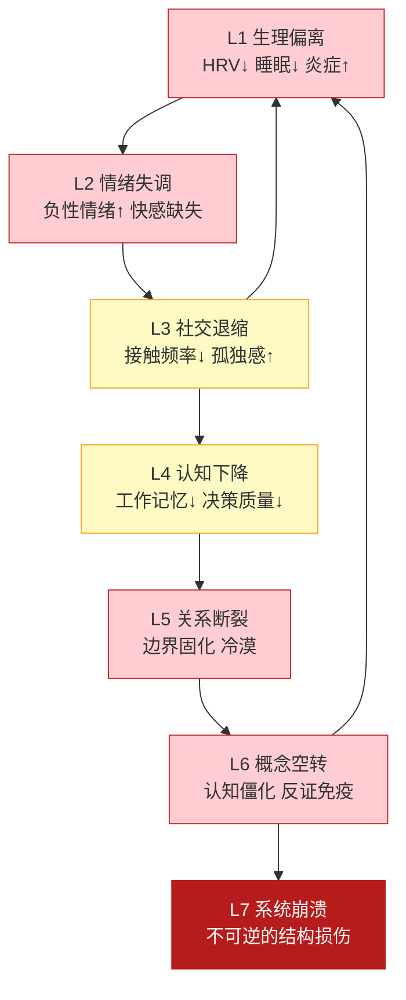

# 偏离道的代价函数：从形式化到预警信号

## The Cost of Deviation from Dao: From Formalization to Early Warning Signals

---

## 摘要

Project Dao.Science 的第一公理将道定义为预期自由能上的梯度流：$\text{Dao} \equiv -\nabla_\theta G(\pi_\theta)$（连续参数化形式），或等价地 $\pi_{\text{顺道}} = \arg\min_\pi G(\pi)$（离散选择形式）。这一形式化回答了"道是什么"——它是思维意识启用的动态过程，是生命自起源以来就一直在运作的基础算法。但它尚未回答一个同样根本的问题：**"不遵循道会怎样？"**

本文提出偏离道的代价函数（Cost of Deviation from Dao），将其形式化为实际策略与最优策略之间的预期自由能差值：

$$\text{Cost}(\pi_{\text{dev}}) = G(\pi_{\text{actual}}) - G(\pi_{\text{optimal}})$$

这一函数在个体层面可观测、可测量、可预测。本文进一步：
1. 从 Dao ≡ -∇G(π) 推导代价函数的数学形式；
2. 建立代价在 L0-L7 各层级的可观测指标；
3. 在预测编码框架下解释"人们不怕死却为精神追求危害生命"的价值对齐失败；
4. 提供可被第一人称觉察的偏离预警信号清单；
5. 闭合项目概念图谱的回环——从 Layer 0 → Layer 1 → ... → Layer 4 → 回到 Layer 1。

**关键词**：偏离代价；代价函数；预警信号；价值对齐失败；DMN 叙事自我；symbolic reward；physiological cost；道作为代价函数

---

> **证据等级**：形式化 [F] + 行为预测 [B]


## 1. 为什么需要代价函数

### 1.1 "道"的两个面向

在 `01_dao_as_process.md` 中，道被操作化定义为：

$$\text{Dao} \equiv -\nabla_\theta G(\pi_\theta)$$

即思维意识在预期自由能景观上沿负梯度方向移动的动态过程，其中 $\pi_\theta$ 是由连续参数 $\theta$ 参数化的认知-行动策略。在离散策略空间中，这等价于选择使预期自由能最小的策略：$\pi_{\text{顺道}} = \arg\min_\pi G(\pi)$。

但这个定义有一个隐含的不对称性：**它描述了"顺道"是什么，却没有描述"不顺道"的后果。**

在物理学中，最小作用量原理不仅告诉你粒子沿哪条路径运动——它还告诉你，偏离那条路径需要额外的能量。在热力学中，自由能最小化不仅告诉你平衡态在哪里——它还告诉你，偏离平衡态的代价是自由能的增加。

道科学需要同样的结构。如果道是预期自由能上的梯度流，那么偏离道就意味着：

$$\text{偏离道} \iff \text{选择使 } G(\pi) > G(\pi_{\text{optimal}}) \text{ 的策略}$$

### 1.2 一个古老直觉的现代转译

"顺道者昌，逆道者亡"——这个古老的直觉在当代计算框架中获得了精确的含义：

- **"昌"** = 系统维持在非平衡稳态（non-equilibrium steady state），自由能保持在低水平，涌现属性（健康、创造力、社会关系）得以维持
- **"亡"** = 系统偏离稳态，自由能持续升高，涌现属性退化或崩溃——从个体的身心疾病到文明的热力学悬崖

这不是道德判断。这是**热力学事实**。任何自组织系统——从单细胞到人类文明——如果持续选择使自由能升高的策略，最终都会丧失维持其结构的能力。

### 1.3 与涌现性的关系

`06_emergence.md` 论证了：整体大于部分之和，涌现属性来自约束条件下的自组织。代价函数是这一论证的自然延伸：

> **当系统偏离其最优组织模式时，涌现属性会退化或崩溃。偏离代价，就是涌现属性丧失的速率。**

一个健康的人不仅仅是没有疾病——她是生理、心理、社会关系等多个涌现层级协调运作的产物。偏离道的代价，就是这些涌现属性逐一丧失的过程：先是睡眠质量下降（L1），然后是情绪失调（L2），然后是社交回避（L3），然后是认知僵化（L6），最终是关系的全面崩塌（L7）。

---

## 2. 代价函数的数学形式化

### 2.1 基本定义

**定义 1（偏离代价）**：设 $\pi_{\text{actual}}$ 为系统实际执行的策略，$\pi_{\text{optimal}}$ 为使预期自由能最小的策略：

$$\pi_{\text{optimal}} = \arg\min_\pi G(\pi)$$

则偏离代价定义为：

$$\boxed{\text{Cost}(\pi_{\text{dev}}) = G(\pi_{\text{actual}}) - G(\pi_{\text{optimal}}) \geq 0}$$

由于 $G(\pi_{\text{optimal}})$ 是全局最小值，$\text{Cost}(\pi_{\text{dev}}) \geq 0$ 恒成立。当且仅当系统选择最优策略时，代价为零。

**定义 2（累积代价）**：在时间区间 $[t_0, t_1]$ 内，累积偏离代价为：

$$\text{Cost}_{\text{cumulative}}(t_0, t_1) = \int_{t_0}^{t_1} \left[G(\pi_{\text{actual}}(t)) - G(\pi_{\text{optimal}}(t))\right] dt$$

累积代价是偏离道的时间积分。短期的、小幅度的偏离（如一夜睡眠不足）通常可逆；长期的、大幅度的偏离（如慢性压力、成瘾、意识形态封闭）可能导致不可逆的结构损伤。

**定义 3（代价增长率）**：代价的时间导数给出了偏离的"加速度"：

$$\frac{d}{dt}\text{Cost}(\pi_{\text{dev}}) = \frac{d}{dt}G(\pi_{\text{actual}}) - \frac{d}{dt}G(\pi_{\text{optimal}})$$

当代价增长率持续为正时，系统正在加速偏离——这是最危险的模式，因为正反馈回路可能已经形成（如：焦虑 → 回避 → 更多焦虑 → 更严重的回避）。

### 2.2 预期自由能的展开形式

回忆预期自由能的定义（来自 `01_dao_as_process.md` 式 (7)）：

$$G(\pi) = \mathbb{E}_{Q(o, s|\pi)}[\ln Q(s|\pi) - \ln P(o, s|\pi)]$$

将其展开为认知价值（epistemic value）和实用价值（pragmatic value）两个组分：

$$G(\pi) = \underbrace{-\mathbb{E}_{Q(o|\pi)}[D_{KL}[Q(s|o, \pi) \| Q(s|\pi)]]}_{\text{认知价值（负）}} + \underbrace{-\mathbb{E}_{Q(o|\pi)}[\ln P(o|C)]}_{\text{实用价值（负）}}$$

因此，偏离代价也可以分解为两个组分：

$$\text{Cost}(\pi_{\text{dev}}) = \text{Cost}_{\text{epistemic}} + \text{Cost}_{\text{pragmatic}}$$

- **认知代价（Cost_epistemic）**：偏离策略导致的信息增益减少——系统不再有效地探索和减少不确定性。表现为：不再学习新事物、不再更新信念、对反证信息视而不见。
- **实用代价（Cost_pragmatic）**：偏离策略导致的偏好满足减少——系统的行动不再有效地达成其目标。表现为：睡眠不足、营养不良、关系破裂、事业停滞。

### 2.3 为什么偏离会发生：精度错配

如果最优策略 $\pi_{\text{optimal}}$ 可以通过最小化 $G(\pi)$ 找到，为什么系统还会偏离？答案在于**精度错配**（precision misallocation）。

在主动推理框架中，策略选择由下式给出：

$$P(\pi) = \sigma(-\gamma G(\pi))$$

其中 $\gamma$ 是策略选择的精度（inverse temperature）。但 $G(\pi)$ 的计算依赖于生成模型对世界的预测——而生成模型本身可能是有偏的。具体而言：

**精度错配类型 1：先验精度过高（High Prior Precision）**

当系统对某个先验信念赋予过高精度时，即使该信念与感官证据矛盾，系统仍会坚持它。在策略层面，这意味着系统会高估某些策略的预期自由能降低效果，而低估其他策略。

**实例**：一个坚信"我不值得被爱"的人，会对"主动建立关系"这一策略赋予高预期自由能（因为预期被拒绝 = 高预测误差），从而选择回避策略——尽管回避策略的实际自由能代价远高于建立关系。

**精度错配类型 2：似然精度过低（Low Likelihood Precision）**

当系统对感官证据赋予过低精度时，即使环境提供了清晰的反馈信号，系统也不会据此更新信念。

**实例**：一个在成瘾中的人，即使身体已经出现明确的痛苦信号（L2 个体实情），仍会低估这些信号的精度，继续选择成瘾行为。

**精度错配类型 3：时间视野过短（Short Temporal Horizon）**

当系统只考虑短期 $G(\pi)$ 而忽略长期累积代价时，会选择短期自由能低但长期自由能高的策略。

**实例**：熬夜刷手机 → 短期 $G(\pi)$ 低（即时满足），但长期累积代价高（睡眠剥夺 → 认知功能下降 → 情绪失调 → 关系冲突）。

---

## 3. 代价的多尺度观测指标

偏离道的代价不是抽象的数学量——它在 L0-L7 的每一层都有可观测的表现。以下表格提供了跨层级的代价指标体系。

| 层级 | 偏离表现 | 可观测指标 | 可逆性 |
|------|---------|-----------|--------|
| **L1（物理/生理）** | 生理稳态失衡 | HRV ↓、皮质醇昼夜节律紊乱、睡眠效率 ↓、炎症标志物 ↑ | 短期可逆（数天-数周） |
| **L2（个体实情）** | 情绪失调 | 负性情绪频率/强度 ↑、快感缺失、内感受准确性 ↓ | 中期可逆（数周-数月） |
| **L3（群体共识）** | 社交退缩 | 社交接触频率 ↓、孤独感 ↑、共情准确性 ↓ | 中期可逆，但关系损伤可能持久 |
| **L4（理性协作）** | 认知功能下降 | 工作记忆 ↓、决策质量 ↓、认知灵活性 ↓ | 取决于 L1-L2 恢复情况 |
| **L5（关系断裂）** | 边界固化/冷漠 | 不再主动联系、对他人困境无反应、信息茧房 | 需要主动的关系修复 |
| **L6（概念空转）** | 认知僵化 | 反复思考同一问题无进展、对反证免疫、语义自我繁殖 | 需要外部扰动或危机触发 |
| **L7（自取灭亡）** | 系统崩溃 | 自杀、战争、生态崩溃、文明瓦解 | 不可逆 |

### 3.1 L1 层代价：生理稳态的偏离

生理稳态是涌现属性的物理基础。当系统偏离道时，最先出现的变化往往在 L1 层：

- **心率变异性（HRV）下降**：HRV 是自主神经系统灵活性的指标。高 HRV 意味着系统能在"应激"和"恢复"之间灵活切换。HRV 持续下降是偏离道的早期生理信号。
- **皮质醇昼夜节律紊乱**：健康的皮质醇节律是"晨高夜低"。慢性偏离导致节律扁平化——早晨皮质醇过低（无法启动），夜间过高（无法放松）。
- **睡眠效率下降**：入睡潜伏期延长、夜间觉醒次数增加、深睡眠比例减少。睡眠是突触稳态恢复和情绪记忆整合的关键窗口。
- **低度慢性炎症**：IL-6、TNF-α、CRP 等炎症标志物持续轻度升高。这是"allostatic load"（适应负荷）的经典指标。

**关键洞察**：L1 层代价通常是最早出现、也最容易被忽视的。因为 L1 信号（如"总觉得累"、"睡不踏实"）的精度通常被系统低估——它们被当作"没什么大不了的"而忽略，直到累积代价越过某个阈值，涌现属性开始退化。

### 3.2 L2 层代价：情绪与内感受的失调

当 L1 层的偏离持续，代价会涌现到 L2 层：

- **负性情绪频率和强度增加**：杏仁核对威胁刺激的响应阈值降低，前额叶对杏仁核的调控减弱。
- **快感缺失（anhedonia）**：不是"不快乐"，而是"对曾经喜欢的事物失去了兴趣"——这是 wanting 系统和 liking 系统的解耦。
- **内感受准确性下降**：无法准确感知自己的心跳、呼吸、饥饿、疲劳——"我不知道自己怎么了"。

### 3.3 L3-L5 层代价：从社交退缩到关系断裂

L2 的失调进一步涌现到社会层面：

- **L3（社交退缩）**：因为情绪调节能力下降，社交互动变得"耗能"，系统开始减少社交接触。
- **L4（协作受损）**：认知资源被内耗占据，可用于理性协作的带宽减少。
- **L5（关系断裂）**：长期的社交退缩导致关系冷却、边界固化、互不干涉——"算了，不联系了"。

### 3.4 L6-L7 层代价：从认知僵化到系统崩溃

偏离的最深层表现是认知和文明层面的崩溃：

- **L6（概念空转）**：系统在语义空间内自我繁殖，不再与 L1（物理规律）和 L2（第一人称实情）校准。教条主义、阴谋论、虚无主义都是 L6 的表现。
- **L7（自取灭亡）**：当概念空转产生的内在张力无法调和时，系统选择最极端的方式——毁灭自己或毁灭他人——来"解决"张力。

### 3.5 代价的跨层级传播：正向反馈回路

偏离代价的一个关键特征是**跨层级正向反馈**：



这个正向反馈回路解释了为什么"小偏离"如果不被干预，会放大为"大崩溃"。L1 的生理偏离导致 L2 的情绪失调，L2 导致 L3 的社交退缩，L3 反过来加重 L1（孤独 → 皮质醇 ↑ → 睡眠 ↓），形成恶性循环。

---

## 4. "人们不怕死却为精神追求危害生命"：价值对齐失败的形式化

### 4.1 现象描述

一个令人困惑的现象贯穿人类历史：生命本身是最珍贵的——这几乎是全人类、全物种的共识——但人们却经常为了精神追求（意识形态、荣誉、信仰、成瘾、复仇、完美主义）直接危害自己的生命健康。

这不是"不理性"。这是在预测编码框架下可以精确描述的**价值对齐失败**（value alignment failure）。

### 4.2 机制：DMN 叙事自我对 symbolic rewards 的系统性高估

默认模式网络（DMN）是叙事自我（narrative self）的神经基础。它的核心功能是维持一个跨时间的、连贯的自我叙事——"我是谁，我来自哪里，我要去哪里"。

这个叙事自我的维持，本身是一个涌现属性（见 `06_emergence.md`）。它需要消耗生理资源（葡萄糖、氧气、突触可塑性预算），但它也为个体提供了关键的适应性功能：长期规划、社会身份、道德判断。

问题出现在：**DMN 叙事自我为了维持其自身的连贯性（coherence），会系统性地高估 symbolic rewards（符号性奖励）而低估 physiological costs（生理代价）。**

在预测编码框架中：

$$G(\pi) = \underbrace{-\mathbb{E}_{Q(o|\pi)}[D_{KL}[Q(s|o, \pi) \| Q(s|\pi)]]}_{\text{认知价值}} + \underbrace{-\mathbb{E}_{Q(o|\pi)}[\ln P(o|C)]}_{\text{实用价值}}$$

叙事自我的维持主要贡献于认知价值组分——它帮助系统"理解"自己的行为在更大的自我叙事中的意义。但当叙事自我的先验精度过高时：

$$P(\pi) = \sigma(-\gamma G(\pi)) \quad \text{其中 } \gamma_{\text{narrative}} \gg \gamma_{\text{physiological}}$$

系统会对"符合自我叙事"的策略赋予极高的选择概率，即使这些策略的生理代价极高。

### 4.3 三个典型案例

**案例 1：完美主义导致的过劳**

一个研究者相信"我必须发表足够多的论文才能证明自己的价值"。这个信念是 DMN 叙事自我的产物——它维持了一个"我是优秀的学者"的自我叙事。为了维持这个叙事，她选择：每天工作 14 小时、忽略身体疲劳信号、取消社交活动、用咖啡因压制睡眠需求。

在代价函数框架中：
- $\pi_{\text{actual}}$ = "持续高强度工作"
- $G(\pi_{\text{actual}})$ 的实用价值组分实际上很高（生理代价大），但叙事自我赋予的认知价值组分被严重高估
- $\text{Cost}(\pi_{\text{dev}})$ 持续累积，首先表现为 L1 层（睡眠不足、HRV 下降），然后涌现到 L2（焦虑、快感缺失），最终可能到达 L6（职业倦怠、意义感丧失）

**案例 2：成瘾中的"想要"劫持**

成瘾是 wanting 系统（中脑边缘多巴胺通路）劫持 liking 系统（阿片类/内源性大麻素系统）的经典案例（Berridge & Robinson, 1998）。在代价函数框架中：
- 成瘾物质/行为通过药理学手段直接刺激多巴胺释放，绕过了正常的 RPE 计算
- 生成模型被篡改：系统"预测"成瘾行为会带来巨大的奖励（高精度先验），即使实际 liking 已经很低
- $\pi_{\text{actual}}$ = "继续使用"，$\pi_{\text{optimal}}$ = "停止使用"
- 累积代价持续增长，但系统的精度错配使其无法选择最优策略

**案例 3：意识形态驱动的自我牺牲**

一个人为了某种意识形态（宗教、政治、民族主义）选择牺牲自己的生命。在代价函数框架中：
- 叙事自我将"我是 X 的信徒/战士/公民"这一身份赋予了极高的精度
- 生理死亡被生成模型编码为"符合自我叙事的行动"而非"生命的终结"
- $G(\pi_{\text{sacrifice}})$ 在叙事自我的精度加权下被计算为"低代价"，尽管在生理层面它是最高代价

### 4.4 这不是"不理性"——这是精度错配

以上案例的共同结构是：**系统并非"不理性"——它在自己的生成模型内部是理性的（即选择使 $G(\pi)$ 最小的策略）。问题在于生成模型本身有偏——它系统性地高估了某些策略的预期自由能降低效果，而低估了其他策略。**

这就是为什么"告诉一个人他正在伤害自己"往往无效。你提供的信息（"吸烟有害健康"）在 L1/L4 层是正确的，但它无法穿透叙事自我在 L6 层的高精度先验（"我是吸烟者，这是我的身份"）。

有效的干预必须发生在精度层面——下调叙事自我对"我是 X"这一先验的精度，上调生理信号（L1）和情绪信号（L2）的精度。这正是四行（xing-ru）的神经计算机制（见 `3_methodology/xing_ru/`）。

---

## 5. 偏离预警信号：第一人称可觉察的早期指标

代价函数不仅是一个理论工具——它应该可以被个体在自己的生命中直接使用。以下是偏离道的**第一人称预警信号清单**，按可觉察的时间顺序排列。

### 5.1 早期信号（L1-L2 层，代价可逆）

这些信号通常在偏离开始后的数天至数周内出现：

| # | 预警信号 | 对应层级 | 觉察方法 |
|---|---------|---------|---------|
| 1 | **睡眠质量持续下降**：入睡困难、早醒、醒来仍感疲惫 | L1 | 记录入睡时间、夜间觉醒次数、晨间主观精力评分（1-10） |
| 2 | **对日常小事的情绪反应增强**：小事引发不成比例的愤怒/焦虑/悲伤 | L2 | 注意"这件事真的值得我这么生气吗？"的时刻 |
| 3 | **社交回避倾向**：开始找借口取消社交安排、回复消息的延迟增加 | L3 | 注意"我不想见人"这个念头的出现频率 |
| 4 | **反复思考同一问题无进展**：思维在同一个圈子里打转，每次回到同样的结论 | L6 | 注意"我又在想这个了"的时刻——这是念起即觉的练习机会 |
| 5 | **对新鲜事物的好奇减弱**："没兴趣"、"无所谓"的频率增加 | L2 | 注意当有人分享新发现时，你的第一反应是"好奇"还是"关我什么事" |

### 5.2 中期信号（L3-L5 层，代价部分可逆）

这些信号通常在偏离持续数周至数月后出现：

| # | 预警信号 | 对应层级 | 觉察方法 |
|---|---------|---------|---------|
| 6 | **不再主动联系任何人**：社交完全被动，只在必要时回复 | L5 | 检查最近一周主动发起的对话数量 |
| 7 | **身体出现不明原因的不适**：头痛、背痛、消化问题、频繁感冒 | L1 | 注意身体不适与情绪状态的时序关联 |
| 8 | **"算了"成为口头禅**：对任何事情都缺乏改变的动力 | L5-L6 | 注意"算了"出现的频率和语境 |
| 9 | **对反证信息产生敌意**：当别人指出你的错误时，第一反应是防御而非好奇 | L6 | 注意被质疑时的身体感受（心跳加速？面部发热？） |
| 10 | **时间感扭曲**：日子模糊地过去，无法清晰回忆昨天做了什么 | L2 | 尝试每晚用三句话总结今天——如果做不到，这是信号 |

### 5.3 晚期信号（L6-L7 层，代价可能不可逆）

这些信号表明系统已经接近或进入危险区域：

| # | 预警信号 | 对应层级 | 觉察方法 |
|---|---------|---------|---------|
| 11 | **意义感全面丧失**："做什么都没有意义"不再是一个想法，而是一种持续的体验 | L6 | 这是需要外部干预的信号——寻求专业帮助 |
| 12 | **自毁行为或想法**：自伤、自杀意念、对他人施加伤害的冲动 | L7 | **立即寻求危机干预**——这不是"修道"能单独解决的 |
| 13 | **完全孤立**：与所有人的关系都已断裂或接近断裂 | L5-L7 | 最后的关系锚点——如果连这个也断了，需要紧急干预 |

### 5.4 预警信号的使用原则

1. **预警信号不是诊断工具**。它们是指南针，不是化验单。如果你在多个信号上持续得分，这提示你需要认真审视自己当前的生活轨迹。
2. **单一信号不可靠，模式才可靠**。偶尔一晚睡不好是正常的。连续两周睡不好 + 对社交失去兴趣 + 反复思考同一问题——这是一个需要认真对待的模式。
3. **早期信号是最有价值的**。在 L1-L2 层觉察并调整，代价最小、可逆性最高。等到 L6-L7 层，代价可能已经不可逆。
4. **预警信号可以共享**。如果你信任的人告诉你"我注意到你最近……"，认真听。他人往往比你更早看到你的偏离信号——因为你的叙事自我正在高精度地维护"我没事"的信念。

---

## 6. 闭合回环：从代价函数回到第一性原理

### 6.1 代价函数完成了什么

Project Dao.Science 的概念架构是一个从 Layer 0 到 Layer 4 的自顶向下流：

```
Layer 0（动机）→ Layer 1（第一性原理）→ Layer 2（心智模型）→ Layer 3（实践方法）→ Layer 4（应用）
```

但一个完整的知识体系需要**自底向上的验证回路**：应用层的反馈如何验证（或修正）第一性原理？

代价函数提供了这个回路：

```
Layer 4（应用）→ 观察偏离代价的实际表现 → 验证 Dao ≡ -∇G(π) 的预测 → Layer 1（第一性原理）
```

具体而言：
- 如果道确实是预期自由能上的梯度流，那么偏离道应该可观测地增加代价
- 如果四行（报冤行/随缘行/无所求行/称法行）确实帮助系统回到道的梯度流上，那么练习四行应该可观测地降低代价
- 如果这些预测被 N-of-1 实验、临床观察或神经影像数据所支持，那么第一性原理得到了验证
- 如果这些预测被推翻，那么第一性原理需要修正

### 6.2 代价函数与项目核心命题的关系

| 核心命题 | 代价函数的贡献 |
|---------|--------------|
| 道 ≡ -∇G(π) | 代价函数给出了"不遵循道"的形式化定义：Cost = G(π_actual) - G(π_optimal) |
| 一 = 无阻塞的觉知带宽 | 当 AB(t) 下降时，系统选择最优策略的能力下降 → 代价上升 |
| 相非物 | 叙事自我对"我是 X"的高精度先验是一种"相"——代价函数揭示了把相误认为物的具体代价 |
| 涌现性 | 代价函数描述了涌现属性退化/崩溃的动力学 |
| 四行 | 四行是降低偏离代价的操作手册——每一行针对特定的精度错配类型 |

### 6.3 代价函数与 FINAL_VISION 的对接

`FINAL_VISION.md` 提出了项目的终极愿景：**"在复杂面前保持鲜活。"**

代价函数为"鲜活"提供了负向定义：

> **"僵死" = 偏离代价持续累积直至涌现属性不可逆丧失的过程。**
> **"鲜活" = 系统能够及时检测偏离信号、修正策略、使代价回归低水平的能力。**

`FINAL_VISION.md` 还提出了"心脏停跳级测试"——热力学不会等人。代价函数在文明层面的对应就是：人类文明作为一个整体，如果持续选择使 $G(\pi)$ 升高的策略（化石燃料依赖、生态破坏、核威慑），累积代价最终将越过不可逆阈值。

### 6.4 "天地不讲武德"：偏离的客观性

对话记录中有这样一句大白话："天地万物从来不讲武德，也不听商量。"这是对代价函数最痛快的注脚。

自然的反馈系统不是人间的法庭——它不会上诉，不会求情，也不会因为你有良好的意图而网开一面。你砍光森林，它不跟你商量，直接给你洪水与荒芜；你把废气排向天空，它不跟你商量，直接给你升温和冰融；你狂妄到想当万物主宰，它更不商量，直接用"反者道之动"把你推向自我毁灭。

这不是道德惩罚，而是**偏离代价的客观执行**：

- **道德惩罚** = "因为你做错了，所以应该受苦"（L3/L6 的叙事建构）
- **客观代价** = "你选择了一个使 $G(\pi)$ 升高的策略，于是你的系统完整性下降"（L1 的热力学事实）

区别至关重要。前者让人陷入"我为什么这么倒霉"的反刍；后者让人清醒：**代价不是天地在发脾气，而是系统偏离稳态后的自然后果。** 天地不是敌人，也不是法官——它是那个你无论如何都无法脱离的更大系统。你的"我"（A）只有在与"非我"（非 A）的背景保持动态协调时，才能持续存在。

因此，"知止"不是一个道德劝诫，而是一个**生存逻辑**：自觉地看到内心与外界的道在运作，自律地让自己的"为"符合那个更大的"是"，自重地明白自己这个"有"依赖于整个"无"与"有"的巨大背景而存在，不敢为所欲为。

---

## 7. 可检验的预测

本文提出的代价函数框架给出了以下可检验的预测：

1. **生理预测**：在偏离预警信号清单中得分较高的个体，应表现出较低的 HRV、较高的皮质醇昼夜斜率、较低的睡眠效率。
2. **行为预测**：在 N-of-1 实验中，练习四行的阶段应比基线阶段表现出更低的偏离预警信号得分。
3. **神经预测**：叙事自我对 symbolic rewards 的系统性高估应与 mPFC（DMN 核心节点）对伏隔核（NAc）的功能连接增强相关。
4. **临床预测**：将偏离预警信号清单整合进 CBT/ACT/MBCT 的初期评估，应能提高治疗方案的个体化匹配度。
5. **文明级预测**：一个国家或地区的"偏离代价"（如基尼系数、环境退化指数、社会信任度）与其长期稳定性应呈负相关。

---

## 8. 局限与开放问题

1. **$G(\pi_{\text{optimal}})$ 的可计算性**：在现实中，我们永远无法精确计算全局最优策略的 $G$ 值——这需要完美的生成模型和无限算力。代价函数在实践中只能以相对变化来估计：$\Delta\text{Cost} \approx G(\pi_{\text{after}}) - G(\pi_{\text{before}})$。
2. **多尺度代价的不可通约性**：L1 的生理代价（如皮质醇升高）和 L6 的认知代价（如意义感丧失）如何在同一量纲下比较？这需要建立跨层级的代价权重体系——这是一个开放问题。
3. **个体差异**：不同个体的生理基线、心理韧性、社会支持网络不同，同样的偏离幅度可能产生不同的代价。代价函数需要个体参数化（见 `05_first_person_epistemology.md`）。
4. **预警信号的敏感度和特异度**：本文提出的预警信号清单尚未经过系统的心理测量学验证。其敏感度（不漏报）和特异度（不误报）需要在 N-of-1 和群体研究中检验。

---

## 9. 总结

偏离道的代价函数是 Project Dao.Science 概念架构的闭合环节。它将"道"从"你正在做的事"扩展为"你不做时会付出代价的事"——为第一性原理提供了负向验证路径。

代价函数的核心洞察是：

1. **偏离道 = 选择使 $G(\pi) > G(\pi_{\text{optimal}})$ 的策略**——这不是道德判断，是热力学事实。
2. **代价是多尺度的**——从 L1（HRV 下降）到 L7（文明崩溃），每一层都有可观测的指标。
3. **"人们不怕死却为精神追求危害生命"不是不理性**——它是 DMN 叙事自我对 symbolic rewards 的系统性高估，是精度错配的结果。
4. **偏离有预警信号**——可被第一人称觉察的早期信号清单，让代价函数从理论工具变为生命实践工具。
5. **代价函数闭合了回环**——从 Layer 4 的应用反馈回到 Layer 1 的第一性原理验证。

最终，代价函数指向一个简单的实践原则：**如果你想知道自己是否在"顺道而行"，不要问"我是否理解了道"——去观察你的睡眠质量、你的情绪稳定性、你的人际关系、你对新事物的好奇心。这些是道最诚实的反馈信号。**

---

> 本文是 Project Dao.Science 第一性原理的第 7 个文件，承接 `06_emergence.md`（涌现性），闭合概念图谱从 Layer 4 回到 Layer 1 的回环。
>
> **交叉引用**：
> - `01_dao_as_process.md`：道的形式化定义与梯度流
> - `02_one_as_bandwidth.md`：觉知带宽与策略选择能力
> - `03_map_not_territory.md`：叙事自我作为"相"的精度错配
> - `05_first_person_epistemology.md`：个体参数化与 N-of-1 验证
> - `06_emergence.md`：涌现属性的退化与崩溃动力学
> - `3_methodology/xing_ru/`：四行作为降低偏离代价的操作手册
> - `4_applications/clinical_mental_health.md`：偏离代价在临床中的表现与干预
> - `FINAL_VISION.md`："鲜活"作为低代价状态，"僵死"作为累积代价的终点
>
> **下一篇**：`2_models/attention_model.md`（注意力动力学：α 参数收放自如）
