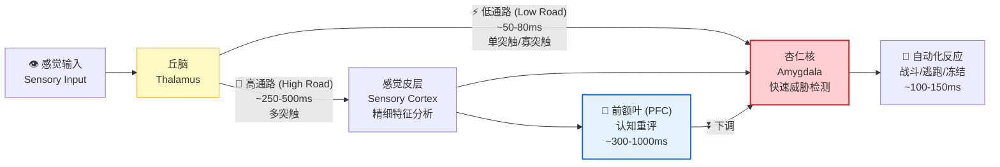

# 100毫秒本能劫持与解离模型

## The 100ms Amygdala Hijacking and Dissociation Model

---

## 摘要

情绪反应的速度远快于意识体验。从刺激呈现到杏仁核（amygdala）激活，最短仅需约74毫秒——远在意识觉知形成之前。本文整合LeDoux的双通路理论（low road / high road）、杏仁核劫持（amygdala hijacking）概念以及重新评估（reappraisal）的神经机制研究，构建了一个精确到毫秒的情绪反应时间线模型。我们论证，在杏仁核激活（~74ms）与意识情绪体验形成（~300-500ms）之间存在一个约100-300毫秒的"黄金窗口"（golden window），这与佛教"念起即觉"（awareness arises with the thought）的修行原则在时间尺度上精确对应。冥想训练通过增强前额叶-杏仁核调控回路的功能连接，系统性地延长了这一窗口的有效干预时间。本文提供该模型的完整数学形式化，将情绪调节描述为自下而上的杏仁核激活与自上而下的前额叶调控之间的动态竞争过程。

**关键词**：杏仁核劫持，双通路理论，情绪调节，重新评估，冥想，念起即觉

> **证据等级**：形式化 [F] + 仿真 [S] + 神经证据 [N] + 行为预测 [B]

---

## 1. LeDoux双通路理论：情绪处理的快慢通道

### 1.1 理论概述

LeDoux（1996, 2000）提出的双通路理论（dual-pathway theory）是理解情绪处理速度差异的基石。该理论识别出从感觉输入到杏仁核的两条解剖和功能上不同的通路：

**图 1：LeDoux 情绪双通路模型。** 低通路（红色虚线）在 ~50-80ms 内将威胁信号从丘脑直接送至杏仁核——绕过皮层，牺牲准确性换取速度。高通路（蓝色实线）在 ~250-500ms 内经过皮层做精细分析。"念起即觉"的窗口（100-300ms）正是 PFC 对杏仁核进行认知重评的关键时间间隙。

**低通路（Low Road）：丘脑→杏仁核**
- 解剖路径：感觉丘脑（sensory thalamus）→ 外侧杏仁核（lateral amygdala, LA）
- 传输速度：约50-80毫秒（单突触或寡突触连接）
- 处理精度：低——仅传递粗糙的感觉特征（如低空间频率信息）
- 功能：快速威胁检测，牺牲精度换取速度
- 进化意义：在需要立即反应的生存情境中，一个"宁可误报也不漏报"的快速通道具有显著的适应性优势

**高通路（High Road）：丘脑→皮层→杏仁核**
- 解剖路径：感觉丘脑→感觉皮层（sensory cortex）→外侧杏仁核
- 传输速度：约100-300毫秒（多突触连接，需要皮层处理时间）
- 处理精度：高——传递经过皮层精细加工的感觉表征
- 功能：精确的刺激评估和情境适当的情绪反应
- 进化意义：允许对复杂刺激进行精细辨别，避免不必要的防御反应

### 1.2 双通路的交互与整合

LeDoux（2000, doi:10.1146/annurev.neuro.23.1.155）强调，低通路和高通路不是相互独立的，而是在时间上动态交互的。低通路提供快速的、粗略的威胁估计，而高通路随后提供更精确的刺激分析，可以确认、修正或推翻低通路的初始评估。这种时间上的层级组织——先快速后精确——是情绪系统的一个基本设计原则。

在神经解剖层面，两条通路汇聚于外侧杏仁核（LA），LA再投射到中央杏仁核（central amygdala, CeA），后者通过投射到脑干和下丘脑来协调自主神经和内分泌反应。此外，LA和CeA之间存在广泛的内部连接，允许对情绪反应进行微调。

### 1.3 双通路理论的更新与发展

值得注意的是，后续研究对双通路理论进行了重要修正。Pessoa和Adolphs（2010）提出，低通路和高通路之间的界限可能比最初设想的更为模糊——皮层下结构（包括丘脑枕核pulvinar和上丘superior colliculus）也可以进行相当复杂的视觉处理。然而，双通路的基本逻辑——存在一个快速但粗糙的威胁检测通道和一个较慢但精确的评估通道——仍然被广泛接受，并得到了大量实验证据的支持。

---

## 2. 精确时间线：从刺激到自主反应

### 2.1 人类颅内记录的证据

Mendez-Bertolo等人（2016, doi:10.1038/nn.4326）使用人类颅内电极（intracranial EEG, iEEG）记录了杏仁核对情绪面孔的反应，提供了迄今为止最精确的人类杏仁核反应时间数据。他们的关键发现包括：

- 杏仁核对恐惧面孔的最早反应出现在刺激呈现后约**74毫秒**
- 这一早期反应局限于杏仁核的特定亚区
- 在约**120-160毫秒**，杏仁核反应变得更加广泛和持久
- 在约**220-300毫秒**，前额叶区域开始显示显著的反应调制

这些数据为双通路理论提供了直接的人类神经生理学证据，并精确界定了低通路和高通路的激活时间窗口。

### 2.2 完整时间线表

以下时间线整合了来自多项研究的数据，描述了从刺激呈现到完整自主神经反应的事件序列：

| 时间（ms） | 事件 | 涉及的神经结构 | 关键参考文献 |
|-----------|------|---------------|-------------|
| 0 | 刺激呈现（如威胁性面孔） | 视网膜→LGN→V1 | — |
| 20-30 | 感觉信息到达丘脑 | 外侧膝状体（LGN），丘脑枕核（pulvinar） | — |
| 30-50 | 丘脑向杏仁核发送低分辨率信号（低通路） | 丘脑枕核→外侧杏仁核（LA） | LeDoux (2000) |
| 50-74 | 杏仁核开始响应（最早的威胁检测） | 外侧杏仁核（LA） | Mendez-Bertolo et al. (2016) |
| 74-100 | 杏仁核反应增强，开始向中央杏仁核传递 | LA→中央杏仁核（CeA） | Mendez-Bertolo et al. (2016) |
| 100-150 | 感觉皮层完成初步加工（高通路开始） | V1→V2→V4→IT皮层 | — |
| 120-160 | 杏仁核反应广泛化，自主神经激活开始 | CeA→脑干/下丘脑 | Mendez-Bertolo et al. (2016) |
| 150-200 | 皮层信号到达杏仁核（高通路输入） | IT皮层→LA | LeDoux (2000) |
| 200-250 | 前额叶开始接收情绪信息 | 杏仁核→OFC/vmPFC | — |
| 220-300 | 前额叶开始对杏仁核进行调节 | dlPFC/vmPFC→杏仁核（间接） | Ochsner et al. (2002) |
| 250-350 | 心率开始变化（自主神经反应） | CeA→迷走神经背核/疑核 | — |
| 300-500 | 意识情绪体验形成 | 前脑岛（anterior insula），ACC | Craig (2009) |
| 400-600 | 皮肤电导反应（SCR）开始 | CeA→下丘脑→交感神经链 | — |
| 500-1000 | 完整的自主神经反应（心率、SCR、瞳孔扩张） | 多系统协调 | — |
| 1000+ | 行为反应（接近/回避） | 运动皮层，基底节 | — |

### 2.3 时间线的关键含义

这条时间线揭示了一个关键事实：在杏仁核开始响应（~74ms）和意识情绪体验形成（~300-500ms）之间，存在一个约**200-400毫秒**的时间窗口。在这个窗口中，自上而下的调控系统（特别是前额叶皮层）有机会对杏仁核的初始反应进行调节——确认、修正或抑制。这个窗口正是"念起即觉"的神经科学基础。

---

## 3. 杏仁核劫持机制

### 3.1 Goleman的概念

"杏仁核劫持"（amygdala hijacking）一词由Daniel Goleman（1995）在其畅销书《情商》（*Emotional Intelligence*）中推广，描述了杏仁核在情绪刺激面前"接管"行为控制的现象。在神经科学层面，杏仁核劫持可以被理解为低通路信号压倒高通路的精确评估和前额叶的调控，导致不适当的、过度的情绪反应。

### 3.2 无意识情绪处理的神经证据

Whalen等人（1998, doi:10.1523/JNEUROSCI.18-01-00411.1998）使用后向掩蔽（backward masking）技术呈现恐惧面孔——刺激呈现时间极短（约33ms），紧接着呈现中性面孔作为掩蔽，使得被试无法有意识地感知到恐惧面孔。关键发现是：即使被试报告没有看到恐惧面孔，他们的杏仁核仍然表现出显著的激活。这一发现提供了强有力的证据，表明杏仁核可以在没有意识觉知的情况下处理情绪信息——这正是杏仁核劫持的神经基础。

后续研究进一步表明，这种无意识的杏仁核激活：
- 依赖于皮层下通路（特别是上丘-丘脑枕核-杏仁核通路）（Morris et al., 1999）
- 主要处理低空间频率的粗糙视觉信息（Vuilleumier et al., 2003）
- 在焦虑个体中表现出增强的反应（Etkin et al., 2004）

### 3.3 劫持的神经环路机制

杏仁核劫持涉及以下关键神经环路的失衡：

1. **丘脑-杏仁核通路的过度激活**：低通路信号异常增强，导致杏仁核在缺乏充分皮层验证的情况下被激活。

2. **前额叶-杏仁核调控的失效**：腹内侧前额叶皮层（vmPFC）通常通过间接连接（经由间质细胞团intercalated cells, ITC cells）抑制中央杏仁核的输出。在劫持状态下，这一抑制机制失效。

3. **去甲肾上腺素能系统的放大效应**：蓝斑（locus coeruleus）释放的去甲肾上腺素（norepinephrine）增强杏仁核的兴奋性，形成正反馈循环。

4. **前扣带皮层（ACC）的冲突监测过载**：ACC检测到情绪反应与情境需求之间的冲突，但在劫持状态下无法有效调用前额叶资源进行解决。

---

## 4. "念起即觉"的神经科学对应

### 4.1 佛教概念的操作化

"念起即觉"（niàn qǐ jí jué）是佛教禅修中的一个核心原则，字面意思是"念头生起的当下就觉知到它"。在操作化层面，这可以被理解为：在情绪反应链的早期阶段（即在完整的意识情绪体验和自主神经反应形成之前），通过元觉知（meta-awareness）检测到情绪激活的初始信号，从而获得干预的机会。

### 4.2 时间窗口的精确对应

将"念起即觉"映射到上述时间线，我们可以识别出以下关键对应：

- **"念起"（thought/emotion arises）**：对应于杏仁核的初始激活（~74-120ms）以及随后向意识系统的信号传递。
- **"即觉"（immediate awareness）**：对应于前额叶和ACC对杏仁核信号的检测（~200-300ms），这一检测发生在完整的意识情绪体验形成（~300-500ms）之前。
- **"黄金窗口"（Golden Window）**：在杏仁核激活和前额叶检测之间的约100-200ms，以及在前额叶检测和完整情绪体验形成之间的约100-200ms。这个窗口是进行情绪干预的最佳时机。

### 4.3 训练缩短"念"到"觉"的延迟

冥想训练的核心效果之一是缩短从"念起"到"即觉"的时间延迟。未经训练的个体可能需要数百毫秒甚至数秒才能意识到自己正在经历情绪反应（此时自主神经反应已经全面展开），而训练有素的冥想者能够在情绪反应的早期阶段（接近杏仁核初始激活的时间）就检测到情绪信号。

这一能力的形式化表达为：

$$T_{\text{awareness}} = T_{\text{amygdala}} + \Delta T_{\text{detection}}$$

其中$T_{\text{amygdala}} \approx 74$ms是杏仁核激活的固定延迟，$\Delta T_{\text{detection}}$是检测延迟。冥想训练的效果是：

$$\Delta T_{\text{detection}}^{\text{trained}} < \Delta T_{\text{detection}}^{\text{untrained}}$$

在理想情况下，$\Delta T_{\text{detection}} \to 0$，即"念起即觉"——觉知与念头同时生起。

### 4.4 竞争动力学模型：杏仁核-前额叶的激活竞赛

"念起即觉"的黄金窗口可以被形式化为杏仁核（A）和前额叶（P）之间的**激活竞赛动力学**（competition dynamics）。设 $a(t)$ 为杏仁核的激活水平，$p(t)$ 为前额叶的调控激活水平：

$$\tau_a \frac{da}{dt} = -a(t) + w_{sa} \cdot S(t) + w_{aa} \cdot f(a) - w_{pa} \cdot p(t) + \sigma_a \cdot \eta_a(t) \quad \text{[F/N]}$$

$$\tau_p \frac{dp}{dt} = -p(t) + w_{sp} \cdot S(t) + w_{ap} \cdot a(t-\delta) + \sigma_p \cdot \eta_p(t) \quad \text{[F/N]}$$

其中：
- $S(t)$：威胁刺激强度
- $w_{sa}$：感觉输入→杏仁核的直接权重（低通路，快速）
- $w_{sp}$：感觉输入→前额叶的权重（高通路，慢速）
- $w_{aa}$：杏仁核的自兴奋权重（正反馈——情绪升级）
- $w_{pa}$：前额叶→杏仁核的抑制权重（认知调控）
- $w_{ap}$：杏仁核→前额叶的兴奋权重（"警报"信号）
- $\delta$：杏仁核到前额叶的信号传导延迟（~50-100ms）
- $\tau_a, \tau_p$：时间常数（$\tau_a < \tau_p$，杏仁核响应更快）
- $\eta_a, \eta_p$：独立高斯噪声，$\sigma_a, \sigma_p$ 为噪声幅度

**关键动态**：

1. **$t = 0$–$74$ms**：$S(t)$ 通过 $w_{sa}$ 直接驱动 $a(t)$ 上升（低通路）。$p(t)$ 尚未响应（高通路延迟）。
2. **$t = 74$–$200$ms**：$a(t)$ 通过自兴奋权重 $w_{aa}$ 进入正反馈循环——情绪升级。同时，$a(t-\delta)$ 开始驱动 $p(t)$ 上升（"警报"到达前额叶）。
3. **$t = 200$–$500$ms**：竞赛的关键阶段。如果 $w_{pa} \cdot p(t) > w_{aa} \cdot f(a)$，前额叶抑制占优——"念起即觉"成功。如果 $w_{aa} \cdot f(a) > w_{pa} \cdot p(t)$，杏仁核自兴奋占优——"杏仁核劫持"。

**训练效应**：冥想训练通过以下机制改变竞赛结果：
- **增强 $w_{pa}$**（前额叶→杏仁核抑制权重）：通过 Hebbian 学习强化 PFC-杏仁核的抑制性连接
- **降低 $w_{aa}$**（杏仁核自兴奋）：通过暴露疗法/习惯化降低杏仁核对威胁刺激的敏感性
- **缩短 $\delta$**（杏仁核→前额叶延迟）：增强内感受精度使"警报"信号更早到达前额叶

在参数空间中，训练将系统从 $w_{aa} \gg w_{pa}$（劫持区域）移向 $w_{pa} \gg w_{aa}$（调控区域）。

### 4.5 "念起即觉"与"明"

佛教"念起即觉"与道家/儒家/佛家共同指向的"明"，在 100ms 时间尺度上找到了一个精确的神经科学接口。如 `1_first_principles/05_first_person_epistemology.md` 所述，"明"不是对某个对象的具体意识，而是**使任何对象得以被意识到的背景性照见能力**。在情绪反应链中：

- **"念起"** 对应于杏仁核的初始激活（~74ms）——一个情绪相关的神经模式开始从混沌背景中凸显为阳（A）；
- **"即觉"** 对应于前额叶/ACC/岛叶对这一凸显的早期检测（~200-300ms）——"明"的照见能力在情绪模式完全被自我叙事捕获之前，就已经识别到它的升起。

因此，"念起即觉"不是"我作为一个观察者去压制一个情绪对象"，而是**"明"在情绪对象尚未完全客体化之前，就已经照亮了它的升起**。这正是"弱者道之用"的神经对应：干预不是强力的压制（这会形成新的对抗），而是在情绪反应尚处于微弱状态时，通过"明"的自然照见使其失去自动升级的动力。

从训练角度看，冥想的效果可以被描述为：**缩短"念起"到"即觉"之间的时间延迟，使"明"能够更早地介入情绪生成过程。** 当这个延迟缩短到接近零时，情绪反应不再被体验为"突然降临的外部事件"，而是被体验为"在觉知背景中自然生起又自然消融的心理内容"——这正是"念起即觉"的成熟状态。

---

## 5. 重新评估的神经机制

### 5.1 重新评估的定义与分类

重新评估（cognitive reappraisal）是一种情绪调节策略，涉及在情绪反应完全展开之前重新解释刺激的意义，从而改变情绪反应的方向和强度。Ochsner等人（2002, doi:10.1162/089892902760807212）的奠基性fMRI研究首次揭示了重新评估的神经基础。

### 5.2 重新评估的神经环路

Ochsner等人（2002）的研究以及后续的元分析（Buhle et al., 2014, doi:10.1093/cercor/bht154）一致识别出以下关键脑区参与重新评估：

1. **背外侧前额叶皮层（dlPFC）**：负责工作记忆中对刺激意义的主动重构——即"重新解释"的计算过程。

2. **腹外侧前额叶皮层（vlPFC）**：负责选择适当的重新评估策略并从语义记忆中检索替代解释。

3. **背内侧前额叶皮层（dmPFC）**：负责监控重新评估的效果并整合情境信息。

4. **腹内侧前额叶皮层（vmPFC）**：作为前额叶调控的最终共同通路，通过投射到杏仁核（直接或通过ITC细胞间接）来实现情绪反应的抑制或增强。

5. **前扣带皮层（ACC）**：监测情绪冲突并在需要时调用前额叶资源。

### 5.3 重新评估的时间动态

Goldin等人（2008, doi:10.1016/j.biopsych.2007.05.031）比较了重新评估（reappraisal）和表达抑制（expressive suppression）两种情绪调节策略的时间动态。关键发现：

- **重新评估**：在情绪刺激呈现的早期（0-4秒）就开始降低杏仁核反应，效果持续到晚期（6-10秒）。这表明重新评估作用于情绪生成过程的早期阶段。
- **表达抑制**：在早期不降低杏仁核反应（甚至可能增强），仅在晚期产生效果。这表明表达抑制作用于情绪反应的输出阶段，而非生成阶段。

这一发现对"念起即觉"具有直接意义：重新评估（而非简单的抑制）是"即觉"后最有效的干预策略，因为它作用于情绪生成的早期阶段——正是"黄金窗口"所在的时间范围。

### 5.4 重新评估的元分析证据

Buhle等人（2014）对48项神经影像研究进行了定量元分析，确认了重新评估一致激活的脑区网络：dlPFC、vlPFC、dmPFC和顶叶皮层（作为认知控制的执行网络），以及vmPFC和杏仁核（作为情绪反应的目标区域）。重要的是，元分析发现重新评估的成功程度（以自我报告的情绪降低来衡量）与vmPFC的激活程度和杏仁核的抑制程度呈正相关。

---

## 6. 冥想训练的效果

### 6.1 冥想改变PFC-杏仁核回路

Brefczynski-Lewis等人（2007, doi:10.1073/pnas.0606552104）使用fMRI研究了专业冥想者（平均练习时间约19,000小时）和 novice冥想者在慈心冥想（loving-kindness meditation）期间对情绪声音的神经反应。关键发现：

- **倒U形效应**：在情绪刺激期间，专业冥想者的杏仁核激活程度与练习时间呈倒U形关系——中等经验水平的冥想者表现出最强的杏仁核激活，而最有经验的冥想者表现出与新手相似的较低激活水平。
- **前额叶-杏仁核耦合增强**：专业冥想者表现出更强的PFC-杏仁核功能连接，表明自上而下的调控能力增强。
- **解释**：这一倒U形模式表明，冥想训练首先增强了对情绪刺激的敏感性和参与度（中等经验阶段），然后在更高水平上实现了对情绪反应的"自动化"调控（高经验阶段），此时调控变得如此高效，以至于不再需要显著的前额叶激活。

### 6.2 冥想降低杏仁核反应性

Kral等人（2018, doi:10.1016/j.neuroimage.2018.07.013）研究了正念冥想训练对杏仁核反应性的影响。关键发现：

- 8周的正念减压（MBSR）训练显著降低了杏仁核对情绪图片的反应。
- 杏仁核反应性的降低与自我报告的压力水平降低呈正相关。
- 功能连接分析显示，MBSR训练增强了vmPFC-杏仁核的功能连接，表明自上而下的情绪调控能力增强。

### 6.3 冥想增强"黄金窗口"的利用

综合上述研究，冥想训练通过以下机制增强"黄金窗口"的利用效率：

1. **缩短检测延迟**：增强的ACC和前脑岛（anterior insula）功能使得情绪信号的早期检测更加迅速和精确。
2. **增强调控效率**：增强的PFC-杏仁核功能连接使得自上而下的调控能够在更短的时间内生效。
3. **自动化调控**：在高级阶段，调控变得自动化，不再需要显著的有意识努力。
4. **扩展有效窗口**：由于检测更快、调控更有效，实际可用于干预的时间窗口被显著扩展。

### 6.4 心理时间的可塑性：从100ms到"无时间"的梯度

上述关于"黄金窗口"的讨论隐含了一个更深层的洞见：**心理时间不是均匀流逝的客观背景，而是大脑主动构建的、具有高度可塑性的内部表征。** 这一洞见同时来自多个独立线索：

**神经生物学证据**：不同物种有不同的"时间感知粒度"——苍蝇的视觉融合频率远高于人类（它们感知到的"一秒钟"包含更多离散帧），蓝鲸的心跳间隔长达数秒（它们的"当下"比人类宽得多）。每个物种的"心理时间尺度"由其神经系统的处理速度（传导速度、突触延迟、整合时间常数）决定。时间不是绝对的——它是神经系统对变化速率的采样频率的函数。

**冥想训练对时间感知的改变**：长期冥想者报告"时间变慢"的体验——不是物理时间的改变，而是**感知密度的增加**。在预测编码框架中，这可以被精确描述为：冥想训练降低了生成模型对"时间流逝"的先验精度（$\Pi_{\text{temporal-flow}}$），使得每一瞬间的感官数据被更充分地采样和处理。当系统不再将大部分认知资源分配给"预测下一秒会发生什么"（DMN 的心理时间旅行功能），剩余的认知资源被重新分配到"当下这一秒的实际体验"上——结果是"一秒变得更丰富"。

**"无时间"状态（Timelessness）**：在深度冥想中，部分实践者报告"时间消失"的体验——过去和未来的心理表征暂时消退，只剩下纯粹的当下。从神经科学的角度，这对应于 DMN 的显著下调——因为 DMN 是心理时间旅行（mental time travel）的主要神经基础，当 DMN 活动被显著抑制时，"过去"（自传体记忆的重播）和"未来"（情景模拟的构建）的心理表征同时减弱，只剩下当下的直接感官-内感受体验。

**"念起即觉"的时间维度**：本项目 `1_first_principles/01_dao_as_process.md` 中定义的"念起即觉"——在念头产生的瞬间（约100-200ms内）觉察到它——在时间维度上意味着：**将元认知觉察的延迟从"秒级"（"我刚才为什么发了脾气？"）压缩到"亚秒级"（"这个念头正在升起"）。** 这本质上是缩短了"自动反应"和"有意识觉察"之间的时间差——从"反应后反思"到"反应中觉察"到"反应前觉察"的梯度。这一梯度与 §6.3 描述的"黄金窗口"的扩展完全一致：训练有素的冥想者不仅能在 200-500ms 的窗口内进行认知重评，而且能将觉察的触角延伸到更早的时间点——在杏仁核反应尚未完全启动之前就识别到威胁信号的"预兆"。

**心理时间可塑性的实践含义**：如果心理时间是构建的而非给定的，那么"时间压力"——当代心理健康危机的主要驱动因素之一——也是一种认知构建。不是"客观上时间不够"，而是**系统将过高的精度分配给了"时间不够"这一先验**（$\Pi_{\text{time-scarcity}} \gg \Pi_{\text{time-scarcity}}^*$）。下调这一先验的精度——通过冥想训练、注意力重新分配、以及对"时间感知是构建的"这一见地的建立——可以直接降低时间压力感，而不需要改变客观的时间安排。

---

## 7. 形式化模型

### 7.1 竞争动力学模型

我们将杏仁核劫持和重新评估描述为两个竞争过程的动态交互：

$$\frac{dA}{dt} = \alpha_B \cdot S(t) - \alpha_T \cdot P(t) \cdot A(t) - \gamma_A \cdot A(t) \quad \text{[F/S]}$$

其中：
- $A(t) \in [0, 1]$ 是杏仁核的归一化激活水平（无量纲）
- $S(t)$ 是刺激强度（已归一化，无量纲）
- $P(t) \in [0, 1]$ 是前额叶调控的归一化强度（无量纲）
- $\alpha_B$ 是自下而上（bottom-up）的驱动系数（$[\alpha_B] = [t]^{-1}$）
- $\alpha_T$ 是自上而下（top-down）的调控系数（$[\alpha_T] = [t]^{-1}$）
- $\gamma_A$ 是杏仁核激活的内在衰减率（$[\gamma_A] = [t]^{-1}$；注意与第 4.4 节中作为时间常数的 $\tau_a$ 区分）

前额叶调控的动态为：

$$\frac{dP}{dt} = \beta \cdot A(t - \delta) - \gamma_P \cdot P(t) \quad \text{[F/S]}$$

其中$\delta$是前额叶对杏仁核信号的反应延迟（约100-200ms），$\beta$是前额叶对杏仁核信号的响应增益（$[\beta] = [t]^{-1}$），$\gamma_P$是前额叶活动的衰减率（$[\gamma_P] = [t]^{-1}$）。

### 7.2 劫持条件

杏仁核劫持发生的条件是自下而上的驱动压倒自上而下的调控：

$$\alpha_B \cdot S(t) \gg \alpha_T \cdot P(t) \cdot A(t)$$

当这个不等式成立时，$\frac{dA}{dt} > 0$，杏仁核激活持续增长，导致完整的情绪劫持。

### 7.3 重新评估的数学描述

重新评估可以被描述为通过增加$\alpha_T$（调控效率）和减少$\delta$（反应延迟）来改变竞争平衡：

$$\alpha_T^{\text{reappraisal}} > \alpha_T^{\text{baseline}}$$
$$\delta^{\text{reappraisal}} < \delta^{\text{baseline}}$$

冥想训练的效果是：

$$\alpha_T^{\text{trained}} = \alpha_T^{\text{untrained}} + \Delta\alpha_T$$
$$\delta^{\text{trained}} = \delta^{\text{untrained}} - \Delta\delta$$

其中$\Delta\alpha_T > 0$和$\Delta\delta > 0$是训练带来的改善。

### 7.4 干预成功概率

在"黄金窗口"内成功干预的概率可以表达为：

$$P_{\text{success}} = 1 - \exp\left(-\lambda \cdot \frac{\alpha_T \cdot W}{\alpha_B \cdot S}\right)$$

其中$W$是有效窗口宽度，$\lambda$是标度参数。冥想训练通过增加$\alpha_T$和$W$（通过缩短$\delta$）来提高$P_{\text{success}}$。

### 7.5 系统稳定性分析

系统的稳态由 $\frac{dA}{dt} = 0$ 和 $\frac{dP}{dt} = 0$ 决定。设 $S$ 为恒定刺激强度（$S(t) = S$），稳态条件为：

$$A^* = \frac{\alpha_B \cdot S}{\alpha_T \cdot P^* + \gamma_A}$$
$$P^* = \frac{\beta \cdot A^*}{\gamma_P}$$

将 $P^*$ 代入 $A^*$ 的表达式：

$$A^* = \frac{\alpha_B \cdot S}{\alpha_T \cdot (\beta \cdot A^* / \gamma_P) + \gamma_A}$$

整理得到关于 $A^*$ 的方程：

$$\frac{\alpha_T \beta}{\gamma_P} \cdot (A^*)^2 + \gamma_A \cdot A^* - \alpha_B S = 0$$

**量纲说明**：为保持方程量纲一致，$A(t)$ 和 $P(t)$ 应理解为各自脑区的归一化激活水平（无量纲，$A, P \in [0, 1]$），此时所有系数 $\alpha_B, \alpha_T, \gamma_A, \beta, \gamma_P$ 均具有量纲 $[t]^{-1}$，方程各项量纲均为 $[t]^{-1}$。完整的量纲约定见 [`NOTATION.md`](../NOTATION.md)。

**边界条件与饱和**：方程 (7.1) 中的竞争项 $\alpha_T P A$ 在 $A \to 1$ 时仍有正反馈可能。实际数值积分中应对 $A(t)$ 和 $P(t)$ 做 $[0, 1]$ 裁剪（或引入 sigmoid 饱和函数），以保证生理合理性。稳态二次方程的解仅在 $A^* \in [0, 1]$ 时有生理意义；若解析解超出该区间，则系统在实际积分中会饱和在边界 $A^* = 1$（杏仁核完全劫持）或 $A^* = 0$（无情绪反应）。

为便于求解，定义 $\tilde{A} = A^* / A_{\text{max}}$（$A_{\text{max}}$ 为最大可能激活，无量纲），并令 $\kappa = \alpha_T \beta A_{\text{max}} / \gamma_P$、$\tilde{\gamma}_A = \gamma_A / \kappa$、$\tilde{S} = \alpha_B S / (\kappa A_{\text{max}})$，则方程可写为：

$$\boxed{\tilde{A}^2 + \tilde{\gamma}_A \cdot \tilde{A} - \tilde{S} = 0} \quad \text{[F/S]}$$

这是标准二次方程，判别式 $\Delta = \tilde{\gamma}_A^2 + 4\tilde{S} > 0$ 恒成立，总有一个正实根（生理上有意义）和一个负实根（无生理意义）：

$$\tilde{A}^* = \frac{-\tilde{\gamma}_A + \sqrt{\tilde{\gamma}_A^2 + 4\tilde{S}}}{2}$$

**稳定性判据**：当自下而上的驱动过强（$\alpha_B S$ 过大）或自上而下的调控过弱（$\alpha_T \beta$ 过小）时，正实根 $\tilde{A}^*$ 趋近于 1（饱和激活）——即杏仁核劫持。反之，当调控足够强时，$\tilde{A}^* \ll 1$——情绪反应维持在适应性水平。

---

## 8. 讨论

### 8.1 理论整合

本模型将LeDoux的双通路理论、Goleman的杏仁核劫持概念、Ochsner等人的重新评估神经机制研究以及佛教"念起即觉"的修行原则整合为一个统一的、可量化的理论框架。该框架的核心贡献在于：（1）精确界定了情绪反应链中的"黄金窗口"（~100-300ms）；（2）将冥想训练的效果形式化为对这一窗口利用效率的系统性提升；（3）提供了描述自下而上和自上而下过程竞争的数学方程。

### 8.2 临床意义

该模型对焦虑障碍、创伤后应激障碍（PTSD）和边缘型人格障碍（BPD）等以情绪失调为特征的临床障碍具有直接的治疗意义。这些障碍可以被理解为竞争动力学中$\alpha_T$过低、$\delta$过大或$\alpha_B$过高导致的系统性失衡。基于正念的干预（如MBSR、MBCT、DBT）通过针对性地增强$\alpha_T$和缩短$\delta$来恢复系统平衡。

### 8.3 局限与未来方向

本模型目前基于群体平均的时间估计，尚未考虑个体差异（如气质、基因型、早期生活经历对杏仁核反应性的影响）。此外，模型假设了线性竞争动力学，而实际的神经动力学可能涉及更复杂的非线性交互。未来的研究需要：（1）使用同时EEG-fMRI记录来验证模型预测的时间动态；（2）将个体差异参数纳入模型；（3）开发基于模型的个性化干预方案。

---

## 参考文献

Brefczynski-Lewis, J. A., Lutz, A., Schaefer, H. S., Levinson, D. B., & Davidson, R. J. (2007). Neural correlates of attentional expertise in long-term meditation practitioners. *Proceedings of the National Academy of Sciences*, *104*(27), 11483–11488. doi:10.1073/pnas.0606552104

Buhle, J. T., Silvers, J. A., Wager, T. D., Lopez, R., Onyemekwu, C., Kober, H., Weber, J., & Ochsner, K. N. (2014). Cognitive reappraisal of emotion: A meta-analysis of human neuroimaging studies. *Cerebral Cortex*, *24*(11), 2981–2990. doi:10.1093/cercor/bht154

Craig, A. D. (2009). How do you feel — now? The anterior insula and human awareness. *Nature Reviews Neuroscience*, *10*(1), 59–70. doi:10.1038/nrn2555

Etkin, A., Klemenhagen, K. C., Dudman, J. T., Rogan, M. T., Hen, R., Kandel, E. R., & Hirsch, J. (2004). Individual differences in trait anxiety predict the response of the basolateral amygdala to unconsciously processed fearful faces. *Neuron*, *44*(6), 1043–1055. doi:10.1016/j.neuron.2004.12.006

Goldin, P. R., McRae, K., Ramel, W., & Gross, J. J. (2008). The neural bases of emotion regulation: Reappraisal and suppression of negative emotion. *Biological Psychiatry*, *63*(6), 577–586. doi:10.1016/j.biopsych.2007.05.031

Goleman, D. (1995). *Emotional intelligence: Why it can matter more than IQ*. Bantam Books.

Kral, T. R. A., Schuyler, B. S., Mumford, J. A., Rosenkranz, M. A., Lutz, A., & Davidson, R. J. (2018). Impact of short- and long-term mindfulness meditation training on amygdala reactivity to emotional stimuli. *NeuroImage*, *181*, 301–313. doi:10.1016/j.neuroimage.2018.07.013

LeDoux, J. E. (1996). *The emotional brain: The mysterious underpinnings of emotional life*. Simon & Schuster.

LeDoux, J. E. (2000). Emotion circuits in the brain. *Annual Review of Neuroscience*, *23*, 155–184. doi:10.1146/annurev.neuro.23.1.155

Mendez-Bertolo, C., Moratti, S., Toledano, R., Lopez-Sosa, F., Martinez-Alvarez, R., Mah, Y. H., Vuilleumier, P., Gil-Nagel, A., & Strange, B. A. (2016). A fast pathway for fear in human amygdala. *Nature Neuroscience*, *19*(8), 1041–1049. doi:10.1038/nn.4326

Morris, J. S., Ohman, A., & Dolan, R. J. (1999). A subcortical pathway to the right amygdala mediating "unseen" fear. *Proceedings of the National Academy of Sciences*, *96*(4), 1680–1685. doi:10.1073/pnas.96.4.1680

Ochsner, K. N., Bunge, S. A., Gross, J. J., & Gabrieli, J. D. E. (2002). Rethinking feelings: An fMRI study of the cognitive regulation of emotion. *Journal of Cognitive Neuroscience*, *14*(8), 1215–1229. doi:10.1162/089892902760807212

Pessoa, L., & Adolphs, R. (2010). Emotion processing and the amygdala: From a "low road" to "many roads" of evaluating biological significance. *Nature Reviews Neuroscience*, *11*(11), 773–782. doi:10.1038/nrn2920

Vuilleumier, P., Armony, J. L., Driver, J., & Dolan, R. J. (2003). Distinct spatial frequency sensitivities for processing faces and emotional expressions. *Nature Neuroscience*, *6*(6), 624–631. doi:10.1038/nn1057

Whalen, P. J., Rauch, S. L., Etcoff, N. L., McInerney, S. C., Lee, M. B., & Jenike, M. A. (1998). Masked presentations of emotional facial expressions modulate amygdala activity without explicit knowledge. *Journal of Neuroscience*, *18*(1), 411–418. doi:10.1523/JNEUROSCI.18-01-00411.1998

---

> 本文是 Project Dao.Science 心智模型系列（`2_models/`）的第二篇。第一篇为：`attention_model.md`（注意力动力学——"收放自如"）。**与 L0-L7 频谱的关系（`0_motivation/L0_L7_spectrum.md`）：** 100ms 杏仁核劫持是 L0-L7 频谱上最快速的层级坍缩机制——在约 100ms 内，系统从 L0-L4 的健康频谱被瞬间压入 L5-L7：威胁信号劫持多巴胺能"想要"系统（L2→L3），边界关闭（L5）作为防御反应，在极端情况下触发毁灭性冲动（L7）。"念起即觉"（100-300ms 窗口内的元认知觉知）是将系统从 L5-L7 重新锚定回 L2-L4 的关键操作——它与 `01_dao_as_process.md` 中描述的"无为"（低预期自由能下的行动）共享同一个深层结构：在"刺激-反应"之间创造间隙，使系统恢复在 L0-L7 频谱上的层级跃迁自由。
>
> 下一篇：`neuroplasticity_loop.md`（神经重塑回路）。
