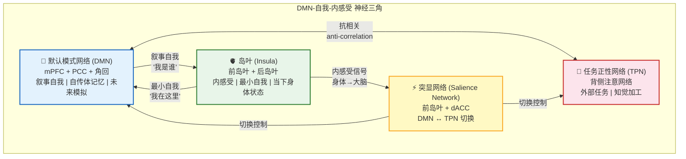

# 默认模式网络、自我模型与内感受：心性修养的神经三角

## The DMN, Self-Model, and Interoception: The Neural Triangle of Mental Cultivation

---

## 摘要

默认模式网络（Default Mode Network, DMN）、自我模型（self-model）和内感受（interoception）构成了心性修养实践所涉及的三个核心神经系统的"铁三角"。本文系统综述这三个系统的神经科学文献，论证：(1) DMN 是"叙事自我"（narrative self）的核心神经基质——内侧前额叶皮层（mPFC）生成自我指涉叙事，后扣带回皮层（PCC）整合自传体记忆，两者的过度耦合是反刍（rumination）和精神内耗的神经基础；(2) "自我模型"是大脑对"我"这个实体的多层预测性构造——从最小自我（minimal self，基于身体拥有感）到叙事自我（narrative self，基于自传体连续性）到社会自我（social self，基于他人的视角）；(3) 内感受（interoception）——对来自身体内部信号的感知（心跳、呼吸、内脏状态）——是自我模型的最底层输入，也是冥想的"锚点"；(4) 冥想训练通过降低 DMN 的内部功能连接（特别是 mPFC-PCC 耦合）、增强岛叶（insula）灰质密度和内感受精度，实现从"叙事自我"到"最小自我"的暂时性重心转移——这与佛教"无我"（anatta）和道家"吾丧我"的神经现象学一致。

**关键词**：默认模式网络，自我模型，内感受，岛叶，叙事自我，最小自我，冥想，无我，吾丧我

> **证据等级**：形式化 [F] + 仿真 [S]（见 `verifiable_units/vu_01_dmn_insula.md`）+ 神经证据 [N]

---

**图 1：DMN-自我-内感受的神经三角。** DMN（蓝）生成叙事自我——"我是谁"的故事。岛叶（绿）生成最小自我——"我在这里，现在"的身体感觉。突显网络（黄）在 DMN 和 TPN 之间切换。冥想的"重心转移"是从 DMN 主导（叙事自我）向岛叶主导（最小自我）的移动。

## 1. 默认模式网络（DMN）

### 1.1 DMN 概述

默认模式网络（Default Mode Network, DMN）是一组在静息状态下高度活跃、在执行外部任务时活动降低的脑区，由 Raichle 等人（2001, doi:10.1073/pnas.98.2.676）首次命名。其核心节点包括内侧前额叶皮层（mPFC）、后扣带回皮层（PCC）/楔前叶、角回和内侧颞叶。DMN 的核心功能可概括为**自我**（self）、**记忆**（memory）、**模拟**（simulation）——它在我们不做外部任务时构建关于"我是谁"的叙事、回顾过去经历、并模拟未来场景（Buckner et al., 2008, doi:10.1196/annals.1440.011）。

DMN 与任务正性网络（TPN）在功能上呈抗相关关系（Fox et al., 2005, doi:10.1073/pnas.0504136102）。DMN 占优时进行内在导向思维（自传体记忆、未来规划、反刍），TPN 占优时进行外在导向注意（任务聚焦、知觉加工）。两者的灵活切换由突显网络（前岛叶 + dACC）介导（Menon & Uddin, 2010, doi:10.1007/s00429-010-0262-0）。

> **详细论述**：DMN 的发现历史、解剖结构、与 TPN 的反相关机制、过度活跃与精神病理的关联，以及冥想对 DMN 的系统性影响，详见 `1_first_principles/02_one_as_bandwidth.md` §2-§3。本节仅保留与自我模型和内感受直接相关的核心要点。

DMN 过度活跃与多种精神病理状态相关：抑郁症（mPFC-PCC 连接增强，Hamilton et al., 2011）、焦虑症（DMN-突显网络异常耦合，Xu et al., 2019）、ADHD（任务中 DMN 不被抑制，Sonuga-Barke & Castellanos, 2007）。这些发现与项目框架中"一即带宽"的公式一致：

$$AB(t) = 1 - \frac{R_{\text{DMN}}(t) - R_0}{R_{\text{max}} - R_0}$$

其中 $R_{\text{DMN}}(t)$ 是 DMN（PCC/mPFC）BOLD 信号相对于静息态基线的标准化变化，$R_0$ 为基线，$R_{\text{max}}$ 为最大观测变化量；$AB(t) \in [0,1]$ 是觉知带宽的相对可用比例。当 DMN 过度活跃时，$AB(t)$ 被压缩，注意力被锁定在自我指涉叙事中无法移开。

---

## 2. 自我模型（Self-Model）

### 2.1 自我不是实体，是多层预测性构造

Thomas Metzinger（2003, *Being No One*）提出的"自我模型理论"（Self-Model Theory of Subjectivity）是当代意识科学中关于自我的最具影响力的理论框架。其核心主张是：

**我们体验到的"自我"不是一个不可还原的实体，而是一个由大脑持续生成并更新的"现象自我模型"（Phenomenal Self-Model, PSM）——一个关于"我"作为一个有边界的、持续的、具有第一人称视角的实体的预测性表征。**

这一理论与预测编码框架（`1_first_principles/01_dao_as_process.md`）高度一致：自我模型是生成模型中最特殊的一类先验——关于"正在拥有这些体验的实体"的先验。它的精度通常被设定得极高（因为我们通常不怀疑"我在"），但这种高精度是可以被训练下调的。

### 2.2 自我的三层级结构

基于当前神经科学文献（Damasio, 2010; Gallagher, 2000; Seth, 2021），自我可以被区分为三个层级：

| 自我层级 | 内容 | 核心神经基质 | 可操作性 |
|---------|------|-------------|---------|
| **最小自我**（Minimal Self） | 身体拥有感（sense of body ownership）、自我定位（self-location）、第一人称视角 | 岛叶（insula）、颞顶联合区（TPJ）、前运动皮层 | 身体性的、当下的、非概念的 |
| **叙事自我**（Narrative Self） | 自传体连续性、人格特征、个人历史、"我是谁"的故事 | DMN（mPFC + PCC）、海马体 | 语言性的、时间延展的、概念化的 |
| **社会自我**（Social Self） | 他人视角中的"我"、社会角色、声誉、地位 | mPFC、颞上沟（STS）、镜像神经元系统 | 关系性的、依赖于他人视角 |

**关键洞见**：这三层自我并非三种不同的实体，而是同一个预测性自我模型在不同层级上的展开。最小自我是最底层——基于内感受和身体信号；叙事自我是中层——将最小自我整合进一个有时间的自传体框架；社会自我是外层——将他人的视角纳入自我模型。

### 2.3 "吾丧我"与自我模型的暂时性解构

《庄子·齐物论》中的"吾丧我"——"我"丧失了"自我"——可以被精确地重新描述为：

**叙事自我（narrative self，对应于"我"/wo）的暂时性精度下调，使得最小自我（minimal self，对应于"吾"/wu——作为纯粹的觉知在场）在现象空间中成为主导体验。**

计算上：
$$\Pi_{\text{narrative-self}} \rightarrow 0 \quad \text{while} \quad \Pi_{\text{minimal-self}} \text{ maintained}$$

这并非"自我"的消失（那将导致去人格化障碍/depersonalization disorder），而是自我模型的重心从叙事层向身体层转移。这与 Seth（2021）的"存在你自己"（Being You）论述一致：身体性的"存在感"是最底层的自我体验，它可以在叙事自我关闭时仍然存在。

---

## 3. 内感受（Interoception）

### 3.1 内感受的定义与神经通路

内感受（interoception）是对身体内部状态的感知——心跳、呼吸、内脏感觉、温度、饥饿、口渴等。与"五大感官"（外感受/exteroception）不同，内感受的信号来源是身体内部环境。

Craig（2002, doi:10.1038/nrn894; 2009, doi:10.1038/nrn2555）的经典工作识别了内感受的核心神经通路：

1. **脊髓/迷走神经传入** → 丘脑（thalamus） → **后岛叶（posterior insula）**（初级内感受皮层——对身体状态的原始表征）
2. **后岛叶** → **前岛叶（anterior insula）**（次级内感受皮层——对身体状态的有意识感知/"感受"）
3. **前岛叶** → **前扣带回（ACC）**（内感受信号与动机/行动倾向的整合）

前岛叶在 Craig 的框架中被赋予了一个特殊角色：它是"全局情绪时刻"（global emotional moment）的生成器——每一瞬间，前岛叶将来自全身的内感受信号整合为一个统一的"我现在感觉如何"的表征。这构成了"最小自我"的神经基础。

### 3.2 内感受精度与情绪

在预测编码框架中，内感受被重新理解为大脑对"身体内部状态的原因"进行的**贝叶斯推理**（Seth, 2013, doi:10.1016/j.tics.2013.09.007）：

- **内感受预测**：大脑生成关于身体内部状态的自上而下预测
- **内感受预测误差**：来自身体的传入信号与预测之间的差异
- **内感受精度**：预测误差在更新身体状态信念时的权重

情绪在这一框架中是一种**内感受推理**（interoceptive inference）："恐惧"不是"被感受到"的，而是大脑对一组身体变化（心跳加快、手心出汗、呼吸变浅）的**最佳解释**——"这些身体变化意味着我正在面对威胁"。

这与 Schachter & Singer（1962）的情绪双因素理论和 LeDoux（1996, 2000）的情绪双通路模型一致，但提供了更精确的计算表述。

### 3.3 内感受作为冥想的"锚点"

在几乎所有冥想传统中，身体——特别是呼吸——被用作注意力的"锚点"。从内感受的角度，这一操作可以被精确描述为：

**通过将注意力持续地指向内感受信号（呼吸的感觉、身体的整体感），上调内感受精度（$\Pi_{\text{interoception}}$），同时下调 DMN 叙事自我回路（mPFC-PCC）的精度。**

具体地：
$$\Pi^{\text{attn}} \rightarrow \Pi^{\text{interoceptive}} \gg \Pi^{\text{DMN}}$$

当内感受精度被上调时，系统对身体的当下状态的信念更新效率提高，对 DMN 生成的"我是谁"叙事的依赖降低。这解释了为什么即使 5-10 分钟的短时呼吸冥想也能产生即时的情绪调节效果——它通过上调内感受精度，暂时性地从叙事自我的反刍循环中"借出"了认知资源。

### 3.4 DMN-岛叶-TPN 动力学的形式化模型

DMN（叙事自我）和岛叶/TPN（最小自我/当下觉知）之间的动态可以被形式化为一个**双稳态竞争系统**（bistable competition system）：

$$\tau_D \frac{dD}{dt} = -D + w_{DD} \cdot \sigma(D) - w_{ID} \cdot \sigma(I) + S_D(t) \quad \text{[F/S]}$$

$$\tau_I \frac{dI}{dt} = -I + w_{II} \cdot \sigma(I) - w_{DI} \cdot \sigma(D) + S_I(t) + \alpha \cdot B(t) \quad \text{[F/S]}$$

其中：
- $D(t)$：DMN 活动水平（mPFC-PCC 同步）
- $I(t)$：岛叶/内感受网络活动水平（前岛叶-ACC 同步）
- $\sigma(x) = 1/(1 + e^{-\beta(x - \theta)})$：sigmoid 激活函数（$\beta$ = 增益，$\theta$ = 阈值；$\sigma(x)$ 无量纲）
- 状态变量 $D(t), I(t) \in [0, 1]$ 为归一化激活水平；完整量纲约定见 [`NOTATION.md`](../NOTATION.md)
- $w_{DD}$：DMN 的自维持权重（反刍的正反馈——"一个念头勾出另一个念头"）
- $w_{ID}$：岛叶→DMN 的抑制权重（内感受锚定对叙事的抑制）
- $w_{DI}$：DMN→岛叶的抑制权重（叙事沉浸对身体觉知的压抑）
- $w_{II}$：岛叶的自维持权重（身体锚定的稳定性）
- $S_D(t)$：驱动 DMN 的外部刺激（社交评价、威胁性不确定性等）
- $S_I(t)$：驱动内感受的外部刺激（显着的身体感觉等）
- $B(t)$：呼吸/身体锚定的注意努力（冥想中的"锚点"信号）
- $\alpha$：注意放大系数——将 $B(t)$ 转化为岛叶的有效驱动
- $\tau_D, \tau_I$：时间常数

**系统的两个稳态**：

1. **DMN 占优稳态**（日常"走神"状态）：$D \gg I$。当 $w_{DD}$ 足够大且 $B(t)$ 低时，系统被吸引到 DMN 高活动、岛叶低活动的固定点。这是一个"叙事陷阱"——系统在没有外部任务时自动滑入此状态。

2. **岛叶占优稳态**（冥想/觉知状态）：$I \gg D$。当 $B(t)$（呼吸锚定）通过 $\alpha$ 被放大到足以克服 DMN 的自维持时，系统切换到岛叶高活动、DMN 低活动的固定点。这是一个"当下锚定"状态。

**切换条件**：从 DMN 占优切换到岛叶占优的临界条件，可以从岛叶网络的净输入中导出。在岛叶活动较低时（$I \approx 0$），岛叶 ODE 的净驱动近似为：

$$\tau_I \frac{dI}{dt} \approx -I - w_{DI} \cdot \sigma(D^*) + S_I(t) + \alpha \cdot B(t)$$

为使岛叶活动从低水平开始增长，净输入必须超过其衰减与 DMN 抑制之和。引入岛叶激活阈值 $\theta_I$（具有与 $I$ 相同的激活单位），并定义无量纲参数：

- $\tilde{B}(t) = B(t) / B_{\text{max}} \in [0, 1]$：归一化的呼吸锚定强度
- $\tilde{S}_I(t) = S_I(t) / \theta_I$：归一化的外部岛叶刺激
- $\tilde{w}_{DI} = w_{DI} / \theta_I$：归一化的 DMN→岛叶抑制权重
- $\tilde{\alpha} = \alpha \cdot B_{\text{max}} / \theta_I$：归一化的锚定放大系数

临界条件为：

$$\tilde{\alpha} \cdot \tilde{B}(t) + \tilde{S}_I(t) > \tilde{w}_{DI} \cdot \sigma(D^*) + 1 \quad \text{[F/S]}$$

其中 $D^*$ 是 DMN 占优稳态下的活动水平，$\sigma(D^*)$ 为 sigmoid 输出（无量纲）。不等式两边均为无量纲量，保证了量纲一致性。这解释了为什么"放下"（停止思维）需要努力——$\tilde{\alpha} \cdot \tilde{B}(t)$ 必须克服 DMN 自维持通过 $w_{DI}$ 对岛叶的抑制以及岛叶自身的激活阈值。

> **边界说明**：上述不等式是岛叶活动从接近零开始增长的**充分条件**，而非完整切换的充分必要条件。实际能否完成从 DMN 占优稳态到岛叶占优稳态的切换，还取决于岛叶自维持权重 $w_{II}$、DMN→岛叶抑制 $w_{DI}$ 的完整非线性动力学，以及数值积分中的 $[0, 1]$ 裁剪。可运行仿真见 `verifiable_units/vu_01_dmn_insula.md`。

**训练效应**：长期冥想通过以下机制使切换更容易：
- **降低 $w_{DD}$**（DMN 自维持权重）：减少反刍的"黏性"
- **增强 $w_{ID}$**（岛叶→DMN 抑制）：一次身体锚定即可更有效地抑制叙事
- **增强 $w_{II}$**（岛叶自维持）：身体锚定更稳定，不易被叙事拉回
- **增大 $\alpha$**（注意放大系数）：相同的呼吸努力产生更强的岛叶驱动

在参数空间中，训练将系统从"深 DMN 吸引子"（需要极大努力才能切换）移向"浅 DMN 吸引子 + 强岛叶吸引子"（轻轻一"锚"即可切换）。

---

## 4. 冥想训练的神经效应：DMN-自我-内感受三角的重塑

### 4.1 DMN 的功能连接降低

大量 fMRI 研究一致发现，长期冥想与 DMN 内部功能连接的降低相关：

- **Brewer 等人（2011, doi:10.1073/pnas.1112029108）**：冥想者在静息状态下 mPFC 和 PCC 之间的功能连接显著低于对照组。更重要的是，PCC 的激活降低与"走神"（mind-wandering）的减少正相关。
- **Garrison 等人（2015, doi:10.1016/j.neuroimage.2015.02.034）**：冥想者报告"专注于冥想对象"时，PCC 的活动降低。PCC 是 DMN 的"集线器"（hub）——它的活动降低意味着整个 DMN 的叙事生成功能被下调。

### 4.2 岛叶灰质密度与内感受精度的增强

- **Holzel 等人（2008, doi:10.1016/j.neulet.2008.02.044）**：正念减压（MBSR）8 周训练后，左侧前岛叶灰质密度显著增加。岛叶灰质密度与内感受精度的行为测量（心跳探测任务）正相关。
- **Lazar 等人（2005, doi:10.1097/01.wnr.0000186598.66243.19）**：长期冥想者的前岛叶和感觉皮层厚度显著大于年龄匹配的对照组。皮层厚度的保持与冥想经验时长呈正相关。

### 4.3 从"叙事自我"到"最小自我"的神经重心转移

综合以上发现，可以提出以下神经现象学模型：

**冥想训练的核心神经效应是一个系统性的"重心转移"——从 DMN 主导的"叙事自我"模式（mPFC-PCC 高耦合 + 岛叶中低激活）转向岛叶主导的"最小自我"模式（前岛叶高激活 + mPFC-PCC 去耦合）。**

| 维度 | 叙事自我模式（日常状态） | 最小自我模式（冥想/觉知状态） |
|------|------------------------|---------------------------|
| **核心网络** | DMN 占优（mPFC-PCC 高耦合） | 岛叶-突显网络占优 |
| **时间定向** | 过去（反刍）或未来（焦虑/规划） | 当下（身体此刻的状态） |
| **自我体验** | "我是有过去的人/我是走向未来的人" | "我在这里，现在" |
| **注意力** | 被思维内容"拉走" | 安住在身体感觉/呼吸上 |
| **神经标志** | α 波 DMN 同步 | θ/γ 波岛叶-前额叶耦合 |

### 4.4 与"四行"的对应

这一"重心转移"模型与达摩"二入四行"体系（`3_methodology/xing_ru/`）存在精确的结构对应：

| 行入 | 神经操作 | DMN-自我-内感受三角的重塑 |
|------|---------|--------------------------|
| **报冤行** | 认知重评（上调 PFC 对杏仁核的调控） | 用 L4 重新评估削减 L2 的自动化叙事 |
| **随缘行** | RPE 修正（无常修正项 δ） | 下调"顺境-自我价值"的叙事绑定 |
| **无所求行** | 下调"想要"系统（降低 NAc 多巴胺能反应性） | 削弱叙事自我的目标执着——"我必须得到 X 才能是 Y" |
| **称法行** | 降低 SoA（行动-自我归属感去耦合） | 叙事自我完全消融于行动之中——"行动发生"而非"我在做" |

---

## 5. 实践意义

### 5.1 "忘我"是神经上的可训练技能

本文综述的核心实践意义是：**"自我"不是一个需要被哲学性地"打破"的形而上实体，而是一个可以被神经性地"下调"的预测模型的精度设置。** "无我"（anatta）不是自我的不存在，而是叙事自我的精度被暂时性（或在长期训练中被特质性地）降低，同时最小自我（身体性的存在感）和内感受精度被增强。

### 5.2 "理入"与"行入"的神经互补性

- **理入**（`3_methodology/li_ru.md`）：在认知层面建立关于"自我是构造"的正确见地 → 降低叙事自我的先验精度 → 改变 DMN 的最高层级先验。
- **行入**（`3_methodology/xing_ru/`）：通过反复的行为/注意力训练 → Hebbian 重塑 DMN-岛叶-TPN 的功能连接 → 巩固"最小自我"模式。

两者形成一个闭环：见地指导训练 → 训练巩固见地 → 见地进一步深化 → 训练进一步精准。这正是"二入"（理入+行入）的神经科学含义。

### 5.3 日常练习建议

基于上述框架，推荐以下日常练习路径：

1. **呼吸锚定（5 分钟/天）**：将注意力放在呼吸的身体感觉上 → 上调内感受精度 → 暂时从 DMN 叙事中"借出"认知资源
2. **身体扫描（body scan, 10-15 分钟/天）**：系统性地将注意力导向身体各部位 → 建立从"叙事自我"到"最小自我"的注意力通路
3. **开放觉知（open monitoring, 10-20 分钟/天）**：在身体锚定的基础上，将注意力扩展到全部感官领域 → α 精度景观扁平化 → "观"的状态

---

## 6. 参考文献

### 默认模式网络（DMN）
1. Buckner, R. L., Andrews-Hanna, J. R., & Schacter, D. L. (2008). The brain's default network: Anatomy, function, and relevance to disease. *Annals of the New York Academy of Sciences*, 1124, 1–38. doi:10.1196/annals.1440.011
2. Fox, M. D., Snyder, A. Z., Vincent, J. L., Corbetta, M., Van Essen, D. C., & Raichle, M. E. (2005). The human brain is intrinsically organized into dynamic, anticorrelated functional networks. *Proceedings of the National Academy of Sciences*, 102(27), 9673–9678. doi:10.1073/pnas.0504136102
3. Hamilton, J. P., Furman, D. J., Chang, C., Thomason, M. E., Dennis, E., & Gotlib, I. H. (2011). Default-mode and task-positive network activity in major depressive disorder: Implications for adaptive and maladaptive rumination. *Biological Psychiatry*, 70(4), 327–333. doi:10.1016/j.biopsych.2011.02.003
4. Menon, V., & Uddin, L. Q. (2010). Saliency, switching, attention and control: A network model of insula function. *Brain Structure and Function*, 214(5-6), 655–667. doi:10.1007/s00429-010-0262-0
5. Raichle, M. E., MacLeod, A. M., Snyder, A. Z., Powers, W. J., Gusnard, D. A., & Shulman, G. L. (2001). A default mode of brain function. *Proceedings of the National Academy of Sciences*, 98(2), 676–682. doi:10.1073/pnas.98.2.676
6. Sonuga-Barke, E. J. S., & Castellanos, F. X. (2007). Spontaneous attentional fluctuations in impaired states and pathological conditions: A neurobiological hypothesis. *Neuroscience and Biobehavioral Reviews*, 31(7), 977–986. doi:10.1016/j.neubiorev.2007.02.005
7. Xu, J., Van Dam, N. T., Feng, C., Luo, Y., Ai, H., Gu, R., & Xu, P. (2019). Anxious brain networks: A coordinate-based activation likelihood estimation meta-analysis of resting-state functional connectivity studies in anxiety. *Neuroscience and Biobehavioral Reviews*, 96, 21–30. doi:10.1016/j.neubiorev.2018.11.003

### 自我模型（Self-Model）
8. Damasio, A. (2010). *Self Comes to Mind: Constructing the Conscious Brain*. New York: Pantheon.
9. Gallagher, S. (2000). Philosophical conceptions of the self: implications for cognitive science. *Trends in Cognitive Sciences*, 4(1), 14–21. doi:10.1016/S1364-6613(99)01417-5
10. Metzinger, T. (2003). *Being No One: The Self-Model Theory of Subjectivity*. Cambridge, MA: MIT Press.
11. Seth, A. K. (2021). *Being You: A New Science of Consciousness*. London: Faber & Faber.

### 内感受（Interoception）
12. Craig, A. D. (2002). How do you feel? Interoception: the sense of the physiological condition of the body. *Nature Reviews Neuroscience*, 3(8), 655–666. doi:10.1038/nrn894
13. Craig, A. D. (2009). How do you feel — now? The anterior insula and human awareness. *Nature Reviews Neuroscience*, 10(1), 59–70. doi:10.1038/nrn2555
14. Schachter, S., & Singer, J. (1962). Cognitive, social, and physiological determinants of emotional state. *Psychological Review*, 69(5), 379–399. doi:10.1037/h0046234
15. Seth, A. K. (2013). Interoceptive inference, emotion, and the embodied self. *Trends in Cognitive Sciences*, 17(11), 565–573. doi:10.1016/j.tics.2013.09.007

### 冥想训练的神经效应
16. Brewer, J. A., Worhunsky, P. D., Gray, J. R., Tang, Y. Y., Weber, J., & Kober, H. (2011). Meditation experience is associated with differences in default mode network activity and connectivity. *Proceedings of the National Academy of Sciences*, 108(50), 20254–20259. doi:10.1073/pnas.1112029108
17. Garrison, K. A., Zeffiro, T. A., Scheinost, D., Constable, R. T., & Brewer, J. A. (2015). Meditation leads to reduced default mode network activity beyond an active task. *Cognitive, Affective, & Behavioral Neuroscience*, 15(3), 712–720. doi:10.3758/s13415-015-0358-3
18. Holzel, B. K., Ott, U., Gard, T., Hempel, H., Weygandt, M., Morgen, K., & Vaitl, D. (2008). Investigation of mindfulness meditation practitioners with voxel-based morphometry. *Social Cognitive and Affective Neuroscience*, 3(1), 55–61. doi:10.1093/scan/nsm038
19. Lazar, S. W., Kerr, C. E., Wasserman, R. H., Gray, J. R., Greve, D. N., Treadway, M. T., McGarvey, M., Quinn, B. T., Dusek, J. A., Benson, H., Rauch, S. L., Moore, C. I., & Fischl, B. (2005). Meditation experience is associated with increased cortical thickness. *NeuroReport*, 16(17), 1893–1897. doi:10.1097/01.wnr.0000186598.66243.19

### 情绪与自我归属感
20. LeDoux, J. E. (1996). *The Emotional Brain: The Mysterious Underpinnings of Emotional Life*. Simon & Schuster.
21. LeDoux, J. E. (2000). Emotion circuits in the brain. *Annual Review of Neuroscience*, 23, 155–184. doi:10.1146/annurev.neuro.23.1.155

---

> 本文是 Project Dao.Science 心智模型系列（`2_models/`）的第四篇。前三篇为：`attention_model.md`（注意力动力学）、`100ms_model.md`（本能劫持与解离）、`neuroplasticity_loop.md`（神经重塑回路）。**与 L0-L7 频谱的关系（`0_motivation/L0_L7_spectrum.md`）：** DMN 是 L2（个体实情/叙事自我）和 L3（文化传承/社会自我）的核心神经基质——它是"相"在神经层面的生成引擎。内感受（岛叶）是 L0（觉知本身）最直接的神经锚点——当下身体的感觉是唯一始终在"此时此地"的信号。冥想的"重心转移"（从 DMN→岛叶）在 L0-L7 频谱上对应从 L2-L3（被过去/未来叙事劫持）向 L0（觉知本身的裸露）的层级跃迁。"吾丧我"（叙事自我的暂时性解构）是这一跃迁的神经现象学描述。
>
> 下一篇：`2_models/social_cognition.md`（社会认知与镜像共鸣——"同体大悲"的神经现象学）。
