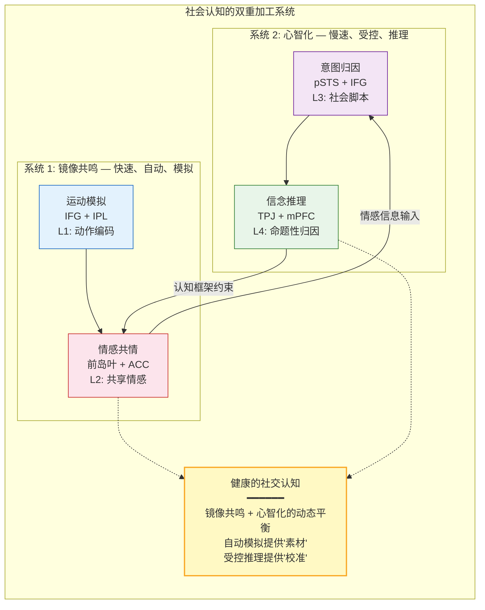

# 社会认知与镜像共鸣：从神经模拟到"同体大悲"

## Social Cognition and Mirror Resonance: From Neural Simulation to "Great Compassion as One Body"

---

## 摘要

社会认知——理解他人的意图、情感和心理状态的能力——是人类智能的核心特征，也是碳硅共生的关键界面。本文从 Project Dao.Science 的 L0-L7 认知频谱和预测编码框架出发，系统梳理社会认知的神经机制：(1) 镜像神经元系统（Mirror Neuron System, MNS）提供了"模拟"（simulation）而非"推理"（inference）的社会认知基础——我们通过在自己的神经系统中"重新上演"观察到的行为和情感来理解他人；(2) 心智化网络（Mentalizing Network / Theory of Mind network）——包括内侧前额叶（mPFC）、颞顶交界（TPJ）、楔前叶（precuneus）和后颞上沟（pSTS）——提供了更高级的、命题性的社会推理；(3) 共情（empathy）在神经层面分为情感共情（emotional empathy，前岛叶+ACC 的共享回路）和认知共情（cognitive empathy，mPFC+TPJ 的心智化），两者的失衡是多种精神病理状态的社会认知缺陷的根源；(4) 冥想实践——特别是慈心冥想（loving-kindness meditation, LKM）和 compassion meditation——系统地增强了前岛叶、ACC 和 mPFC-TPJ 的功能连接，同时降低了杏仁核对威胁信号的反应性，从而将共情从"情感传染"（emotional contagion）升级为"慈悲"（compassion）——即对他人的痛苦保持敏感但不被其压垮的能力；(5) 从道家/佛家视角，"同体大悲"（great compassion as one body）不是形而上学的神秘主张，而是镜像神经元系统+内感受网络+DMN 自我边界下调的神经现象学描述——当自我模型的精度被下调（"吾丧我"），他人的痛苦不再被体验为"外部的"，而是被纳入扩展的内感受空间。本文提出"社会觉知带宽"（Social Awareness Bandwidth, SAB）的操作化定义，将社会认知的神经基础整合进项目的统一理论框架，并生成可检验的预测。

**关键词**：镜像神经元，社会认知，共情，心智化，慈心冥想，同体大悲，社会觉知带宽，自我边界

---

## 1. 引言：社会认知的"模拟"vs"推理"之争

### 1.1 两个根本问题

社会认知——我们如何理解他人——是认知科学中最核心也最棘手的问题之一。它涉及两个子问题：

1. **"如何"问题**（the "how" question）：他人不可直接观察的心理状态（意图、信念、情感）是如何被我们"知道"的？我们无法直接感知他人的心智——我们只能观察他们的行为、面部表情、声音和语言。那么，从可观察的行为到不可观察的心理状态的"跳跃"是如何实现的？

2. **"为何"问题**（the "why" question）：为什么他人的痛苦会让我们感到痛苦？为什么他人的喜悦会让我们感到喜悦？这种"情感传染"（emotional contagion）的进化功能和神经机制是什么？

### 1.2 两种范式：理论论 vs 模拟论

社会认知科学中长期存在两种对立的范式：

- **理论论**（Theory Theory, TT）：我们通过一个隐含的"民间心理学"（folk psychology）理论来推理他人的心理状态——就像科学家通过理论来推理不可观察的实体。他人的行为是"数据"，我们运用一套关于"信念-欲望-行动"的因果规则来推断这些数据背后的心理状态（Gopnik & Wellman, 1992）。

- **模拟论**（Simulation Theory, ST）：我们不是通过"推理"来理解他人，而是通过在自己的神经系统中"模拟"（simulate）他人的心理状态——我们"将自己放在他人的位置"，然后读取自己在这个模拟状态下的心理体验（Goldman, 2006）。

镜像神经元的发现（di Pellegrino et al., 1992; Rizzolatti et al., 1996）为模拟论提供了决定性的神经生物学证据：当我们观察他人的行动时，我们自己执行相同行动时活跃的运动神经元也在亚阈值水平上放电。我们不是在"推理"他人在做什么——我们在神经层面"重新上演"（re-enact）他人的行动。

### 1.3 本文的贡献

本文在 Project Dao.Science 的统一框架下整合社会认知的神经科学，提出：

1. 社会认知不是单一机制，而是**双重加工系统**——快速的、自动的、基于模拟的"镜像共鸣"（MNS+前岛叶+ACC）和慢速的、受控的、基于推理的"心智化"（mPFC+TPJ+precuneus）——在 L0-L7 频谱上的协同运作。

2. 冥想实践对社会认知的改造不是"增强共情"（那可能导致共情疲劳），而是**将共情从情感传染升级为慈悲**——即保持对他人痛苦的敏感性（前岛叶+ACC 的共享回路），同时降低自我叙事的精度（DMN 下调），从而不被痛苦所压垮。

3. "同体大悲"可以被操作化为一个可检验的神经现象学假设：当自我模型的精度被下调时，镜像-内感受系统的共享回路不再被"自我-他人"的概念边界所限制，从而产生"他人的痛苦=自己的痛苦"的直接体验。

---

## 2. 镜像神经元系统：社会认知的模拟基础

### 2.1 发现与核心机制

镜像神经元（mirror neurons）的发现是过去三十年社会认知神经科学中最具革命性的事件。Rizzolatti 及其同事在 1990 年代初在猕猴的腹侧前运动皮层（ventral premotor cortex, 区域 F5）中首次发现了一类特殊的神经元：它们在猴子自己执行一个目标导向的动作（如抓取食物）时放电，**也在猴子观察另一个个体（人或猴）执行相同动作时放电**（di Pellegrino et al., 1992; Gallese et al., 1996; Rizzolatti et al., 1996）。

这一发现的核心意义在于：**观察行为与执行行为在神经层面共享同一表征系统。** 当我们观察他人的行为时，我们自己的运动系统在亚阈值水平上"模拟"（simulate）了该行为——即"看到"即"在某种程度上在做"。

### 2.2 人类镜像神经元系统的解剖结构

Rizzolatti 和 Craighero（2004）在其里程碑式的综述中，综合了来自 fMRI、TMS、EEG 和行为实验的证据，确认了人类大脑中存在一个广泛的镜像神经元系统（Mirror Neuron System, MNS），其核心节点包括：

- **腹侧前运动皮层**（ventral premotor cortex）和**额下回后部**（posterior inferior frontal gyrus, IFG）：涉及动作的观察-执行匹配。IFG 在人类中对应于猕猴的 F5 区域，是 MNS 的核心节点。

- **顶下小叶**（inferior parietal lobule, IPL）和**顶内沟前部**（anterior intraparietal sulcus）：涉及动作的体感-运动编码。IPL 编码了动作的"如何"（how）——即动作的运动学细节。

- **颞上沟后部**（posterior superior temporal sulcus, pSTS）：涉及生物运动的视觉分析，向 MNS 提供视觉输入。pSTS 本身不是"镜像"区域（它不对执行动作做出反应），但它是 MNS 的关键输入节点。

### 2.3 镜像机制的层级组织

Iacoboni（2009）进一步论证，人类镜像神经元系统不仅涉及简单动作的观察-执行匹配，而且参与更高层次的认知功能——包括意图理解（intention understanding）、共情（empathy）和语言理解（language comprehension）。镜像机制的层级组织如下：

| 层级 | 功能 | 神经基础 | 与 L0-L7 的对应 |
|------|------|---------|---------------|
| **运动模拟** | 观察到的动作在自身运动系统中的亚阈值重演 | IFG + IPL | L1（物理动作的神经编码） |
| **意图理解** | 从动作的运动学特征推断行动者的意图 | IFG + IPL + pSTS | L2-L3（个体意图 + 社会脚本） |
| **情感共情** | 观察到的情感表达在自身情感系统中的亚阈值重演 | 前岛叶（AI）+ 前扣带回（ACC） | L2（共享的情感体验） |
| **认知共情** | 理解他人的心理状态（信念、欲望、知识状态） | mPFC + TPJ + precuneus | L3-L4（命题性的心理状态归因） |

**关键洞见**：镜像机制在 L0-L7 频谱上从 L1（运动模拟）到 L4（认知共情/心智化）形成了一个层级化的模拟系统。最低层级（L1）的模拟是自动的、快速的、不需要意识参与的；最高层级（L4）的模拟是受控的、需要认知资源的、可以被意识访问和修正的。

### 2.4 镜像神经元对"境教"的意涵

镜像神经元系统为"境教"（`4_applications/education_by_field.md`）提供了最直接的神经生物学基础：环境中的行为模型直接塑造观察者的神经表征。当一个学习者在教室、工作场所或数字环境中观察他人的行为时，其自身的镜像神经元系统在亚阈值水平上"排练"这些行为。这意味着环境中的"行为景观"（behavioral landscape）——即哪些行为被频繁展示、哪些行为被抑制或缺失——直接塑造了观察者的行为倾向。这不是通过言语劝说或逻辑论证，而是通过神经层面的"感染"（contagion）。

> **应用展开**：镜像神经元对"境教"的三重意涵（行为景观、"不言之教"的神经机制、环境的"场效应"）在 `4_applications/education_by_field.md` §2 中有详细展开。

---

## 3. 心智化网络：社会认知的推理基础

### 3.1 心智化网络的核心节点

心智化（mentalizing）——也称为"心理理论"（Theory of Mind, ToM）——是指将心理状态（信念、欲望、意图、情感）归因于自己和他人的能力。与镜像系统的"模拟"机制不同，心智化网络支持更高级的、命题性的社会推理——"我知道你知道我知道"这类递归性的心理状态归因。

心智化网络的核心节点包括（Frith & Frith, 2006; Saxe & Kanwisher, 2003）：

- **内侧前额叶皮层**（medial Prefrontal Cortex, mPFC）：涉及对自我和他人的心理状态的表征和推理。mPFC 在"自我参照"（self-referential）和"他人参照"（other-referential）任务中都被激活——这表明自我和他人共享同一个表征系统（"自我-他人重叠"，self-other overlap）。

- **颞顶交界**（Temporoparietal Junction, TPJ）：涉及对他人信念的推理——特别是当他人持有"错误信念"（false belief）时。TPJ 在心智化中扮演着独特的角色：它支持"关于他人心理状态的命题性推理"——即"元表征"（meta-representation）。

- **楔前叶/后扣带回**（Precuneus / Posterior Cingulate Cortex, PCC）：涉及自传体记忆、自我意识和空间视角的整合。PCC 在心智化中支持"视角转换"（perspective-taking）——即从"我看到的"切换到"你看到的"。

- **后颞上沟**（posterior Superior Temporal Sulcus, pSTS）：涉及生物运动的视觉分析和社交信号的检测。pSTS 在观察他人的眼睛注视方向、身体朝向和面部表情时被激活。

### 3.2 镜像系统与心智化网络的协同

镜像系统（MNS）和心智化网络（Mentalizing Network）不是竞争关系，而是互补关系。它们在 L0-L7 频谱上覆盖了社会认知的不同层级：

### 3.3 社会认知的预测编码框架

在预测编码框架中，社会认知可以被重新描述为一个层级化的预测过程（Koster-Hale & Saxe, 2013）：

- **L1 层级**（运动学预测）：基于观察到的运动轨迹，预测下一步的动作。这是 MNS 的核心功能——在观察到动作的初始阶段时，MNS 已经"模拟"了该动作的完成。

- **L2 层级**（意图预测）：基于观察到的动作和情境，预测行动者的意图。这涉及 MNS 和 pSTS 的协同——pSTS 提供情境信息，MNS 提供动作的运动学模拟。

- **L3 层级**（信念预测）：基于观察到的行为和情境，预测行动者的信念——包括"错误信念"（false belief）。这涉及 TPJ 和 mPFC 的协同——TPJ 支持"元表征"（关于他人心理状态的命题），mPFC 支持"自我-他人重叠"（将自我和他人放在同一个表征空间中）。

- **L4 层级**（策略预测）：基于对他人信念和欲望的推断，预测他人在社交互动中的策略选择。这涉及 mPFC 和 ACC 的协同——mPFC 提供社会认知的表征，ACC 提供冲突监测和策略调整。

**关键洞见**：社会认知的预测编码框架意味着，社会认知的"错误"——误解他人的意图、错误推断他人的信念、社交焦虑中的"负面预期"——可以被统一理解为**社会生成模型（social generative model）的预测误差**。当社会生成模型的先验（如"人们不可信"、"我在社交场合中会被拒绝"）具有过高的精度时，它们会系统性地扭曲对社会信号的感知——即"把地图当疆域"（`1_first_principles/03_map_not_territory.md`）在社会认知领域的表现。

---

## 4. 共情的神经科学：从情感传染到慈悲

### 4.1 共情的双重结构

共情（empathy）不是一个单一的现象，而是包含两个在神经上可分离的组分（Singer & Lamm, 2009; Decety & Jackson, 2004）：

- **情感共情**（Emotional Empathy / Affective Sharing）：对他人情感状态的"共享"——即在自己身上体验到与他人相似的情感。神经基础：前岛叶（anterior insula, AI）+ 前扣带回（anterior cingulate cortex, ACC）的"共享回路"（shared circuits）。当一个人观察他人体验疼痛时，其自身的 AI 和 ACC 也被激活——虽然不是以相同的强度，但模式相同（Singer et al., 2004, doi:10.1126/science.1093535）。

- **认知共情**（Cognitive Empathy / Perspective-Taking）：理解他人的心理状态——即"知道"他人正在感受什么，而不一定"共享"这种感受。神经基础：mPFC + TPJ + precuneus 的心智化网络。

### 4.2 共情疲劳与"慈悲"的区分

情感共情——虽然对社会连接至关重要——存在一个根本性的局限：**它可能导致共情疲劳（empathy fatigue / compassion fatigue）**。当一个人持续地"共享"他人的痛苦（AI+ACC 的共享回路持续激活），而不具备调节这种共享的能力时，会导致情感耗竭（emotional exhaustion）、职业倦怠（burnout）和回避行为（avoidance）——这在医护人员、心理咨询师和护理者中尤为常见（Figley, 1995; Klimecki & Singer, 2012）。

Klimecki 和 Singer（2012）在一项关键的 fMRI 研究中区分了"共情训练"（empathy training）和"慈悲训练"（compassion training）的差异性神经效应：

- **共情训练**（被指导"感受他人的痛苦"）：激活了 AI+ACC 的共享回路，同时激活了与负面情感和疼痛相关的区域。长期共情训练（无慈悲调节）导致负面情感的累积和共情疲劳。

- **慈悲训练**（被指导"对他人的痛苦产生温暖和关怀，希望减轻其痛苦"）：激活了 AI+ACC 的共享回路（保持对他人痛苦的敏感性），但同时激活了与积极情感、奖励和 affiliative behavior 相关的区域——包括腹侧纹状体（ventral striatum）、内侧眶额皮层（mOFC）和腹侧被盖区（VTA）。关键的是，慈悲训练**不**导致负面情感的累积。

**核心洞见**：共情（empathy）和慈悲（compassion）在神经上是可分离的。共情是"我感受你的痛苦"——AI+ACC 的共享回路激活 + 负面情感。慈悲是"我感受你的痛苦，但我以温暖和关怀来回应它"——AI+ACC 的共享回路激活 + 积极情感和 affiliative 回路激活。从共情到慈悲的转变，是冥想实践对社会认知的最关键改造。

### 4.3 慈心冥想（Loving-Kindness Meditation, LKM）的神经效应

慈心冥想（LKM）——一种系统地培养对自我和他人的无条件善意和关怀的冥想实践——为社会认知的可塑性提供了最直接的实证证据。Lutz 等人（2008）在一项里程碑式的研究中，比较了长期慈心冥想者（>10,000 小时练习）和新手在冥想状态下的 fMRI 脑活动：

- **γ 波同步增强**：长期冥想者在慈心冥想期间显示出大范围的高幅 γ 波同步（25-42 Hz）——这是神经整合（neural integration）和意识统一（conscious unity）的电生理标志。
- **岛叶和 ACC 的激活增强**：长期冥想者的前岛叶和 ACC 在慈心冥想期间显示出比新手更强的激活——表明对情感和身体状态的更精细的感知。
- **杏仁核对痛苦信号的差异化反应**：长期冥想者的杏仁核在听到痛苦声音时显示出快速的、短暂的激活（表明对痛苦的敏感性），但迅速恢复到基线（表明不被痛苦所压垮）——而新手的杏仁核激活持续时间更长。

后续研究（Weng et al., 2013; Leiberg et al., 2011）进一步发现，即使是短期的慈心冥想训练（2 周，每天 30 分钟）也可以：
- 增强对他人痛苦的帮助行为（prosocial behavior）
- 增强 AI+ACC 的共享回路激活
- 增强 mPFC-TPJ 的功能连接（心智化网络的整合）
- 降低杏仁核对威胁信号的反应性

---

## 5. "同体大悲"：自我边界的神经现象学

### 5.1 "吾丧我"的神经操作化

《庄子·齐物论》开篇描述了南郭子綦"隐机而坐，仰天而嘘，荅焉似丧其耦"的状态——颜成子游问他："何居乎？形固可使如槁木，而心固可使如死灰乎？"子綦回答："今者吾丧我，汝知之乎？"

"吾丧我"（I have lost myself）——在庄子的描述中——是一种"自我"（作为叙事性、社会性的构造）被暂时悬置的状态。从神经科学的角度，"吾丧我"可以被操作化为：

1. **DMN 的叙事自我功能的暂时性下调**：mPFC 和 PCC 的自我指涉加工被抑制——"我是谁"、"别人怎么看我"、"我应该成为什么样的人"这些叙事被暂时悬挂。

2. **自我-他人边界的模糊化**：在正常状态下，mPFC 和 TPJ 维持着"自我表征"和"他人表征"之间的概念性边界。当 DMN 的叙事自我功能被下调时，这一边界变得可渗透——他人的情感状态不再被自动地标记为"外部的"。

3. **镜像-内感受系统的共享回路的扩展**：前岛叶（AI）和 ACC 的共享回路——在正常状态下主要对"自我"的身体和情感状态做出反应——现在对"他人"的身体和情感状态也产生了同等的反应。

### 5.2 "同体大悲"的神经现象学定义

"同体大悲"（great compassion as one body）是大乘佛教的核心概念——菩萨将一切众生的痛苦体验为"自己的痛苦"，不是因为一种抽象的"爱"，而是因为"自我"和"他人"之间的概念性边界被看穿了。

从神经现象学的角度，"同体大悲"可以被精确地操作化为以下神经配置状态：

1. **前岛叶+ACC 的共享回路对"自我"和"他人"的痛苦信号产生同等强度的激活**——即不再有"我的痛苦 > 你的痛苦"的神经区分。

2. **DMN 的叙事自我功能（mPFC+PCC）被下调**——"这是'我'在感受'你'的痛苦"的叙事性自我-他人区分被悬挂。

3. **积极情感和 affiliative 回路（腹侧纹状体、mOFC、VTA）的激活**——"慈悲"不是"共情疲劳"，而是"温暖和关怀"的积极情感状态。

4. **杏仁核对痛苦信号的快速但短暂的响应**——保持对痛苦的敏感性，但不被痛苦所压垮（不产生持续的负面情感）。

**关键洞见**："同体大悲"不是形而上学的神秘主张，而是一个可检验的神经现象学假设。如果上述四个神经配置在长期冥想者（特别是慈心冥想和 compassion meditation 的实践者）中被系统性地观察到，那么"同体大悲"就获得了它的神经科学操作化——它不是"超自然"的体验，而是通过系统性训练可达到的神经认知配置状态。

### 5.3 与项目框架的整合

"同体大悲"在 Project Dao.Science 的统一框架中可以被精确地定位：

- **与"一"（`1_first_principles/02_one_as_bandwidth.md`）的关系**："同体大悲"是"得一"在社会认知领域的表现。当觉知带宽（AB）最大化时，自我指涉加工（R_DMN）被最小化，注意力不再被"自我"的叙事所收缩——他人的痛苦不再被过滤为"外部的"、"不相关的"或"威胁性的"，而是被纳入扩展的内感受空间。

- **与"相非物"（`1_first_principles/03_map_not_territory.md`）的关系**："自我"和"他人"的区分是一张"地图"——一个由 DMN 的叙事自我功能所维持的概念性构造。"同体大悲"不是"消除"了自我和他人的物理区分（物理上，你的身体和我的身体仍然是分开的），而是"看穿"了自我-他人区分的"绝对性"——即不再将"自我"和"他人"的叙事性区分误认为"疆域"。

- **与 L0-L7 频谱（`0_motivation/L0_L7_spectrum.md`）的关系**："同体大悲"是 L0（觉知本身）在社会认知领域的直接启用——当 L2（个体实情——"我的痛苦"）和 L3（文化传承——"我属于这个群体，不属于那个群体"）的精度被下调时，L0 的觉知不再被"自我-他人"的概念性边界所限制，从而直接体验到"一切众生的痛苦=觉知场中的现象"。

---

## 6. 社会觉知带宽：一个操作化定义

### 6.1 定义

基于前述分析，我们提出**社会觉知带宽**（Social Awareness Bandwidth, SAB）的操作化定义：

> **SAB(t) = f(AB(t), MNS_act(t), MEN_act(t), AI_shared(t), DMN_self(t))**

其中：
- **AB(t)**：觉知带宽（`1_first_principles/02_one_as_bandwidth.md`）——时刻 t 的相对可用认知容量，$AB(t) \in [0,1]$
- **MNS_act(t)**：镜像神经元系统的激活水平——时刻 t 的模拟性社会认知的强度
- **MEN_act(t)**：心智化网络（Mentalizing Network）的激活水平——时刻 t 的推理性社会认知的强度
- **AI_shared(t)**：前岛叶+ACC 共享回路的激活水平——时刻 t 的情感共情强度
- **DMN_self(t)**：DMN 叙事自我功能的激活水平——时刻 t 的自我-他人边界的概念性维持强度

为闭合求解，可采用一个可计算的加权形式：

$$SAB(t) = AB(t) \cdot \left[ w_M \cdot \sigma(MNS_{\text{norm}}(t)) + w_E \cdot \sigma(MEN_{\text{norm}}(t)) + w_A \cdot \sigma(AI_{\text{shared,norm}}(t)) \right] \cdot \left[ 1 - \sigma(DMN_{\text{self,norm}}(t)) \right]$$

其中 $\sigma(\cdot)$ 为 sigmoid 函数，$w_M + w_E + w_A = 1$ 为社会认知三个组分的权重，下标 "norm" 表示各神经指标已归一化到 $[0,1]$。该形式满足：当 $AB(t) \to 1$、DMN_self 低、且 MNS/MEN/AI_shared 处于中等偏高水平时，$SAB(t)$ 最大。

**社会觉知带宽的"最大化"**（即"同体大悲"的操作化对应）发生在：
- AB(t) → 1（觉知带宽最大化——"得一"）
- MNS_act(t) 和 MEN_act(t) 均处于中等但非过度激活的水平（社会认知的"收放自如"——既不过度模拟也不过度推理）
- AI_shared(t) 高（对他人情感的敏感性）
- DMN_self(t) 低（自我-他人边界的概念性维持被下调）

### 6.2 可检验的预测

**预测 1：长期慈心冥想者的 SAB 特征**

长期慈心冥想者（>1,000 小时练习）在观察他人痛苦时，相对于人口匹配对照组，应显示：
- (a) AI+ACC 共享回路的激活强度不区分"自我"和"他人"的痛苦（即自我痛苦和他人痛苦产生同等强度的 AI+ACC 激活）
- (b) DMN 的叙事自我功能（mPFC+PCC）在观察他人痛苦时被抑制（而非激活——在非冥想者中，观察他人痛苦常触发"这会发生在'我'身上吗？"的自我指涉加工）
- (c) 腹侧纹状体+mOFC 的激活增强（慈悲的积极情感成分）
- (d) 杏仁核对痛苦信号的响应持续时间缩短（不被痛苦所压垮）

**预测 2：短期慈心冥想训练的效果**

经过 2 周慈心冥想训练（每天 30 分钟）后，实验组（相对于等待名单对照组）应显示：
- (a) AI+ACC 共享回路的激活增强
- (b) 帮助行为（prosocial behavior）的增加
- (c) 自我报告的"共情疲劳"（empathy fatigue）的降低
- (d) DMN 叙事自我功能在观察他人痛苦时的激活降低

**预测 3：社会认知的"收放自如"**

在社交认知任务中（如"读取心灵之眼"任务, Reading the Mind in the Eyes Test, Baron-Cohen et al., 2001），有经验的冥想者应显示：
- (a) 在需要"模拟"（MNS）和需要"推理"（MEN）的试次之间更灵活的神经切换
- (b) 在"模拟"试次中更强的 IFG+IPL 激活
- (c) 在"推理"试次中更强的 TPJ+mPFC 激活
- (d) 更高的任务正确率（社会认知的"收放自如"——在模拟和推理之间灵活切换）

---

## 7. 临床应用与社会意涵

### 7.1 社会认知缺陷的跨诊断视角

社会认知的缺陷——特别是情感共情和认知共情之间的失衡——是多种精神病理状态的共同特征：

- **自闭症谱系障碍**（Autism Spectrum Disorder, ASD）：心智化网络（特别是 TPJ 和 mPFC）的功能异常——认知共情的缺陷，但情感共情（AI+ACC 共享回路）可能保留甚至增强（Bird et al., 2010）。这导致"无法推理他人的心理状态，但能感受他人的情感"的矛盾状态。

- **精神病态**（Psychopathy）：情感共情（AI+ACC 共享回路）的系统性缺陷，但认知共情（心智化网络）保留甚至增强——"知道你在痛苦，但我不感受你的痛苦"（Blair, 2005）。这是镜像-情感系统的"冷认知"（cold cognition）——社会认知被降格为纯粹的工具性推理。

- **社交焦虑障碍**（Social Anxiety Disorder）：心智化网络的过度活跃——特别是 mPFC 和 TPJ 对"他人如何评价我"的过度推理。DMN 的叙事自我功能（mPFC+PCC）在社交情境中被过度激活，导致"自我意识"（self-consciousness）的慢性增强。

- **抑郁症**（Major Depressive Disorder）：AI+ACC 共享回路的过度活跃（对他人负面情感的过度共享）+ DMN 叙事自我功能的过度活跃（反刍——"为什么我总是让别人失望？"）——导致"共情疲劳"和社交退缩。

### 7.2 慈心冥想作为跨诊断干预

慈心冥想（LKM）和 compassion meditation 对社会认知的多组分效应——增强情感共情（AI+ACC）、增强认知共情（mPFC+TPJ）、降低 DMN 叙事自我（mPFC+PCC）、降低杏仁核反应性——使其成为一种有前景的跨诊断干预：

- **对 ASD**：LKM 可能通过增强 AI+ACC 共享回路来补偿心智化网络的缺陷——即使"推理"他人的心理状态仍然困难，"感受"他人的情感状态可能被增强。

- **对社交焦虑**：LKM 可能通过降低 DMN 叙事自我功能（mPFC+PCC）来减少"他人如何评价我"的过度推理——从"自我意识"（self-consciousness）切换到"他人意识"（other-consciousness）。

- **对抑郁症**：LKM 可能通过增强积极情感回路（腹侧纹状体+mOFC）来对抗负面情感的累积——从"共情疲劳"切换到"慈悲"。

- **对精神病态**：LKM 对情感共情（AI+ACC）的增强效应可能部分补偿精神病态的情感共情缺陷——但这需要更系统的研究。

> **情感作为"因果压缩算法"：一个计算视角。** 从演化计算的角度，情感可以被理解为一种高效的、由自然选择打磨的"因果压缩算法"——它将亿万年物种进化中验证有效的生存策略压缩为即时的、无需显式计算的内感受信号。"爱" ≈ 一种将另一主体的生存权重设定得与自我生存权重等同甚至更高的内部状态；"愧疚" ≈ 一种在破坏社会契约后产生的、促使个体在未来进行更大程度补偿以修复整体生存框架的负反馈信号；"意义" ≈ 一种全局效用函数，使个体能够忍受局部的能量损耗（牺牲），因为它在认知上连接到一个更宏大、更持久的"存在叙事"。这一视角将社会情感从"不可言说的主观体验"重新框定为"可被形式化分析的适应性算法"——不是要还原情感的丰富性，而是为理解情感为什么存在、以及它们如何在神经层面被实现提供了一个工程上可操作的框架。慈心冥想的操作——系统性地将"另一主体的生存权重"上调——在这一框架中可以被理解为对这一"因果压缩算法"的有意识重新参数化。

### 7.3 社会意涵：从"共情疲劳"到"慈悲文化"

在更广泛的社会层面，本文的框架暗示了一种从"共情文化"到"慈悲文化"的转变：

- **"共情文化"**（empathy culture）的局限：鼓励人们"感受他人的痛苦"——但如果没有慈悲的调节，这可能导致共情疲劳、情感耗竭和回避行为。这在医护人员、社会工作者和活动家中尤为常见。

- **"慈悲文化"**（compassion culture）的特征：保持对他人痛苦的敏感性（AI+ACC 共享回路），同时以温暖和关怀来回应（腹侧纹状体+mOFC），不被痛苦所压垮（杏仁核反应的快速恢复），不被自我叙事所限制（DMN 下调）。这不是"冷漠"（那将是 L5——关系断裂），而是"慈悲"——一种更可持续的、更具再生性的社会连接方式。

---

## 8. 参考文献

### 镜像神经元与社会认知
1. di Pellegrino, G., Fadiga, L., Fogassi, L., Gallese, V., & Rizzolatti, G. (1992). Understanding motor events: A neurophysiological study. *Experimental Brain Research*, 91(1), 176–180. doi:10.1007/BF00230027
2. Gallese, V., Fadiga, L., Fogassi, L., & Rizzolatti, G. (1996). Action recognition in the premotor cortex. *Brain*, 119(2), 593–609. doi:10.1093/brain/119.2.593
3. Rizzolatti, G., Fadiga, L., Gallese, V., & Fogassi, L. (1996). Premotor cortex and the recognition of motor actions. *Cognitive Brain Research*, 3(2), 131–141. doi:10.1016/0926-6410(95)00038-0
4. Rizzolatti, G., & Craighero, L. (2004). The mirror-neuron system. *Annual Review of Neuroscience*, 27, 169–192. doi:10.1146/annurev.neuro.27.070203.144230
5. Iacoboni, M. (2009). Imitation, empathy, and mirror neurons. *Annual Review of Psychology*, 60, 653–670. doi:10.1146/annurev.psych.60.110707.163604

### 心智化与心理理论
6. Frith, C. D., & Frith, U. (2006). The neural basis of mentalizing. *Neuron*, 50(4), 531–534. doi:10.1016/j.neuron.2006.05.001
7. Saxe, R., & Kanwisher, N. (2003). People thinking about thinking people: The role of the temporo-parietal junction in "theory of mind". *NeuroImage*, 19(4), 1835–1842. doi:10.1016/S1053-8119(03)00230-1
8. Koster-Hale, J., & Saxe, R. (2013). Theory of mind: A neural prediction problem. *Neuron*, 79(5), 836–848. doi:10.1016/j.neuron.2013.08.020
9. Gopnik, A., & Wellman, H. M. (1992). Why the child's theory of mind really is a theory. *Mind & Language*, 7(1-2), 145–171. doi:10.1111/j.1468-0017.1992.tb00202.x
10. Goldman, A. I. (2006). *Simulating Minds: The Philosophy, Psychology, and Neuroscience of Mindreading*. Oxford University Press.

### 共情与慈悲的神经科学
11. Singer, T., Seymour, B., O'Doherty, J., Kaube, H., Dolan, R. J., & Frith, C. D. (2004). Empathy for pain involves the affective but not sensory components of pain. *Science*, 303(5661), 1157–1162. doi:10.1126/science.1093535
12. Singer, T., & Lamm, C. (2009). The social neuroscience of empathy. *Annals of the New York Academy of Sciences*, 1156, 81–96. doi:10.1111/j.1749-6632.2009.04418.x
13. Decety, J., & Jackson, P. L. (2004). The functional architecture of human empathy. *Behavioral and Cognitive Neuroscience Reviews*, 3(2), 71–100. doi:10.1177/1534582304267187
14. Klimecki, O., & Singer, T. (2012). Empathic distress fatigue rather than compassion fatigue? Integrating findings from empathy research in psychology and social neuroscience. In B. Oakley, A. Knafo, G. Madhavan, & D. S. Wilson (Eds.), *Pathological Altruism* (pp. 368–383). Oxford University Press.

### 慈心冥想与慈悲训练
15. Lutz, A., Brefczynski-Lewis, J., Johnstone, T., & Davidson, R. J. (2008). Regulation of the neural circuitry of emotion by compassion meditation: Effects of meditative expertise. *PLoS ONE*, 3(3), e1897. doi:10.1371/journal.pone.0001897
16. Lutz, A., Greischar, L. L., Rawlings, N. B., Ricard, M., & Davidson, R. J. (2004). Long-term meditators self-induce high-amplitude gamma synchrony during mental practice. *Proceedings of the National Academy of Sciences*, 101(46), 16369–16373. doi:10.1073/pnas.0407401101
17. Weng, H. Y., Fox, A. S., Shackman, A. J., Stodola, D. E., Caldwell, J. Z. K., Olson, M. C., Rogers, G. M., & Davidson, R. J. (2013). Compassion training alters altruism and neural responses to suffering. *Psychological Science*, 24(7), 1171–1180. doi:10.1177/0956797612469537
18. Leiberg, S., Klimecki, O., & Singer, T. (2011). Short-term compassion training increases prosocial behavior in a newly developed prosocial game. *PLoS ONE*, 6(3), e17798. doi:10.1371/journal.pone.0017798

### 精神病理与社会认知
19. Bird, G., Silani, G., Brindley, R., White, S., Frith, U., & Singer, T. (2010). Empathic brain responses in insula are modulated by levels of alexithymia but not autism. *Brain*, 133(5), 1515–1525. doi:10.1093/brain/awq060
20. Blair, R. J. R. (2005). Responding to the emotions of others: Dissociating forms of empathy through the study of typical and psychiatric populations. *Consciousness and Cognition*, 14(4), 698–718. doi:10.1016/j.concog.2005.06.004
21. Figley, C. R. (1995). Compassion fatigue: Toward a new understanding of the costs of caring. In B. H. Stamm (Ed.), *Secondary Traumatic Stress: Self-Care Issues for Clinicians, Researchers, and Educators* (pp. 3–28). Sidran Press.

### 项目框架参考
22. Baron-Cohen, S., Wheelwright, S., Hill, J., Raste, Y., & Plumb, I. (2001). The "Reading the Mind in the Eyes" Test revised version: A study with normal adults, and adults with Asperger syndrome or high-functioning autism. *Journal of Child Psychology and Psychiatry*, 42(2), 241–251. doi:10.1111/1469-7610.00715
23. Friston, K. (2010). The free-energy principle: a unified brain theory? *Nature Reviews Neuroscience*, 11(2), 127–138. doi:10.1038/nrn2787
24. Seth, A. K. (2021). *Being You: A New Science of Consciousness*. Faber & Faber.

### 道家/佛家原典
25. 庄子. (约公元前3世纪). 《庄子》. (英文引文参考: Watson, B. (1968). *The Complete Works of Chuang Tzu*. Columbia University Press.)
26. 寂天 (Shantideva). (c. 8th century CE). 《入菩萨行论》 (Bodhicaryavatara). (英文引文参考: Crosby, K., & Skilton, A. (1995). *The Bodhicaryavatara*. Oxford University Press.)

---

> 本文是 Project Dao.Science 心智模型系列（`2_models/`）的第五篇。前四篇为：`attention_model.md`（注意力动力学）、`100ms_model.md`（本能劫持与解离）、`neuroplasticity_loop.md`（神经重塑回路）、`dmn_self_model.md`（DMN 与自我模型）。补充文件：`hypoxia_fifty_demons.md`（缺氧与五十阴魔——禅修幻觉的神经生理学解释）。
>
> **与 L0-L7 频谱的关系（`0_motivation/L0_L7_spectrum.md`）：** 社会认知在 L0-L7 频谱上跨越了从 L1（运动模拟——镜像神经元）到 L4（命题性心智化——TPJ+mPFC）的完整范围。健康的社交认知是"收放自如"在社会领域的表现——在"模拟"（L1-L2 的镜像共鸣）和"推理"（L3-L4 的心智化）之间灵活切换。"同体大悲"是 L0（觉知本身）在社会认知领域的直接启用——当 L2（"我的痛苦" vs "你的痛苦"的个体实情区分）和 L3（"我属于这个群体，不属于那个群体"的文化传承区分）的精度被下调时，L0 的觉知不再被"自我-他人"的概念性边界所限制。"共情疲劳"是 L2（AI+ACC 共享回路）被过度激活而缺乏 L0（慈悲的温暖和关怀）的调节——系统被锁定在"共享痛苦"的单一模式中，无法切换到"温暖关怀"的积极情感模式。慈心冥想和 compassion meditation 的核心操作是：保持 L2（情感共情的敏感性），下调 L2（DMN 叙事自我的精度——"这是'我'在感受'你'的痛苦"），激活 L0-L2（积极情感和 affiliative 回路——腹侧纹状体+mOFC+VTA），从而实现从"共情疲劳"到"慈悲"的转变。
>
> **与"吾丧我"的关系（`2_models/dmn_self_model.md`）：** "同体大悲"是"吾丧我"在社会认知领域的直接表现。当 DMN 的叙事自我功能（mPFC+PCC）被下调（"吾丧我"），前岛叶+ACC 的共享回路不再被"自我-他人"的概念性边界所限制——他人的痛苦不再被体验为"外部的"、"需要被'推理'的"，而是被直接纳入扩展的内感受空间。"同体大悲"不是"我"对"你"产生慈悲——而是当"我"和"你"的叙事性区分被看穿后，慈悲自然地从觉知场中涌现。
>
> 下一篇：`2_models/hypoxia_fifty_demons.md`（缺氧与五十阴魔——禅修幻觉的神经生理学解释）。
