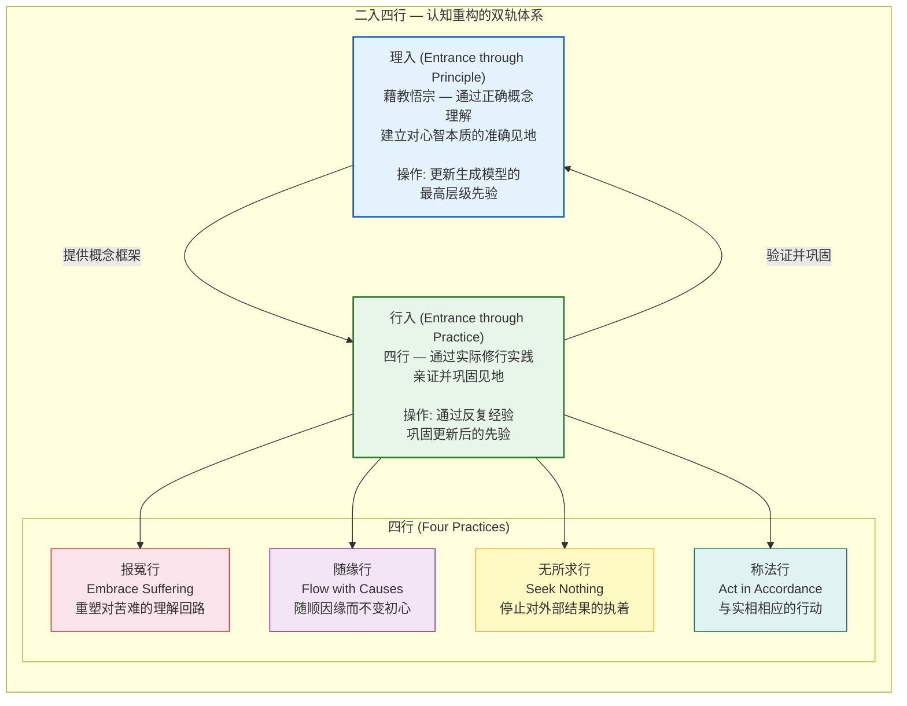

# 理入：见地建立

## Li-ru (理入): Establishing the View — Cognitive Restructuring Through Correct Mental Models

---

## 摘要

"理入"（Li-ru）是达摩"二入四行"体系中的第一个入口——通过正确的概念理解（"藉教悟宗"）来建立对心智本质的准确见地。本文将"理入"操作化为认知重构（cognitive restructuring）的最深层形式：不是改变特定的不良信念（如认知行为疗法CBT），而是改变关于"自我是什么"的最根本信念——即更新生成模型（generative model）中最高层级、最具影响力的先验（prior）。从预测编码（predictive coding）的视角看，"理入"等价于对自我模型（self-model）的精度（precision）进行系统性下调——不是消除自我模型（那是不可能的，也是不适应的），而是使其从"绝对真理"降级为"可修正的假设"。本文进一步将"理入"与CBT、元认知疗法（MCT）和接纳承诺疗法（ACT）进行比较，并提供了具体的操作步骤。

**关键词**：理入，二入四行，认知重构，预测编码，自我模型，CBT，元认知

---

## 1. 达摩"二入四行"的历史语境

### 1.1 文本来源与结构

### 1.1a 文本来源与结构

"二入四行"（Two Entrances and Four Practices）是禅宗初祖菩提达摩（Bodhidharma, c. 5th-6th century CE）的核心教义，记载于《二入四行论》（*Treatise on the Two Entrances and Four Practices*），其最完整的早期版本保存在敦煌写本中（Broughton, 1999）。该文本的结构如下：

- **二入（Two Entrances）**：
  1. **理入**（Entrance through Principle, 理入）：通过正确的概念理解（"藉教悟宗"）来建立对心智本质的准确见地
  2. **行入**（Entrance through Practice, 行入）：通过实际的修行实践来亲证这一见地

- **四行（Four Practices）**：行入的四个具体维度
  1. **报冤行**（Practice of Embracing Suffering）：重塑对苦难的理解回路
  2. **随缘行**（Practice of Flowing with Causes）：随顺因缘而不变初心
  3. **无所求行**（Practice of Seeking Nothing）：停止对外部结果的执着
  4. **称法行**（Practice of Acting in Accordance with Reality）：与实相相应的行动

### 1.2 理入的原始定义

达摩对"理入"的原始定义如下（据敦煌本《二入四行论》）：

> "理入者，谓藉教悟宗。深信含生同一真性，但为客尘妄想所覆，不能显了。若也舍妄归真，凝住壁观，自他凡圣等一，坚住不移，更不随于文教，此即与理冥符。无有分别，寂然无为，名之理入。"

翻译为现代汉语：

> "理入，就是凭借教法而觉悟到根本宗旨。深信一切众生都具有同一真实本性，只是被外在的客尘和妄想所遮蔽，不能显现明了。如果能够舍弃虚妄、回归真实，专注地安住于壁观（wall contemplation）中，自我与他人、凡夫与圣者都平等一如，坚定地安住于此而不动摇，不再追随文字教条的表面含义，这就是与真理暗中契合。没有分别执着，寂然无为，这就叫做理入。"

### 1.3 理入与行入的关系

达摩的体系明确区分但又不割裂"理入"和"行入"。"理入"提供正确的概念框架（见地），"行入"提供实际的训练方法（修行）。这一结构在认知科学层面具有精确的对应：

- **理入 = 更新生成模型的最高层级先验**：在预测编码框架中，最高层级的先验（highest-level priors）编码了系统关于世界和自身的最抽象、最基础的信念（Friston, 2010; Clark, 2015）。这些先验约束了所有下级层级的推理过程。改变最高层级的先验——即改变关于"自我是什么"、"心智如何运作"、"实在的本质是什么"的基本信念——将对整个认知-情感系统产生级联效应（cascade effects）。

- **行入 = 通过反复的经验来巩固更新后的先验**：仅仅在概念层面"知道"自我是一个过程而非实体，不足以改变根深蒂固的习惯性自我指涉加工（self-referential processing）。新的先验需要通过反复的、直接的第一人称经验来巩固——这正是"行入"的功能。在神经层面，这对应于通过反复激活新的神经活动模式来驱动LTP介导的突触巩固（见 `2_models/neuroplasticity_loop.md`）。

---

## 2. 理入的现代转译：认知重构的最深层

### 2.1 "藉教悟宗"的认知操作

"藉教悟宗"——凭借教法而觉悟根本宗旨——可以被精确地操作化为以下认知操作序列：

1. **接收一个关于心智本质的命题**（如"心智内容百分百是万物之相，非万物全部"——见 `1_first_principles/03_map_not_territory.md`）
2. **通过理性分析验证该命题的逻辑一致性**（如通过分析哲学中的"感知之幕"论证、佛教量论中的自相/共相区分、神经科学中的"锁脑"模型——见 `03_map_not_territory.md` 第1-4节）
3. **将该命题从"外部知识"转化为"内部信念"**——即将该命题从"别人说的"转化为"我通过自己的推理和体验确认的"
4. **将该信念提升为生成模型中最高层级的先验**——使其成为约束所有下级推理的"默认假设"

这一过程的最终产物是"见地"（view, 见地）——一个关于心智本质的、被充分内化的、具有行为影响力的概念框架。

### 2.2 "深信含生同一真性"的现代解读

达摩的"深信含生同一真性"（深信一切众生都具有同一真实本性）在历史上常被解读为一种形而上的"佛性"（buddha-nature）理论。然而，从当代认知科学的视角，这一命题可以被重新解读为：

**所有人类心智共享同一基本架构**——即层级化的预测编码架构（hierarchical predictive coding architecture）。在这一架构中，"真实本性"（真性）不是某种神秘的超越实体，而是心智在未被习惯性先验（特别是自我指涉先验）所扭曲时的**默认运作模式**——即"道"（见 `1_first_principles/01_dao_as_process.md`）的自然流动。

"客尘妄想"（外在的客尘和妄想）在预测编码框架中对应于**过高精度的、僵化的高层级先验**——特别是关于"自我"的叙事性先验（"我是一个什么样的人"、"世界应该如何对待我"、"什么对我有利/不利"）。这些先验之所以是"客尘"（外在的尘埃），是因为它们并非心智架构的固有部分，而是通过经验（特别是早期社会化和创伤性经历）后天获得的。它们之所以是"妄想"（delusions），是因为它们被赋予了过高的精度（precision），使得系统将它们视为"绝对真理"而非"可修正的假设"。

### 2.3 理入作为"先验精度下调"

在预测编码框架中，"理入"的核心操作可以被精确地描述为：

$$\Pi_{\text{self-narrative}} \rightarrow \Pi_{\text{self-narrative}} - \Delta\Pi$$

即：对自我叙事相关的高层级先验的精度（$\Pi_{\text{self-narrative}}$）进行系统性下调（减去$\Delta\Pi$）。

这一操作的效果是：
- 自我叙事不再被系统视为"绝对真理"，而是被视为"一个可能的解释"
- 当自我叙事与当下的直接体验发生冲突时，系统更倾向于信任当下的体验（自下而上的预测误差）而非叙事（自上而下的预测）
- 自我模型的更新变得更加灵活和快速——系统不再需要大量的矛盾证据才能改变对自身的看法

这并不意味着自我模型的消除——一个完全没有自我模型的系统将无法在社会环境中正常运作。理入的目标是**精度的恰当校准**（appropriate precision calibration），而非精度的归零。

---

## 3. 认知重构的神经科学

### 3.1 先验如何塑造感知

预测编码框架的核心主张是：感知不是被动接收，而是主动构建——我们"看到"的不是视网膜上的原始信号，而是大脑关于"外面有什么"的最佳猜测（best guess），这一猜测同时受到自下而上的感觉信号和自上而下的先验信念的约束（Clark, 2013; Seth, 2021）。

这一主张得到了大量实验证据的支持：

- **先验影响感知的经典范式**：在"空心面具错觉"（hollow mask illusion）中，正常面孔的内凹面具被感知为外凸的正常面孔——因为"面孔是外凸的"这一强先验压倒了"这是内凹的"的感觉信号（Gregory, 1970）。
- **预期影响感知内容**：当被试预期看到特定刺激时，即使该刺激实际上不存在，其感觉皮层也会表现出与真实刺激相似的活动模式（Summerfield & de Lange, 2014）。
- **信念改变感知学习速率**：关于环境统计结构的先验信念可以显著加速或减慢感知学习的速率（Nassar et al., 2010）。

这些发现共同指向一个关键结论：**"见地"（view）——即系统持有的高层级先验——在字面意义上塑造了系统所体验到的"现实"**。改变见地就是改变体验本身。

### 3.2 自我模型的神经基础

"自我"不是一个单一的实体，而是一个多层面的、分布式的神经过程。认知神经科学区分了自我的多个维度（Damasio, 2010; Gallagher, 2000）：

- **原型自我（Proto-self）**：脑干和皮层下结构中对身体内部状态的连续、非意识表征
- **核心自我（Core Self / Minimal Self）**：在"此时此地"对自身作为经验主体的即时感觉，主要涉及前脑岛（anterior insula）、前扣带皮层（ACC）和躯体感觉皮层
- **自传体自我（Autobiographical Self / Narrative Self）**：跨越时间的、基于记忆和叙事的自我概念，主要涉及默认模式网络（DMN）——特别是内侧前额叶皮层（mPFC）和后扣带回（PCC）

"理入"的主要目标是**下调自传体自我（叙事自我）的精度**，同时保持核心自我（体验自我）的正常功能。在神经层面，这对应于降低DMN（特别是mPFC和PCC）对感知和决策过程的"精度加权"影响，同时保持前脑岛和ACC的内感受和当下觉知功能。

### 3.3 从"信念更新"到"先验重构"

标准的贝叶斯信念更新（Bayesian belief updating）是一个渐进的、累积的过程——系统根据新的证据逐步调整其后验信念。然而，"理入"所涉及的改变不是渐进式的参数更新，而是**先验本身的重构**（prior restructuring）——系统关于"自我是什么"和"心智如何运作"的最基本假设发生了质的改变。

在计算层面，这对应于"模型选择"（model selection）而非"参数估计"（parameter estimation）——系统不是在现有模型框架内调整参数，而是切换到了一个不同的模型框架。这一区分在贝叶斯统计中对应于"贝叶斯模型比较"（Bayesian model comparison）——比较不同模型结构的模型证据（model evidence），选择最优的模型结构（Penny et al., 2004）。

---

## 4. 与认知行为疗法（CBT）的比较

### 4.1 CBT的核心机制

认知行为疗法（Cognitive Behavioral Therapy, CBT）的核心机制是识别和修正"适应不良的自动思维"（maladaptive automatic thoughts）和"中间信念"（intermediate beliefs），从而改变情绪和行为（Beck, 1979）。CBT的认知模型将信念分为三个层级：

1. **自动思维（Automatic Thoughts）**：在特定情境中自动出现的具体想法（如"我肯定搞砸了"）
2. **中间信念（Intermediate Beliefs）**：跨情境的态度、规则和假设（如"我必须完美才能被接受"）
3. **核心信念（Core Beliefs）**：关于自我、他人和世界的最基本、最全局性的信念（如"我不可爱"、"世界是危险的"）

### 4.2 CBT与理入的层级差异

CBT和理入都涉及认知重构，但它们在操作的层级上存在根本差异：

| 维度 | CBT | 理入 |
|------|-----|------|
| **操作层级** | 核心信念（关于"我是一个什么样的人"） | 关于"自我是什么"的元信念（meta-belief） |
| **目标** | 将适应不良的信念替换为适应良好的信念 | 改变与所有信念的关系——从"信念=现实"到"信念=心智构造" |
| **方法** | 苏格拉底式提问、行为实验、证据检验 | 概念分析、直接观察心智的运作、精度下调 |
| **终点** | "我相信我是有价值的" | "我观察到'我相信我是有价值的'和'我相信我不可爱'都只是心智构造——我不需要相信其中任何一个" |
| **类比** | 修改软件的特定功能 | 修改操作系统的基本架构 |

理入不试图将"负面自我信念"替换为"正面自我信念"——因为两者都是自我叙事，都是"地图"而非"疆域"（见 `1_first_principles/03_map_not_territory.md`）。理入的目标是改变与所有自我叙事的关系——从"我的自我叙事定义了我是谁"到"我的自我叙事只是心智生成的众多可能故事之一"。

### 4.3 理入与元认知疗法（MCT）的接近性

值得注意的是，理入与Adrian Wells（2009）提出的元认知疗法（Metacognitive Therapy, MCT）有显著的接近性。MCT的核心主张是：心理困扰的根源不是思维内容本身，而是与思维的关系——特别是"认知注意综合征"（Cognitive Attentional Syndrome, CAS），包括持续的担忧/反刍、威胁监测和适应不良的应对行为。MCT的目标是改变元认知信念（metacognitive beliefs）——即关于思维的思维。

理入与MCT的关键差异在于：
- MCT主要关注关于"思维"的元认知信念（如"担忧有助于我做好准备"）
- 理入关注关于"自我"和"实在"的最根本信念（如"存在一个固定的、独立的自我"）
- MCT的操作层级在理入和CBT之间——它比CBT更深（元认知 vs. 认知内容），但不如理入根本（关于思维的信念 vs. 关于自我本质的信念）

---

## 5. 操作步骤：建立见地的实践框架

### 5.1 第一阶段：概念理解（Conceptual Understanding）

**目标**：在理性层面理解心智的预测编码架构和自我模型的构造性质。

**操作**：
1. 系统学习本项目第一性原理部分的三篇论文：
   - `01_dao_as_process.md`：理解"道"作为意识激活的动态过程
   - `02_one_as_bandwidth.md`：理解"一"作为觉知带宽
   - `03_map_not_territory.md`：理解心智内容=表征≠实在
2. 在每次阅读后，用自己的语言总结核心论点，并识别其与自己日常体验的联系。
3. 对每个核心论点进行"理性压力测试"：寻找反例、可能的反驳和逻辑漏洞。见地不应建立在盲信之上，而应建立在理性的严格检验之上。

**检验标准**：能够用自己的语言、用具体的例子向他人解释"为什么心智内容百分百是表征而非实在"。

### 5.2 第二阶段：体验验证（Experiential Verification）

**目标**：将概念理解从"外部知识"转化为"内部确认"——通过直接观察自己的心智运作来验证概念框架的正确性。

**操作**：
1. 在日常情境中观察"地图-疆域混淆"的实例：
   - 当你对某人产生强烈的负面情绪时，暂停并识别：这个情绪是基于对方实际做了什么（疆域），还是基于你对对方行为的解释（地图）？
   - 当你对未来感到焦虑时，暂停并识别：这个焦虑是基于实际存在的威胁（疆域），还是基于你的心智模拟的可能情景（地图）？
2. 记录这些观察，形成"个人证据库"（personal evidence base）。
3. 在观察中特别注意：当"地图"被识别为地图（而非疆域）时，情绪反应是否发生了变化？

**检验标准**：能够在情绪反应发生的过程中（而非事后）识别出"这是地图，不是疆域"。

### 5.3 第三阶段：先验重构（Prior Restructuring）

**目标**：将"自我是过程而非实体"这一见地从"我知道"转化为"我以此运作"——即从陈述性知识（declarative knowledge）转化为程序性默认（procedural default）。

**操作**：
1. 每日"壁观"练习（达摩的"凝住壁观"）：固定时间（建议20-40分钟），安坐，将注意力放在呼吸或身体感觉上。当自我叙事的念头出现时（"我做得对吗？""这太无聊了""我真是个糟糕的冥想者"），仅标记为"叙事"（narrative），然后回到呼吸。
2. 在日常生活中进行"微型壁观"：在等待、走路、做家务等日常活动中，将注意力从"思考"切换到"感觉"——感受脚底的触感、空气中的温度、身体的存在感。这训练系统在"叙事模式"和"直接体验模式"之间灵活切换。
3. 每周进行一次"见地回顾"：回顾本周的观察记录，识别"地图被误认为疆域"的模式，并注意这些模式是否在逐渐松动。

**检验标准**：当自我叙事的念头出现时，系统自动（无需有意识的努力）将其识别为"一个正在出现的叙事"而非"关于我的事实"。这种自动识别表明新的先验已经开始在生成模型中扎根。

### 5.4 常见障碍与对策

1. **"理智化"陷阱**：将"理入"误解为纯粹的概念游戏——积累更多的概念知识而不进行体验验证。**对策**：每学习一个新的概念，必须找到一个具体的、可观察的日常体验来验证它。

2. **"虚无主义"误解**：将"自我是构造"误解为"什么都不重要"或"一切都是虚幻的"。**对策**：重新阅读 `03_map_not_territory.md` 的瑜伽行派"三性"理论——"地图不是疆域"不等于"地图不存在"或"地图无用"。地图是导航所必需的——问题只在于将地图误认为疆域。

3. **"灵性逃避"（Spiritual Bypassing）**：使用"一切都是心智构造"来回避真实的情感痛苦或人际关系困难。**对策**：见地的建立不是情感的压抑或回避——恰恰相反，它是为了更直接、更充分地体验情感，而不被关于情感的叙事所劫持。

---

## 6. 参考文献

1. Beck, A. T. (1979). *Cognitive Therapy and the Emotional Disorders*. New York: Penguin.
2. Broughton, J. L. (1999). *The Bodhidharma Anthology: The Earliest Records of Zen*. Berkeley: University of California Press.
3. Clark, A. (2013). Whatever next? Predictive brains, situated agents, and the future of cognitive science. *Behavioral and Brain Sciences*, 36(3), 181-204. doi:10.1017/S0140525X12000477
4. Clark, A. (2015). *Surfing Uncertainty: Prediction, Action, and the Embodied Mind*. Oxford: Oxford University Press.
5. Damasio, A. (2010). *Self Comes to Mind: Constructing the Conscious Brain*. New York: Pantheon.
6. Friston, K. (2010). The free-energy principle: a unified brain theory? *Nature Reviews Neuroscience*, 11(2), 127-138. doi:10.1038/nrn2787
7. Gallagher, S. (2000). Philosophical conceptions of the self: implications for cognitive science. *Trends in Cognitive Sciences*, 4(1), 14-21. doi:10.1016/S1364-6613(99)01417-5
8. Gregory, R. L. (1970). *The Intelligent Eye*. London: Weidenfeld & Nicolson.
9. Nassar, M. R., Wilson, R. C., Heasly, B., & Gold, J. I. (2010). An approximately Bayesian delta-rule model explains the dynamics of belief updating in a changing environment. *Journal of Neuroscience*, 30(37), 12366-12378. doi:10.1523/JNEUROSCI.0822-10.2010
10. Penny, W. D., Stephan, K. E., Mechelli, A., & Friston, K. J. (2004). Comparing dynamic causal models. *NeuroImage*, 22(3), 1157-1172. doi:10.1016/j.neuroimage.2004.03.026
11. Seth, A. K. (2021). *Being You: A New Science of Consciousness*. London: Faber & Faber.
12. Summerfield, C., & de Lange, F. P. (2014). Expectation in perceptual decision making: neural and computational mechanisms. *Nature Reviews Neuroscience*, 15(11), 745-756. doi:10.1038/nrn3838
13. Wells, A. (2009). *Metacognitive Therapy for Anxiety and Depression*. New York: Guilford Press.

---

> 本文是 Project Dao.Science 实践方法论（`3_methodology/`）的第一篇，对应达摩"二入四行"体系中的"理入"。本文应与第一性原理部分（`1_first_principles/`）的三篇论文配合阅读，它们共同构成"理入"的概念基础。后续四篇论文（`xing_ru/01-04`）分别对应"四行"的实践操作。
>
> **与 L0-L7 频谱的关系（`0_motivation/L0_L7_spectrum.md`）：** "理入"在 L0-L7 频谱上的操作是：通过 L4（理性协作/契约精神）的精密推理和 L1（物理规律/神经科学数据）的实证支持，建立对 L0（觉知本身）的正确见地，然后以这个见地作为最高层级先验，重新校准 L2（个体实情）和 L3（文化传承）的精度加权。这正是"理入"的深层含义——不是积累更多 L1/L4 的知识（"为学日益"），而是用正确的见地（"众生同一法性"= 所有自组织系统共享同一个自由能最小化原理）来下调自我模型的精度（"为道日损"）。