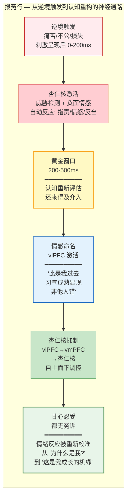

# 报冤行：重塑对苦难的理解回路

## The Practice of Embracing Suffering — Rewiring the Suffering-Interpretation Circuit

---

## 摘要

"报冤行"（Bao-yuan-xing）是达摩"二入四行"体系中"行入"的第一行——当逆境生起时，立即标记："此是我过去习气成熟显现，非他人错。"本文从认知神经科学的视角，将这一古老的修行原则操作化为一个精确的情绪调控技术。我们论证：(1) "报冤行"的核心机制是认知重新评估（cognitive reappraisal）——在情绪反应的"黄金窗口"（刺激呈现后约200-500ms）内，通过前额叶-杏仁核调控回路（vlPFC→dmPFC→vmPFC→amygdala）对情绪刺激进行重新解释；(2) "标记"（labeling）的操作——将逆境归因于"过去习气成熟"——精确地利用了"情感命名"（affect labeling）的神经机制，通过激活腹外侧前额叶（vlPFC）来抑制杏仁核反应；(3) "报冤行"不是受害者归咎（victim-blaming），而是一种认知策略——它通过将"他人的过错"重新框架为"自身习气的显现"，切断了"指责-愤怒-反刍"的恶性循环；(4) 佛教"业"（karma）的概念在神经科学层面可以被精确地转译为"习惯化的神经回路"——过去的行为模式通过长时程增强（LTP）在神经系统中留下结构性的"痕迹"，当前的逆境激活了这些痕迹。本文提供该练习的详细操作步骤、记录模板和评估指标。

**关键词**：报冤行，认知重新评估，情感命名，前额叶-杏仁核调控，业，神经可塑性，二入四行

---

## 1. 达摩原文与历史语境

### 1.1 原文

达摩对"报冤行"的原始定义如下（据敦煌本《二入四行论》，Broughton, 1999）：

> "云何报冤行？谓修道行人，若受苦时，当自念言：我从往昔无数劫中，弃本从末，流浪诸有，多起冤憎，违害无限。今虽无犯，是我宿殃恶业果熟，非天非人所能见与。甘心忍受，都无冤诉。经云：逢苦不忧。何以故？识达故。此心生时，与理相应。体冤进道，故说言报冤行。"

### 1.2 结构分析

这段文本包含一个精确的认知操作序列：

1. **触发条件**："若受苦时"——当痛苦/逆境实际发生时
2. **认知操作**："当自念言：我从往昔无数劫中...今虽无犯，是我宿殃恶业果熟"——执行一个特定的自我陈述：将当前的痛苦重新归因于"过去行为的果报成熟"
3. **归因排除**："非天非人所能见与"——明确排除外部归因（不是天的惩罚，不是他人的过错）
4. **情感目标**："甘心忍受，都无冤诉"——达到甘愿接受而无怨恨的心理状态
5. **理论依据**："识达故"——因为深刻地理解了（因果法则/心智运作的本质）
6. **修行功能**："体冤进道"——将逆境转化为修行的助缘

### 1.3 与"理入"的关系

"报冤行"作为"行入"的第一行，直接依赖于"理入"（见 `li_ru.md`）所建立的见地。具体而言：

- **理入的核心见地**："深信含生同一真性，但为客尘妄想所覆"——一切众生本具同一真实本性，只是被外在的客尘和妄想所遮蔽。
- **报冤行的认知操作**："今虽无犯，是我宿殃恶业果熟"——将当前的逆境重新框架为"自身过去行为的果报"，而非"他人的恶意"。

这两者之间的逻辑连接是：如果"自我"不是一个固定的实体，而是过去行为（业）所塑造的动态过程，那么"我"当前所遭遇的一切，都是"过去的我"（通过其行为）所创造的条件的成熟。因此，"怨恨他人"在逻辑上是不成立的——因为"他人"只是"我自己的业力成熟"所借助的缘（条件），而非独立的、自主的"加害者"。

这一逻辑在认知重构层面具有强大的操作性力量，无论一个人是否接受"业"的形而上学含义。

---

## 2. 现代转译：认知重新评估的精确操作

### 2.1 "报冤行"作为认知重新评估



### 2.1a "报冤行"作为认知重新评估

"报冤行"的核心操作——在逆境中执行一个特定的、预先训练好的自我陈述来改变对逆境的理解——精确地对应于认知神经科学中的"认知重新评估"（cognitive reappraisal）策略。重新评估被定义为"在情绪反应完全展开之前，重新解释刺激的意义，从而改变情绪反应的方向和强度"（Gross, 1998, 2002）。

在Gross的情绪调节过程模型中，重新评估属于"前提导向策略"（antecedent-focused strategy）——它在情绪反应的生成阶段进行干预，而非在反应已经产生后进行抑制。这一定位使得重新评估比表达抑制（expressive suppression）更有效且心理代价更低（Gross, 2002）。

"报冤行"的独特之处在于，它提供了一个**特定的、预先准备好的重新评估框架**——"这是我过去习气成熟的显现"——修行者不需要在每次逆境中临时创造一个新的重新评估，而是使用一个经过反复训练、已被内化的标准框架。这大大降低了重新评估的认知负荷，使其能够在情绪反应的早期阶段（即"黄金窗口"内）被快速调用。

### 2.2 "非天非人"的归因排除操作

"报冤行"的"非天非人所能见与"——明确排除"天的惩罚"和"他人的过错"这两种归因——在认知层面执行了一个关键的"归因阻断"（attributional blocking）操作。

社会心理学中的归因理论（attribution theory; Heider, 1958; Weiner, 1985）表明，当人们将负面事件归因于"他人的故意行为"时，会产生愤怒、怨恨和报复冲动——这些情绪具有强烈的行动驱动力，且倾向于通过反刍（rumination）自我维持。而当人们将同一事件归因于"非个人的、因果性的因素"时，情绪反应倾向于转向悲伤或接受，而非愤怒——这些情绪的行动驱动力较弱，且更容易自然消退。

"报冤行"通过将归因从"他人的过错"（个人化、道德化的归因）转移到"自身过去行为的因果成熟"（非个人化、因果性的归因），精确地利用了归因理论所揭示的情绪调控机制。关键的是，这一归因转移不是否认他人的行为（"他们没有做"），而是重新框架了他人行为的性质——他们不是"自主的加害者"，而是"我自身业力成熟所借助的缘"。

### 2.3 "甘心忍受"与"习得性无助"的本质区别

一个关键的区分必须在此明确："报冤行"的"甘心忍受"（甘愿接受）与心理学中的"习得性无助"（learned helplessness; Seligman, 1972）有本质区别。

| 维度 | 习得性无助 | 报冤行的"甘心忍受" |
|------|-----------|-------------------|
| **认知框架** | "无论我做什么都无法改变结果" | "当前的逆境是过去行为的果报，我现在的行为正在创造未来的果报" |
| **能动性** | 丧失——对未来行为的无效性预期 | 增强——对当前行为（修行）的因果效力有明确信念 |
| **时间取向** | 过去和现在（固着于不可控的当下） | 过去→现在→未来（理解因果链条的连续性） |
| **行为效应** | 被动、退缩、放弃尝试 | 主动接受当前逆境 + 积极修行以改变未来 |
| **神经基础** | 背侧中缝核（dorsal raphe nucleus）5-HT神经元的过度激活；vmPFC-背侧中缝核回路的功能失调（Maier & Seligman, 2016） | 前额叶-杏仁核调控回路的增强；vmPFC对杏仁核的抑制性控制增强 |

"甘心忍受"不是放弃能动性，而是将能动性从"试图改变已经发生的逆境"（这是不可能的）重新导向"改变当前对逆境的反应方式"和"为未来创造更好的条件"（这是可能的，且正是修行的核心）。

---

## 3. 神经科学解释：重新评估回路

### 3.1 重新评估的神经回路

Ochsner等人（2002, doi:10.1162/089892902760807212）的奠基性fMRI研究首次揭示了认知重新评估的神经基础。当被试被要求重新解释负性图片的意义以降低负面情绪时，以下脑区被显著激活：

1. **背外侧前额叶皮层（dlPFC）**：负责工作记忆中的主动意义重构——即"重新解释"的计算过程。
2. **腹外侧前额叶皮层（vlPFC）**：负责从语义记忆中选择适当的重新评估框架，并抑制不适应的习惯性解释。
3. **背内侧前额叶皮层（dmPFC）**：负责监控重新评估的效果，并整合情境信息以调整策略。
4. **腹内侧前额叶皮层（vmPFC）**：作为前额叶调控的最终共同通路，通过投射到杏仁核（直接或通过间质细胞团ITC cells间接）来实现情绪反应的抑制。

同时，这些前额叶区域的激活伴随着**杏仁核（amygdala）**活动的显著降低——表明自上而下的认知调控成功地抑制了情绪反应的核心结构。

Buhle等人（2014, doi:10.1093/cercor/bht154）对48项重新评估神经影像研究进行了定量元分析，确认了这一回路的跨研究一致性，并发现重新评估的成功程度（以自我报告的情绪降低来衡量）与vmPFC的激活程度和杏仁核的抑制程度呈正相关。

### 3.2 重新评估的时间动态

Goldin等人（2008, doi:10.1016/j.biopsych.2007.05.031）比较了重新评估和表达抑制的时间动态。关键发现：

- **重新评估**：在情绪刺激呈现的**早期**（0-4秒）就开始降低杏仁核反应，效果持续到晚期（6-10秒）。这表明重新评估作用于情绪生成过程的早期阶段——在完整的情绪反应链展开之前进行干预。
- **表达抑制**：在早期不降低杏仁核反应（甚至可能增强），仅在晚期产生效果。这表明表达抑制作用于情绪反应的输出阶段，而非生成阶段。

这一发现对"报冤行"的操作化至关重要：**"报冤行"的认知重新评估必须在逆境出现的极早期（即"念起"后的第一时间）被激活，才能最大化其情绪调控效果。** 这正是为什么"报冤行"提供了一个预先训练好的、可以快速调用的标准重新评估框架——它缩短了从"逆境触发"到"重新评估启动"之间的延迟。

### 3.3 "标记"的神经机制：情感命名

"报冤行"中的"当自念言"——对自己说一个特定的语句——利用了"情感命名"（affect labeling）的神经机制。Lieberman等人（2007, doi:10.1111/j.1467-9280.2007.01916.x）发现，当被试被要求用词语描述情绪面孔的情感（"这是恐惧"、"这是愤怒"）时，相对于仅观看面孔，他们的vlPFC活动增加，而杏仁核活动降低。

这一"命名即驯服"（name it to tame it）的效应背后的机制是：将情感体验转化为语言符号的过程需要vlPFC的参与，而vlPFC的激活通过前额叶-杏仁核调控回路对杏仁核产生抑制性影响。语言处理——即使只是一个简短的标签——将神经处理从以杏仁核为中心的情绪反应模式转向了以前额叶为中心的认知加工模式。

"报冤行"的"当自念言：此是我过去习气成熟显现"正是利用了这一机制：通过将逆境体验转化为一个语言命题（"这是习气成熟"），修行者自动地将神经处理从"情绪反应模式"切换到了"认知加工模式"，从而获得了对情绪反应的调控能力。

---

## 4. "业"的神经科学转译

### 4.1 业作为神经习惯

佛教的"业"（karma，字面意思为"行为"）概念在传统教义中指的是：有意图的行为会产生与行为性质相应的果报，果报可能在今生或未来生中成熟。这一概念在历史上承载了大量的形而上学和宇宙论含义。

然而，从当代神经科学的视角，"业"可以被精确地转译为**习惯化的神经回路**（habitualized neural circuits）——过去的行为模式通过活动依赖的可塑性机制（特别是LTP和STDP）在神经系统中留下的结构性"痕迹"。具体而言：

- **"造业"（creating karma）** = 通过反复的行为模式，在神经回路中通过LTP强化特定的突触连接。每一次重复的行为都在"加深"相应的神经通路。
- **"业力成熟"（karmic ripening）** = 已强化的神经回路被环境刺激激活，产生习惯性的认知-情感-行为反应。当前情境中的触发刺激（"缘"，pratyaya）激活了由过去行为所塑造的神经回路。
- **"消业"（dissolving karma）** = 通过系统性地不激活已强化的不适应回路（使其经历LTD介导的削弱），同时通过新的行为模式强化适应性的替代回路（LTP）。

这一转译将"业"从形而上学的"道德因果律"转化为神经科学的"活动依赖的可塑性"——保留了原始概念的核心洞见（过去的行为塑造现在的体验），同时使其完全兼容于当代科学框架。

### 4.2 "过去习气"的神经基础

"报冤行"中的"过去习气"（past habitual tendencies, vasana）在神经科学层面对应于：

1. **自动化的感知-反应模式**：通过STDP强化的、在特定刺激和特定反应之间建立的快速连接。例如，如果过去反复在"被批评"的情境中体验到"被攻击"的感觉并产生"愤怒/防御"反应，那么"被批评"的感知将自动激活"愤怒/防御"的神经回路。

2. **默认模式网络（DMN）中的自我叙事**：DMN中的自传体记忆和叙事结构编码了"我是谁"、"世界如何对待我"、"什么是公平的"等基本假设。当逆境触发与这些叙事不一致的体验时，DMN产生反刍和负面情绪。

3. **杏仁核的过度泛化**：经历过反复的压力或创伤后，杏仁核对威胁刺激的响应阈值降低，且对与原始威胁仅部分相似的刺激也产生反应（过度泛化，overgeneralization）。

"报冤行"的认知操作——"这是我过去习气成熟显现"——通过将这些自动化的反应模式识别为"过去的痕迹"而非"当前现实的准确反映"，在元认知层面创建了一个"观察者视角"，从而削弱了这些自动化模式的"精度"（precision）——即系统对其的"信任度"。

---

## 5. 练习记录模板

### 5.1 日常练习记录

以下模板用于记录"报冤行"的日常实践：

```
============================================================
报冤行 日常练习记录
日期：____________________
============================================================

【逆境事件】
简要描述发生了什么（客观事实，不含解释）：
____________________________________________________________
____________________________________________________________

【初始反应】
身体感觉（如胸闷、心跳加速、面部发热等）：
____________________________________________________________

自动思维（脑海中自动出现的想法）：
____________________________________________________________

情绪标签（愤怒/委屈/恐惧/悲伤/羞耻/其他）：
____________________________________________________________

情绪强度（0-10）：_____

【报冤行操作】
执行自我陈述的时间点（在逆境发生后多久）：_____ 秒/分钟

使用的陈述语句：
"此是我过去习气成熟显现，非他人错。"
或其他变体：________________________________________________

【操作后评估】
操作后的情绪强度（0-10）：_____

情绪强度的变化：_____ → _____ （变化：_____）

是否成功将归因从"他人的过错"转移到"自身习气成熟"？
□ 完全成功  □ 部分成功  □ 未成功

【反思】
这次操作中遇到的困难：
____________________________________________________________

下次可以改进的地方：
____________________________________________________________
```

### 5.2 周度汇总

每周进行一次汇总分析：

```
============================================================
报冤行 周度汇总
周次：____________________
============================================================

本周逆境事件总数：_____
成功执行报冤行的次数：_____
成功率：_____%

平均初始情绪强度：_____
平均操作后情绪强度：_____
平均情绪强度降低：_____

最常见的逆境类型：
□ 人际冲突  □ 工作/学业挫折  □ 健康问题
□ 财务压力  □ 意外事件  □ 其他：__________

最常见的初始自动思维模式：
____________________________________________________________

本周的主要进步：
____________________________________________________________

下周的改进目标：
____________________________________________________________
```

---

## 6. 参考文献

1. Broughton, J. L. (1999). *The Bodhidharma Anthology: The Earliest Records of Zen*. Berkeley: University of California Press.
2. Buhle, J. T., Silvers, J. A., Wager, T. D., Lopez, R., Onyemekwu, C., Kober, H., Weber, J., & Ochsner, K. N. (2014). Cognitive reappraisal of emotion: A meta-analysis of human neuroimaging studies. *Cerebral Cortex*, 24(11), 2981-2990. doi:10.1093/cercor/bht154
3. Goldin, P. R., McRae, K., Ramel, W., & Gross, J. J. (2008). The neural bases of emotion regulation: Reappraisal and suppression of negative emotion. *Biological Psychiatry*, 63(6), 577-586. doi:10.1016/j.biopsych.2007.05.031
4. Gross, J. J. (1998). The emerging field of emotion regulation: An integrative review. *Review of General Psychology*, 2(3), 271-299.
5. Gross, J. J. (2002). Emotion regulation: Affective, cognitive, and social consequences. *Psychophysiology*, 39(3), 281-291. doi:10.1017/S0048577201393198
6. Heider, F. (1958). *The Psychology of Interpersonal Relations*. New York: Wiley.
7. Lieberman, M. D., Eisenberger, N. I., Crockett, M. J., Tom, S. M., Pfeifer, J. H., & Way, B. M. (2007). Putting feelings into words: Affect labeling disrupts amygdala activity in response to affective stimuli. *Psychological Science*, 18(5), 421-428. doi:10.1111/j.1467-9280.2007.01916.x
8. Maier, S. F., & Seligman, M. E. P. (2016). Learned helplessness at fifty: Insights from neuroscience. *Psychological Review*, 123(4), 349-367. doi:10.1037/rev0000033
9. Ochsner, K. N., Bunge, S. A., Gross, J. J., & Gabrieli, J. D. E. (2002). Rethinking feelings: An fMRI study of the cognitive regulation of emotion. *Journal of Cognitive Neuroscience*, 14(8), 1215-1229. doi:10.1162/089892902760807212
10. Seligman, M. E. P. (1972). Learned helplessness. *Annual Review of Medicine*, 23(1), 407-412.
11. Weiner, B. (1985). An attributional theory of achievement motivation and emotion. *Psychological Review*, 92(4), 548-573.

---

> 本文是 Project Dao.Science 实践方法论（`3_methodology/`）"行入四行"系列的第一篇。**与 L0-L7 频谱的关系（`0_motivation/L0_L7_spectrum.md`）：** "报冤行"在 L0-L7 频谱上的操作是：当逆境触发 L2（个体实情——痛苦、恐惧、愤怒）并可能滑向 L5（边界关闭/回避）或 L7（毁灭性冲动）时，通过"甘心忍受"的认知重评，将系统从 L2 的自动化反应中拉回 L4（理性协作——"这是我过去业力（神经习惯）的成熟"），并最终在 L0（觉知本身）中安住——"痛苦在那里，但受苦者不在那里"。这正是 100ms 窗口（`2_models/100ms_model.md`）内"念起即觉"的实践应用：在杏仁核劫持的 100-300ms 窗口内，通过预先建立的 L4 见地（理入），将系统从 L5-L7 的坍缩中拉回 L0-L4 的健康频谱。
>
> 下一篇：`02_flow_with_causes.md`（随缘行）。