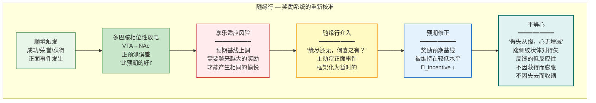

# 随缘行：随顺因缘而不变初心

## The Practice of Flowing with Causes — Aligning with Conditions Without Losing the Core

---

## 摘要

"随缘行"（Sui-yuan-xing）是达摩"二入四行"体系中"行入"的第二行——当顺境生起时，了知："此是过去善业成熟，非我所能占有。缘尽还无，何喜之有？"本文从认知神经科学的视角，将这一古老的修行原则操作化为对奖励系统（reward system）的重新校准。我们论证：(1) "随缘行"的核心机制是维持一个平坦的奖励预测基线（flat reward prediction baseline），防止多巴胺能系统（dopaminergic system）对奖励预期的习惯性上调——即防止"享乐适应"（hedonic treadmill）；(2) "得失从缘，心无增减"在神经层面对应于腹侧纹状体（ventral striatum）和前脑岛（anterior insula）对得失反馈的低反应性——即"平等心"（equanimity）的神经标志；(3) "随缘行"与斯多葛主义（Stoicism）的"控制二分法"（dichotomy of control）在结构上高度相似，但存在一个关键差异——斯多葛主义强调"区分可控与不可控"，而"随缘行"强调"在不可控中看到因果法则的运作"；(4) 长期冥想训练通过降低腹侧纹状体对奖励预测误差（reward prediction error）的反应性来稳定"随缘"的神经基础。

**关键词**：随缘行，奖励预测误差，多巴胺，平等心，斯多葛主义，腹侧纹状体，二入四行

---

## 1. 达摩原文与历史语境

### 1.1 原文

达摩对"随缘行"的原始定义如下（据敦煌本《二入四行论》，Broughton, 1999）：

> "众生无我，并缘业所转。苦乐齐受，皆从缘生。若得胜报荣誉等事，是我过去宿因所感，今方得之。缘尽还无，何喜之有？得失从缘，心无增减。喜风不动，冥顺于道，是故说言随缘行。"

### 1.2 结构分析

这段文本包含一个与"报冤行"对称但方向相反的认知操作序列：

1. **理论基础**："众生无我，并缘业所转。苦乐齐受，皆从缘生"——一切众生没有固定的、独立的自我，而是被业力和因缘条件所推动。苦和乐都是因缘条件聚合的产物，而非"我"的固有属性。
2. **触发条件**："若得胜报荣誉等事"——当获得成功、荣誉或其他正面结果时
3. **认知操作**："是我过去宿因所感，今方得之。缘尽还无，何喜之有？"——将当前的顺境归因于过去行为所创造的因缘条件的成熟，并认识到这些条件是暂时的、必将耗尽的
4. **情感目标**："得失从缘，心无增减。喜风不动，冥顺于道"——内心不因获得而膨胀，不因失去而收缩，在得失的变动中保持内在的稳定

"随缘行"与"报冤行"的对称性揭示了达摩体系的一个核心洞见：**苦和乐是对称的——两者都是因缘条件的产物，两者都需要被"看穿"而非被"执着"或"排斥"。** 修行不是从"痛苦"转向"快乐"，而是从"被苦乐所驱动"转向"在苦乐中保持内在的稳定"。

---

## 2. 现代转译：奖励系统的重新校准

### 2.1 "随缘行"作为奖励预测的重新校准



### 2.1a "随缘行"作为奖励预测的重新校准

"随缘行"的核心操作——在顺境中提醒自己"这是过去因缘的成熟，不是'我'的功劳，且终将过去"——在神经科学层面对应于对大脑奖励系统（reward system）的重新校准。

奖励系统——以中脑边缘多巴胺通路（mesolimbic dopamine pathway）为核心，包括腹侧被盖区（ventral tegmental area, VTA）、伏隔核（nucleus accumbens, NAc）和腹侧纹状体（ventral striatum）——是驱动"想要"（wanting）和"喜欢"（liking）的神经基础。Schultz等人（1997, doi:10.1126/science.275.5306.1593）的经典研究发现，中脑多巴胺神经元编码的不是奖励本身，而是**奖励预测误差**（reward prediction error, RPE）——即实际奖励与预期奖励之间的差异。

多巴胺神经元的活动模式如下：
- **实际奖励 > 预期奖励（正预测误差）**：多巴胺神经元相位性放电增加 → 主观体验为愉悦/兴奋/"比预期的好"
- **实际奖励 = 预期奖励（零预测误差）**：多巴胺神经元维持基线放电 → 主观体验为"如预期"
- **实际奖励 < 预期奖励（负预测误差）**：多巴胺神经元相位性放电暂停 → 主观体验为失望/沮丧/"比预期的差"

关键的是，**多巴胺系统对奖励的响应不是绝对的，而是相对于预期的**。这意味着，持续的正面体验会导致预期上调——即"享乐适应"（hedonic treadmill; Brickman & Campbell, 1971）——使得需要越来越大的奖励才能产生相同的多巴胺响应。

"随缘行"的认知操作——"缘尽还无，何喜之有？"——通过主动地将正面事件框架化为"暂时的、必将耗尽的"，**防止了奖励预期的习惯性上调**。这等价于在多巴胺系统的计算中引入了一个"预期修正项"（expectation correction term），使得系统在体验正面事件时维持一个较低的奖励预期基线，从而：(a) 降低了因预期上调而导致的"享乐适应"；(b) 增强了对小奖励的敏感性（因为预期基线较低，小奖励也能产生正预测误差）。

### 2.2 "得失从缘，心无增减"的神经基础

"得失从缘，心无增减"——在得失的变化中保持内在的稳定——在神经层面对应于**腹侧纹状体和前脑岛对得失反馈的低反应性**。

在标准的"金钱激励延迟任务"（Monetary Incentive Delay task, MID; Knutson et al., 2001）中，获得金钱奖励和失去金钱分别激活腹侧纹状体和前脑岛。这些激活的幅度在个体之间存在显著差异，且与个体的"奖励敏感性"（reward sensitivity）和"惩罚敏感性"（punishment sensitivity）人格特质相关。

长期冥想训练的效果之一是降低腹侧纹状体对奖励反馈和惩罚反馈的反应性（Kirk et al., 2015; Brewer et al., 2013）。这一"情绪平稳化"（emotional flattening）不是情感麻木（anhedonia）——冥想者在日常生活中仍然体验和享受正面事件——而是对得失反馈的"去自动化"（de-automatization）：系统不再自动地对每一个得失信号产生强烈的趋近或回避反应。

在"随缘行"的框架中，"心无增减"正是这一状态的精确描述：心不被"得"（奖励）所膨胀，也不被"失"（惩罚）所收缩。这不是对得失的冷漠无视，而是对得失的"平等心"（equanimity）——能够清晰地感知得失，但不被得失所驱动。

### 2.3 "随缘"与"被动"的本质区别

与"报冤行"需要区分"甘心忍受"和"习得性无助"一样，"随缘行"需要区分"随缘"和"被动"（passivity）：

| 维度 | 被动（Passivity） | 随缘（Flowing with Causes） |
|------|------------------|---------------------------|
| **对因果的理解** | 无——"事情就这样发生了" | 有——"这是因缘条件的成熟" |
| **能动性** | 放弃——"我无能为力" | 重新导向——"我专注于当下的因，而非过去的果" |
| **对结果的态度** | 漠不关心——"结果无所谓" | 平等心——"结果重要，但不定义我" |
| **行为效应** | 不行动（inaction） | 行动但不执着于特定结果（action without attachment） |
| **神经基础** | 可能与腹侧纹状体的低反应性（快感缺乏）相关 | 腹侧纹状体的正常反应性 + 前额叶对纹状体的调控增强 |

"随缘"不是"不努力"，而是"努力但不执着于努力的结果"。这与《庄子》中"庖丁解牛"的描述一致——庖丁并非不行动，而是他的行动如此精确地与牛的解剖结构（因缘条件）相协调，以至于"以无厚入有间，恢恢乎其于游刃必有余地矣"。

---

## 3. 神经科学解释：奖励预测误差与平等心

### 3.1 多巴胺与奖励预测误差

Schultz等人（1997, doi:10.1126/science.275.5306.1593）的经典研究通过记录猴子中脑多巴胺神经元的单细胞活动，发现了奖励预测误差（RPE）的神经编码。这一发现奠定了理解奖励学习的神经基础。

后续研究进一步揭示了RPE信号的功能意义：

- **RPE驱动学习**：正RPE增强导致奖励的行为（通过纹状体中的D1受体介导的LTP），负RPE削弱导致惩罚的行为（通过D2受体介导的LTD）。这使得RPE成为强化学习（reinforcement learning）中TD误差（temporal difference error）的神经实现（Montague et al., 1996）。

- **RPE驱动动机**：多巴胺不仅编码"这个奖励比预期好"，还编码"这个线索预测了奖励"——即激励突显性（incentive salience）。这使得原本中性的线索获得"吸引注意力"和"激发行动"的能力（Berridge & Robinson, 1998）。

- **RPE的适应性校准**：多巴胺系统会根据环境的奖励统计特性动态调整其响应增益（gain adaptation）。在奖励丰富的环境中，RPE的增益降低（需要更大的奖励才能产生相同的多巴胺响应）；在奖励贫乏的环境中，RPE的增益升高（小奖励也能产生显著的多巴胺响应）（Tobler et al., 2005）。

### 3.2 "随缘行"如何调节RPE

"随缘行"的认知操作——"缘尽还无，何喜之有？"——可以被理解为对RPE计算的一种"自上而下的先验调制"（top-down prior modulation）。具体而言：

在标准的RPE计算中：

$$\text{RPE} = R_{\text{actual}} - R_{\text{expected}}$$

"随缘行"的认知操作在RPE计算中引入了一个"无常修正项"（impermanence correction term）：

$$\text{RPE}_{\text{随缘}} = R_{\text{actual}} - R_{\text{expected}} - \kappa \cdot R_{\text{actual}}$$

其中$\kappa \in [0, 1]$是"无常觉知系数"（impermanence awareness coefficient）。当$\kappa$较高时，即使实际奖励很大，修正后的RPE也被抑制——因为系统认识到"这个奖励是暂时的，它终将过去"。

这一修正的效果是双重的：
1. **降低正RPE的幅度**：防止因大奖励而产生的过度多巴胺响应，从而防止"享乐适应"和"奖励预期上调"。
2. **降低负RPE的幅度**：当奖励消失时（"缘尽"），系统不会产生强烈的负RPE（失望），因为它早已预期到这一结果。

### 3.3 长期冥想对奖励系统的效应

Kirk等人（2015, doi:10.1093/scan/nsu100）使用fMRI研究了长期冥想者和非冥想者在金钱奖励任务中的脑活动差异。关键发现：

- 长期冥想者在奖励预期阶段（而非奖励接收阶段）表现出**更低的腹侧纹状体激活**。
- 这一效应在"正念"（mindfulness）特质得分较高的个体中更为显著。
- 腹侧纹状体的低激活与自我报告的"快乐"水平呈正相关——即冥想者虽然对奖励预期的神经反应较低，但主观幸福感较高。

这一发现揭示了一个看似矛盾但实际一致的模式：**通过降低对奖励预期的神经反应性（"心无增减"），冥想者实际上获得了更稳定的主观幸福感**——因为他们不受"享乐适应"的驱动，不会因奖励预期的持续上调而陷入"永远不够"的循环。

Brewer等人（2013, doi:10.1016/j.neuroimage.2013.04.023）进一步发现，有经验的冥想者在"无为"（non-doing）状态下表现出后扣带回（PCC）和腹侧纹状体之间的功能连接降低——表明DMN（自我叙事）和奖励系统（驱动力）之间的耦合被削弱。这一"去耦合"（decoupling）可能是"随缘"的神经基础：当自我叙事不再紧密地绑定于奖励信号时，"得"不再使"我"膨胀，"失"不再使"我"收缩。

---

## 4. 与斯多葛主义的比较

### 4.1 斯多葛的"控制二分法"

斯多葛主义（Stoicism）的核心教义之一是"控制二分法"（dichotomy of control），由Epictetus（c. 55-135 CE）在其《手册》（*Enchiridion*）中经典表述：

> "有些事情在我们的控制之内，有些事情不在。在我们的控制之内的是：意见、冲动、欲望、厌恶——简言之，我们自己的行为。不在我们控制之内的是：身体、财产、名誉、职位——简言之，不是我们自己的行为。"（Epictetus, *Enchiridion*, §1）

斯多葛的实践核心是：将注意力完全集中在"可控的"（自己的判断和行为）上，对"不可控的"（外部事件和他人的行为）保持完全的接受。

### 4.2 "随缘行"与斯多葛主义的异同

"随缘行"与斯多葛主义在结构上高度相似，但存在一个关键的哲学差异：

| 维度 | 斯多葛主义 | 随缘行 |
|------|-----------|--------|
| **核心区分** | 可控 vs. 不可控 | 因 vs. 果（因缘 vs. 果报） |
| **对"不可控"的态度** | 接受——"这是自然的秩序" | 理解——"这是因果法则的运作" |
| **对"可控"的定义** | 自己的判断、选择和行为 | 当下的心念和行为（"因"） |
| **时间取向** | 集中于当下和未来（"我能做什么？"） | 过去→现在→未来（"过去的因→现在的果→现在的因→未来的果"） |
| **哲学基础** | 逻各斯（Logos，宇宙理性） | 缘起（Pratityasamutpada，条件性共生） |
| **实践目标** | 内心的宁静（ataraxia） | 与道冥合（"冥顺于道"） |

关键差异在于：斯多葛主义将"不可控"归因于"宇宙理性"（Logos）的安排——这是一个形而上学的、目的论的框架。而"随缘行"将"不可控"归因于"因缘条件的成熟"——这是一个因果性的、非目的论的框架。

在实践层面，这一差异导致了对"不可控事件"的不同态度：斯多葛主义者说"这是自然的秩序，我接受"；"随缘行"的修行者说"这是我过去行为（因）的果报成熟，我现在正在创造未来的因"。后者在"接受"的同时保留了对"因果效力"的觉知——我不是被动的接受者，而是因果链条中的主动参与者。

---

## 5. 练习记录模板

### 5.1 日常练习记录

```
============================================================
随缘行 日常练习记录
日期：____________________
============================================================

【顺境事件】
简要描述发生了什么正面事件（客观事实）：
____________________________________________________________
____________________________________________________________

【初始反应】
身体感觉（如兴奋、能量上升、微笑等）：
____________________________________________________________

自动思维（脑海中自动出现的想法）：
____________________________________________________________

情绪标签（喜悦/自豪/满足/期待/其他）：
____________________________________________________________

情绪强度（0-10）：_____

【随缘行操作】
执行自我陈述的时间点（在顺境发生后多久）：_____ 秒/分钟

使用的陈述语句：
"此是过去善业成熟，缘尽还无，何喜之有？"
或其他变体：________________________________________________

【操作后评估】
操作后的情绪强度（0-10）：_____

是否在享受正面体验的同时保持内在的稳定？
□ 是——既享受又不执着  □ 部分——享受但有些执着  □ 否——完全被喜悦带走

是否出现了"害怕失去"的焦虑？
□ 是  □ 否

【反思】
____________________________________________________________
```

### 5.2 周度汇总

与"报冤行"的周度汇总格式相同，增加以下"随缘行"特有指标：

- 本周"享乐适应"的觉察次数（即注意到自己对某事物的快乐感在重复后降低）
- 本周"得失从缘"的成功率（在得失事件中保持内在稳定的比例）

---

## 6. 参考文献

1. Berridge, K. C., & Robinson, T. E. (1998). What is the role of dopamine in reward: hedonic impact, reward learning, or incentive salience? *Brain Research Reviews*, 28(3), 309-369. doi:10.1016/S0165-0173(98)00019-8
2. Brewer, J. A., Garrison, K. A., & Whitfield-Gabrieli, S. (2013). What about the "self" is processed in the posterior cingulate cortex? *Frontiers in Human Neuroscience*, 7, 647. doi:10.3389/fnhum.2013.00647
3. Brickman, P., & Campbell, D. T. (1971). Hedonic relativism and planning the good society. In M. H. Appley (Ed.), *Adaptation Level Theory: A Symposium* (pp. 287-302). New York: Academic Press.
4. Broughton, J. L. (1999). *The Bodhidharma Anthology: The Earliest Records of Zen*. Berkeley: University of California Press.
5. Epictetus (c. 125 CE / 1983). *The Handbook (The Encheiridion)*. (N. P. White, Trans.). Indianapolis: Hackett.
6. Kirk, U., Brown, K. W., & Downar, J. (2015). Adaptive neural reward processing during anticipation and receipt of monetary rewards in mindfulness meditators. *Social Cognitive and Affective Neuroscience*, 10(5), 752-759. doi:10.1093/scan/nsu100
7. Knutson, B., Adams, C. M., Fong, G. W., & Hommer, D. (2001). Anticipation of increasing monetary reward selectively recruits nucleus accumbens. *Journal of Neuroscience*, 21(16), RC159.
8. Montague, P. R., Dayan, P., & Sejnowski, T. J. (1996). A framework for mesencephalic dopamine systems based on predictive Hebbian learning. *Journal of Neuroscience*, 16(5), 1936-1947.
9. Schultz, W., Dayan, P., & Montague, P. R. (1997). A neural substrate of prediction and reward. *Science*, 275(5306), 1593-1599. doi:10.1126/science.275.5306.1593
10. Tobler, P. N., Fiorillo, C. D., & Schultz, W. (2005). Adaptive coding of reward value by dopamine neurons. *Science*, 307(5715), 1642-1645. doi:10.1126/science.1105370

---

> 本文是 Project Dao.Science 实践方法论（`3_methodology/`）"行入四行"系列的第二篇。**与 L0-L7 频谱的关系（`0_motivation/L0_L7_spectrum.md`）：** "随缘行"在 L0-L7 频谱上的操作是：当顺境触发 L2（个体实情——"想要"系统的激励突显性归因）并可能滑向 L6（概念空转——"我值得拥有更多"的自我叙事膨胀）时，通过"无常修正项"（$\delta_{\text{impermanence}}$）下调 RPE 的精度，使系统从 L2 的"想要"驱动中回到 L4（理性协作——"顺境也是缘起的，不值得执着"），并最终在 L0（觉知本身）中安住。这与"信息常量"（`0_motivation/L0_L7_spectrum.md` 第4节）的论述一致：链式因果（"我的成功是因为我优秀"）是心智的高压缩比"相"——"随缘行"通过识别这一压缩的失真性，恢复对物理世界"复杂变量"的敬畏。
>
> 上一篇：`01_embrace_suffering.md`（报冤行）。下一篇：`03_seek_nothing.md`（无所求行）。