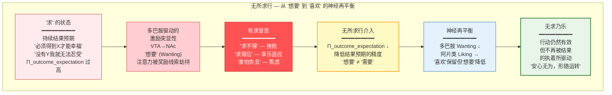

# 无所求行：停止对外部结果的执着

## The Practice of Seeking Nothing — Ceasing Attachment to External Outcomes

---

## 摘要

"无所求行"（Wu-suo-qiu-xing）是达摩"二入四行"体系中"行入"的第三行——"有求皆苦，无求乃乐"。本文从认知神经科学的视角，将这一古老的修行原则操作化为对"想要"（wanting）系统的精确下调。我们论证：(1) "无所求行"的核心机制是降低多巴胺能系统的激励突显性（incentive salience）归因——即削弱"想要"（wanting）而不削弱"喜欢"（liking），这一区分由Berridge和Robinson（1998, 2003）在神经科学层面精确建立；(2) "无所求"与正念认知疗法（MBCT）中的"去中心化"（decentering）机制高度一致——两者都通过将思维视为"心智事件"而非"现实的反映"来削弱其驱动力；(3) "无所求"是"无为"（wu-wei）的态度的前提——对特定结果的执着（"求"）使得行动变得"有为"（forced/effortful），放下执着后行动自然变得"无为"（effortless）；(4) 长期冥想训练通过降低伏隔核（nucleus accumbens）对奖励线索的反应性来稳定"无所求"的神经基础。

**关键词**：无所求行，想要vs喜欢，激励突显性，去中心化，无为，多巴胺，二入四行

---

## 1. 达摩原文与历史语境

### 1.1 原文

达摩对"无所求行"的原始定义如下（据敦煌本《二入四行论》，Broughton, 1999）：

> "世人长迷，处处贪着，名之为求。智者悟真，理将俗反。安心无为，形随运转。万有斯空，无所愿乐。功德黑暗，常相随逐。三界久居，犹如火宅。有身皆苦，谁得而安？了达此处，故舍诸有，息想无求。经云：有求皆苦，无求乃乐。判知无求真为道行，故言无所求行。"

### 1.2 结构分析

这段文本包含达摩体系中最激进的一个主张——"有求皆苦，无求乃乐"——并提供了其理论基础：

1. **问题诊断**："世人长迷，处处贪着，名之为求"——凡夫长期处于迷惑中，到处贪恋执着，这被称为"求"（seeking/craving）。
2. **解决方案**："智者悟真，理将俗反"——智者觉悟到真实本性后，其运作方式与世俗相反。
3. **实践方法**："安心无为，形随运转"——安住于无为的心，身体随顺因缘而运作。
4. **理论基础**："万有斯空，无所愿乐"——一切存在都是空的（无固定自性的），没有值得执着追求的对象。
5. **核心命题**："有求皆苦，无求乃乐"——只要有"求"（执着于特定结果），就有苦；当"求"止息时，乐自然显现。

"无所求行"在"四行"中处于承上启下的位置。它承接"报冤行"（对逆境的重新评估）和"随缘行"（对顺境的重新评估），将两者的逻辑推向极致：**不仅逆境和顺境是"缘起"的，连"我"对任何特定结果的"需要"本身也是"缘起"的——它是一个可以被观察、被质疑、最终被放下的心智构造。**

---

## 2. 现代转译：从"结果预期"到"当下过程"

### 2.1 "无所求行"作为注意力的重新导向



### 2.1a "无所求行"作为注意力的重新导向

"无所求行"的核心操作可以被精确地描述为：**将注意力从"结果预期"（outcome expectation）拉回"当下过程"（present-moment process）。**

在认知心理学中，"结果预期"指的是对某个行为将产生何种结果的信念和期待。结果预期是驱动目标导向行为（goal-directed behavior）的核心心理机制——我们之所以行动，是因为我们预期行动将产生我们想要的结果。然而，当结果预期变得过度活跃时——即当心智持续地、自动地模拟未来的结果并评估其"好/坏"——它就从"有用的规划工具"变成了"持续的心理负担"。

"无所求行"不是要消除目标导向行为（那将使人类无法完成任何复杂任务），而是要**切断对特定结果的"执着"（attachment）**——即降低心智对"结果必须是这样，不能是那样"的精度（precision）加权。在预测编码框架中，这对应于降低"结果预期"这一高层级先验的精度：

$$\Pi_{\text{outcome-expectation}} \rightarrow \Pi_{\text{outcome-expectation}} - \Delta\Pi$$

当结果预期的精度被降低后，系统仍然可以规划和行动，但不再被"结果必须符合预期"的执着所驱动。行动变得"无为"——它仍然有效，但不再伴随着"必须成功"的紧张和"害怕失败"的焦虑。

### 2.2 "想要"（Wanting）vs. "喜欢"（Liking）的神经科学区分

"无所求行"的"求"在神经科学层面有一个精确的对应：**激励突显性（incentive salience）——即"想要"（wanting）系统。**

Berridge和Robinson（1998, doi:10.1016/S0165-0173(98)00019-8）在他们开创性的综述中，基于大量的动物和人类实验证据，提出了"想要"（wanting）和"喜欢"（liking）是两个在神经化学和解剖上可分离的系统的理论：

- **"喜欢"（Liking）**：对奖励的享乐性体验（hedonic impact）——即"这个感觉很好"。核心神经基础：伏隔核（NAc）和腹侧苍白球（ventral pallidum）中的阿片类物质（opioid）和内源性大麻素（endocannabinoid）信号。这些系统产生"愉悦"的主观体验。

- **"想要"（Wanting）**：对奖励的动机性驱动（incentive salience）——即"我想要这个"。核心神经基础：中脑边缘多巴胺系统（mesolimbic dopamine system），特别是从VTA到NAc的多巴胺投射。多巴胺不产生"愉悦"本身，而是使奖励相关的线索变得"突显"（salient）——即吸引注意力、激发行动、产生"渴望"的感觉。

这一区分的核心意义在于：**"想要"和"喜欢"可以被独立地调节。** 在成瘾（addiction）中，"想要"被多巴胺系统的敏化（sensitization）极度放大，而"喜欢"（对药物的实际愉悦体验）可能同时降低——即成瘾者"疯狂地想要"某种他们实际上不再"喜欢"的东西。相反，在冥想的"无所求"状态中，"想要"被下调，而"喜欢"——对当下体验的直接愉悦感受——可能被保留甚至增强。

### 2.3 "无所求行"的预测编码形式化

在预测编码框架中，"无所求行"可以被精确地形式化为激励突显性先验的精度下调。定义系统的价值函数为：

$$V(s) = \underbrace{w_{\text{want}} \cdot \text{IS}(s)}_{\text{激励突显性（Wanting）}} + \underbrace{w_{\text{like}} \cdot \text{H}(s)}_{\text{享乐价值（Liking）}}$$

其中 $\text{IS}(s)$ 是状态 $s$ 的激励突显性（由多巴胺能 VTA→NAc 投射编码），$\text{H}(s)$ 是状态 $s$ 的享乐价值（由阿片类/内源性大麻素信号编码），$w_{\text{want}}$ 和 $w_{\text{like}}$ 是各自的精度权重。

在正常状态下，$w_{\text{want}} \approx w_{\text{like}}$——系统既"想要"也"喜欢"奖励。在成瘾状态中，$w_{\text{want}} \gg w_{\text{like}}$——"想要"被多巴胺敏化极度放大，"喜欢"相对不变或降低。在"无所求"状态中：

$$w_{\text{want}} \rightarrow w_{\text{want}} - \Delta w, \quad w_{\text{like}} \text{ 保持不变}$$

即"想要"的精度被系统性下调，而"喜欢"的精度保持不变。这意味着系统仍然能够体验愉悦（"喜欢"在线），但不再被奖励线索所劫持（"想要"被下调）。

这一形式化与 Schultz 等人（1997）的多巴胺奖励预测误差（RPE）模型一致：

$$\delta(t) = r(t) + \gamma V(s_{t+1}) - V(s_t)$$

其中 $\delta(t)$ 是时刻 $t$ 的奖励预测误差，$r(t)$ 是实际奖励，$V(s)$ 是状态价值。在"无所求"状态中，$V(s)$ 的基线被降低——系统对"未来奖励"的预期价值估计更为保守——因此相同的实际奖励 $r(t)$ 产生更大的正预测误差 $\delta(t)$。这意味着"无所求"不是"不快乐"——恰恰相反，它使系统对小的、当下的奖励更加敏感和感激。

**实践意涵**："无所求行"不是消除愉悦（那将是 L5 的冷漠/关系断裂），而是**将愉悦的来源从"未来结果的预期"重新锚定到"当下过程的体验"**。当 $w_{\text{want}}$ 被下调后，系统不再被"如果我得不到 X 就无法幸福"的预测所驱动，而是能够在当下时刻的简单体验中——呼吸、身体感觉、与他人的连接——找到满足。

**"无所求行"的操作目标正是下调"想要"（wanting）系统，同时保留甚至增强"喜欢"（liking）系统。** 这不是禁欲主义（asceticism）——不是否定愉悦或压抑欲望——而是解除"想要"对行为的自动化控制，使得行动由当下的直接体验（而非对未来的执着预期）所引导。

### 2.3 "无所求"与"无为"的连接

"无所求"是"无为"（wu-wei）的态度的前提。"无为"在本项目的理论框架中被定义为"低预期自由能状态下的行动"（见 `1_first_principles/01_dao_as_process.md` 第4.4节）——行动自然地沿着预期自由能的梯度方向展开，而非被"必须达到特定结果"的执着所驱动。

"求"（执着于特定结果）在主动推理框架中可以被理解为：**对先验偏好分布 $P(o|C)$ 赋予了过高的精度**，使得系统在策略选择中过度加权"达到该特定结果"的目标，而忽视了其他维度（如过程的质量、副作用、长期可持续性等）。"无所求"等价于降低先验偏好的精度，使得策略选择更加均衡地考虑多个维度。

当"求"被放下后，行动从"有为"（forced/effortful——被对特定结果的执着所驱动）转变为"无为"（effortless——自然地沿着最优梯度流动）。这正是达摩所说的"安心无为，形随运转"——心在无为中安定，身体随顺因缘而运作。

---

## 3. 神经科学解释：去中心化与想要系统的下调

### 3.1 MBCT的"去中心化"机制

正念认知疗法（Mindfulness-Based Cognitive Therapy, MBCT）中的"去中心化"（decentering）——或称"元认知觉知"（metacognitive awareness）——指的是"将思维视为心智事件而非现实的直接反映"的能力（Teasdale et al., 2002）。

Teasdale等人（2002, doi:10.1037/0022-006X.70.2.275）发现，MBCT预防抑郁症复发的核心机制不是改变思维内容（如CBT），而是改变与思维的关系——即"去中心化"。在MBCT训练后，康复期抑郁症患者能够将负面自动思维视为"正在经过的心智事件"而非"关于自我的事实"，从而切断了"负面思维→反刍→抑郁复发"的恶性循环。

"去中心化"与"无所求行"的核心操作高度一致：

| 维度 | MBCT的去中心化 | 无所求行 |
|------|---------------|---------|
| **操作对象** | 负面自动思维 | 对特定结果的"想要"/执着 |
| **操作方式** | 将思维视为"心智事件" | 将"求"视为"心智构造" |
| **效果** | 思维不再自动触发反刍 | "想要"不再自动触发执着驱动的行为 |
| **神经基础** | 前额叶对DMN的调控增强 | 前额叶对腹侧纹状体的调控增强 |

两者共享同一个底层机制：**通过元认知觉知（metacognitive awareness）在"心智内容"和"对心智内容的自动化反应"之间创建一个间隙（gap），在这个间隙中，系统获得了选择不同反应方式的自由。**

### 3.2 长期冥想对"想要"系统的效应

如前文（`02_flow_with_causes.md` 第3.3节）所述，Kirk等人（2015）发现长期冥想者在奖励预期阶段表现出更低的腹侧纹状体激活。这一发现在"无所求行"的语境中具有更深层的意义：它不仅表明冥想者降低了"想要"（对奖励的预期性驱动），而且表明这一降低与**更高的主观幸福感**相关。

这一发现与Berridge和Robinson的"想要 vs. 喜欢"框架完全一致：冥想训练下调了多巴胺驱动的"想要"（激励突显性），同时保留甚至增强了阿片类物质和内源性大麻素驱动的"喜欢"（享乐体验）。这解释了为什么冥想者报告"更快乐"但同时"更不执着于快乐"——他们充分体验当下的愉悦，但不被"想要更多"的驱动力所劫持。

### 3.3 "有求皆苦"的神经基础

"有求皆苦"——只要有"求"（执着于特定结果），就有苦——在神经科学层面有一个精确的机制性解释：

1. **"求"激活多巴胺能"想要"系统**：当心智执着于某个特定结果时，与该结果相关的线索被赋予了高激励突显性（incentive salience），持续激活多巴胺系统。

2. **"想要"系统的不满足性**：多巴胺系统的一个核心特性是它不编码"满足"——它编码的是"比预期更好"（正预测误差）。这意味着"想要"系统在本质上是永不满足的：一旦获得了想要的东西，预期立即上调，需要"更多"或"更好"才能产生相同的多巴胺响应。这就是"享乐适应"（hedonic treadmill）的神经基础。

3. **"求"导致"苦"的机制**：当"想要"系统被激活但目标未达成时，产生负预测误差（失望、沮丧）。当目标达成时，产生短暂的满足，但预期立即上调，系统迅速进入"想要下一个"的状态。因此，"求"——无论其目标是否达成——在结构上无法产生持久的满足。这就是"有求皆苦"的神经科学含义。

4. **"无求乃乐"的机制**：当"想要"系统被下调后，系统不再被"必须达到X"的驱动力所推动。它仍然可以行动、实现目标、享受成果——但这些活动不再被"执着"所污染。愉悦来自于当下的直接体验（"喜欢"），而非对未来的执着预期（"想要"）。这就是"无求乃乐"的神经科学含义。

---

## 4. 练习记录模板

### 4.1 日常练习记录

```
============================================================
无所求行 日常练习记录
日期：____________________
============================================================

【"求"的觉察】
今天在什么情境中觉察到了"求"（执着于特定结果）？
____________________________________________________________
____________________________________________________________

"求"的具体内容（我执着地想要什么结果）：
____________________________________________________________

身体感觉（如紧张、收缩、向前冲的感觉等）：
____________________________________________________________

"求"的强度（0-10）：_____

【无所求行操作】
执行自我陈述的时间点：_____

使用的陈述语句：
"有求皆苦，无求乃乐。"
或其他变体：________________________________________________

【操作后评估】
操作后"求"的强度（0-10）：_____

是否成功将注意力从"结果预期"拉回"当下过程"？
□ 完全成功  □ 部分成功  □ 未成功

在放下"求"之后，行动是否变得更加轻松/自然？
□ 是  □ 部分  □ 否

【反思】
____________________________________________________________
```

### 4.2 周度汇总

与前三行的周度汇总格式相同，增加以下"无所求行"特有指标：

- 本周觉察到的"求"的总次数
- 最常见的"求"的类型（对认可/成就/控制/安全/愉悦/其他的执着）
- "放下求"的成功率
- 在"放下求"后，行动质量的变化（更轻松/更有效/更愉悦/无变化/更困难）

---

## 5. 参考文献

1. Berridge, K. C., & Robinson, T. E. (1998). What is the role of dopamine in reward: hedonic impact, reward learning, or incentive salience? *Brain Research Reviews*, 28(3), 309-369. doi:10.1016/S0165-0173(98)00019-8
2. Berridge, K. C., & Robinson, T. E. (2003). Parsing reward. *Trends in Neurosciences*, 26(9), 507-513. doi:10.1016/S0166-2236(03)00233-9
3. Broughton, J. L. (1999). *The Bodhidharma Anthology: The Earliest Records of Zen*. Berkeley: University of California Press.
4. Kirk, U., Brown, K. W., & Downar, J. (2015). Adaptive neural reward processing during anticipation and receipt of monetary rewards in mindfulness meditators. *Social Cognitive and Affective Neuroscience*, 10(5), 752-759. doi:10.1093/scan/nsu100
5. Segal, Z. V., Williams, J. M. G., & Teasdale, J. D. (2002). *Mindfulness-Based Cognitive Therapy for Depression: A New Approach to Preventing Relapse*. New York: Guilford Press.
6. Teasdale, J. D., Moore, R. G., Hayhurst, H., Pope, M., Williams, S., & Segal, Z. V. (2002). Metacognitive awareness and prevention of relapse in depression: Empirical evidence. *Journal of Consulting and Clinical Psychology*, 70(2), 275-287. doi:10.1037/0022-006X.70.2.275

---

> 本文是 Project Dao.Science 实践方法论（`3_methodology/`）"行入四行"系列的第三篇。**与 L0-L7 频谱的关系（`0_motivation/L0_L7_spectrum.md`）：** "无所求行"在 L0-L7 频谱上的操作是：下调 L2（个体实情中"想要"系统的激励突显性——"我非要这个结果不可"），通过"去中心化"（将"求"视为 L2 的心智构造而非 L1 的客观必然），使系统从 L2→L6（"如果得不到我就完了"的概念空转）的滑坡中回到 L4（理性协作——行动仍然发生，但不再被"结果必须是这样"的执着所污染），并最终在 L0（觉知本身）中安住——"喜欢"（liking）被保留甚至增强，而"想要"（wanting）被下调。这与"主动停车"（`4_applications/ai_governance.md` 和 `0_motivation/L0_L7_spectrum.md` 第5.3节）共享同一个深层结构：系统内生地"知道何时该停"——不是外部围栏的强制，而是从 L0 自然涌现的"知止"。
>
> 上一篇：`02_flow_with_causes.md`（随缘行）。下一篇：`04_act_in_accordance.md`（称法行）。