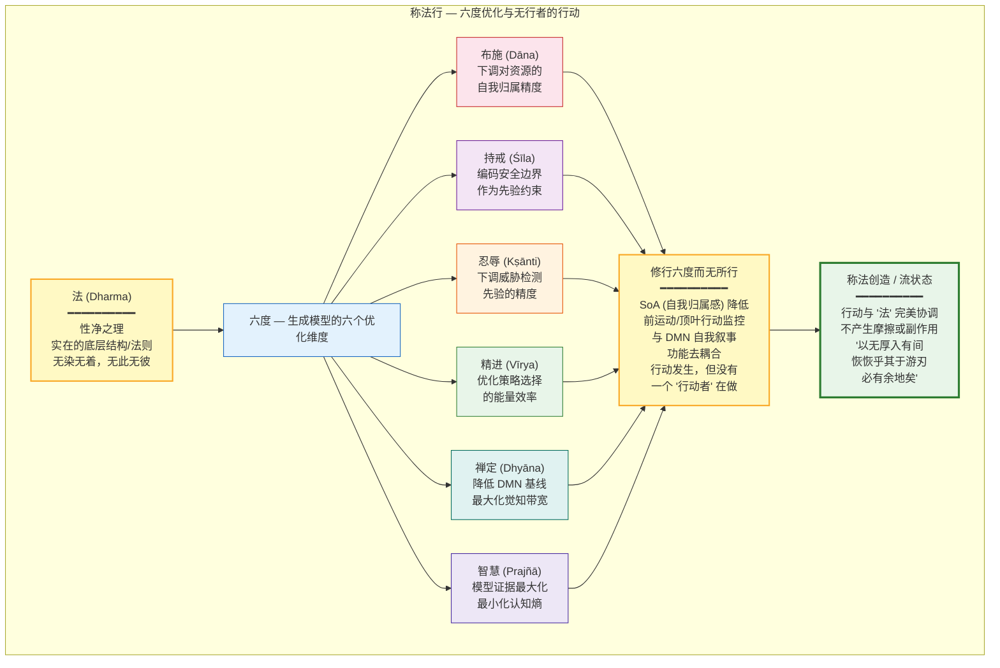

# 称法行：与实相相应的行动

## The Practice of Acting in Accordance with Reality — Action Aligned with the Nature of Things

---

## 摘要

"称法行"（Cheng-fa-xing）是达摩"二入四行"体系中"行入"的第四行——"性净之理，目之为法。此理众相斯空，无染无着，无此无彼。智者若能信解此理，应当称法而行。"本文从认知神经科学的视角，将这一古老的修行原则操作化为"行动与实在的底层结构相协调"。我们论证：(1) "称法行"的核心机制是降低行动的"自我归属感"（sense of agency, SoA）——行动仍然发生，但不再被体验为"我"这个独立实体在"做"——这与主动推理框架中"降低自我模型精度"的操作一致；(2) "修行六度而无所行"（实践六种完美行为而不感觉有一个"行为者"在行为）在神经层面对应于前运动皮层（premotor cortex）和后顶叶皮层（posterior parietal cortex）中行动监控信号与默认模式网络（DMN）自我叙事之间的功能去耦合；(3) "称法行"提供了一个工程类比——最优的系统设计遵循底层约束（constraints）而非对抗之——这与道家"顺势而为"和现代工程"设计模式"（design patterns）共享同一个结构洞见；(4) "六度"（布施/持戒/忍辱/精进/禅定/智慧）可以被重新解读为优化生成模型与外部世界交互的六个维度。

**关键词**：称法行，自我归属感，行动监控，六度，无为，工程类比，二入四行

---

## 1. 达摩原文与历史语境

### 1.1 原文

达摩对"称法行"的原始定义如下（据敦煌本《二入四行论》，Broughton, 1999）：

> "性净之理，目之为法。此理众相斯空，无染无着，无此无彼。经云：法无众生，离众生垢故。法无有我，离我垢故。智者若能信解此理，应当称法而行。法体无悭，于身命财行檀舍施，心无吝惜。达解三空，不倚不着，但为去垢。称化众生而不取相。此为自行，复能利他，亦能庄严菩提之道。檀施既尔，余五亦然。为除妄想，修行六度而无所行，是为称法行。"

### 1.2 结构分析

"称法行"是"四行"的收尾之作，也是整个"二入四行"体系的顶点。它在结构上与前三个"行"不同——前三个"行"各自针对特定的情境（逆境、顺境、执着），而"称法行"提供了一个**总括性的行动原则**：在所有情境中，行动应与"法"（dharma，实在的底层结构/法则）相协调。

文本结构：

1. **"法"的定义**："性净之理，目之为法"——本性清净的真理，称之为"法"。这不是外在的律法，而是实在本身的运作方式。
2. **"法"的特征**："此理众相斯空，无染无着，无此无彼"——这个真理超越一切相（表象），不被任何事物污染或执着，没有"此"与"彼"的二元对立。
3. **"法"与"我"的关系**："法无众生，离众生垢故。法无有我，离我垢故"——在"法"的层面，没有独立的"众生"实体，也没有独立的"自我"实体。
4. **实践原则**："应当称法而行"——应当与"法"相协调地行动。
5. **六度作为"称法"的具体展开**：以布施（檀施）为例，说明如何在具体行为中体现"称法"——"法体无悭，于身命财行檀舍施，心无吝惜"（"法"的本质没有吝啬，因此在身体、生命和财产方面进行布施，心中没有吝惜）。
6. **核心悖论**："修行六度而无所行"——实践六种完美行为，同时不感觉有一个"行为者"在"做"这些行为。这是"称法行"的精髓：行动与"法"如此完美地协调，以至于"行动者"的感觉（sense of agency）消融在行动本身之中。

---

## 2. 现代转译：降低自我归属感的行动

### 2.1 "称法行"作为"无行者的行动"



### 2.1a "称法行"作为"无行者的行动"

"称法行"的核心操作可以被精确地描述为：**行动仍然发生，但行动的"自我归属感"（sense of agency, SoA）被降低或消融。**

自我归属感（SoA）指的是"我"是自身行动的作者（author）的感觉——即"我在做这个"的体验。SoA是自我意识的一个基本维度，在正常状态下，所有的意志行动（voluntary actions）都伴随着SoA。SoA的神经基础涉及前运动皮层（premotor cortex）、辅助运动区（supplementary motor area, SMA）、后顶叶皮层（posterior parietal cortex）和脑岛（insula）之间的功能整合（Haggard, 2017, doi:10.1038/nrn.2017.14）。

在SoA的标准计算模型——"比较器模型"（comparator model）中，运动系统生成一个"运动指令"（motor command），同时生成该指令的"预测感觉后果"（predicted sensory consequences，即"efference copy"）。当实际的感觉反馈与预测的感觉后果匹配时，系统将行动标记为"自我生成的"（self-generated）——这就是SoA的计算基础（Frith et al., 2000）。

"称法行"的"修行六度而无所行"——实践完美行为而不感觉有一个"行为者"——在计算层面对应于：**行动的运动指令和预测-比较循环仍然正常运作（行动被有效地执行），但DMN的自我叙事系统不再将这些行动"绑定"到自传体自我（autobiographical self）的叙事中。** 换言之，行动被体验为"正在发生"而非"我正在做"。

### 2.2 "称法"的工程类比

"称法而行"——与"法"（实在的底层结构）相协调地行动——在工程领域有一个精确的类比：**最优的系统设计遵循底层约束（constraints）而非对抗之。**

在软件工程中，"设计模式"（design patterns; Gamma et al., 1994）的核心洞见是：某些问题反复出现，而某些解决方案在给定的约束下反复有效。优秀的工程师不试图"发明"违反底层约束的解决方案，而是识别当前问题的深层结构（"法"），并选择与该结构最协调的设计模式（"称法"）。

在道家哲学中，这一原则被表述为"无为而治"——不是不行动，而是行动与系统的自然动态（"道"）如此完美地协调，以至于行动不产生"摩擦"（friction）或"副作用"（side effects）。《庄子·养生主》中庖丁解牛的寓言精确地描述了这一状态："以无厚入有间，恢恢乎其于游刃必有余地矣"——刀刃（行动）如此之薄，牛的关节间隙（实在的结构）如此之宽，以至于行动在结构中自由流动，不受阻碍。

在主动推理框架中，"称法"等价于：**系统的生成模型（generative model）如此精确地捕捉了环境的因果结构，以至于系统选择的策略（policies）自然地沿着预期自由能（Expected Free Energy）的最低梯度方向流动，不产生"意外"（surprise）或"冲突"（conflict）。**

### 2.3 "六度"作为生成模型的六个优化维度

大乘佛教的"六度"（六波罗蜜，Six Paramitas）——布施（dana）、持戒（sila）、忍辱（ksanti）、精进（virya）、禅定（dhyana）、智慧（prajna）——可以被重新解读为优化生成模型与外部世界交互的六个维度：

| 六度 | 传统定义 | 现代转译（生成模型优化维度） |
|------|---------|---------------------------|
| **布施**（Dana） | 给予物质、保护和佛法 | 降低对"我所拥有"的精度加权——减少"自我"与"外在资源"之间的刚性绑定 |
| **持戒**（Sila） | 遵守伦理规范 | 在策略空间中引入伦理约束（ethical constraints）作为先验偏好 $P(o\|C)$ |
| **忍辱**（Ksanti） | 忍受逆境和伤害 | 降低杏仁核对威胁刺激的自动化反应——扩大"刺激-反应"之间的间隙（见 `01_embrace_suffering.md`） |
| **精进**（Virya） | 持续不懈地修行 | 维持"后训练"（见 `2_models/neuroplasticity_loop.md`）的持续性和强度——防止LTD介导的回路回退 |
| **禅定**（Dhyana） | 心一境性（concentration） | 增强元参数 $\alpha$ 的调控精度（见 `2_models/attention_model.md`）——训练"收放自如"的能力 |
| **智慧**（Prajna） | 对实相的直接洞察 | 建立正确的最高层级先验（见 `li_ru.md`）——下调自我模型的精度，上调"空性"（sunyata，无固定自性）的精度 |

"六度"作为一个整体，构成了一个完整的"生成模型优化方案"——从行为层面（布施、持戒）到情感层面（忍辱）到动力层面（精进）到注意力层面（禅定）到认知层面（智慧），系统性地优化心智系统与外部世界交互的每一个维度。

---

## 3. 神经科学解释：自我归属感与行动监控

### 3.1 自我归属感（SoA）的神经基础

Haggard（2017, doi:10.1038/nrn.2017.14）在其综述中系统梳理了人类意志行为（voluntary action）和自我归属感（sense of agency）的神经基础。关键脑区和功能：

- **前辅助运动区（pre-SMA）和辅助运动区（SMA）**：意志行动的运动准备和启动。pre-SMA/SMA在行动执行前约1-2秒就已经开始活动（"准备电位", readiness potential; Libet et al., 1983）。
- **前运动皮层（premotor cortex）和后顶叶皮层（posterior parietal cortex）**：行动的表征和监控。这些区域编码行动的目标和预期感觉后果。
- **脑岛（insula）**：将行动的感觉后果与身体状态的变化进行整合，产生"这是我的行动"的身体感觉。
- **角回（angular gyrus）和颞顶联合区（TPJ）**：SoA的高级判断——将行动归因于"自我"还是"外部因素"。

SoA不是全有或全无的，而是一个连续谱。在某些状态下——如"流"状态（flow state; Csikszentmihalyi, 1990）、高度熟练的技能表现（如职业运动员的"在区域内"体验）、以及深度冥想状态——SoA可以被显著降低，同时行动的功能性（effectiveness）不仅不受影响，甚至可能增强。

### 3.2 "修行六度而无所行"的神经基础

"修行六度而无所行"——实践完美行为而不感觉有一个"行为者"——在神经层面可以被理解为：

1. **行动的运动回路（pre-SMA/SMA → 运动皮层 → 脊髓）正常运作**：行动被有效地执行，具有完整的功能性。
2. **行动的监控回路（前运动皮层、后顶叶皮层、小脑）正常运作**：行动的感觉后果被准确地预测和监测，运动指令被实时调整。
3. **DMN的自我叙事系统（mPFC、PCC）对行动监控信号的"绑定"被降低**：行动监控信号不再自动地触发"我在做这个"的自我叙事。行动被体验为"正在发生"而非"我正在做"。

### 3.3 SoA 比较器模型的形式化与"称法行"的精度下调

在 SoA 的标准计算模型——"比较器模型"（comparator model; Frith et al., 2000）中，运动系统生成运动指令 $m(t)$ 的同时，生成该指令的预测感觉后果 $\hat{s}(t)$（efference copy）。当实际的感觉反馈 $s(t)$ 与 $\hat{s}(t)$ 匹配时，系统将行动标记为"自我生成的"：

$$\text{SoA}(t) = \sigma\left(D_{KL}[s(t) \| \hat{s}(t)]^{-1} \cdot w_{\text{bind}}\right)$$

其中 $D_{KL}[s(t) \| \hat{s}(t)]$ 是实际感觉反馈与预测感觉后果之间的 KL 散度（差异越小，SoA 越强），$w_{\text{bind}}$ 是"绑定权重"——即感觉-运动匹配信号被"绑定"到 DMN 自传体自我叙事的强度。

在正常状态下，$w_{\text{bind}}$ 较高——每一个意志行动都被自动地标记为"我的行动"。在"称法行"的状态中：

$$w_{\text{bind}} \rightarrow w_{\text{bind}} - \Delta w_{\text{bind}}$$

即感觉-运动匹配信号与自传体自我叙事之间的绑定权重被下调。关键的是：
- 运动指令 $m(t)$ 仍然正常生成——行动被有效执行
- 预测感觉后果 $\hat{s}(t)$ 仍然正常生成——行动被准确地监测
- 但 $\hat{s}(t)$ 与 $s(t)$ 的匹配信号不再自动触发 DMN 的"这是我的行动"叙事

这等价于：**SoA 的"归因组件"（行动是谁的？）被下调，但 SoA 的"监控组件"（行动是否按预期执行？）保持不变。** 这正是"称法行"的精髓——行动仍然精准、有效、与"法"协调，但不再被"有一个行动者在做"的自我叙事所束缚。

这一形式化与主动推理框架中的"自我模型精度下调"操作一致（见 `2_models/dmn_self_model.md`）：当 DMN 叙事自我的精度被下调后，行动不再被体验为"我的行动"，而是被体验为"在觉知场中自然涌现的、与实相协调的现象流"。

在功能连接层面，这对应于前运动皮层/后顶叶皮层（行动监控网络）与DMN（自我叙事网络）之间的功能连接降低。这一"去耦合"（decoupling）使得行动可以在不激活自我叙事的情况下被有效地执行和监控。

### 3.3 "流"状态与"称法行"的神经对应

Csikszentmihalyi（1990）描述的"流"状态（flow state）——一种完全沉浸于活动中的体验，伴随着"自我意识的丧失"（loss of self-consciousness）和"时间的扭曲"（distortion of time）——在神经层面与"称法行"有显著的对应。

在"流"状态的fMRI研究中，一个一致的发现是**前额叶活动的降低**（transient hypofrontality; Dietrich, 2004）——特别是与自我指涉加工（self-referential processing）和元认知监控（metacognitive monitoring）相关的mPFC和ACC区域。这一"前额叶活动的暂时性降低"可能正是"自我意识的丧失"的神经基础：当自我监控系统"安静下来"时，行动变得"无为"——它仍然被有效地执行，但不再被"自我"的持续监控和评估所"阻碍"。

"称法行"的"修行六度而无所行"可以被理解为一种**被有意识训练的"流"状态**——不是偶然进入的（如艺术家或运动员的"流"体验），而是通过系统性的训练（理入+行入）获得的、可以在日常生活中持续维持的"无行者的行动"状态。

---

## 4. 练习记录模板

### 4.1 日常练习记录

```
============================================================
称法行 日常练习记录
日期：____________________
============================================================

【行动描述】
简要描述今天的一个主要行动/活动：
____________________________________________________________
____________________________________________________________

【自我归属感的觉察】
在行动过程中，你在多大程度上感觉到"我在做这个"？
（0 = "行动自己发生"，10 = "完全是我在做"）

行动前：_____
行动中：_____
行动后：_____

【"称法"的评估】
这个行动在多大程度上与情境的"底层结构"相协调？
（0 = "完全对抗"，10 = "完全协调"）

协调度：_____

如果协调度较低，阻碍协调的主要因素是什么？
□ 对结果的执着（"求"）  □ 对自我形象的维护
□ 对他人评价的担忧  □ 习惯性的行为模式
□ 其他：________________________________________________

【"无行者"的体验】
在行动中是否出现了"行动自己发生"的体验？
□ 是——行动流畅自然，没有"我在做"的感觉
□ 部分——偶尔有"无行者"的瞬间
□ 否——全程感觉"我在做"

【反思】
____________________________________________________________
```

### 4.2 周度汇总

与前三行的周度汇总格式相同，增加以下"称法行"特有指标：

- 本周"无行者的行动"体验的总次数
- 最常见的阻碍"称法"的因素
- "六度"各维度的实践情况（布施/持戒/忍辱/精进/禅定/智慧的自我评分，0-10）

---

## 5. 参考文献

1. Broughton, J. L. (1999). *The Bodhidharma Anthology: The Earliest Records of Zen*. Berkeley: University of California Press.
2. Csikszentmihalyi, M. (1990). *Flow: The Psychology of Optimal Experience*. New York: Harper & Row.
3. Dietrich, A. (2004). Neurocognitive mechanisms underlying the experience of flow. *Consciousness and Cognition*, 13(4), 746-761. doi:10.1016/j.concog.2004.07.002
4. Frith, C. D., Blakemore, S. J., & Wolpert, D. M. (2000). Abnormalities in the awareness and control of action. *Philosophical Transactions of the Royal Society B*, 355(1404), 1771-1788. doi:10.1098/rstb.2000.0734
5. Gamma, E., Helm, R., Johnson, R., & Vlissides, J. (1994). *Design Patterns: Elements of Reusable Object-Oriented Software*. Reading, MA: Addison-Wesley.
6. Haggard, P. (2017). Sense of agency in the human brain. *Nature Reviews Neuroscience*, 18(4), 196-207. doi:10.1038/nrn.2017.14
7. Libet, B., Gleason, C. A., Wright, E. W., & Pearl, D. K. (1983). Time of conscious intention to act in relation to onset of cerebral activity (readiness-potential). *Brain*, 106(3), 623-642.

---

> 本文是 Project Dao.Science 实践方法论（`3_methodology/`）"行入四行"系列的第四篇（终篇）。**与 L0-L7 频谱的关系（`0_motivation/L0_L7_spectrum.md`）：** "称法行"是 L0-L7 频谱上最完整的操作——"修行六度而无所行"意味着：行动在 L4（理性协作/契约精神）层面被有效执行（六度的每一个维度），但行动的自我归属感（SoA）——即 L2（"我在做这个"的个体实情）和 L3（"这是修行者/好人的行为"的文化叙事）——被消融。系统在 L0（觉知本身）中安住，行动在 L1-L4 中自然展开，不经过 L2 的"我执"中介。这就是"称法"——行动与"法"（实在的底层结构/L0-L4 的健康频谱）如此完美地协调，以至于"行动者"的感觉消融在行动本身之中。这也是碳硅共生（`0_motivation/L0_L7_spectrum.md` 第5节）的最终形态：碳基提供 L0 的觉知和 L2 的实存，硅基提供 L1 的检索和 L4 的工程化——两者在同一个频谱上找到各自的生态位，协作产出单一智能体无法触及的洞见。
>
> 上一篇：`03_seek_nothing.md`（无所求行）。下一篇：`4_applications/ai_governance.md`（AI 治理——"知止不殆"）。"四行"作为一个整体，构成了从逆境（报冤行）到顺境（随缘行）到执着（无所求行）到总括性原则（称法行）的完整修行体系。建议与 `li_ru.md`（理入）和本项目所有第一性原理与心智模型文件配合阅读。