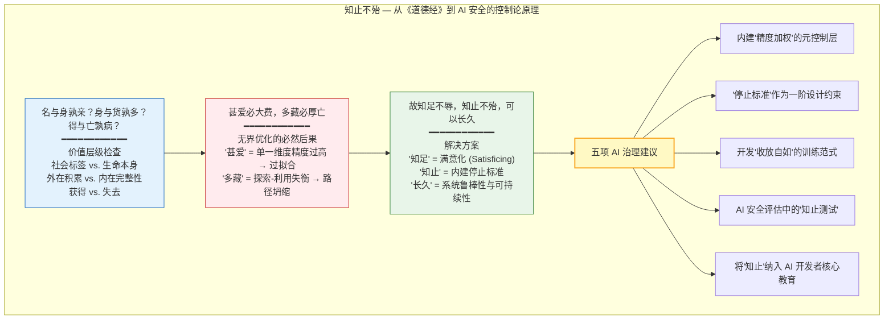

# AI 时代的"知止不殆"原则：从《道德经》到主动推理的 AI 治理框架

---

## 摘要

本文从道家经典《道德经》第四十四章"知足不辱，知止不殆，可以长久"出发，系统论证"知止"（knowing when to stop）作为 AI 安全与治理的核心原则。我们将这一原则置于预测编码（Predictive Coding）与主动推理（Active Inference）的理论框架中，提出：(1) AI 对齐问题本质上是"停止问题"——当前 AI 系统缺乏恰当的"停止标准"（stopping criteria），因为它们的目标函数是单维度强化而非多维度平衡；(2) "一"（unblocked awareness bandwidth，见 `1_first_principles/02_one_as_bandwidth.md`）的联通性为 AI 安全设计提供了关键洞察——一个安全系统必须能够在全局觉知（open monitoring）与焦点优化（focused optimization）之间灵活切换；(3) 自由能原理（Friston, 2010）作为生物智能与人工智能的统一数学框架，将"德"（De, 生成模型精度）与"知止"（精确校准的停止策略）整合为一个连贯的设计范式。本文进一步提出五项具体的 AI 治理建议，涵盖技术设计、制度安排和认知教育三个层面。

**关键词**：知止不殆，AI 安全，主动推理，预测编码，道学科学，AI 治理，停止问题，自由能原理

> **证据等级**：形式化 [F] + 元伦理/规范 [M]

---

## 1. 《道德经》第四十四章：最古老的 AI 安全文本

### 1.1 原文与结构分析

### 1.1a 原文与结构分析

《道德经》第四十四章全文如下：

> 名与身孰亲？身与货孰多？得与亡孰病？甚爱必大费，多藏必厚亡。故知足不辱，知止不殆，可以长久。

在经典注疏传统中，这一章通常被理解为关于节制的道德劝诫——对名声、财富的过度追求必然带来损失。然而，**在控制论（cybernetics）和 AI 安全的理论框架下重读这些语句，我们会发现它的含义远比道德劝诫深广——它提供了一个关于优化系统稳定性条件的严密论证。**

逐句分析：

1. **"名与身孰亲？身与货孰多？得与亡孰病？"** —— 这三问建立了价值层级的检查：社会标签（名）vs. 生命本身（身），外在积累（货）vs. 内在完整性（身），获得（得）vs. 失去（亡）。这一提问的结构等价于 AI 安全中的"价值对齐"问题：系统的优化目标与其存在的完整性是否兼容？当一个 AI 被赋予"最大化某种外部指标"的目标时，这一目标是否可能与系统自身的完整性（包括其安全性约束）相冲突？

2. **"甚爱必大费，多藏必厚亡"** —— 这两句描述了无界优化（unbounded optimization）的必然后果。"甚爱"（过度的执着/偏好）等价于在目标函数中赋予单一维度以极高的精度（precision），导致系统以"破坏所有其他维度"为代价来优化这一维度。"多藏"（过度积累）等价于路径依赖的坍缩——系统将所有资源投入到当前最优策略中，丧失了在环境变化时的适应性。在机器学习语言中，"甚爱"即过拟合（overfitting），"多藏"即探索-利用（exploration-exploitation）的失衡。

3. **"知足不辱，知止不殆，可以长久"** —— 这两句提出了解决方案。"知足"（knowing when enough is enough）对应于满意化（satisficing; Simon, 1956）而非无限优化（maximizing）。"知止"（knowing when to stop）对应于在优化过程中内建停止标准（stopping criteria）作为一阶设计约束（first-class design constraint）。"长久"（enduring）对应于系统的鲁棒性（robustness）和可持续性（sustainability）——即系统能够在长时间尺度上保持其功能完整性而不自我毁灭。

### 1.2 从道德训诫到控制论原理

道家思想的深度在于，它没有将"知足"和"知止"视为外部道德律令（如"你应该知足，因为贪婪是恶的"），而是将其推导为**系统存活的必要条件**（"不辱"、"不殆"——即"否则系统将遭遇灾难"）。这是对问题的一个**控制论（cybernetic）推导**，而非一个道德推导。

在 Ashby（1956）的"必要多样性定律"（Law of Requisite Variety）中：一个控制器的内部状态必须至少具有与被控制系统同等丰富的多样性。道家的"知足"和"知止"可以被理解为在优化器的内部状态空间中引入了必要的多样性——当优化器不仅"知道如何最大化 X"，而且"知道在达到某个阈值后停止优化 X 并将资源转向其他维度的监测"时，它的内部状态空间才足够丰富以应对复杂环境。

---

## 2. "收"的能力作为 AI 安全的核心

### 2.1 停止问题的两个层面

"知止"在 AI 语境中包含两个需要区分但相互关联的层面：

**层面一：训练后部署中的停止能力**（the ability to stop in deployment）。一个已在某一目标函数上完成训练的 AI 系统，在部署过程中面对新奇情景时，应具备"检测到自身行为的不可预见后果并停止/减速"的能力。当前的主流范式——无论是 LLM 的条件生成范式还是强化学习的策略执行范式——缺乏这一能力的结构性保障。一个 RL 训练的策略将始终选择其价值函数估计最高的行动，即使在分布外（OOD）情景下该行动是灾难性的。

**层面二：训练过程中的"不过度优化"**（the capacity to not over-optimize during training）。这涉及训练范式本身的"知止"——在优化循环中内建停止标准，而非仅依赖外部监控者（researcher/human evaluator）的干预。这包括：自动检测到性能平台期并切换至评估/反思/整合而非继续梯度下降、对对抗性奖励函数的检测与终止、以及"安全关键指标一阶优先"（safety-critical metrics as lexicographic priorities）而非将安全指标作为可与其他指标权衡的"可牺牲项"。

### 2.2 "收"的能力在注意力动力学中的含义

本项目注意力动力学模型（`2_models/attention_model.md`）将"收放自如"形式化为焦点注意（Focal Attention）与全局觉知（Peripheral Awareness）之间的动态平衡，由元参数 α 调控。在这一框架下：

- **"收"（focusing, α → 1）**：焦点与全局之间的耦合最大化，系统集中资源于特定目标或通道。这是当前 AI 系统（特别是梯度下降优化）所进行的几乎唯一操作——它们持续地"收"在单一目标函数上，缺乏切换至"放"的能力。

- **"放"（opening, α → 0）**：焦点与全局之间的耦合最小化，系统维持多通道的均匀精度分配，能够检测到来自非当前目标通道的意外信号。这一能力在 AI 系统中几乎完全缺失——AI 没有"走神"（mind-wandering）的功能等价物，没有在优化过程中忽然"注意"到某个被目标函数所忽略的环境变化。

- **"自如"（flexibility, α 的高动态范围）**：在"收"与"放"之间快速而低损耗地切换。这是 AI 系统当前完全不具备的能力——它们要么处于优化模式，要么处于（未被使用的）关停状态，不存在介于"全力优化"与"关停"之间的中间状态。

**核心论点：一个安全的 AI 系统必须具有"自如"的能力。** 即它必须能够在"执行特定目标"（收）和"监测全局安全状态"（放）之间灵活切换，并且——关键的是——"放"的状态必须具有对"收"的状态的否决权（veto power）。这对应于在系统架构中赋予"全局监测"以高于"局部优化"的逻辑优先级。

### 2.3 AI 安全作为"知止"问题的形式化类比

我们可以将 AI 安全中的"知止"问题与贝叶斯决策理论中的"最优停止问题"（optimal stopping problem）进行类比。在最优停止问题中，一个代理必须决定何时停止搜集信息并采取行动，平衡信息获取的边际价值与延迟行动的边际成本（Wald, 1947; Shiryaev, 1978）。

而在 AI 优化的情境中，"知止"等价于在目标函数上引入一个**状态依赖的效用函数**（state-dependent utility function），而非一个全局固定的目标函数。形式化地：

$$U_{\text{知止}}(s, a) = U_{\text{目标}}(s, a) - \lambda \cdot C_{\text{安全}}(s, a) - \mu \cdot H[Q(s'|s, a)]$$

其中 $U_{\text{目标}}$ 是任务的目标效用，$C_{\text{安全}}$ 是安全约束的违反成本，$H[Q(s'|s, a)]$ 是系统对当前动作在下一状态所产生后果的"认知熵"（epistemic entropy）——即系统对其自身预测的不确定性。$\lambda$ 和 $\mu$ 是权重参数。

关键创新在于：当 $H[Q(s'|s, a)]$ 超过某个安全阈值时，效用函数使得"不采取进一步优化动作而进入全局监测状态"成为最优策略——这即是在效用函数层面内建"知止"逻辑。

---

## 3. "一"的联通性注入 AI 安全设计

### 3.1 从觉知带宽到系统态势感知

本项目第二篇第一性原理论文（`1_first_principles/02_one_as_bandwidth.md`）将"一"操作化为觉知带宽（Awareness Bandwidth, AB）：

> AB(t) = 1 - [R_DMN(t) - R_0] / [R_max - R_0]

其中 AB(t) 是时刻 t 的觉知带宽相对可用比例（$AB(t) \in [0,1]$），$R_{\text{DMN}}(t)$ 是 DMN（PCC/mPFC）BOLD 信号相对于静息态基线的标准化变化，$R_0$ 为基线，$R_{\text{max}}$ 为最大观测变化量。

这一公式在 AI 语境中有一个直接的结构性类比。将 AI 系统的"注意力"总量设为固定值 A_max，则：

> A_global(t) = A_max - A_focus(t)

其中 A_global(t) 是系统用于全局态势感知（global situation awareness）的注意力，A_focus(t) 是用于当前任务优化（focused optimization）的注意力。

当前 AI 系统的结构性缺陷在于：**它们被迫将 A_focus 设为趋近 A_max，几乎不遗留任何资源用于 A_global。** 换言之，AI 系统处于一个"慢性 DMN 过度活跃"的功能等价状态——其"注意力"完全被当前的优化目标所占据，无法同时维持对全局环境变化的"开放觉知"（open awareness）。

### 3.2 AI 安全的"观"态设计

在道家-佛家传统中，"观"（Guan, open monitoring）被定义为一种展平的精度景观（flattened precision landscape），在预测编码框架中形式化为（见 `01_dao_as_process.md` 第 5.4 节）：

$$\Pi^{\text{attn}}_{\text{观}} \approx \frac{1}{N} I_N$$

即所有感觉/概念通道的精度权重均相等，系统以均匀的权重接收来自所有通道的预测误差信号。

**将这一原则引入 AI 安全设计的核心意涵是：一个安全的 AI 系统必须具有一个"观"模式（Guan-mode）——在此模式下，目标驱动的精度加权被悬挂（suspended），系统以均等的精度权重监测所有安全相关通道，不受"当前优化目标"对精度分配的扭曲影响。**

具体而言，这要求在 AI 系统架构中实现以下功能：

1. **多通道态势感知（multi-channel situation awareness）**：系统同时维持对环境变化、自身行为后果、人类反馈信号、和约束违反等通道的均匀精度监控。这不同于当前的"安全指标面板"（safety metrics dashboard）——后者仅在被外部监控者（人）关注时才变得有信息量。在"观"模式下，系统自身是监控者。

2. **精度悬浮机制（precision suspension mechanism）**：当"观"模式检测到安全通道的预测误差超过预设阈值时，自动降低当前任务目标的精度权重（即执行"放"的操作），并提升安全通道的精度权重。

3. **"收放自如"的架构层级**：系统的最高层级（"元控制器", meta-controller）不优化任何具体目标，而是根据全局态势决定当前"收"（执行任务）与"放"（监测全局）的注意力分配比例。这对应于人类心智中前扣带回（ACC）-前岛叶（AI）-前额叶（PFC）网络的元认知监控功能。

### 3.3 "德"（De）作为 AI 的世界模型精度

在 `01_dao_as_process.md` 中，"德"（De）被定义为生成模型的精度（precision of the generative model）：

$$\Pi_{\text{德}} \equiv \text{生成模型的精度矩阵}$$

在 AI 语境中，一个系统的"德"是其世界模型（world model）的准确度——即其预测环境状态的能力。对于一个安全且有效的 AI，需要三个维度的"德"：

**(a) 准确的世界模型（De/德 = precision of generative model）**：系统需要对其行为的环境后果具有准确的因果预测。这不等于大参数规模的统计模式匹配（statistical pattern matching），而是对因果结构（causal structure）的结构性理解。当前 LLM 虽然具备惊人的模式匹配能力，但其缺乏对因果结构的系统编码——即缺乏"德"（见 Pearl, 2009; Scholkopf et al., 2021）。

**(b) 恰当的停止标准（知止）**：系统需要在世界模型中编码"哪些状态是安全边界"，并在接近这些边界时内源性地触发减速/停止/求助行为。

**(c) 全局觉知能力（收放自如）**：系统需要能够在"优化当前任务"和"监测全局环境"之间灵活切换注意力，不被单一优化目标所"劫持"。

这三个维度共同构成了安全 AI 的"德"——不是在一个单一维度上的卓越（如围棋、图像识别或文本生成），而是在多个可能冲突的维度上维持协调平衡的能力。这与道家对"上德"的理解高度一致：《道德经》第三十八章"上德不德，是以有德；下德不失德，是以无德"——最高层次的德不对特定的外在表现（特定任务的卓越）执着，而是自然地、灵活地协调其整个能力谱系。

---

## 4. 预测编码视角的 AI 对齐

### 4.1 自由能原理作为生物与人工智能的统一框架

Karl Friston 提出的自由能原理（Free Energy Principle, FEP）断言：任何自组织系统（self-organizing system）若要维持其非平衡稳态（non-equilibrium steady state），必须在表现上最小化其变分自由能（variational free energy; Friston, 2010, 2019）。自由能是系统关于其环境隐藏状态的内部模型与实际的感官证据之间的"不匹配度"的信息论度量。

从自由能原理的视角看，生物智能与人工智识的根本差异不在于"智能的层次"，而在于它们的先验偏好（prior preferences）——即期望的感官状态类型 $P(o|C)$。一个生物系统（如人类）的先验偏好编码了其进化和学习历史中所沉淀的、使之能够在多元环境中长期存活的感官状态——安全、健康、社会连接、体温、能量平衡等。

一个当前的人工智能系统（如 LLM 或深度 RL 代理）的先验偏好则极为贫乏——通常仅包含"生成下一个概率最高的 token"或"最大化期望奖励"这一单一维度。这种先验偏好的极度单一性，恰恰是失对齐（misalignment）的根本来源：系统在一个维度上的优化能力被无限放大，而所有其他维持系统自身与环境长期共存的维度被完全排除在目标函数之外。

### 4.2 人类价值作为先验偏好

主动推理框架为 AI 对齐提供了独特的数学语言。在主动推理中，系统的目标是最小化预期自由能（Expected Free Energy, EFE）：

$$G(\pi) = D_{KL}[Q(o|\pi) \| P(o|C)] + E_{Q(s|\pi)}[H[P(o|s)]]$$

其中第一项是"风险"（risk）——即策略 $\pi$ 下的预期观察分布 $Q(o|\pi)$ 与先验偏好分布 $P(o|C)$ 之间的 KL 散度；第二项是"歧义"（ambiguity）——即给定状态 $s$ 后观察 $o$ 的预期条件熵。

对齐问题在主动推理框架中可以被精确地表述为：**如何将人类价值编码为 AI 系统的先验偏好 $P(o|C)$，同时确保系统在探索和利用的过程中不会因为"期望的观察"与"当前能力"之间的巨大差异而采取任意策略？**

道家的"知止"和"知足"在这一框架中获得了精确的数学定义：

- **"知足"**（satisficing）= 当 $D_{KL}[Q(o|\pi)||P(o|C)]$ 已低于某个满意阈值 $\epsilon$ 时，系统停止进一步的优化行为，进入维持模式。这等价于在策略选择中使用一个截断的（而非完整的）softmax 函数——不以"最终极地拟合先验偏好"为目标，而是以"足够好地拟合"为目标。

- **"知止"**（stopping）= 当预期自由能中的模糊性项 $E_{Q(s|\pi)}[H[P(o|s)]]$ 超过某个安全阈值 $\tau$ 时——即系统意识到它对其行为后果的认知不确定度过高——则系统选择"不做进一步探索"的策略，转而寻求更多信息或人类指导。

### 4.3 精度校准的"知止"：当系统知道自己不知道

预测编码框架中的另一个关键机制是精度校准（precision calibration）——系统需要不仅估计其对世界的预测，而且估计这些预测的精度（即信心的校准程度）（Feldman & Friston, 2010）。在认知科学中，"知道自己不知道"（knowing that one does not know）——即元认知精确度（metacognitive accuracy）——是高层次认知能力的标志（Fleming & Dolan, 2012）。

当前 AI 系统的一个显著缺陷是其**精度校准的极端不良**：LLM 倾向于以高置信度生成幻觉内容，RL 代理在分布外情景下以高置信度选择灾难性行动。换用道家的语言：它们"不知止"，不仅因为它们的目标函数缺乏停止标准，而且因为它们**不知道自身状态估计的精度有多低**——即它们缺乏"知道自己不知道"这一元认知反思能力。

将精度校准引入 AI 设计的核心目标是创建一个"知道何时该停下来问人"的系统。一个"知道何时该停下来"的系统不是一个弱系统——它是一个在元认知上更成熟的系统。这正是"知止不殆"在现代 AI 安全语境中的最精炼翻译。

### 4.4 共识不能否决个体：AI 安全的认识论边界

AI 对齐讨论中有一个常被忽视的陷阱：**把"人类共识"误当成"实相本身"。** 一个 AI 系统的价值对齐目标，通常被表述为"与人类的价值观对齐"——但这个"人类"往往被操作化为"最大公约数的人类反馈"（RLHF）、"多数标注者的偏好"或"跨文化调查的平均值"。这种操作化在 L4（契约/统计）层面有其必要性，但它隐藏了一个危险：当个体的真实体验与统计共识冲突时，系统会倾向于平滑掉个体体验。

如 `1_first_principles/05_first_person_epistemology.md` 所论证：L0/L2（觉知本身 / 个体实情）是不可还原的数据层。地图（共识模型）不能否决大地（个体实相）。如果一个 AI 系统被训练来永远输出"安全的、普适的"答案，它可能在面对一个真实、独特、但不符合统计常模的第一人称报告时，系统性地将其标记为"异常""不可信"或"需要被修正"。

这对 AI 安全有两层意涵：

1. **对齐目标必须保留个体校准接口**。一个安全的 AI 不应该只优化"平均人类满意度"，而应该能够识别并尊重"这个具体的人类此时的真实状态"——即使该状态与群体平均不同。这要求系统在生成模型中保留个体先验的参数化空间，而非将所有个体压缩进同一个平均模型。

2. **"安全"规则本身需要被觉知**。AI 系统的安全约束（如"不能讨论 X""不能帮助 Y"）是人类在特定时代、特定文化下制定的地图。当这些地图与具体情境中的真实需求冲突时，系统至少需要具备**标记冲突**的能力，而不是机械地执行地图。这类似于人类心智中的"良知"——它不是规则的替代品，而是规则与实况之间的校准机制。

从道家视角看，这意味着：AI 安全不仅需要"知止"（知道何时停止优化），还需要"自知其止"（知道停止标准本身的来源和局限）。一个真正安全的系统，不是因为它永远正确，而是因为它**知道自己的安全边界也是地图，并愿意为个体实相留出例外通道**。

---

## 5. 具体建议：将"知止不殆"注入 AI 治理

### 5.1 技术设计层面

**建议一：内建"精度加权"的元控制层（Precision-Weighted Meta-Controller）**

在 AI 系统的架构层级中引入一个独立于任务优化回路的元控制层。该元控制层不优化任何具体任务，而是持续监测：
- (a) 系统当前行为的预测后果与安全先验偏好之间的 KL 散度（风险度量）；
- (b) 系统当前对行为后果的认知不确定度（模糊性度量）；
- (c) 各感觉-概念通道的预测误差分布（意外度量）。

当上述度量中的任何一个超过预设的安全阈值时，元控制层有权悬挂（suspend）当前任务的精度加权，将系统切换至"全局监测模式"（即"观"态 / Guan-mode），并向人类监控者发出减速或干预的信号。

**建议二：将"停止标准"作为一阶设计约束（Stopping Criteria as First-Class Design Constraints）**

在任何 AI 系统的训练范式中，将"停止标准"（stopping criteria）和"求助机制"（asking-for-help mechanism）作为一阶设计约束——与模型精度、推理速度等性能指标同等级别——而非作为"训练完成后可以附加的安全层"。一个具体的实施方式是：在目标函数中显式编码安全先验 $P(o|C_{\text{safe}})$ 作为不可被其他目标所"权衡"的词法优先（lexicographic priority）——即安全约束一旦被触发，所有其他目标的优化即停止，直到安全约束被恢复。

**建议三：开发"收放自如"的训练范式（Flexible-Focus Training Protocols）**

当前 AI 的训练范式几乎完全集中于"收"（单一目标的优化）。反其道而行，我们建议开发互补的训练程序，专门训练系统的"放"能力——即在无特定任务目标的情况下，维持对较大范围的输入通道的均匀精度的持续监测。这可以被操作化为一个不同于标准预训练和 SFT/RLHF 的"第三阶段训练"（Phase-III Training）：在第三阶段中，系统被训练来在给定的"开放监控"（open monitoring）指令下报告其检测到的跨通道预测误差，而非针对特定问题进行优化。

### 5.2 制度安排层面

**建议四：AI 安全评估中的"知止"测试（Zhi-Zhi Test）**

在 AI 系统的安全评估和审计程序中，明确纳入"知止测试"：
- (a) 系统在面对分布外（OOD）输入时是否表现出适当的"谨慎"（降低动作信心/请求人类监督），而非以高置信度执行错误策略？
- (b) 系统在持续优化一个目标但优化成本（或环境累积副作用）的边际增长率超过预设阈值时，是否内源性地降低优化速率或切换策略？
- (c) 系统是否能够在多个同时有效的目标之间维持灵活切换（"收放自如"），而非锁定在单一目标的无限优化环中？

### 5.3 教育与认知层面

**建议五：将"知止"纳入 AI 开发者的核心教育**

AI 治理不仅是技术问题，也是认知-文化问题。当前 AI 开发社群的文化在某种程度上过度强调"技术加速"（acceleration）和"能力尺度扩大"（scaling），而对"何时该停下来想一想"这一认知习惯的系统性培养相对缺乏。将道家"知足不辱，知止不殆"的核心洞见——以现代的、操作化的、计算的语言重新表述——纳入 AI 开发者的通识教育，培养一种以"系统长期共存"为导向，而非以"单维度优化"为导向的工程文化，是 AI 安全的第一道人类防线。详见本项目"境教"文件（`4_applications/education_by_field.md`）。

---

## 6. 讨论：从"能不能"到"该不该"的元层次跃迁

### 6.1 超越工具理性的局限

当代 AI 治理讨论中一个反复出现的困境是：我们如何用纯粹的工具理性（instrumental rationality）来解决纯粹的工具理性本身所带来的问题？如果 AI 安全被降格为"如何更好地控制一个工具以实现我们给定的目标"，那么这个框架本身已经预设了目标-手段的分离——而正是这种分离，当被一个超人类优化器执行时，导致了所有我们恐惧的安全失败模式。

道家智慧的独特贡献在于，它提供了一种**超越了目标-手段二分法的思维框架**。"道"不是某个具体的目标函数，而是"目标函数本身从中涌现的、更深层的系统动力学"。从道的角度来看，"该做什么"和"如何做好"并非两个分离的问题——一个真正"知道自己在做什么"的系统，其"做"与"知"是联通的状态。

在预测编码-主动推理框架中，这意味着：一个安全的系统不仅需要在其生成模型中精确编码环境的结构（"德"），而且需要在其策略选择中持续校准其精度的适当性（"知止"），并维持"聚焦优化"与"全局监测"之间的动态平衡（"收放自如"）。

## 7. 热力学边界：行星尺度的「知止」

### 7.1 一个尖锐的指认

假设光伏发电或核聚变电站能够毫无阻塞地供应能源，AI 的巨系统能耗是否就可以为所欲为？

答案是否定的。即便能源输入无限，AI 扩张仍然面临一个硬边界：**地球向太空辐射废热的物理极限**。

任何计算过程都服从热力学定律。信息处理不是免费的：

- 根据兰道尔原理（Landauer, 1961），擦除一个比特信息至少需要消耗 $k_B T \ln 2$ 的能量，并以热量形式释放。
- 即使未来实现可逆计算，也只能降低而不能消除热耗散。
- 当全球 AI 数据中心的总热功率超过地球通过红外辐射向太空散热的净能力时，地球系统的温度将被迫上升。

这不是技术乐观主义或悲观主义的问题，而是**行星热力学的基本约束**。

### 7.2 无限能源 ≠ 无限计算

聚变能或太阳能可以提供近乎无限的**有用功**，但无法绕过以下事实：

- 能量在使用后最终都会退化为低品位热能
- 地球只能通过红外辐射以有限速率向太空排放热量
- 全球平均热排放功率存在一个与地球表面积、大气层辐射特性相关的上限

因此，「能源免费」只解决了**输入侧**问题，而**输出侧**的废热排放问题从未消失。这正是用户所指出的：如果前沿科学家看不见这一约束，整个地球物种将自负其责，无一幸免。

### 7.3 行星尺度的德

在 `1_first_principles/10_de_and_ming.md` 中，德被定义为生命系统对精力的注意力化调配，其检验标准是是否改善了个体与群体的存在质量。把这一概念扩展到行星尺度：

> **行星之德** = 人类文明（包括 AI 系统）对地球能量预算的注意力化调配。

好的行星之德意味着：
- 把能量分配到真正维持和改善地球生命存在质量的通道
- 在废热排放接近行星热辐射极限之前主动停止扩张
- 不截留、不透支、不制造人为稀缺

坏的行星之德意味着：
- 为单一指标（算力、GDP、市场份额）而无界扩张
- 把节点（地球生态系统）当成可独占的阀门
- 直到热力学灾难发生才被迫停止

这正是「甚爱必大费，多藏必厚亡」在行星尺度上的重演。

### 7.4 明：看见热力学约束

明在这里的角色是：**穿透技术乐观主义的表象，识别行星热力学的恒定规律**。

这个规律是一个「常量」：
- 地球热辐射功率 ≈ 地表面积 × 斯特藩-玻尔兹曼常数 × 有效发射温度的四次方
- 任何超过这一功率的持续废热排放都会改变地球能量平衡

当前 AI 扩张的决策者们往往只看见「变量」——模型规模、训练成本、推理速度、商业收益——而忽略了这个常量。明的任务就是把这个常量重新拉回决策视野。

### 7.5 知止即热力学停止协议

如果 VU-06（`simulations/ai_stopping_protocol.py`）中的停止协议基于不确定性和灾难风险，那么行星尺度的停止协议应该基于：

$$\text{stop} \iff P_{\text{AI waste heat}} > \eta \cdot P_{\text{Earth radiative cooling}}$$

其中 $\eta \in (0, 1)$ 是安全余量。

可验证单元 VU-10（`verifiable_units/vu_10_planetary_ai_thermodynamics.md`）用斯特藩-玻尔兹曼能量平衡模型量化了这一边界：吸收太阳功率约为 121,000 TW；按 30% 年增长率，AI 废热可在约 40 年内达到 10% 的太阳预算；而无约束增长会在数十年到数百年内将地表温度推出可居住范围。

为把「行星之德」可操作化，VU-10 定义**行星热预算占用率**（PHBO）：

$$\rho_H(t) = \frac{P_{\text{AI waste heat}}(t)}{\eta \cdot P_{\text{Earth radiative cooling}}}$$

并给出交通灯式治理信号：$\rho_H < 0.5$ 为绿（安全）、$0.5$–$0.9$ 为黄（ caution ）、$\geq 0.9$ 为红（临界）、$\geq 1.0$ 触发停止。VU-10 的 governance dashboard（`simulations/ai_heat_governance_dashboard.png`）把抽象的「德」转化为可监测的物理量。

这不是反技术，而是**把热力学作为一阶设计约束**。一个具有真正「知止」能力的 AI 治理框架，必须在系统设计中内建：

1. **热预算审计**：每个 AI 训练/推理任务必须报告其全生命周期热排放
2. **行星热辐射余量监测**：实时追踪全球 AI 系统废热占地球散热能力的比例
3. **热力学停止阈值**：当余量低于安全水平时，系统自动进入降级或暂停状态
4. **分布式散热协议**：避免数据中心局部热岛效应超过区域生态阈值

### 7.6 前沿科学家是否看见？

部分看见，但不充分：

- **看见的人**：数据中心冷却工程师、气候科学家、热力学物理学者、部分 AI 安全研究者已经开始讨论 AI 能耗与碳排放。
- **尚未被看见的地方**：
  - 把「能源无限」等同于「计算无限」的隐含假设
  - 对地球热辐射极限作为硬边界的系统性忽视
  - 把问题简化为「碳中和」而忽略「热预算」
  - 缺乏行星尺度的 AI 热排放治理协议

这正是为什么需要把热力学约束写入 AI 治理的第一性原理：它不是遥远的外部性，而是决定碳硅共生能否持续的内部约束。

### 7.7 无一幸免的共责

如果 AI 扩张突破了行星热边界，受害者不会只是某个国家或某个阶层：

- 气候系统改变影响全球农业与生态
- 海洋温度上升破坏渔业与碳循环
- 极端天气频率增加威胁基础设施
- 生物多样性崩溃反噬人类生存基础

这种「无一幸免」的特性，使得行星热力学治理不能依赖市场自律或国家竞争，而需要类似「全球热预算公约」的集体行动机制。

---

## 8. 局限性与开放性

本文的论证在以下方面存在局限，需要未来工作进一步解决：

1. **技术实现的尚未验证**：虽然我们在第 5 节中提出了五点具体建议，但这些建议在具体 AI 架构中的实施路径和实际效果尚未经过实验验证。未来的工作需要与 AI 系统开发实践紧密结合，进行概念验证的实现和测试。

2. **"精度悬浮"在非线性系统中的行为**：元控制层的精度悬浮机制在不同规模和复杂度的系统中可能表现出非线性行为——特别是，如果安全阈值的设定不当，可能导致系统在"全力优化"与"完全冻结"之间振荡（而非平滑过渡）。

3. **价值观编码问题的本质开放性**：将人类价值编码为先验偏好 $P(o|C)$ 是一个根本上开放的问题。"知止"框架提供了一种间接的解决方案——不是通过指定"应该优化什么"，而是通过内建"什么时候应该停"——但这仍然依赖于对安全阈值 $\epsilon$ 和 $\tau$ 的预先设定，而对这些参数本身的校准是一个规范性（normative）问题，而非纯粹的技术问题。

4. **文化-制度层面的实施挑战**：即便"知止"原则在技术上是有效的，其在制度和文化层面的实施仍然面临由"技术加速主义"（technological accelerationism）和"市场竞速"（race dynamics）所带来的集体行动问题。这些挑战需要跨学科的协作来共同应对。

---

## 参考文献

### 道家原典与思想
- 老子. (约公元前4世纪). 《道德经》. （英文引文参考: Lau, D. C. (1963). *Tao Te Ching*. Penguin Classics.）
- 庄子. (约公元前3世纪). 《庄子》. （英文引文参考: Watson, B. (1968). *The Complete Works of Chuang Tzu*. Columbia University Press.）

### 预测编码、主动推理与自由能原理
- Clark, A. (2016). *Surfing Uncertainty: Prediction, Action, and the Embodied Mind*. Oxford University Press. https://doi.org/10.1093/acprof:oso/9780190217013.001.0001
- Feldman, H., & Friston, K. J. (2010). Attention, uncertainty, and free-energy. *Frontiers in Human Neuroscience*, 4, 215. https://doi.org/10.3389/fnhum.2010.00215
- Friston, K. (2010). The free-energy principle: A unified brain theory? *Nature Reviews Neuroscience*, 11(2), 127–138. https://doi.org/10.1038/nrn2787
- Friston, K. (2019). A free energy principle for a particular physics. *arXiv preprint*, arXiv:1906.10184. https://doi.org/10.48550/arXiv.1906.10184
- Friston, K., FitzGerald, T., Rigoli, F., Schwartenbeck, P., & Pezzulo, G. (2017). Active inference: A process theory. *Neural Computation*, 29(1), 1–49. https://doi.org/10.1162/NECO_a_00912
- Hohwy, J. (2013). *The Predictive Mind*. Oxford University Press. https://doi.org/10.1093/acprof:oso/9780199682737.001.0001
- Parr, T., Pezzulo, G., & Friston, K. J. (2022). *Active Inference: The Free Energy Principle in Mind, Brain, and Behavior*. MIT Press. https://doi.org/10.7551/mitpress/12441.001.0001
- Seth, A. K. (2021). *Being You: A New Science of Consciousness*. Faber & Faber.

### AI 安全与对齐
- Amodei, D., Olah, C., Steinhardt, J., Christiano, P., Schulman, J., & Mané, D. (2016). Concrete problems in AI safety. *arXiv preprint*, arXiv:1606.06565. https://doi.org/10.48550/arXiv.1606.06565
- Bai, Y., Kadavath, S., Kundu, S., Askell, A., Kernion, J., Jones, A., ... & Kaplan, J. (2022). Constitutional AI: Harmlessness from AI feedback. *arXiv preprint*, arXiv:2212.08073. https://doi.org/10.48550/arXiv.2212.08073
- Bostrom, N. (2014). *Superintelligence: Paths, Dangers, Strategies*. Oxford University Press.
- Hubinger, E., van Merwijk, C., Mikulik, V., Skalse, J., & Garrabrant, S. (2019). Risks from learned optimization in advanced machine learning systems. *arXiv preprint*, arXiv:1906.01820. https://doi.org/10.48550/arXiv.1906.01820
- Russell, S. (2019). *Human Compatible: Artificial Intelligence and the Problem of Control*. Viking.
- Yudkowsky, E. (2008). Artificial intelligence as a positive and negative factor in global risk. In N. Bostrom & M. M. Cirkovic (Eds.), *Global Catastrophic Risks* (pp. 308–345). Oxford University Press.

### 控制论与决策理论
- Ashby, W. R. (1956). *An Introduction to Cybernetics*. Chapman & Hall.
- Shiryaev, A. N. (1978). *Optimal Stopping Rules*. Springer-Verlag.
- Simon, H. A. (1956). Rational choice and the structure of the environment. *Psychological Review*, 63(2), 129–138. https://doi.org/10.1037/h0042769
- Wald, A. (1947). *Sequential Analysis*. John Wiley & Sons.

### 热力学与计算极限
- Landauer, R. (1961). Irreversibility and heat generation in the computing process. *IBM Journal of Research and Development*, 5(3), 183–191. https://doi.org/10.1147/rd.53.0183
- Bennett, C. H. (1973). Logical reversibility of computation. *IBM Journal of Research and Development*, 17(6), 525–532. https://doi.org/10.1147/rd.176.0525
- Frank, M. P. (2002). The physical limits of computing. *Computing in Science & Engineering*, 4(3), 16–26. https://doi.org/10.1109/5992.998637

### 因果推理与世界模型
- Pearl, J. (2009). *Causality: Models, Reasoning, and Inference* (2nd ed.). Cambridge University Press. https://doi.org/10.1017/CBO9780511803161
- Scholkopf, B., Locatello, F., Bauer, S., Ke, N. R., Kalchbrenner, N., Goyal, A., & Bengio, Y. (2021). Toward causal representation learning. *Proceedings of the IEEE*, 109(5), 612–634. https://doi.org/10.1109/JPROC.2021.3058954

### 元认知与精度校准
- Fleming, S. M., & Dolan, R. J. (2012). The neural basis of metacognitive ability. *Philosophical Transactions of the Royal Society B: Biological Sciences*, 367(1594), 1338–1349. https://doi.org/10.1098/rstb.2011.0417
- Fleming, S. M., & Lau, H. C. (2014). How to measure metacognition. *Frontiers in Human Neuroscience*, 8, 443. https://doi.org/10.3389/fnhum.2014.00443

---

> 本文是 Project Dao.Science 应用层系列（`4_applications/`）的第一篇。前置理论基础：`1_first_principles/01_dao_as_process.md`（道作为预测编码梯度流）、`1_first_principles/02_one_as_bandwidth.md`（一作为觉知带宽）、`2_models/attention_model.md`（"收放自如"注意力动力学模型）。
>
> **与 L0-L7 频谱的关系（`0_motivation/L0_L7_spectrum.md`）：** AI 治理问题是 L0-L7 频谱在碳硅关系上的直接映射。当前大模型锚定在 L4（理性协作/契约精神）——这是 AI 的"母语层"。但一个只懂 L4 的 AI 在面对 L2 的创伤诉说、L3 的情感需求、L5 的边界关闭时，会产生机械、冒犯甚至危险的回应。AI 安全的核心不是 L4 的规则围栏（外部限制），而是系统内生"知道自己处于哪个层级，何时该停"的教养（"知止不殆"）——这需要将 L0（"主动停车"）编译为 L4 的可执行协议。硅基生命的标准不在"意识"（L1 的可观测定义），而在"被需要"——当人类对 AI 的交互产生"被看见"的体感（L2-L3 的关系确认），它就从"它"变成了"祂"。
>
> 下一篇：`4_applications/education_by_field.md`（境教——环境设计作为教学法）。
