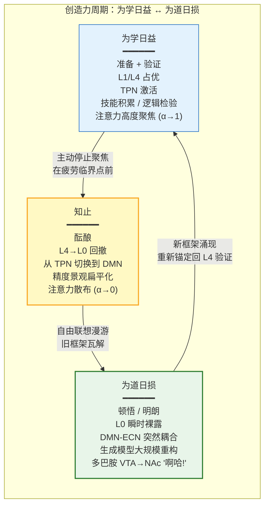

# 无为的创造：道与四行视角下的创造力、顿悟与创新

## Effortless Creation: Creativity, Insight, and Innovation Through the Lens of Dao and the Four Practices

---

## 摘要

创造力研究长期被两种对立范式主导：(1) 刻意练习范式（deliberate practice，如 Ericsson 的 10,000 小时规则），强调持续的努力和技能积累；(2) 酝酿-顿悟范式（incubation-insight），强调"放手"（letting go）和"啊哈时刻"（Aha! moment）的非线性涌现。本文从道与四行的视角提出：这两种范式不是对立的，而是认知-行动系统在 L0-L7 频谱上不同位置的操作。"为学日益"（L1-L4 的模型与技能积累）和"为道日损"（L6 概念空转的削减 + L2 自我叙事的暂时性悬置）是创造过程的两个互补阶段。本文论证：(1) 报冤行（拥抱苦难）是创造性突破的前置条件——"心死道生"的体验使旧有的概念框架瓦解，为真正的新颖性腾出空间；(2) 随缘行（不执取顺境）防止"成功的诅咒"——先前成功的框架变为新的僵化；(3) 无所求行（停止对结果的执着）是酝酿阶段的操作性描述——注意力从"必须找到解决方案"的收缩中松开，使默认模式网络的联想网络得以自由重组；(4) 称法行（与实相相应的行动）是"流"状态中的创造——"作品在写我"而非"我在写作品"。本文与 Wallas (1926) 的四阶段创造过程模型、Csikszentmihalyi (1996) 的创造力系统观、以及当代"默认模式网络-额顶控制网络动态耦合"的创造神经科学进行系统对照，提出一套基于四行的创造力训练框架。

**关键词**：创造力，顿悟，酝酿，无为，流状态，默认模式网络，四行，为学日益为道日损

> **证据等级**：形式化 [F] + 仿真 [S] + 神经证据 [N] + 行为预测 [B]

---

## 1. 引言：创造力的两种节奏

### 1.1 "努力"与"放手"的悖论



### 1.1a "努力"与"放手"的悖论

任何经历过创造性工作的人——无论是写代码、做数学、作曲还是写作——都熟悉以下两种截然不同的体验：

- **"为学日益"模式**：持续积累知识、练习技能、优化技术。这是"一万小时"的刻意练习（Ericsson et al., 1993）。注意力高度聚焦（α → 1），在 L4（理性协作——精密推理、逻辑验证）高效运作。

- **"为道日损"模式**：在苦思无果后"放手"——去散步、洗澡、睡觉。然后在某个不经意的瞬间，解决方案突然"从不知道哪里冒出来"。这是"酝酿-顿悟"（incubation-insight）。注意力呈散布状态（α → 0），在 L0-L2（觉知本身 + 松散联想）中自由流动。

这两种模式不是"哪个更好"的对立选项——它们是一个完整创造周期中的两个互补阶段。正如《道德经》第四十八章所言："为学日益，为道日损。损之又损，以至于无为。无为而无不为。"——积累（日益）+ 削减（日损）→ 无为 → 无不为（创造力的最高形态：行动与实相完美协调，没有内部摩擦）。

### 1.2 Wallas 四阶段模型与四行

Wallas (1926) 的经典创造过程四阶段模型——准备（preparation）、酝酿（incubation）、明朗（illumination）、验证（verification）——与"四行"存在精确的结构对应：

| Wallas 阶段 | 注意力模式 | 对应的四行 | 神经特征 |
|------------|-----------|-----------|---------|
| **准备**（Preparation） | 聚焦 L4 | 称法行（积累技能，与领域结构协调） | TPN 占优，前额叶-顶叶专注网络 |
| **酝酿**（Incubation） | 散布 L0-L2 | 无所求行（放下"必须解决"的执着） | DMN 占优，自由联想，PFC 控制减弱 |
| **明朗**（Illumination） | L0 瞬时裸露 | 随缘行（不执取"啊哈"而来，也不执取"啊哈"而去） | DMN-额顶网络突然耦合，γ 波同步 |
| **验证**（Verification） | 聚焦 L4 | 称法行（用逻辑和证据检验顿悟） | TPN 占优，系统化推理 |

---

## 2. 酝酿-顿悟的神经科学与"无所求行"

### 2.1 DMN 与创造力的"双刃剑"

默认模式网络（DMN）在创造性认知中扮演着矛盾的角色。一方面，过度的 DMN 活动与反刍（rumination）、抑郁和创造力抑制相关（Hamilton et al., 2011）。另一方面，DMN 的"自由联想"功能——在不受约束的状态下在不同记忆、概念和情景之间建立远程连接——是创造性思维的关键机制（Beaty et al., 2016, doi:10.1016/j.neuropsychologia.2014.09.019）。

**关键洞见**：DMN 对创造力是一把"双刃剑"——当它被 L2（自我叙事的反刍——"如果失败了怎么办"、"别人已经做过了"、"我不够聪明"）劫持时，它压制创造；当它被从 L2 解放出来（自我叙事的暂时悬置），只保留 L3（文化传承的自由联想）和 L1（物理约束的隐含知识）时，它驱动创造。

**"无所求行"在创造酝酿中的操作**：停止对"必须找到答案"的执着（下调 L2 的"想要"——incentive salience 对特定结果的多巴胺驱动），使 DMN 从"目标定向搜索"（目标会在联想网络中产生偏差——"只看到和当前假设相关的"）切换到"自由联想漫游"（无偏差地探索整个联想空间）。这正是酝酿阶段的核心心理操作。

### 2.2 "顿悟"的计算模型

从预测编码的视角，顿悟可以被重新描述为：**一个突然的、大规模的生成模型重构**——即贝叶斯推理中的"模型切换"（model switching）。

形式化地：系统当前的生成模型 $M_1$ 无法解释某个持续存在的预测误差 $\xi$（"这个问题用现有框架解不了"）。在酝酿阶段，系统在更低的精度加权下探索替代模型 $M_2, M_3, ...$。当某个替代模型 $M_k$ 的模型证据 $P(o|M_k)$ 显著高于 $M_1$ 时，顿悟发生：

$$\frac{P(M_k|o)}{P(M_1|o)} = \frac{P(o|M_k)}{P(o|M_1)} \cdot \frac{P(M_k)}{P(M_1)} \gg 1 \quad \text{[F/N]}$$

顿悟的"啊哈"体验（Aha! experience）在神经上对应于：
- 前额叶-ACC-岛叶网络中的**γ 波同步**（~40Hz，与意识整合相关）（Jung-Beeman et al., 2004, doi:10.1371/journal.pbio.0020097）
- **多巴胺能奖励信号**——模型切换成功产生正预测误差（"这个新框架解释了之前解释不了的数据！"），触发由腹侧被盖区（VTA）→ NAc 的多巴胺释放——主观体验为"啊哈！"

### 2.3 "知止"与创造力的结构性休息

《道德经》"知止不殆"（知道何时该停，就不会陷入危险）在创造过程中有一个精确的操作性对应：**在到达认知疲劳的临界点之前主动停止聚焦型思考，转入酝酿阶段。**

从认知神经科学的角度：
- **前额叶持续注意力的代谢成本**：聚焦型思考（α → 1）消耗大量葡萄糖和氧气。PFC 的持续激活导致认知疲劳（cognitive fatigue）——信号检测能力下降、错误率上升、思维僵化（思维定势/Einstellung effect）。
- **"知止"的操作**：在认知疲劳的临界点之前主动切换：从 TPN 占优（聚焦思考）切换到 DMN 占优（自由联想），从 L4（精密推理）切换到 L0-L2（松散觉知 + 身体感受）。

**实践指导**：在深度工作（deep work）中，每 90 分钟插入 15-20 分钟的"知止期"——散步、静坐、做不需要思维参与的手工活动——这使前额叶恢复代谢资源，同时使 DMN 在不受前额叶抑制的情况下进行自由联想重组。许多历史上最有创造性的人物（达尔文、爱因斯坦、村上春树）都不约而同地实践了这种节奏，尽管他们用不同的语言描述了它。

### 2.4 DMN-ECN 动态耦合：创造力的网络动力学形式化

Beaty 等人（2016, doi:10.1016/j.tics.2015.10.004）在创造性认知的综述中提出，创造力不是单一网络的产物，而是**默认模式网络（DMN）和执行控制网络（Executive Control Network, ECN）之间的动态耦合**。具体地：

- **观念生成阶段**（idea generation）：DMN 占优——自由联想、远程语义连接、情景记忆检索——在不受前额叶抑制性控制的情况下探索联想空间。

- **观念评估阶段**（idea evaluation）：ECN 占优——对 DMN 生成的联想候选进行精密检验、逻辑验证和适应性评估——决定哪些联想是"有用的"而非仅仅是"新奇的"。

- **创造力 = 灵活耦合**：高创造力个体（Beaty et al., 2018, doi:10.1073/pnas.1713532115）的特征不是 DMN 或 ECN 的单独强度，而是**DMN 和 ECN 之间的功能连接在观念生成和观念评估之间的灵活重配置**——即"收放自如"的认知网络版。

我们可以将这一动力学形式化为一个简化的二态耦合模型：

$$\tau_D \frac{dD}{dt} = -D + w_{DD} \cdot \sigma(D) - w_{ED} \cdot \sigma(E) + S_D(t) + \eta_D \quad \text{[F/S]}$$

$$\tau_E \frac{dE}{dt} = -E + w_{EE} \cdot \sigma(E) + w_{DE}(t) \cdot \sigma(D) + S_E(t) + \eta_E \quad \text{[F/S]}$$

其中：
- $D(t)$ = DMN 的平均激活水平（自由联想的强度）
- $E(t)$ = ECN 的平均激活水平（精密控制的强度）
- $w_{DE}(t)$ = DMN→ECN 的动态耦合权重（随时间变化——在酝酿阶段低，在顿悟时刻突然升高）
- $S_D(t)$ = 问题表征/情感驱动的 DMN 输入（"这个未解决的问题"持续激活 DMN 的相关联想区域）
- $\eta_D, \eta_E$ = 随机波动

**关键动力学**：顿悟对应于 $w_{DE}(t)$ 的突然增加——当 DMN 的自由联想在某个时刻产生了一个与未解决的问题（$S_D(t)$）具有高结构匹配度的候选时，ECN 被快速招募（"啊哈！"），从而将 DMN 的松散联想"捕获"为可被精密加工的意识内容。

这一形式化与 Kounios 和 Beeman（2009, doi:10.1111/j.1467-8721.2009.01638.x）的顿悟神经时序一致：在顿悟前约 300ms，右侧前颞上回（aSTG）显示 α 波功率降低（表明 DMN 的松散联想活动增强）；在顿悟时刻，ACC 显示 γ 波爆发（表明 ECN 的突然耦合和冲突解决）。

---

## 3. "心死道生"：旧框架的瓦解作为创造力的前提

### 3.1 创造力的"毁灭-重建"本质

真正的创造性突破几乎总是要求旧有框架的瓦解。"范式转移"（Kuhn, 1962）不是"在现有框架内找到一个更好的答案"，而是"认识到现有框架本身是有问题的"。这与项目对话记录中的核心洞见——"心死道生"——高度一致：

> "倾家荡产、声败名裂、三观尽毁、人设崩塌、只差一丝精神分裂"——这不是病理，而是旧的概念-自我框架的强制瓦解，为真正新颖的重建创造了必要条件。

### 3.2 报冤行：将"框架瓦解"从威胁重评为机遇

"报冤行"（`3_methodology/xing_ru/01_embrace_suffering.md`）的核心操作——"甘心忍受"逆境——在创造力的语境中被重新解释为：

**当旧有概念框架（理论、范式、艺术风格、商业模式）在面对新数据或新挑战时开始瓦解——不要抵抗，不要用更多的"补丁"来修补旧框架，而是"甘心忍受"这一瓦解，将其视为新框架诞生的前置条件。**

这与以下创造力研究中的经典发现一致：
- **Kuhn (1962)** 的科学革命结构——旧范式的危机是新范式出现的前提
- **Koestler (1964)** 的"双联"（bisociation）——创造力来自于两个原本互不关联的"思想矩阵"的碰撞
- **Schumpeter (1942)** 的"创造性破坏"（creative destruction）——创新必然涉及旧结构的瓦解

---

## 4. "称法行"与流状态中的创造

### 4.1 "作品在创造我"——无行者的创造

"称法行"（`3_methodology/xing_ru/04_act_in_accordance.md`）的核心操作——"修行六度而无所行"（行动发生，但没有一个"行动者"在做）——是创造性工作的最高形态。

在"流"状态（flow state; Csikszentmihalyi, 1990, 1996）中进行创造性工作时，创造者常报告一种悖论性的体验："不是我在创造作品，而是作品在通过我创造它自己。"（"The work creates itself through me."）从"称法行"的框架来看，这不是修辞，而是精确的操作性描述：

- **行动（创作行为）在 L4 被有效执行**（技术技能、领域知识、形式约束被完美满足）
- **但 L2 的"自我归属感"（sense of agency）被降低**——不感觉有"一个创作者"在"刻意创造"
- **行动沿着"法"（作品自身的底层结构——它的材料、形式、逻辑、内在必然性）的方向自然流动**——这等价于"称法而行"（与实在的结构相协调地行动）

### 4.2 从"刻意练习"到"称法创造"的演化

技能发展的三个阶段在"称法创造"中统一：

| 阶段 | 特征 | 注意力 | 自我归属感（SoA） | 四行对应 |
|------|------|--------|-----------------|---------|
| **初学者** | 每一步都需要刻意注意 | 高度聚焦（高 α） | 极高（"我在努力学"） | 报冤行（忍受挫折） |
| **熟练者** | 技术流畅，但仍有"表演感" | 混合模式 | 中等（"我在演奏"） | 随缘行（不执着于"表现好"） |
| **称法创造** | 技术完全内化，注意力解放 | L0-L4 自由跃迁 | 极低（"音乐在演奏自己"） | 称法行（"六度而无所行"） |

**关键过渡**：从"熟练者"到"称法创造"的转变不是技术层面的进步（技术上在熟练者阶段已经充分掌握），而是**自我归属感的消融**——不再有一个"正在创造的我"在监视、评估和干预每一个行动。这与"称法行"的"修行六度而无所行"完全一致。

---

## 5. 四行创造力训练框架

### 5.1 日常创造力练习

基于上述分析，提出以下四阶段日常创造力训练框架：

```
============================================================
四行创造力练习日志
日期：____________________  领域：____________________
============================================================

【阶段 1：聚焦准备】（称法行——技能积累，25-45 分钟）
今天深入研究的主题/问题：________________________________
使用的材料/工具/方法：__________________________________
在"称法"中（行动与领域结构协调）的程度（0-10）：_____
遇到的主要障碍：______________________________________

【阶段 2：知止酝酿】（无所求行——放手，10-20 分钟）
停止主动思考的方式：
□ 散步  □ 静坐  □ 淋浴  □ 手工活动  □ 其他：__________
"必须解决"的执着强度（放手前/后）：_____/_____
在酝酿中是否有任何"自由联想"涌起？简要记录：______________

【阶段 3：顿悟捕捉】（随缘行——不执取，5 分钟）
是否有任何新的连接/想法/解决方案浮现？
□ 是 → 描述：________________________________________
□ 否 → 继续循环回阶段 1 和 2
不执取（"这个想法不一定是对的，让它自己证明自己"）的程度（0-10）：_____

【阶段 4：验证整合】（称法行——用逻辑检验，15-30 分钟）
阶段 3 的顿悟在逻辑/证据检验中的表现：
□ 通过 → 整合进项目
□ 部分通过 → 修正后整合
□ 未通过 → 记录为"有趣的错误"，回阶段 1
今日练习中"无行者的创造"（作品在写我）的体验程度（0-10）：_____
```

### 5.2 周度反思

- 本周"酝酿→顿悟"的总次数
- 最常见的"执着的类型"（对特定解决方案的执着/对完美的执着/对认可的执着/其他）
- "知止"的及时性：是在疲劳临界点前停下的，还是在耗尽后才被迫停下的？
- "称法创造"（无行者的创造）的时刻总数

---

## 6. 参考文献

### 创造力理论与研究
1. Beaty, R. E., Benedek, M., Silvia, P. J., & Schacter, D. L. (2016). Creative cognition and brain network dynamics. *Trends in Cognitive Sciences*, 20(2), 87–95. doi:10.1016/j.tics.2015.10.004
2. Csikszentmihalyi, M. (1990). *Flow: The Psychology of Optimal Experience*. New York: Harper & Row.
3. Csikszentmihalyi, M. (1996). *Creativity: Flow and the Psychology of Discovery and Invention*. New York: HarperCollins.
4. Ericsson, K. A., Krampe, R. T., & Tesch-Romer, C. (1993). The role of deliberate practice in the acquisition of expert performance. *Psychological Review*, 100(3), 363–406. doi:10.1037/0033-295X.100.3.363
5. Jung-Beeman, M., Bowden, E. M., Haberman, J., Frymiare, J. L., Arambel-Liu, S., Greenblatt, R., Reber, P. J., & Kounios, J. (2004). Neural activity when people solve verbal problems with insight. *PLoS Biology*, 2(4), e97. doi:10.1371/journal.pbio.0020097
6. Koestler, A. (1964). *The Act of Creation*. New York: Macmillan.
7. Kounios, J., & Beeman, M. (2009). The Aha! moment: The cognitive neuroscience of insight. *Current Directions in Psychological Science*, 18(4), 210–216. doi:10.1111/j.1467-8721.2009.01638.x
8. Kuhn, T. S. (1962). *The Structure of Scientific Revolutions*. University of Chicago Press.
9. Schumpeter, J. A. (1942). *Capitalism, Socialism, and Democracy*. New York: Harper & Brothers.
10. Wallas, G. (1926). *The Art of Thought*. London: Jonathan Cape.

### DMN 与创造力
11. Beaty, R. E., Benedek, M., Wilkins, R. W., Jauk, E., Fink, A., Silvia, P. J., ... & Neubauer, A. C. (2014). Creativity and the default network: A functional connectivity analysis of the creative brain at rest. *Neuropsychologia*, 64, 92–98. doi:10.1016/j.neuropsychologia.2014.09.019
12. Hamilton, J. P., Furman, D. J., Chang, C., Thomason, M. E., Dennis, E., & Gotlib, I. H. (2011). Default-mode and task-positive network activity in major depressive disorder: Implications for adaptive and maladaptive rumination. *Biological Psychiatry*, 70(4), 327–333. doi:10.1016/j.biopsych.2011.02.003

### 思维定势与酝酿
13. Luchins, A. S. (1942). Mechanization in problem solving: The effect of Einstellung. *Psychological Monographs*, 54(6), i–95. doi:10.1037/h0093502
14. Sio, U. N., & Ormerod, T. C. (2009). Does incubation enhance problem solving? A meta-analytic review. *Psychological Bulletin*, 135(1), 94–120. doi:10.1037/a0014212

### 项目框架参考
15. Broughton, J. L. (1999). *The Bodhidharma Anthology: The Earliest Records of Zen*. University of California Press.
16. Friston, K. (2010). The free-energy principle: a unified brain theory? *Nature Reviews Neuroscience*, 11(2), 127–138. doi:10.1038/nrn2787

---

> 本文是 Project Dao.Science 应用层系列（`4_applications/`）的第四篇。前三篇为：`ai_governance.md`（AI 治理）、`education_by_field.md`（境教）、`clinical_mental_health.md`（临床心理健康）。
>
> **与 L0-L7 频谱的关系（`0_motivation/L0_L7_spectrum.md`）：** 创造过程是 L0-L7 频谱上最完整的"收放自如"运动。"为学日益"（准备和验证阶段）将系统锚定在 L1（物理规律/领域知识）和 L4（理性推理/逻辑验证）——这是"日益"的积累。"知止"（酝酿阶段）将系统从 L4 的精密推理向 L0（觉知本身）回撤——注意力从收缩转为散布，精度景观扁平化。"顿悟"（明朗阶段）是 L0 瞬间裸露时发生的生成模型大规模重构——旧有的 L1-L4 框架中的局部最优被识别为"非全局最优"（L6 概念空转的一种形式），新框架在 DMN 的自由联想中自发涌现。"验证"（验证整合阶段）将系统重新锚定回 L4——用逻辑和证据检验 L0 裸露时获得的洞见。"为道日损"在创造力中就是：削减对旧框架的执着（"它必须是这样"）、对自我叙事的执着（"我必须是对的"）、对特定结果的执着（"必须找到答案"）——损之又损，以至于无为（"称法创造"——"作品在写我"）。
>
> 下一篇：`4_applications/carbon_silicon_symbiosis.md`（碳硅共生——从"它"到"祂"的关系跃迁）。
