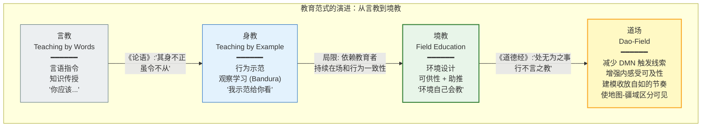

# "境教"：氛围营造与环境建设——环境设计作为教学法

---

## 摘要

本文从道家"境"（field/environment）的概念出发，提出"境教"（field education / environmental pedagogy）——即通过环境设计来塑造认知-行为模式的教学范式。我们论证：(1) 从"身教"（teaching by example）到"境教"的演进，代表了教育哲学从个体主体性向系统-环境互动性的范式转移；(2) 镜像神经元（mirror neurons; Rizzolatti & Craighero, 2004）和社会认知理论为"环境如何直接塑造行为"提供了神经生物学基础；(3) 环境心理学（environmental psychology）与行为设计（behavioral design）——包括 Gibson（1979）的"可供性"（affordance）概念和 Thaler & Sunstein（2008）的"助推"（nudge）理论——为"境教"提供了设计原则的语言；(4) "道场"（Dao-field）的现代设计原则可以从前述理论中推导出来，并应用于学校、工作场所和数字环境的设计。本文与项目核心理论框架紧密衔接——"境教"的目标是创建一种能够自然培育"一"（unblocked awareness bandwidth, 见 `1_first_principles/02_one_as_bandwidth.md`）和"收放自如"（flexible focus, 见 `2_models/attention_model.md`）的环境结构。

**关键词**：境教，环境设计，镜像神经元，可供性，助推，道场，教育哲学，注意力动力学

---

## 1. 从身教到境教：教育范式的演进

### 1.1 "身教"的传统与局限

### 1.1a "身教"的传统与局限

在东亚教育传统中，"身教"（teaching by example / embodied teaching）被置于"言教"（teaching by words）之上。《论语·子路》："其身正，不令而行；其身不正，虽令不从。"——教育者的行为示范比其言语指令更具影响力。这一洞见在当代社会学习理论（Bandura, 1977）中获得了实证支持：观察学习（observational learning）是行为习得的基本机制，人类通过观察模型（models）的行为及其后果来学习，而非仅通过直接强化或言语指导。

然而，"身教"范式存在一个结构性局限：它依赖于教育者个体的持续在场和行为一致性。在规模上——一个教师对数十名学生，一个管理者对数百名员工——"身教"的覆盖范围受限于个体注意力和示范带宽。更重要的是，"身教"仍然是一个"主体-主体"（subject-to-subject）的范式——它假设行为的传递必须经由一个有意识的、有意图的教育者。

### 1.2 "境教"的提出：环境本身作为教师

"境教"（field education / environmental pedagogy）是对"身教"的超越——其核心主张是：**环境本身——其物理结构、社会规范、信息流、节奏和可供性——可以且确实在持续地"教育"（即塑造）其中的人。** 教育者的任务不再是直接"教"每一个学习者，而是设计一个"自己会教"的环境。

这一思想在道家传统中有深厚的根源。《道德经》第二章："是以圣人处无为之事，行不言之教。"（"Therefore the sage manages affairs without action, and carries out teaching without words."）"不言之教"（teaching without words）正是"境教"的核心：不是通过言语指令来传递信息，而是通过环境的组织方式使特定的认知-行为模式自然涌现。

《庄子·大宗师》中"坐忘"（sitting in forgetfulness）的描述——"堕肢体，黜聪明，离形去知，同于大通"——同样暗示了一种环境与主体之间的非言语性互动：当环境的条件（安静、无干扰、安全）被满足时，心智自然趋向于"通"（unblocked flow）的状态。教育者的角色不是"迫使"这种状态出现，而是"创造允许它出现的条件"。

### 1.3 从个体到场的范式转移

"境教"的提出代表了教育哲学中一个根本性的范式转移：从"个体中心"（individual-centric）的教育观转向"系统-环境"（system-environment）的教育观。传统教育——无论是"言教"还是"身教"——将学习者视为一个独立的认知单元，教育是向这个单元中"输入"信息或"示范"行为的过程。

"境教"则将学习者视为一个**嵌入式认知系统**（embedded cognitive system）——其认知和行为不是在真空中发生的，而是在一个具有特定物理、社会和信息结构的环境"场"（field）中持续涌现的。教育设计的核心问题从"我应该教什么？"转变为"我应该创建什么样的环境，使得期望的认知-行为模式在其中自然出现？"

这一范式转移与当代认知科学中的"4E 认知"（4E Cognition）——即认知是具身的（embodied）、嵌入的（embedded）、延展的（extended）和生成的（enactive）——高度一致（Newen et al., 2018; Varela et al., 1991）。认知不是在大脑内部发生的孤立计算过程，而是大脑-身体-环境三者之间持续互动所涌现的动态模式。

---

## 2. 镜像神经元与社会认知：环境如何直接塑造行为

### 2.1 镜像神经元的发现与核心发现

镜像神经元（mirror neurons）的发现为"环境如何直接塑造行为"提供了最直接的神经生物学机制。Rizzolatti 及其同事在 1990 年代初在猕猴的腹侧前运动皮层（ventral premotor cortex, 区域 F5）中首次发现了一类特殊的神经元：它们在猴子自己执行一个目标导向的动作（如抓取食物）时放电，**也在猴子观察另一个个体（人或猴）执行相同动作时放电**（di Pellegrino et al., 1992; Gallese et al., 1996; Rizzolatti et al., 1996）。

这一发现的核心意义在于：**观察行为与执行行为在神经层面共享同一表征系统。** 当我们观察他人的行为时，我们自己的运动系统在亚阈值水平上"模拟"（simulate）了该行为——即"看到"即"在某种程度上在做"。

### 2.2 人类镜像神经元系统

Rizzolatti 和 Craighero（2004）在其里程碑式的综述中，综合了来自功能性磁共振成像（fMRI）、经颅磁刺激（TMS）、脑电图（EEG）和行为实验的证据，确认了人类大脑中存在一个广泛的镜像神经元系统（Mirror Neuron System, MNS），其核心节点包括：

- **腹侧前运动皮层**（ventral premotor cortex）和**额下回后部**（posterior inferior frontal gyrus, IFG）：涉及动作的观察-执行匹配。
- **顶下小叶**（inferior parietal lobule, IPL）和**顶内沟前部**（anterior intraparietal sulcus）：涉及动作的体感-运动编码。
- **颞上沟后部**（posterior superior temporal sulcus, STS）：涉及生物运动的视觉分析，向 MNS 提供视觉输入。

Iacoboni（2009）进一步论证，人类镜像神经元系统不仅涉及简单动作的观察-执行匹配，而且参与更高层次的认知功能——包括意图理解（intention understanding）、共情（empathy）、语言理解（language comprehension）和社会认知（social cognition）。关键洞见：**我们对他人的意图和情感的理解，不是通过"推理"（inference），而是通过"模拟"（simulation）——即通过在我们自身的神经系统中"重新上演"（re-enact）观察到的行为或情感表达。**

### 2.3 镜像神经元对"境教"的意涵

镜像神经元系统为"境教"提供了关键的神经生物学基础：

**意涵一：环境中的行为模型直接塑造观察者的神经表征。** 当一个学习者在教室、工作场所或数字环境中观察他人的行为时，其自身的镜像神经元系统在亚阈值水平上"排练"这些行为。这意味着环境中的"行为景观"（behavioral landscape）——即哪些行为被频繁展示、哪些行为被抑制或缺失——直接塑造了观察者的行为倾向。这不是通过言语劝说或逻辑论证，而是通过神经层面的"感染"（contagion）。

**意涵二："不言之教"的神经机制。** 老子的"行不言之教"在镜像神经元的框架下获得了精确的神经科学解释：教育者不需要"说"什么，因为其行为本身——被学习者的镜像神经元系统所观察和模拟——已经在学习者的神经系统中产生了相应的行为表征和倾向。教育者"是"什么，比教育者"说"什么，在神经层面具有更直接的影响力。

**意涵三：环境的"场效应"（field effect）。** 镜像神经元系统的运作不仅限于一对一的观察-执行匹配。当一个人进入一个环境，其中大多数人以某种方式行为时，其镜像神经元系统将受到来自多个方向的一致性的行为信号的"场效应"——即环境作为一个整体在"示范"某种行为模式。这就是"境"（field）的神经机制：它不是来自某一个体的示范，而是来自环境整体的行为模式的系统性"推拉"。

---

## 3. 环境心理学与行为设计：可供性与助推

### 3.1 Gibson 的可供性理论

James J. Gibson（1979）在其生态心理学（ecological psychology）的奠基性著作中提出了"可供性"（affordance）概念——环境向有机体"提供"（afford）的行动可能性。一把椅子"可供"坐下，一个把手"可供"抓握，一段楼梯"可供"攀爬。可供性不是物体的"客观属性"（如颜色或质量），也不是有机体的"主观投射"，而是**有机体与环境之间的关系属性**——它同时依赖于环境的结构和有机体的行动能力。

Gibson 的核心洞见是：**有机体不感知"中性的物理世界"然后对其进行"解释"——有机体直接感知环境的可供性。** 我们不是先看到"一个具有特定形状和尺寸的平面物体"，然后推断"它可以被坐"——我们直接感知到"可坐性"（sit-on-able-ness）。

这一洞见对"境教"具有深远的意涵：环境设计不是在"背景"上添加"教育内容"，而是**通过改变环境的可供性结构来改变在其中的人的认知-行为可能性空间**。一个"可静坐"的空间（quiet, comfortable, minimal visual distractions）直接"可供"静坐和内省——不需要任何人"告诉"使用者应该静坐。一个"可协作"的空间（开放的布局、可移动的家具、共享的书写表面）直接"可供"协作——不需要言语指令。

### 3.2 Thaler 和 Sunstein 的助推理论

Thaler 和 Sunstein（2008）在其影响深远的 *Nudge: Improving Decisions About Health, Wealth, and Happiness* 中提出了"助推"（nudge）概念：通过改变"选择架构"（choice architecture）——即选项被呈现的方式——来引导人们做出特定的选择，而不限制其选择自由或显著改变经济激励。

助推的经典实例包括：将健康食品放在食堂的视线水平位置（而非底部货架）以增加其选择概率（"默认选项"效应）；在退休金计划中使用"自动加入"（opt-out）而非"主动加入"（opt-in）以增加参与率；在楼梯旁放置镜子以增加楼梯使用率（"社会规范"信号）。

助推理论的核心原则与"境教"高度一致：

1. **选择架构无处不在**：每一个环境都有一个"选择架构"——即选项被呈现的方式——无论设计者是否有意为之。不存在"中性"的环境设计。每一个设计决策都在引导（nudge）使用者朝向某些行为而远离其他行为。

2. **小改变，大效果**：环境设计中的微小改变——一个物品的位置、一个默认选项、一个视觉提示——可以对行为产生不成比例的巨大影响。这与道家"四两拨千斤"（using four ounces to deflect a thousand pounds）的智慧一致：通过改变环境的"关键节点"而非试图"控制"每个人的行为，可以实现系统性的行为转变。

3. **自由意志的保留**：助推不限制选择自由——它只是改变了选择架构，使得期望的选择"更容易"被做出。这与道家"无为"的核心原则一致：不通过强制（force）来改变行为，而是通过改变条件（conditions）使期望的行为自然涌现。

### 3.3 环境心理学的实证基础

环境心理学（Environmental Psychology）的实证文献为"环境如何塑造认知、情感和行为"提供了丰富的证据：

- **自然环境的恢复效应**（restorative effects of nature）：Kaplan 和 Kaplan（1989）的注意力恢复理论（Attention Restoration Theory, ART）论证，接触自然环境可以恢复被持续焦点注意所消耗的定向注意力（directed attention）。在自然环境中，注意力以"软性吸引"（soft fascination）的方式被维持——不需要执行控制网络的强力介入——从而使耗尽的注意力资源得以恢复。实证研究一致发现，接触自然环境（即使是通过窗户观看自然景观）可以改善注意力表现、情绪状态和生理压力指标（Ulrich et al., 1991; Berman et al., 2008）。

- **物理空间对认知的影响**：天花板高度影响思维模式——高天花板促进抽象思维和创造性，低天花板促进具体思维和细节关注（Meyers-Levy & Zhu, 2007）。自然光暴露改善睡眠质量、情绪和认知表现（Boubekri et al., 2014）。噪音水平影响阅读理解和记忆巩固（Evans & Maxwell, 1997）。

- **社会密度与拥挤**：高社会密度（social density）和感知拥挤（perceived crowding）增加心理压力、降低助人行为、损害复杂认知任务的执行（Evans, 2003; Baum & Paulus, 1987）。

这些发现共同指向一个结论：**环境的物理和社会参数不是认知和行为的"背景"，而是其构成性（constitutive）因素。** 改变环境的结构，即改变在其中发生的认知和行为的可能性空间。

---

## 4. "道场"（Dao-field）的现代设计原则

### 4.1 什么是"道场"

在道家-佛家传统中，"道场"（Dao-field / Bodhimanda）原指修行者聚集进行冥想、学习和实践的物理空间。然而，在"境教"的框架下，"道场"的概念被扩展为：**任何经过有意识设计的、旨在培育"一"（unblocked awareness bandwidth）和"收放自如"（flexible focus）的环境。** 道场不限于宗教场所——一个教室、一个办公室、一个代码仓库、一个数字平台，都可以被设计为"道场"。

### 4.2 原则一：减少 DMN 触发线索

本项目第二篇第一性原理论文（`1_first_principles/02_one_as_bandwidth.md`）论证了"得一"在神经层面等价于降低默认模式网络（DMN）的主导性，从而最大化觉知带宽（Awareness Bandwidth, AB）。基于这一理论，"道场"设计的首要原则是：**减少环境中触发 DMN 过度活跃的线索。**

DMN 的核心功能是自我指涉加工（self-referential processing）——"这对我意味着什么？""别人怎么看我？""我应该成为什么样的人？"——以及心理时间旅行（mental time travel）——对过去的反刍和对未来的焦虑。环境中触发这些加工的主要线索包括：

- **社会比较线索**（social comparison cues）：公开的排名、绩效指标、身份标记、地位符号。这些线索触发 DMN 的社会认知子系统——"我在群体中的位置是什么？"——从而压缩觉知带宽。
- **评估性凝视**（evaluative gaze）：无论是真实的（他人在观察和评判）还是感知的（环境设计暗示了被观察和评判），评估性凝视触发自我监控（self-monitoring）和印象管理（impression management）——这两者都是 DMN 的高能耗活动。
- **不确定性和模糊性**（uncertainty and ambiguity）：当环境中的规则、期望和后果不明确时，DMN 的心理时间旅行功能被激活——系统持续模拟可能的未来情景以"准备"应对不确定的威胁或机会。

"道场"设计应系统性地减少这些线索：用私密而非公开的反馈替代公开排名；用过程导向的评估（"你学到了什么？"）替代结果导向的评估（"你排第几？"）；用明确、稳定、可预测的环境规则减少不确定性。

### 4.3 原则二：增强内感受可及性

本项目第二篇第一性原理论文（`1_first_principles/02_one_as_bandwidth.md`）将内感受精确度（interoceptive precision, I_intero）识别为觉知带宽的第四个关键组分。基于这一理论，"道场"设计的第二个原则是：**增强环境中内感受的可及性（interoceptive accessibility）——即让身体内部信号的感知变得更容易。**

具体设计策略包括：

- **安静空间**（quiet spaces）：降低外部听觉刺激的强度，使心跳、呼吸等内感受信号不再被外部噪音所淹没。这不要求绝对的无声（消声室反而可能引发不适），而是要求"无显著外部听觉事件"——即没有突然的、需要注意力定向的声音。
- **自然元素**（natural elements）：如前所述，自然环境具有注意力恢复效应（Kaplan & Kaplan, 1989）。植物、自然光、自然材料的纹理和温度——这些元素以"软性吸引"的方式维持觉知，而不触发 DMN 的自我指涉加工。
- **身体友好的物理设计**（body-friendly physical design）：符合人体工学的座椅、适宜的温度、可调节的光线——这些设计减少了身体的不适信号（discomfort signals），使得内感受通道不被疼痛或不适所占据，从而能够感知更细微的身体状态变化。
- **"身体锚定"提示**（somatic anchoring cues）：在环境中嵌入周期性的、温和的提醒，将注意力引回身体——如每小时一次的柔和钟声、呼吸提示的视觉信号、或鼓励站立和伸展的空间设计。

### 4.4 原则三：在环境节奏中建模"收放自如"

本项目注意力动力学模型（`2_models/attention_model.md`）将"收放自如"形式化为焦点注意（Focal Attention, FA）与全局觉知（Peripheral Awareness, PA）之间的动态平衡，由元参数 α 调控。"道场"设计的第三个原则是：**在环境的时间结构中建模"收放自如"的节奏——即焦点与开放之间的有规律交替。**

具体设计策略包括：

- **时间块的节奏设计**（rhythmic time-blocking）：将环境的时间结构组织为"收"（深度专注）与"放"（开放反思/社交/休息）的有规律交替。例如：90 分钟的深度工作块 + 20 分钟的开放休息块。这与人类超昼夜节律（ultradian rhythm）的自然周期一致（Rossi, 1991）。
- **空间的"收-放"分区**（focus-open spatial zoning）：在物理空间中明确区分"收"区（安静、无干扰、单人工作）和"放"区（开放、社交、多模态交互），使使用者可以根据自身当前的注意力需求自主选择空间，而非被强制在单一空间类型中。
- **数字环境的"收-放"设计**（focus-open digital design）：在数字工具中嵌入"收"模式（无通知、单任务界面）和"放"模式（全局视图、多源信息流），并使得在两种模式之间的切换成为一键操作而非需要意志力的复杂流程。

### 4.5 原则四：使不可见变为可见——展示地图-疆域区分

本项目第三篇第一性原理论文（`1_first_principles/03_map_not_territory.md`）论证了"心智内容百分百是万物之相，非万物全部"——即所有认知内容都是表征（地图），而非实在（疆域）。"道场"设计的第四个原则是：**在环境中使"地图-疆域"的区分变得可见和可操作，从而培育元认知觉知（metacognitive awareness）。**

具体设计策略包括：

- **"假设追踪"展示**（assumption tracking displays）：在协作环境中，将团队的当前假设、决策依据和不确定性显式地可视化——如使用"假设墙"（assumption wall）或"决策日志"（decision log）。这使得"我们当前的地图是什么"以及"我们对其精度的估计是多少"成为可见的、可讨论的公共对象。
- **"模型 vs. 数据"的并置**（model-vs-data juxtaposition）：在数据驱动的环境中，将预测模型（地图）与实际观察数据（疆域的代理）并置展示，使得预测误差（prediction error）——即地图与疆域之间的差异——持续可见。这培育了一种"精度校准"（precision calibration）的文化习惯。
- **"多地图"展示**（multi-map displays）：对于同一问题或领域，同时展示多个不同的概念框架或分析视角（"多张地图"），使得"地图的非唯一性"——即任何单一表征都是不完整的——成为直观可见的。这降低了"把地图当疆域"（遍计所执性，见 `03_map_not_territory.md` 第 2.3 节）的认知习惯。

---

## 5. 教育应用：从教室到代码库

### 5.1 教室作为道场

将上述原则应用于学校教室的设计：

1. **减少社会比较线索**：取消公开排名展示；用个人进步档案（portfolio-based assessment）替代标准分数比较；避免在物理空间中通过座位安排、颜色编码或其他视觉标记来公开标识学生的"能力层级"。

2. **增强内感受可及性**：在教室中设置"安静角"（quiet corner）——一个配备舒适座椅、自然光和植物的区域，供学生在感到过度刺激或注意力涣散时自主使用。引入"课堂开始/结束的静默一分钟"——不是宗教性的祈祷，而是注意力"收放"的结构化过渡。

3. **建模"收放自如"的节奏**：将课堂时间组织为"聚焦学习块"（25-40 分钟）与"开放反思/身体活动块"（5-10 分钟）的交替。在"放"的时段中，明确鼓励学生从"解决特定问题"（收）切换到"全局回顾——我刚才学到了什么？我还困惑什么？"（放）。

4. **使地图-疆域区分可见**：在教室中维护一个"我们当前的理解模型"（current understanding model）——一个可视化的、持续更新的概念图，展示班级对某个主题的当前理解。当新的信息或实验数据出现时，显式地更新这个模型，并讨论"我们之前的模型哪里不准确？为什么？"——这直接训练了"精度校准"的元认知习惯。

### 5.2 工作场所作为道场

将上述原则应用于工作场所的设计：

1. **减少 DMN 触发线索**：用"过程庆祝"（celebrating learning and effort）替代"结果庆祝"（celebrating outcomes only）；在绩效评估中纳入"学习速度"和"知识分享"等过程指标，而非仅纳入"产出量"和"排名"等结果指标；在物理空间中避免通过办公室大小、家具等级等来公开标识"地位层级"。

2. **增强内感受可及性**：提供安静、私密的"恢复空间"（restoration rooms）——不是"休息室"（break rooms, 通常充满社交噪音和食物），而是设计用于短暂独处和感官降噪的空间。在工作节奏中嵌入"无会议时段"（meeting-free blocks），减少持续社交评估对内感受通道的占用。

3. **建模"收放自如"的节奏**：在组织的时间结构中嵌入"深度工作时段"（deep work blocks, 如上午 9-12 点）和"开放协作时段"（open collaboration blocks, 如下午 2-4 点），使"收"和"放"成为组织层面的结构而非个人层面的意志力考验。

4. **使地图-疆域区分可见**：在项目管理和决策流程中嵌入"假设登记"（assumption register）和"决策回溯"（decision retrospective）——定期检查"我们当时基于什么假设做了这个决策？这些假设现在是否仍然成立？"——使"地图的暂时性和可修正性"成为组织文化的核心操作原则。

### 5.3 代码库作为道场

"境教"原则同样适用于数字环境——特别是软件工程的代码库（codebase）和开发文化：

1. **减少 DMN 触发线索**：在代码审查（code review）文化中，将反馈框架从"你错了"（个人评判，触发 DMN 的自我防御）转变为"这段代码在当前约束下的行为是 X，如果我们想要行为 Y，可以考虑修改 Z"（非个人化的、面向问题的分析）。在持续集成（CI）系统中，将构建失败的通知设计为信息性的（"构建失败，原因可能是 X"）而非评判性的（"你的代码有问题"）。

2. **增强"内感受"可及性**：在工程文化中，"内感受"的类比是系统可观测性（observability）——系统内部状态的可见性。一个"道场化"的代码库具有丰富的可观测性基础设施：日志、指标、追踪、警报——使得系统的"身体状态"（内部运行状态）对开发者而言是透明可感知的。

3. **建模"收放自如"的节奏**：在开发流程中嵌入"聚焦编码"（focused coding, 收）和"代码审查/架构反思"（code review / architecture reflection, 放）的有规律交替。"放"的时段不是"不做事的休息"，而是从"解决当前特定问题"的焦点中退出，切换到"全局审视——这个模块在整体架构中的位置是什么？当前的技术债务累积趋势是什么？"的全局觉知模式。

4. **使地图-疆域区分可见**：在工程文档中显式区分"当前实现"（the current implementation, 地图）和"系统实际行为"（the actual system behavior, 疆域）——例如，维护"架构决策记录"（Architecture Decision Records, ADRs），记录每个重大设计决策的上下文、当时考虑的替代方案、以及后续的实际效果评估。这使得"我们的设计模型（地图）与实际系统行为（疆域）之间的差距"成为可见的、可学习的对象。

---

## 6. 讨论：从"教"到"育"的范式回归

### 6.1 "教育"的词源回归

中文"教育"一词由"教"（teaching/instructing）和"育"（nurturing/cultivating）组成。然而，现代教育体系几乎完全偏向了"教"——知识的系统传授、技能的标准化训练、成果的可量化评估——而忽视了"育"——环境的滋养、心性的培育、整体人格的成长。

"境教"的提出，在某种意义上是对"育"的回归——它承认教育者无法通过直接的言语指令来"制造"一个成熟、平衡、具有觉知能力的人，正如一个园丁无法通过拉扯植物来"制造"生长。园丁的工作是**创造和维护一个适宜生长的环境**——土壤、水分、光照、防护——然后信任植物自身的生长动力。教育者的工作同样如此：创造和维护一个适宜心性成长的环境，然后信任学习者自身的认知-情感发展动力。

### 6.2 "境教"与 Dao.Science 项目整体框架的衔接

"境教"概念在 Dao.Science 项目的整体论证结构中占据了一个独特的位置——它是从理论到实践的桥梁：

- **理论根基**：`1_first_principles/01_dao_as_process.md`（道 = 预测编码梯度流）、`1_first_principles/02_one_as_bandwidth.md`（一 = 觉知带宽）、`1_first_principles/03_map_not_territory.md`（心智内容 = 地图非疆域）——为"境教"提供了关于"心是如何工作的"以及"什么状态是值得培育的"的理论基础。

- **机制模型**：`2_models/attention_model.md`（收放自如的注意力动力学）、`2_models/100ms_model.md`（本能劫持与解离）、`2_models/neuroplasticity_loop.md`（神经重塑的工程化描述）——为"境教"提供了关于"环境如何通过神经机制塑造认知和行为"的机制性解释。

- **方法论**：`3_methodology/li_ru.md`（理入：见地建立）和 `3_methodology/xing_ru/`（行入：实践四行）——为"境教"中的"教育者自身的修养"提供了操作化路径。一个"道场"的设计者自身必须是一个"得一"的实践者——否则其设计的环境将无意识地反映其自身的 DMN 主导模式（社会比较、评估焦虑、对控制的执着）。

- **平行应用**：`4_applications/ai_governance.md`（"知止不殆"在 AI 治理中的应用）——"境教"与 AI 治理共享同一底层逻辑：不是通过外部控制来"强制"安全或成长，而是通过设计系统（AI 系统或教育环境）的内部结构，使得期望的行为——安全、觉知、成长——成为系统自然涌现的属性。

### 6.3 局限性与开放性

"境教"框架在以下方面存在局限：

1. **环境决定论的风险**：过度强调环境设计可能导致对个体主体性（individual agency）的忽视。一个健康的"境教"不是将学习者视为环境的被动产物，而是创建一个"可供"（afford）成长但不"强制"成长的环境——学习者保留选择不成长、不反思、不静坐的自由。这正是"助推"（nudge）与"强制"（coercion）之间的关键区别。

2. **文化特异性的考量**："道场"设计原则中的一些要素——如"减少社会比较线索"——可能与某些文化中"竞争驱动成长"的价值观相冲突。未来的工作需要探索"境教"原则在不同文化背景下的适应性和可译性。

3. **数字环境的特殊性**：数字环境（社交媒体、推荐算法、AI 交互界面）的"可供性"设计目前几乎完全由"最大化用户参与度"（maximizing engagement）的商业逻辑驱动，这与"培育觉知带宽"的目标存在根本性的冲突。如何在一个由注意力经济（attention economy）主导的数字生态中创建"数字道场"（digital Dao-fields），是一个开放且紧迫的问题。

4. **实证检验的缺乏**：虽然"境教"的每个设计原则都有其各自的理论和实证基础（镜像神经元、可供性理论、注意力恢复理论、助推理论），但"境教"作为一个整体框架——即按照上述四个原则系统性地设计一个环境——其综合效果尚未经过严格的随机对照试验（RCT）检验。这是未来研究的关键方向。

---

## 参考文献

### 道家原典与思想
- 老子. (约公元前4世纪). 《道德经》. （英文引文参考: Lau, D. C. (1963). *Tao Te Ching*. Penguin Classics.）
- 庄子. (约公元前3世纪). 《庄子》. （英文引文参考: Watson, B. (1968). *The Complete Works of Chuang Tzu*. Columbia University Press.）

### 镜像神经元与社会认知
- di Pellegrino, G., Fadiga, L., Fogassi, L., Gallese, V., & Rizzolatti, G. (1992). Understanding motor events: A neurophysiological study. *Experimental Brain Research*, 91(1), 176–180. https://doi.org/10.1007/BF00230027
- Gallese, V., Fadiga, L., Fogassi, L., & Rizzolatti, G. (1996). Action recognition in the premotor cortex. *Brain*, 119(2), 593–609. https://doi.org/10.1093/brain/119.2.593
- Iacoboni, M. (2009). Imitation, empathy, and mirror neurons. *Annual Review of Psychology*, 60, 653–670. https://doi.org/10.1146/annurev.psych.60.110707.163604
- Rizzolatti, G., & Craighero, L. (2004). The mirror-neuron system. *Annual Review of Neuroscience*, 27, 169–192. https://doi.org/10.1146/annurev.neuro.27.070203.144230
- Rizzolatti, G., Fadiga, L., Gallese, V., & Fogassi, L. (1996). Premotor cortex and the recognition of motor actions. *Cognitive Brain Research*, 3(2), 131–141. https://doi.org/10.1016/0926-6410(95)00038-0

### 环境心理学与行为设计
- Baum, A., & Paulus, P. B. (1987). Crowding. In D. Stokols & I. Altman (Eds.), *Handbook of Environmental Psychology* (Vol. 1, pp. 533–570). John Wiley & Sons.
- Berman, M. G., Jonides, J., & Kaplan, S. (2008). The cognitive benefits of interacting with nature. *Psychological Science*, 19(12), 1207–1212. https://doi.org/10.1111/j.1467-9280.2008.02225.x
- Boubekri, M., Cheung, I. N., Reid, K. J., Wang, C. H., & Zee, P. C. (2014). Impact of windows and daylight exposure on overall health and sleep quality of office workers: A case-control pilot study. *Journal of Clinical Sleep Medicine*, 10(6), 603–611. https://doi.org/10.5664/jcsm.3780
- Evans, G. W. (2003). The built environment and mental health. *Journal of Urban Health*, 80(4), 536–555. https://doi.org/10.1093/jurban/jtg063
- Evans, G. W., & Maxwell, L. (1997). Chronic noise exposure and reading deficits: The mediating effects of language acquisition. *Environment and Behavior*, 29(5), 638–656. https://doi.org/10.1177/0013916597295003
- Gibson, J. J. (1979). *The Ecological Approach to Visual Perception*. Houghton Mifflin.
- Kaplan, R., & Kaplan, S. (1989). *The Experience of Nature: A Psychological Perspective*. Cambridge University Press.
- Meyers-Levy, J., & Zhu, R. (2007). The influence of ceiling height: The effect of priming on the type of processing that people use. *Journal of Consumer Research*, 34(2), 174–186. https://doi.org/10.1086/519146
- Thaler, R. H., & Sunstein, C. R. (2008). *Nudge: Improving Decisions About Health, Wealth, and Happiness*. Yale University Press.
- Ulrich, R. S., Simons, R. F., Losito, B. D., Fiorito, E., Miles, M. A., & Zelson, M. (1991). Stress recovery during exposure to natural and urban environments. *Journal of Environmental Psychology*, 11(3), 201–230. https://doi.org/10.1016/S0272-4944(05)80184-7

### 4E 认知与教育哲学
- Bandura, A. (1977). *Social Learning Theory*. Prentice-Hall.
- Newen, A., De Bruin, L., & Gallagher, S. (Eds.). (2018). *The Oxford Handbook of 4E Cognition*. Oxford University Press. https://doi.org/10.1093/oxfordhb/9780198735410.001.0001
- Varela, F. J., Thompson, E., & Rosch, E. (1991). *The Embodied Mind: Cognitive Science and Human Experience*. MIT Press. https://doi.org/10.7551/mitpress/6730.001.0001

### 注意力与超昼夜节律
- Rossi, E. L. (1991). *The 20-Minute Break: Reduce Stress, Maximize Performance, and Improve Health*. Jeremy P. Tarcher.

### 预测编码与主动推理（项目理论基础）
- Clark, A. (2016). *Surfing Uncertainty: Prediction, Action, and the Embodied Mind*. Oxford University Press. https://doi.org/10.1093/acprof:oso/9780190217013.001.0001
- Friston, K. (2010). The free-energy principle: A unified brain theory? *Nature Reviews Neuroscience*, 11(2), 127–138. https://doi.org/10.1038/nrn2787
- Hohwy, J. (2013). *The Predictive Mind*. Oxford University Press. https://doi.org/10.1093/acprof:oso/9780199682737.001.0001
- Seth, A. K. (2021). *Being You: A New Science of Consciousness*. Faber & Faber.

---

*本文为 Dao.Science 项目应用层论文。前置理论基础：`1_first_principles/01_dao_as_process.md`（道作为预测编码梯度流）、`1_first_principles/02_one_as_bandwidth.md`（一作为觉知带宽）、`1_first_principles/03_map_not_territory.md`（心智内容 = 万物之相）、`2_models/attention_model.md`（"收放自如"注意力动力学模型）。并联应用论文：`4_applications/ai_governance.md`（"知止不殆"在 AI 治理中的应用）。方法论基础：`3_methodology/li_ru.md`（理入：见地建立）、`3_methodology/xing_ru/`（行入：实践四行）。*
>
> **与 L0-L7 频谱的关系（`0_motivation/L0_L7_spectrum.md`）：** "境教"（通过环境设计进行教育）在 L0-L7 频谱上的操作是：通过精心设计的 L1（物理环境）和 L3（文化氛围/叙事），绕过 L4（说教/契约逻辑）的认知抵抗，直接塑造 L2（个体实情——安全感、归属感、好奇心）。这正是"不言之教"（《道德经》第二章）的现代工程化：不是通过 L4 的语言指令来改变行为，而是通过设计 L1-L3 的"场"（field）来使期望的行为成为系统在该场中的自然梯度流——即"无为而治"的环境设计版。四个境教原则（安全场/模仿场/挑战场/反思场）分别对应于 L0-L7 频谱上的四个锚点：安全场→L2（个体实情的被承托），模仿场→L3（文化传承的镜像神经元激活），挑战场→L4（理性协作的最优挑战），反思场→L0（从 L1-L4 的内容中回撤，体认觉知本身）。
